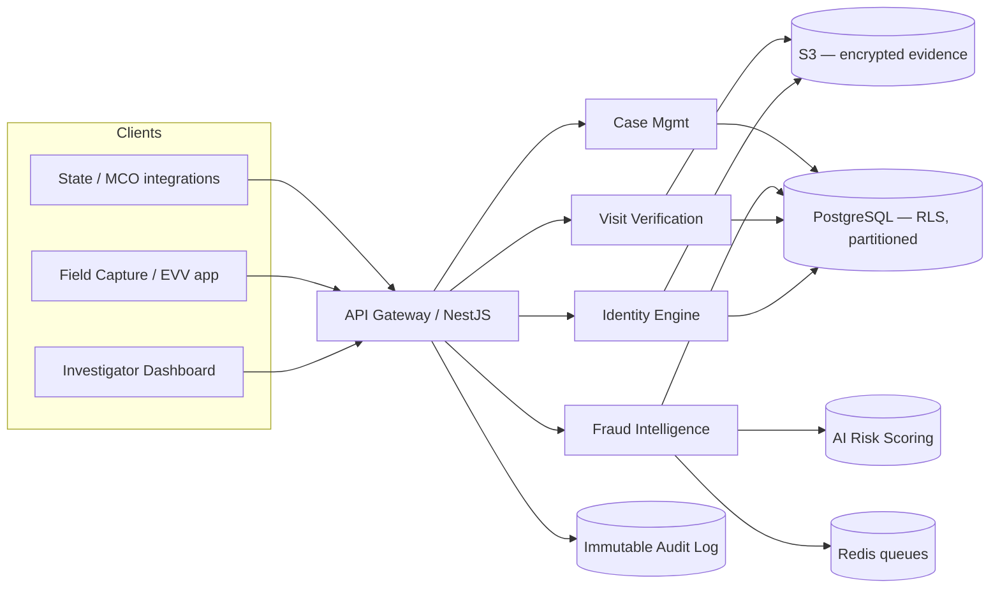

# RayVerify™

**Government-grade fraud detection & identity verification for Medicaid, HCBS, personal care, and government-funded healthcare programs.**

> Parent platform: **RayHealthEVV™**

Current Electronic Visit Verification (EVV) systems verify *time* and *location*. RayVerify verifies **identity, presence, location, device authenticity, patient confirmation, and billing legitimacy** — and surfaces fraud intelligence to investigators and state agencies *before payments are made*.

This is **not** an EVV platform. It is a **fraud prevention, identity verification, and program integrity** platform for state Medicaid agencies, MCOs, program integrity units, OIG investigators, compliance officers, and auditors.

---

## Table of contents

- [Product modules](#product-modules)
- [Repository layout](#repository-layout)
- [Architecture at a glance](#architecture-at-a-glance)
- [Quickstart](#quickstart)
- [Documentation](#documentation)
- [Security & compliance](#security--compliance)
- [Status & roadmap](#status--roadmap)

---

## Product modules

| # | Module | Purpose |
|---|--------|---------|
| 1 | **Identity Verification Engine** | Selfie + liveness + device-trust verification that the caregiver is who they claim to be. |
| 2 | **Visit Verification Engine** | Every visit produces a verification package: identity → GPS → device → patient → fraud scoring → approval. |
| 3 | **Fraud Intelligence Engine** | Rules + ML detectors (impossible travel, duplicate visits, shared devices, billing anomalies…) producing an explainable 0–100 fraud score. |
| 4 | **Investigator Dashboard** | Fraud alerts, provider risk rankings, heat maps, case management, evidence review, fraud timelines. |
| 5 | **Provider Risk Scoring** | Dynamic per-provider risk score with historical trend. |
| 6 | **Audit & Compliance Center** | Immutable, searchable, exportable audit trail with tamper-evident hash chain. |
| 7 | **Reporting & Analytics** | Fraud, provider-risk, visit-verification, investigation, and state-compliance reports (PDF/Excel). |
| 8 | **Future Hardware Integration Layer** | SDK abstraction for NFC, fingerprint, facial-recognition cameras, secure element, GPS, LTE. |

---

## Repository layout

```
RayVerify/
├── README.md
├── package.json                 # npm workspaces (monorepo root)
├── docker-compose.yml           # Postgres + Redis + LocalStack for local dev
├── db/
│   └── schema.sql               # Production PostgreSQL DDL (partitioning, RLS, triggers)
├── api/
│   └── openapi.yaml             # OpenAPI 3.1 specification
├── docs/                        # Architecture, compliance & operations docs
│   ├── 00-overview.md
│   ├── 01-product-requirements.md
│   ├── 02-system-architecture.md
│   ├── 03-database-design.md
│   ├── 04-api-design.md
│   ├── 05-fraud-detection-engine.md
│   ├── 06-ai-risk-scoring.md
│   ├── 07-security-architecture.md
│   ├── 08-aws-deployment.md
│   ├── 09-cicd-pipeline.md
│   ├── 10-development-roadmap.md
│   └── 11-production-deployment.md
├── packages/
│   ├── backend/                 # NestJS + Prisma API & engines
│   │   ├── prisma/schema.prisma # Canonical logical data model
│   │   └── src/modules/…        # auth, verification, visits, fraud, …
│   ├── frontend/                # Next.js 15 investigator dashboard
│   └── shared/                  # Shared TS types, enums, DTO contracts
├── infra/
│   └── terraform/               # AWS IaC (VPC, RDS, ECS, S3, CloudFront, KMS)
└── .github/workflows/           # CI/CD pipelines
```

---

## Architecture at a glance

- **Frontend:** Next.js 15 · TypeScript · TailwindCSS · shadcn/ui
- **Backend:** NestJS · Prisma · PostgreSQL · Redis (queues + cache)
- **Infra:** AWS — RDS PostgreSQL · S3 · CloudFront · ECS (EKS-ready)
- **Security:** AES-256 at rest · TLS 1.3 in transit · JWT + refresh · RBAC · MFA · immutable audit logs · Zero Trust
- **Patterns:** Multi-tenant (row-level security) · API-first · microservice-ready



See [`docs/02-system-architecture.md`](docs/02-system-architecture.md) for the full set of diagrams.

---

## Quickstart

> Prerequisites: Node ≥ 20, npm ≥ 10, Docker.

```bash
# 1. Install workspace dependencies
npm install

# 2. Bring up Postgres + Redis (+ LocalStack S3) for local dev
npm run dev:infra

# 3. Configure backend env
cp packages/backend/.env.example packages/backend/.env

# 4. Apply the schema & seed reference data
npm run db:migrate
npm run db:seed

# 5. Run everything (backend :4000, frontend :3000)
npm run dev
```

- Backend API + Swagger UI: `http://localhost:4000/docs`
- Frontend dashboard: `http://localhost:3000`

---

## Documentation

| Doc | Contents |
|-----|----------|
| [00 — Overview](docs/00-overview.md) | Vision, users, value proposition, glossary. |
| [01 — Product Requirements](docs/01-product-requirements.md) | Full PRD: personas, module specs, functional & non-functional requirements. |
| [02 — System Architecture](docs/02-system-architecture.md) | Service & deployment diagrams, data flow, tenancy model. |
| [03 — Database Design](docs/03-database-design.md) | ERD, table reference, partitioning & indexing strategy. |
| [04 — API Design](docs/04-api-design.md) | Endpoints, request/response contracts, versioning, errors. |
| [05 — Fraud Detection Engine](docs/05-fraud-detection-engine.md) | Detector catalog, scoring pipeline, rule definitions. |
| [06 — AI Risk Scoring](docs/06-ai-risk-scoring.md) | Feature store, models, explainability framework. |
| [07 — Security Architecture](docs/07-security-architecture.md) | HIPAA/HITECH/NIST 800-63/SOC 2/CMS controls, encryption, Zero Trust. |
| [08 — AWS Deployment](docs/08-aws-deployment.md) | Cloud topology, networking, IaC. |
| [09 — CI/CD Pipeline](docs/09-cicd-pipeline.md) | Build/test/scan/deploy stages. |
| [10 — Development Roadmap](docs/10-development-roadmap.md) | Phased delivery plan & milestones. |
| [11 — Production Deployment](docs/11-production-deployment.md) | Go-live runbook, DR, observability. |

---

## Security & compliance

RayVerify is designed against **HIPAA**, **HITECH**, **NIST 800-63 (IAL/AAL)**, **SOC 2**, and **CMS EVV** requirements. Highlights:

- AES-256-GCM envelope encryption for PHI (AWS KMS); TLS 1.3 in transit.
- Row-level security for hard tenant isolation (`db/schema.sql`).
- Append-only verification evidence + tamper-evident audit hash chain.
- RBAC + MFA + least-privilege; full auditability of every read/write/export.

Full control mapping: [`docs/07-security-architecture.md`](docs/07-security-architecture.md).

> ⚠️ This repository contains architecture, schema, and reference implementation
> scaffolding. It is **not** yet an authorized-to-operate (ATO) production system.
> A formal security assessment, penetration test, and BAA chain are required
> before processing real PHI.

---

## Status & roadmap

This is the **foundation** drop: data model, schema, API contract, service
scaffolding, and the full documentation set. See
[`docs/10-development-roadmap.md`](docs/10-development-roadmap.md) for the path
from foundation → MVP → state pilot → production.

---

*RayVerify™ and RayHealthEVV™ are product names used throughout this repository.*
