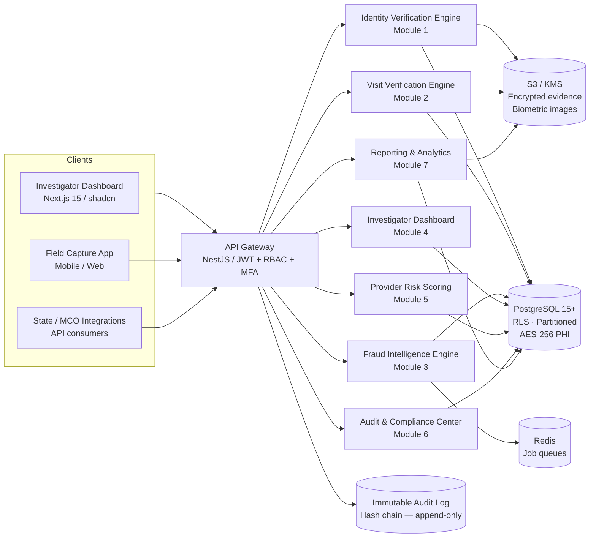

# RayVerify™ — Executive Overview

> **Platform:** RayVerify™ | **Parent:** RayHealthEVV™
> **Classification:** Government-grade fraud detection & identity verification
> **Programs served:** Medicaid · HCBS · Personal Care Services · Government-funded healthcare

---

## Table of Contents

1. [Mission](#1-mission)
2. [The Problem — Medicaid Fraud at Scale](#2-the-problem--medicaid-fraud-at-scale)
3. [The RayVerify Thesis](#3-the-rayverify-thesis)
4. [Architecture at a Glance](#4-architecture-at-a-glance)
5. [Value Proposition vs. Legacy EVV](#5-value-proposition-vs-legacy-evv)
6. [The Eight Modules](#6-the-eight-modules)
7. [Primary Users](#7-primary-users)
8. [Glossary](#8-glossary)

---

## 1. Mission

RayVerify™ exists to close the enforcement gap at the exact moment it matters most: **before a Medicaid dollar leaves the treasury**.

Legacy Electronic Visit Verification (EVV) systems were designed to record that a visit happened — a timestamp and a GPS coordinate. They answer *when* and *where*. They do not answer *who*, *whether the right person was present*, *whether the device reporting the visit is trustworthy*, *whether the patient confirms the service was received*, or *whether the billed claim is consistent with authorized care*.

RayVerify is a **fraud prevention, identity verification, and program integrity platform** built specifically for state Medicaid agencies, Managed Care Organizations (MCOs), Program Integrity Units, OIG investigators, compliance officers, and state auditors. It verifies identity, presence, location, device authenticity, patient confirmation, and billing legitimacy — and surfaces fraud intelligence to the right investigator **before payment is made**.

This is not another EVV vendor. It is the enforcement layer that state programs have been missing.

---

## 2. The Problem — Medicaid Fraud at Scale

Federal and state reports consistently place Medicaid improper payments in the **tens of billions of dollars annually** — a figure that has grown as home and community-based services (HCBS) enrollment has expanded and as legacy oversight infrastructure has not kept pace. (These figures are widely cited from HHS OIG and CMS annual reports; treat them as illustrative of the order of magnitude, not as a precise audited total.)

The home-care and personal-care sector is disproportionately represented in program integrity findings for several reasons:

- **Services are delivered in private residences**, far from any agency oversight.
- **EVV mandates (21st Century Cures Act, 2016)** required states to collect visit data, but the mandate specified *what to collect*, not *how to verify its authenticity*.
- **Identity is assumed, not verified.** A caregiver's login credentials confirm a username and password, not a face, not a live human being, not physical presence at a care site.
- **Device substitution is trivial.** A caregiver can hand a phone to a family member, a fraudulent agency can log check-ins from a desktop, and emulated devices can fabricate GPS coordinates.
- **Billing anomalies are caught after payment**, if at all. Retroactive audits recover pennies on the dollar.

The result is a structural fraud opportunity that grows proportionally with HCBS enrollment. Improper payments in this sector include ghost visits (services never rendered), identity substitution (a different person clocking in), time inflation (billing for more hours than worked), service overlap (two claims for the same beneficiary at the same time), and provider-level fraud schemes orchestrated across networks of caregivers and patients.

RayVerify was designed to close this gap.

---

## 3. The RayVerify Thesis

> **Verify identity, presence, device, and billing legitimacy at the point of service — pre-payment.**

The thesis rests on four convictions:

1. **Pre-payment fraud prevention yields dramatically higher returns than post-payment auditing.** Every dollar blocked before it is paid avoids the recovery cost (legal fees, administrative burden, low recovery rates) entirely.

2. **The caregiver's identity must be verified biometrically at each visit clock-in, not once at enrollment.** A credential can be shared; a face, combined with active liveness detection, is significantly harder to substitute.

3. **Every verification event must generate an immutable, auditable evidence record.** When an OIG investigator builds a case or a state auditor responds to a CMS inquiry, the evidence package must be court-ready, tamper-evident, and exportable.

4. **Fraud intelligence must be continuous and automated.** A single analyst cannot manually review hundreds of thousands of visits. A rules-and-ML composite scoring pipeline, running on every visit, surfaces the highest-risk providers and claims for human review — eliminating the needle-in-a-haystack problem.

---

## 4. Architecture at a Glance

RayVerify is an API-first, multi-tenant SaaS platform. The architecture is designed for state and federal procurement requirements: no single point of failure, hard tenant isolation, immutable evidence, and a compliance posture that targets HIPAA, HITECH, NIST 800-63, SOC 2, and the CMS EVV requirements of the 21st Century Cures Act.

### Technology Stack

| Layer | Technology |
|---|---|
| **Frontend** | Next.js 15 · TypeScript · TailwindCSS · shadcn/ui |
| **Backend** | NestJS · Prisma ORM · TypeScript |
| **Database** | PostgreSQL 15+ (RDS Multi-AZ) · Redis (queues + cache) |
| **Infrastructure** | AWS — RDS · S3 · CloudFront · ECS (EKS-ready) · KMS · CloudWatch |
| **Security** | AES-256-GCM at rest · TLS 1.3 transit · JWT + RBAC + MFA · immutable audit logs |
| **Patterns** | Multi-tenant RLS · API-first · microservice-ready · Zero Trust |

### Data Model Highlights (from `packages/backend/prisma/schema.prisma`)

The canonical data model is organized into five domains:

- **Tenancy & IAM:** `organizations`, `users`, `sessions`, `roles`, `permissions`, `role_permissions`, `user_roles`. Every business table carries `organizationId` as the tenant root; PostgreSQL RLS enforces isolation with `SET app.current_org` per transaction.
- **Domain entities:** `providers` (NPI + Medicaid ID), `caregivers`, `biometric_enrollments`, `patients`, `service_authorizations` (geofence anchor: lat/lng + `radiusMeters`).
- **Device trust:** `devices` — tracks `trustLevel` (TRUSTED / UNKNOWN / SUSPICIOUS / BLOCKED), `isEmulator`, `isRooted`, `isJailbroken`, `fingerprintHash`.
- **Verification chain:** `visits` (partitioned monthly), `visit_verifications` (sealed chain + `evidenceHash`), `identity_verifications`, `gps_verifications`, `device_verifications` — all append-only, immutable by DB trigger.
- **Fraud intelligence & reporting:** `fraud_events`, `fraud_cases`, `case_notes`, `case_evidence`, `fraud_scores`, `provider_risk_profiles`, `reports`, `notifications`, `audit_logs` (partitioned monthly, hash chain).

Money is stored as integer cents (`billedAmountCents`, `exposureCents`) to avoid floating-point drift. Coordinates use `Decimal(9,6)` for ~11 cm precision. Surrogate PKs are UUID v4.

---

## 5. Value Proposition vs. Legacy EVV

| Capability | Legacy EVV | RayVerify™ |
|---|---|---|
| **Clock-in timestamp** | Yes | Yes |
| **GPS coordinate** | Yes (device-reported) | Yes + geofence validation + anomaly detection |
| **Identity verification** | Login credentials only | Selfie + liveness detection + enrolled face comparison |
| **Device trust** | None | Emulator detection, root/jailbreak detection, device fingerprinting, device-switching alerts |
| **Patient confirmation** | None | Patient confirmation step linked to visit record |
| **Fraud signal detection** | None / post-payment | Real-time: impossible travel, duplicate visits, shared devices, billing anomalies, service overlap, cross-provider risk |
| **Pre-payment scoring** | None | 0–100 composite risk score per visit; HIGH/CRITICAL triggers hold queue |
| **Provider risk profiling** | None | Dynamic per-provider risk score with historical trend and contributing factor breakdown |
| **Case management** | None | Full investigator workflow: case creation, evidence linking, notes, status lifecycle (OPEN → ESCALATED → SUBSTANTIATED) |
| **Audit trail** | Basic logs | Immutable, append-only, tamper-evident hash chain; every read/write/export logged |
| **Compliance reporting** | Visit logs | Six report types: Fraud Summary, Provider Risk, Visit Verification, Investigation, State Compliance, Executive Dashboard |
| **Integration model** | State-mandated EVV aggregator | API-first; consumes EVV feed + adds verification layer; integrates with state MMIS/claims systems |
| **Multi-tenant isolation** | Varies | PostgreSQL Row-Level Security; every query scoped to `organization_id` |
| **Timing** | Post-visit data capture | Real-time verification chain at clock-in and clock-out |

---

## 6. The Eight Modules

### Module 1 — Identity Verification Engine

The Identity Verification Engine answers the foundational question that legacy EVV ignores: **is this actually the enrolled caregiver?** At each visit clock-in, the caregiver captures a selfie through the field application. The engine performs active liveness detection (to defeat photo and video replay attacks) and compares the probe image against the caregiver's enrolled biometric template stored in the `biometric_enrollments` table. The result — a `confidenceScore` (0.0–1.0) and a `livenessScore` (0.0–1.0) — is written to `identity_verifications` as an append-only, immutable record. The engine emits PASS, REVIEW, or FAIL. REVIEW and FAIL outcomes feed immediately into the fraud scoring pipeline. Future modalities (fingerprint, NFC identity card, government-issued credential at NIST 800-63 IAL2/IAL3) are enumerated in the `IdentityMethod` type and stubbed in the Hardware Integration Layer.

### Module 2 — Visit Verification Engine

The Visit Verification Engine orchestrates the **complete verification chain** for every visit: identity → GPS → device → patient confirmation → fraud scoring → approval. For each visit event (clock-in, clock-out, optional mid-visit check), the engine collects the caregiver's GPS coordinates and evaluates them against the geofence anchored to the patient's `service_authorization` record (authorized address + `radiusMeters`, defaulting to 150 m). GPS outcomes: inside radius = PASS; outside radius = REVIEW / FLAG; major discrepancy = FAIL. The full chain result is sealed into a `visit_verification` record, which carries a SHA-256 `evidenceHash` over the canonical evidence package for tamper detection. Visit status progresses through the SCHEDULED → IN_PROGRESS → COMPLETED → FLAGGED / APPROVED / REJECTED lifecycle. Approved visits are eligible for billing; FLAGGED visits enter a hold queue pending investigator review.

### Module 3 — Fraud Intelligence Engine

The Fraud Intelligence Engine runs a catalog of 13 detectors — rules-based and ML-augmented — against every visit and billing event, in real time. Detector types are defined in the `FraudEventType` enum: `IMPOSSIBLE_TRAVEL`, `DUPLICATE_VISIT`, `SHARED_DEVICE`, `GPS_ANOMALY`, `IDENTITY_MISMATCH`, `UNUSUAL_BILLING`, `ABNORMAL_DURATION`, `EXCESSIVE_OVERTIME`, `SERVICE_OVERLAP`, `CROSS_PROVIDER_RISK`, `LIVENESS_FAILURE`, `DEVICE_TAMPERING`, `GEOFENCE_BREACH`. Each detector emits a `FraudEvent` with a severity score (0–100), a `riskLevel` (LOW / MODERATE / HIGH / CRITICAL), a human-readable `explanation`, and structured `evidence` for explainability. Composite scores are aggregated into `FraudScore` records against any subject type: VISIT, PROVIDER, CAREGIVER, PATIENT, or CLAIM. The engine is versioned (each event carries `detector` + `detectorVersion`) for reproducibility and model governance.

### Module 4 — Investigator Dashboard

The Investigator Dashboard is the primary interface for OIG investigators, Program Integrity Unit staff, and state auditors. It surfaces real-time fraud alerts, a ranked list of high-risk providers, geographic heat maps of anomaly concentrations, and a full case management workflow. Investigators can create or be assigned `FraudCase` records (human-friendly case numbers follow the format `RV-YYYY-NNNNNN`), link fraud events to cases, attach evidence (visit records, GPS traces, identity verification images, exported documents), write internal case notes, and advance the case through the status lifecycle: OPEN → IN_REVIEW → ESCALATED → PENDING_PAYMENT_HOLD → SUBSTANTIATED / UNSUBSTANTIATED → CLOSED. The `exposureCents` field captures the estimated dollars at risk, enabling prioritization by financial exposure.

### Module 5 — Provider Risk Scoring

Provider Risk Scoring maintains a continuously updated, denormalized risk profile for every Medicaid provider in the `provider_risk_profiles` table. The profile aggregates `verificationFailures`, `gpsAnomalies`, `billingAnomalies`, `identityIssues`, `openCases`, and `substantiatedCases` into a composite `currentScore` (0–100) and `riskLevel`. Historical score points are stored as a sparkline JSON array (`trend`) enabling trend visualization — a provider whose score is rising rapidly is a different enforcement priority than one with a stable elevated score. The module enables state agencies and MCOs to rank their entire provider network by risk, identify outliers, and direct limited audit resources toward the highest-exposure providers first.

### Module 6 — Audit & Compliance Center

The Audit & Compliance Center provides the evidentiary backbone required for HIPAA, HITECH, SOC 2, and CMS audit responses. Every user action — login, read, write, export, verification, scoring event, case action, configuration change — is written to the `audit_logs` table as an immutable, append-only record. The table is partitioned monthly for query performance and carries a SHA-256 tamper-evident hash chain: each row stores `prevHash` (the hash of the prior row in the same tenant chain) and `hash` (computed over the canonical concatenation of the row's fields). A DB-layer trigger (`trg_audit_hash`) computes the chain on insert; a second trigger (`trg_audit_immutable`) blocks all UPDATE and DELETE operations, enforcing append-only semantics at the database level. Audit records are searchable and exportable by date range, actor, resource type, and action.

### Module 7 — Reporting & Analytics

The Reporting & Analytics module serves the full reporting surface required by state procurement officers, CMS auditors, MCO compliance teams, and executive leadership. Six report types are defined in `ReportType`: `FRAUD_SUMMARY`, `PROVIDER_RISK`, `VISIT_VERIFICATION`, `INVESTIGATION`, `STATE_COMPLIANCE`, `EXECUTIVE_DASHBOARD`. Reports are generated asynchronously (QUEUED → GENERATING → READY), stored encrypted in S3, and downloadable in PDF, XLSX, CSV, or JSON (`ReportFormat`). Expired reports are lifecycle-managed via the `expiresAt` field. Every report generation is a logged, audited action. The module supports scheduled delivery and webhook notification on completion.

### Module 8 — Future Hardware Integration Layer

The Hardware Integration Layer is an SDK abstraction that decouples the verification engines from specific capture hardware, enabling RayVerify to upgrade the strength of identity assurance as hardware becomes available in the field. The `IdentityMethod` enum reserves slots for `FINGERPRINT`, `NFC_CARD`, and `GOV_CREDENTIAL` (targeting NIST 800-63 IAL2/IAL3). The `DevicePlatform` enum includes `HARDWARE_TERMINAL`. This layer is explicitly **out of scope for the current release** and is documented here to convey the platform's designed-for extensibility. Physical modalities — dedicated facial recognition cameras, fingerprint scanners, NFC identity card readers, secure elements, and GPS/LTE modules — will integrate through this abstraction without requiring changes to the verification chain or fraud scoring logic above it.

---

## 7. Primary Users

| User | Role | What RayVerify Gives Them |
|---|---|---|
| **State Medicaid Agency** | Program owner; CMS-accountable for improper payment rates | Real-time visit verification data; state compliance reports; pre-payment fraud hold queue; audit-ready evidence for CMS |
| **Medicaid Managed Care Organization (MCO)** | Contracts with providers; financially at risk for overpayments | Provider risk rankings; visit-level verification outcomes; fraud summary reports; integration feed for claims adjudication |
| **Program Integrity Unit** | Investigates fraud, waste, and abuse referrals | Automated fraud alerts; investigator dashboard; case management workflow; evidence packages; investigation reports |
| **OIG Investigator / Agent** | Conducts formal fraud investigations; refers cases for prosecution | Tamper-evident evidence chain; case management with SHA-256 chain-of-custody; exportable audit logs; case notes (internal/external) |
| **Compliance Officer** | Ensures organizational adherence to Medicaid rules | Audit & Compliance Center; full audit trail export; HIPAA/HITECH controls documentation; state compliance reports |
| **State Auditor** | Reviews provider billing and program expenditure | Provider risk profiles; visit verification reports; executive dashboard; PDF/XLSX exports for audit workpapers |
| **Home-Care Oversight Agency** | Licenses and monitors home-care providers | Provider enrollment status; GPS verification outcomes; identity verification failure rates; geofence breach trends |
| **Federal Healthcare Program Administrator** | CMS or OIG national program oversight | State compliance reports; aggregate improper payment trends; cross-state visibility (where federated deployment is authorized) |

---

## 8. Glossary

| Term | Definition |
|---|---|
| **AAL (Authenticator Assurance Level)** | NIST 800-63B framework defining the strength of an authentication mechanism. AAL1 = password; AAL2 = MFA; AAL3 = hardware cryptographic authenticator. RayVerify targets AAL2 for all platform users. |
| **ATO (Authorization to Operate)** | Formal federal/state security authorization required before a system processes real PHI in a government program. Not yet obtained; see README security notice. |
| **Audit Hash Chain** | A cryptographic linked list over `audit_logs` rows. Each row's `hash` is computed over `prevHash || canonical(row)` using SHA-256, making retroactive tampering detectable. |
| **Biometric Enrollment** | The one-time process of capturing and storing a caregiver's reference facial template in `biometric_enrollments`, against which subsequent selfies are compared. |
| **Case Number** | Human-readable fraud case identifier in the format `RV-YYYY-NNNNNN` (e.g., `RV-2026-000123`). Unique per tenant/organization. |
| **EVV (Electronic Visit Verification)** | Technology system used to verify that home- and community-based services are delivered. Federally mandated by the 21st Century Cures Act (2016). Records time, location, caregiver, patient, and service type. RayVerify adds identity and fraud verification on top of EVV data. |
| **Geofence** | A virtual perimeter, defined as a latitude/longitude anchor point plus a `radiusMeters` value (default 150 m), within which a caregiver's GPS coordinates must fall at clock-in and clock-out. Defined per `service_authorization`. |
| **HCBS (Home and Community-Based Services)** | Medicaid-funded long-term services and supports delivered in a beneficiary's home or community setting rather than in an institutional setting. The highest-fraud-risk Medicaid service category. |
| **IAL (Identity Assurance Level)** | NIST 800-63A framework defining the strength of the identity proofing process. IAL1 = self-asserted; IAL2 = remote identity verification with document check; IAL3 = in-person identity proofing. RayVerify's biometric check targets IAL2-equivalent assurance. |
| **Improper Payment** | A payment that should not have been made, was made in the wrong amount, or was made to the wrong recipient. Includes payments for services not rendered (fraud) and billing errors (waste/abuse). Source: HHS/OMB definition. |
| **Liveness Detection** | An algorithmic challenge-response or passive analysis technique that determines whether the face presented to the camera is a live human being rather than a photograph, printed image, or video replay. Captured as `livenessScore` (0.0–1.0) in `identity_verifications`. |
| **MCO (Medicaid Managed Care Organization)** | A private health plan contracted by a state to deliver Medicaid benefits to enrolled beneficiaries. MCOs bear financial and compliance risk for the providers in their network. |
| **Medicaid Member ID** | The state-issued unique identifier for a Medicaid beneficiary (`medicaid_member_id` in `patients`). PHI; stored encrypted with a blind index for searchability. |
| **MMIS (Medicaid Management Information System)** | The state-operated system that processes Medicaid claims and manages eligibility, provider enrollment, and prior authorization. RayVerify integrates with MMIS via API to flag visits before claim adjudication. |
| **MFA (Multi-Factor Authentication)** | Authentication using two or more factors. RayVerify supports TOTP, SMS OTP, and WebAuthn (`MfaMethod` enum). Required for all platform users. |
| **NPI (National Provider Identifier)** | The 10-digit Luhn-checked unique identifier assigned by CMS to every health care provider in the United States. Stored in `providers.npi`; format-validated by DB constraint. |
| **OIG (Office of Inspector General)** | The U.S. Department of Health and Human Services Office of Inspector General, responsible for detecting and prosecuting Medicaid fraud. Also applies to state-level OIG offices. |
| **PCS (Personal Care Services)** | Medicaid-funded assistance with activities of daily living (bathing, dressing, toileting) delivered in the home. A major HCBS service type subject to EVV mandates. |
| **PHI (Protected Health Information)** | Individually identifiable health information protected under HIPAA. Includes Medicaid member IDs, dates of birth, biometric images, and service records. Stored encrypted at rest (AES-256-GCM, AWS KMS). |
| **Program Integrity** | The body of activities — audits, fraud investigations, data analytics, provider oversight — undertaken by state and federal agencies to ensure Medicaid funds are spent appropriately. |
| **Risk Level** | RayVerify's four-tier risk classification: LOW (0–30), MODERATE (31–60), HIGH (61–80), CRITICAL (81–100). Applied to visits, providers, caregivers, patients, and claims. |
| **RLS (Row-Level Security)** | PostgreSQL feature that restricts row visibility based on the current session's `app.current_org` setting. Enforces hard multi-tenant isolation: queries from one tenant cannot access another tenant's rows even if the application contains a bug. |
| **Service Authorization** | The formal Medicaid approval for a beneficiary to receive a specific service (identified by HCPCS or state-specific service code), with an authorized unit cap and a geofence-anchoring address. Stored in `service_authorizations`. |
| **Verification Result** | The three-valued outcome of any verification step: `PASS` (no action needed), `REVIEW` (human review required before approval), `FAIL` (visit blocked from billing). |
| **Visit Verification Chain** | The ordered sequence of verification steps applied to every visit: identity → GPS → device → patient confirmation → fraud scoring → final approval/rejection. The composite result is sealed in `visit_verifications` with a SHA-256 `evidenceHash`. |
