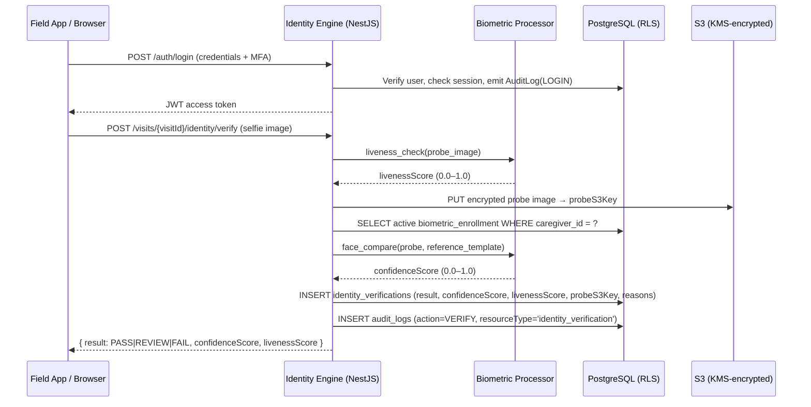
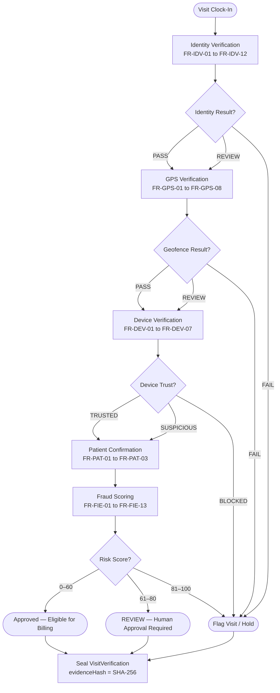

# RayVerify™ — Product Requirements Document

---

## 1. Document Control

| Field | Value |
|---|---|
| **Document title** | RayVerify™ Product Requirements Document (PRD) |
| **Version** | 1.0 |
| **Status** | Draft |
| **Parent platform** | RayHealthEVV™ |
| **Product owner** | Head of Product |
| **Technical lead** | Principal Engineer |
| **Compliance review** | Compliance & Privacy Officer |
| **Security review** | Security Architect |
| **Last updated** | 2026-06-10 |
| **Next review** | 2026-09-10 |
| **Audience** | State procurement reviewers · Investors · Engineering · Compliance |

### 1.1 Related Documents

| Document | Path |
|---|---|
| System Architecture | `docs/02-system-architecture.md` |
| Database Design | `docs/03-database-design.md` |
| API Design | `docs/04-api-design.md` |
| Fraud Detection Engine | `docs/05-fraud-detection-engine.md` |
| AI Risk Scoring | `docs/06-ai-risk-scoring.md` |
| Security Architecture | `docs/07-security-architecture.md` |
| AWS Deployment | `docs/08-aws-deployment.md` |

---

## 2. Goals and Non-Goals

### 2.1 Goals

1. Provide state Medicaid agencies, MCOs, and Program Integrity Units with **pre-payment identity and fraud verification** for every home and community-based service visit.
2. Verify **who** delivered a service (biometric identity), **where** (geofenced GPS), **with what device** (device trust), **confirmed by the patient**, and **consistent with authorized billing** — in a single verification chain per visit.
3. Surface fraud intelligence automatically — real-time, explainable, scored — to investigators, so limited human audit resources are directed at the highest-risk providers and claims.
4. Generate a **court-ready, tamper-evident evidence record** for every visit verification, usable in OIG investigations, state audits, and CMS program integrity inquiries.
5. Deliver compliance reporting to meet CMS EVV requirements (21st Century Cures Act), HIPAA/HITECH obligations, and state audit standards.
6. Support **multi-tenant deployment** so a single platform instance can serve multiple state agencies, MCOs, and oversight organizations with hard data isolation.

### 2.2 Non-Goals

1. **NOT an EVV platform.** RayVerify does not replace state EVV aggregators or compete with EVV vendors. It is the verification and fraud intelligence layer that runs on top of EVV-captured or EVV-equivalent visit data.
2. **NOT a claims adjudication system.** RayVerify produces verification outcomes and risk signals; the MMIS/claims system uses those signals to adjudicate or hold claims. RayVerify does not process Medicaid payments.
3. **NOT a caregiver scheduling or HR system.** Provider enrollment, caregiver credentialing, and scheduling are external systems. RayVerify consumes provider and caregiver identities via API or import.
4. **NOT a beneficiary portal.** RayVerify does not manage patient enrollment, eligibility, or care plans. Patients are referenced entities, not active platform users.
5. **NOT hardware.** Physical biometric terminals, NFC readers, and fingerprint scanners are explicitly deferred to the Hardware Integration Layer (Module 8, future phase).

---

## 3. Personas

### Persona 1 — State Medicaid Program Integrity Director

**Role:** Senior state government official accountable to the state Medicaid director and CMS for the agency's improper payment rate and fraud recovery figures.

**Goals:**
- Demonstrate to CMS that the state has implemented "effective and cost-efficient program integrity" per 42 CFR Part 455.
- Reduce the improper payment rate in HCBS/PCS claims.
- Receive executive-level visibility into fraud trends without needing to operate investigation tooling directly.

**Pain points:**
- Current EVV data proves a visit was *recorded*, not that it was *legitimately delivered*.
- CMS audit cycles expose gaps months after payments were made.
- No aggregate view of which providers are highest risk across the entire Medicaid network.

**Key workflows:**
- Review Executive Dashboard and State Compliance reports weekly.
- Export state compliance reports for CMS submissions.
- Receive alerts when aggregate risk indicators cross defined thresholds.

**Success metrics:** Reduction in HCBS improper payment rate year-over-year; number of pre-payment holds actioned; CMS audit findings closed.

---

### Persona 2 — OIG Investigator / Agent

**Role:** Law enforcement–adjacent investigator within the state Office of Inspector General or Medicaid Fraud Control Unit (MFCU), building cases for civil or criminal referral.

**Goals:**
- Rapidly identify and build a case file with sufficient evidence for civil investigative demand (CID) or referral to the state attorney general.
- Ensure all evidence collected is chain-of-custody compliant and court-admissible.
- Track multiple open cases without losing thread on any of them.

**Pain points:**
- Current evidence is a spreadsheet of visit logs with no biometric link to the caregiver actually present.
- No automated anomaly detection; investigators must manually query large datasets.
- No tamper-proof audit trail demonstrating that evidence has not been modified since collection.

**Key workflows:**
- Triage fraud alerts from the Fraud Intelligence Engine in the Investigator Dashboard.
- Open a `FraudCase` (e.g., `RV-2026-000412`), assign priority, set estimated `exposureCents`.
- Link fraud events and visit verification records to the case as evidence.
- Write internal case notes; attach exported evidence packages.
- Advance case to ESCALATED → PENDING_PAYMENT_HOLD → SUBSTANTIATED.
- Export the complete evidence package (PDF, XLSX, audit trail) for referral.

**Success metrics:** Case throughput per investigator per quarter; average time from fraud alert to case substantiation; dollar recovery / hold rate.

---

### Persona 3 — MCO Compliance Officer

**Role:** Employed by a Medicaid Managed Care Organization; responsible for network provider oversight, claims integrity, and regulatory reporting to the state.

**Goals:**
- Identify high-risk providers in the MCO's network before claims are adjudicated.
- Meet contractual and regulatory obligations to report suspected fraud to the state.
- Ensure the MCO's capitation dollars are not eroded by fraudulent claims.

**Pain points:**
- Provider performance data arrives in disconnected spreadsheets; no real-time risk view.
- Compliance staff must manually cross-reference EVV data against billing — extremely time-intensive.
- MCO faces financial liability for claims already paid when fraud is discovered post-payment.

**Key workflows:**
- Monitor Provider Risk Scoring dashboard; filter by `riskLevel` = HIGH or CRITICAL.
- Review Provider Risk reports for monthly compliance filings.
- Flag providers for additional review; submit referrals to state program integrity.

**Success metrics:** Number of high-risk providers identified pre-payment vs. post-payment; compliance report turnaround time; reduction in post-payment recoveries.

---

### Persona 4 — Program Integrity Analyst

**Role:** Data analyst within a state Program Integrity Unit or MCO, responsible for running queries, generating reports, and surfacing anomalies for investigator review.

**Goals:**
- Efficiently process large volumes of fraud alert data and route the highest-priority items to investigators.
- Generate accurate, reproducible reports for state management and CMS.
- Build a defensible, documented evidence trail from raw visit data to investigation outcome.

**Pain points:**
- Current tooling requires SQL or custom scripts to extract fraud patterns; no built-in anomaly detection.
- Report generation is manual, error-prone, and time-consuming.
- No confidence that the data underlying a report has not been modified after export.

**Key workflows:**
- Review open `FraudEvent` queue; triage OPEN events to TRIAGED or LINKED_TO_CASE.
- Generate Fraud Summary and Visit Verification reports on a scheduled or ad-hoc basis.
- Export reports in PDF (management briefings) and XLSX (workpaper-compatible).

**Success metrics:** Time to triage a fraud alert; report generation SLA; audit query response time.

---

### Persona 5 — State Auditor

**Role:** Independent state auditor or OIG financial auditor reviewing Medicaid program expenditures, provider billing accuracy, and EVV compliance.

**Goals:**
- Independently verify that visit claims in a sample are supported by legitimate, compliant verification evidence.
- Export a complete, unmodified audit trail for a date range or provider scope.
- Ensure the evidence chain has not been retroactively altered.

**Pain points:**
- Today's audit requires pulling data from multiple disconnected systems (EVV vendor, billing system, provider records) and manually reconciling.
- No cryptographic assurance that audit log data is genuine and unmodified.

**Key workflows:**
- Query the Audit & Compliance Center by date range, actor, or resource type.
- Export audit logs and visit verification packages.
- Verify SHA-256 hash chain integrity programmatically.

**Success metrics:** Audit sample completion time; findings supported by system evidence; zero hash-chain validation failures.

---

### Persona 6 — Platform Administrator (Org Admin)

**Role:** Technical or operational administrator within a state agency, MCO, or oversight organization, responsible for configuring and maintaining the RayVerify tenant.

**Goals:**
- Manage user accounts, roles, and permissions without requiring vendor intervention.
- Configure tenant-level settings (geofence thresholds, fraud score alert thresholds, notification channels).
- Ensure the platform remains available and correctly configured at all times.

**Pain points:**
- Onboarding new investigators requires accurate RBAC configuration; errors create audit gaps.
- Threshold tuning (e.g., adjusting `radiusMeters` for rural vs. urban service areas) must not require code deployments.

**Key workflows:**
- Create and manage `User` records; assign system roles (INVESTIGATOR, AUDITOR, COMPLIANCE_OFFICER, ORG_ADMIN, OIG_AGENT).
- Configure `Organization.settings` (feature flags, thresholds, branding).
- Review notification channel configurations (IN_APP, EMAIL, SMS, WEBHOOK).

**Success metrics:** Time to onboard a new user; zero unauthorized access incidents; configuration change audit coverage.

---

### Persona 7 — Home-Care Oversight Agency Inspector

**Role:** State licensing or inspection official responsible for monitoring the compliance of home-care agencies with Medicaid participation requirements.

**Goals:**
- Quickly assess whether a specific provider or caregiver has a pattern of verification failures, GPS anomalies, or identity mismatches.
- Generate a provider-level compliance summary for a licensing renewal or complaint investigation.

**Pain points:**
- Current provider monitoring relies on complaint-driven processes; no proactive risk signal.
- Visiting a provider for an audit requires manual record assembly; no consolidated view.

**Key workflows:**
- Look up a provider by NPI or `medicaidId`; review `ProviderRiskProfile` and historical `FraudScore` trend.
- Generate a Provider Risk report for a specific provider; export as PDF for the licensing file.

**Success metrics:** Time to produce a provider compliance summary; number of proactive referrals generated from risk signals (vs. complaint-driven).

---

## 4. Module Requirements

---

### 4.1 Module 1 — Identity Verification Engine

**Purpose:** Cryptographically link each visit clock-in to the biometrically enrolled caregiver — detecting substitution fraud before the visit is recorded as complete.

#### 4.1.1 Identity Workflow

#### 4.1.2 User Stories

- **US-IDV-01:** As a caregiver, I want to capture a selfie at visit clock-in so that my identity is verified without requiring a password or PIN.
- **US-IDV-02:** As a Program Integrity analyst, I want every identity verification attempt to be stored as an immutable record so that I can reconstruct the evidence if a claim is disputed.
- **US-IDV-03:** As an OIG investigator, I want to see the confidence score and liveness score for any identity verification event so that I can assess the strength of the evidence in a case.
- **US-IDV-04:** As a platform administrator, I want to enroll a caregiver's biometric reference image at onboarding so that the system has a trusted baseline for comparison.
- **US-IDV-05:** As a compliance officer, I want identity verification failures to automatically generate fraud events so that no failure is silently discarded.

#### 4.1.3 Functional Requirements

| ID | Requirement |
|---|---|
| **FR-IDV-01** | The system SHALL capture a probe selfie image from the caregiver's device at each visit clock-in and clock-out event. |
| **FR-IDV-02** | The system SHALL perform active liveness detection on the probe image and compute a `livenessScore` between 0.0 and 1.0. A `livenessScore` below the configured threshold (default: 0.70) SHALL yield a result of REVIEW or FAIL. |
| **FR-IDV-03** | The system SHALL compare the probe image against the caregiver's active `BiometricEnrollment` reference template and compute a `confidenceScore` between 0.0 and 1.0. |
| **FR-IDV-04** | The system SHALL produce a `VerificationResult` of PASS, REVIEW, or FAIL based on configurable thresholds for `confidenceScore` and `livenessScore`. Default thresholds: PASS requires both scores ≥ 0.85; REVIEW: one score between 0.70–0.85; FAIL: any score below 0.70. |
| **FR-IDV-05** | The system SHALL write an immutable `identity_verifications` record for every verification attempt, including `method`, `result`, `confidenceScore`, `livenessScore`, `probeS3Key`, `matcher`, and `reasons`. |
| **FR-IDV-06** | The system SHALL store the probe image in S3 with AES-256-GCM encryption (envelope-encrypted via AWS KMS). The raw image SHALL NOT be stored in the database. |
| **FR-IDV-07** | The system SHALL write an `AuditLog` entry (action = VERIFY, resourceType = 'identity_verification') for every verification attempt. |
| **FR-IDV-08** | A verification result of REVIEW or FAIL SHALL automatically generate a `FraudEvent` of type `IDENTITY_MISMATCH` or `LIVENESS_FAILURE` respectively. |
| **FR-IDV-09** | The system SHALL support caregiver biometric enrollment: capturing and storing a reference image (`referenceS3Key`) and template pointer (`templateRef`) in `biometric_enrollments`. Only one enrollment per caregiver per `IdentityMethod` SHALL be active at a time. |
| **FR-IDV-10** | The system SHALL support future identity methods (`FINGERPRINT`, `NFC_CARD`, `GOV_CREDENTIAL`) as defined in the `IdentityMethod` enum, without requiring changes to the verification chain interface. |
| **FR-IDV-11** | The `reasons` field in `identity_verifications` SHALL contain a structured JSON array of explainability factors (e.g., `["LOW_LIVENESS","FACE_ANGLE_DEVIATION"]`). |
| **FR-IDV-12** | The system SHALL enforce that `identity_verifications` rows cannot be updated or deleted (DB-layer trigger `trg_idv_immutable`). |

#### 4.1.4 Acceptance Criteria

- AC-IDV-01: Given a valid probe selfie with liveness score ≥ 0.85 and confidence score ≥ 0.85, the system returns PASS within 3 seconds.
- AC-IDV-02: Given a photo-replay attack (printed photo), the liveness check returns a score < 0.70, and the result is FAIL with a `LIVENESS_FAILURE` fraud event generated.
- AC-IDV-03: Given a confidence score of 0.55 against the enrolled template, the result is FAIL and a `FraudEvent` of type `IDENTITY_MISMATCH` is created and linked to the visit.
- AC-IDV-04: An `identity_verifications` row cannot be deleted via any application role; a direct DELETE attempt raises `integrity_constraint_violation`.
- AC-IDV-05: The `probeS3Key` object is retrievable only by the application's KMS-authorized role; direct S3 access without KMS credentials is denied.

#### 4.1.5 Key Screens / Endpoints

| Surface | Description |
|---|---|
| `POST /visits/{visitId}/identity/verify` | Submit selfie for identity verification; returns result + scores. |
| `POST /caregivers/{caregiverId}/biometric/enroll` | Enroll a caregiver's reference image. |
| `GET /visits/{visitId}/identity/verifications` | List all identity verification attempts for a visit. |
| `GET /caregivers/{caregiverId}/identity/history` | Identity verification history with pass/fail trend for a caregiver. |
| Dashboard: Caregiver Identity Panel | Displays per-caregiver verification pass rate, recent FAIL events, trend sparkline. |

---

### 4.2 Module 2 — Visit Verification Engine

**Purpose:** Orchestrate the complete, ordered verification chain for every visit event and produce a sealed, tamper-evident verification package.

#### 4.2.1 Visit Verification Chain

#### 4.2.2 GPS Verification Rules

| GPS Outcome | Condition | `VerificationResult` | `FraudEventType` generated |
|---|---|---|---|
| **PASS** | `distanceMeters` ≤ `radiusMeters` (default 150 m) | `PASS` | None |
| **REVIEW / FLAG** | `distanceMeters` > `radiusMeters` AND ≤ 3× `radiusMeters` | `REVIEW` | `GPS_ANOMALY` |
| **FAIL** | `distanceMeters` > 3× `radiusMeters` (major discrepancy) | `FAIL` | `GEOFENCE_BREACH` |
| **Accuracy too low** | `accuracyMeters` > configured max (default 100 m) | `REVIEW` | `GPS_ANOMALY` |
| **No GPS signal** | Coordinates unavailable | `FAIL` | `GPS_ANOMALY` |

GPS verification events are captured at CLOCK_IN, CLOCK_OUT, and optionally MID_VISIT (`eventType` field in `gps_verifications`).

#### 4.2.3 Device Trust Signals

The Device Verification Engine evaluates the following signals from the `devices` table and the `signals` JSONB in `device_verifications`:

| Signal | `DeviceTrustLevel` impact | `FraudEventType` |
|---|---|---|
| `isEmulator = true` | SUSPICIOUS → BLOCKED | `DEVICE_TAMPERING` |
| `isRooted = true` (Android) | SUSPICIOUS | `DEVICE_TAMPERING` |
| `isJailbroken = true` (iOS) | SUSPICIOUS | `DEVICE_TAMPERING` |
| Device switch mid-visit (different `deviceId` at clock-out vs clock-in) | SUSPICIOUS | `SHARED_DEVICE` |
| `fingerprintHash` matches a known-bad device | BLOCKED | `DEVICE_TAMPERING` |
| Multiple caregivers using same `deviceId` within 24 hours | SUSPICIOUS | `SHARED_DEVICE` |
| IP geolocation inconsistent with GPS | SUSPICIOUS | `GPS_ANOMALY` |

#### 4.2.4 User Stories

- **US-VVE-01:** As a Program Integrity analyst, I want every visit to produce a single verification package so that I can assess the overall legitimacy of a claim in one view.
- **US-VVE-02:** As a compliance officer, I want visit verification packages to be sealed with a SHA-256 hash so that I can prove to an auditor that the evidence has not been modified since the visit.
- **US-VVE-03:** As an OIG investigator, I want visits that fail any verification step to be automatically flagged and held from billing so that I can review them before payment is made.
- **US-VVE-04:** As a caregiver, I want to clock out using the same app with an automatic GPS check so that my legitimate visits are approved without unnecessary friction.
- **US-VVE-05:** As a state auditor, I want to query verification outcomes by date range, provider, or result type so that I can scope an audit sample efficiently.

#### 4.2.5 Functional Requirements

| ID | Requirement |
|---|---|
| **FR-VVE-01** | The system SHALL execute the verification chain in order: identity → GPS → device → patient confirmation → fraud scoring for every visit clock-in and clock-out event. |
| **FR-VVE-02** | The system SHALL capture GPS coordinates at CLOCK_IN and CLOCK_OUT, compute `distanceMeters` from the `service_authorization` anchor, and apply the geofence rules in §4.2.2. |
| **FR-VVE-03** | The system SHALL write an immutable `gps_verifications` record for every GPS capture event, including `latitude`, `longitude`, `accuracyMeters`, `distanceMeters`, `result`, `capturedAt`, and `eventType`. |
| **FR-VVE-04** | The system SHALL evaluate device trust signals per §4.2.3 and write an immutable `device_verifications` record per visit event. |
| **FR-VVE-05** | The system SHALL seal the complete verification chain into a `visit_verifications` record containing `result`, `riskScore`, `riskLevel`, `chain` (per-step outcomes in JSON), and `evidenceHash` (SHA-256 over the canonical evidence package). |
| **FR-VVE-06** | The `evidenceHash` SHALL be computed over a canonical representation of the linked `identity_verifications`, `gps_verifications`, `device_verifications`, and patient confirmation data for the visit. |
| **FR-VVE-07** | A visit with a FAIL result in any verification step SHALL be set to `VisitStatus.FLAGGED` and excluded from the billing-eligible queue until manually approved. |
| **FR-VVE-08** | A visit with a REVIEW result and `riskScore` ≥ 61 SHALL be routed to the investigator review queue. |
| **FR-VVE-09** | The system SHALL denormalize `clockInLat` and `clockInLng` to the `visits` table for fast geospatial querying. |
| **FR-VVE-10** | The system SHALL support the full `VisitStatus` lifecycle: SCHEDULED → IN_PROGRESS → COMPLETED → FLAGGED / APPROVED / REJECTED / CANCELLED. |
| **FR-VVE-11** | GPS coordinates SHALL be stored as `Decimal(9,6)` (~11 cm precision). |
| **FR-VVE-12** | The `gps_verifications`, `identity_verifications`, and `device_verifications` tables SHALL be append-only (DB-layer immutability triggers). |
| **FR-VVE-13** | The `service_authorization.radiusMeters` SHALL be configurable per authorization (default: 150). The system SHALL validate that `radiusMeters > 0` (DB constraint `chk_radius_positive`). |

#### 4.2.6 Acceptance Criteria

- AC-VVE-01: A visit clock-in with all steps passing returns APPROVED status and a `visit_verifications` record with result=PASS within 5 seconds.
- AC-VVE-02: A visit clock-in where GPS distance = 600 m (outside 3× the 150 m default radius) generates a `GEOFENCE_BREACH` fraud event and sets visit status to FLAGGED.
- AC-VVE-03: Altering any byte of the `chain` JSON in `visit_verifications` causes the `evidenceHash` to no longer match the recomputed hash.
- AC-VVE-04: Attempting to UPDATE a `gps_verifications` row raises `integrity_constraint_violation`.
- AC-VVE-05: A mid-visit `MID_VISIT` GPS check that returns REVIEW adds a `GPS_ANOMALY` fraud event but does not immediately change visit status.

#### 4.2.7 Key Screens / Endpoints

| Surface | Description |
|---|---|
| `POST /visits/{visitId}/clock-in` | Trigger the full verification chain at clock-in. |
| `POST /visits/{visitId}/clock-out` | Trigger clock-out verification; finalizes `durationMinutes`. |
| `GET /visits/{visitId}/verification` | Retrieve the sealed `VisitVerification` package including all chain steps. |
| `GET /visits?status=FLAGGED&organizationId=...` | Query flagged visits pending investigator review. |
| `PATCH /visits/{visitId}/approve` | Investigator approves a FLAGGED visit; writes `approvedById` and `approvedAt`. |
| Dashboard: Visit Verification Queue | Table view of FLAGGED visits sorted by `riskScore` descending. |
| Dashboard: Visit Detail | Full verification chain display with per-step results, GPS map, identity photo (blurred by default), device signals. |

---

### 4.3 Module 3 — Fraud Intelligence Engine

**Purpose:** Automatically detect fraud, waste, and abuse signals across all visits and billing events in real time, producing a scored, explainable, and versioned `FraudEvent` record for each signal.

#### 4.3.1 Fraud Detector Catalog

| `FraudEventType` | Description | Example Signal |
|---|---|---|
| `IMPOSSIBLE_TRAVEL` | Caregiver clocked in at two locations farther apart than could be covered in the elapsed time. | 80-mile gap in 30 minutes. |
| `DUPLICATE_VISIT` | Two visits for the same caregiver + patient + service code overlap in time. | 10 AM visit A, 10:30 AM visit B, same day same caregiver. |
| `SHARED_DEVICE` | Same `deviceId` used by multiple caregivers, or device switched between clock-in and clock-out. | Device X used by Caregiver A at 9 AM and Caregiver B at 9:45 AM. |
| `GPS_ANOMALY` | GPS coordinates inconsistent with claimed service address; low accuracy; IP/GPS mismatch. | Clock-in 2 miles from authorized address. |
| `IDENTITY_MISMATCH` | Face comparison confidence below threshold. | `confidenceScore` = 0.61 (below 0.70 FAIL threshold). |
| `UNUSUAL_BILLING` | Billed units or amount inconsistent with visit duration or historical patterns. | 12-hour billed for a 2-hour authorized visit. |
| `ABNORMAL_DURATION` | Visit duration is statistical outlier vs. authorization or caregiver history. | Visit duration 300% above the caregiver's rolling average. |
| `EXCESSIVE_OVERTIME` | Caregiver exceeds authorized unit cap within the authorization period. | `billedUnits` exceeds `ServiceAuthorization.authorizedUnits`. |
| `SERVICE_OVERLAP` | Same patient billed for two overlapping services at the same time from different providers. | Patient billed for personal care and physical therapy 10–11 AM same day. |
| `CROSS_PROVIDER_RISK` | A caregiver or patient appears in multiple providers with fraud histories. | Caregiver moved from HIGH-risk Provider A to Provider B; carries risk signal. |
| `LIVENESS_FAILURE` | Active liveness check failed; possible photo or video replay attack. | `livenessScore` = 0.42. |
| `DEVICE_TAMPERING` | Device is an emulator, rooted, or jailbroken. | `isEmulator = true` on Android device. |
| `GEOFENCE_BREACH` | Clock-in GPS outside the authorized geofence by a major margin (> 3× radius). | Clock-in 500 m from a 150 m geofence. |

#### 4.3.2 User Stories

- **US-FIE-01:** As a Program Integrity analyst, I want fraud events to be generated automatically on every visit so that I do not need to manually scan for anomalies.
- **US-FIE-02:** As an OIG investigator, I want each fraud event to include a human-readable explanation and structured evidence so that I can assess it without running SQL queries.
- **US-FIE-03:** As a compliance officer, I want fraud detector versions to be recorded so that I can audit whether a rule change affected event generation.
- **US-FIE-04:** As a state auditor, I want fraud events to be immutable so that I can prove to CMS that the detection record has not been modified after the fact.
- **US-FIE-05:** As an analyst, I want to triage open fraud events (OPEN → TRIAGED → LINKED_TO_CASE / DISMISSED) so that the alert queue reflects current investigation status.

#### 4.3.3 Functional Requirements

| ID | Requirement |
|---|---|
| **FR-FIE-01** | The system SHALL evaluate all 13 fraud detectors in the catalog (§4.3.1) against every visit event in real time. |
| **FR-FIE-02** | Each detector SHALL emit a `FraudEvent` record containing `type`, `status` (initial: OPEN), `severity` (0–100), `riskLevel`, `explanation` (human-readable text), `evidence` (structured JSON), `detector` (identifier), and `detectorVersion`. |
| **FR-FIE-03** | `fraud_events` rows SHALL be append-only (DB-layer trigger `trg_fe_immutable`); no UPDATE or DELETE is permitted by any application role. |
| **FR-FIE-04** | The system SHALL compute a composite `FraudScore` (0–100) per visit and per provider by aggregating contributing detector severities into the `fraud_scores` table. |
| **FR-FIE-05** | A composite `riskScore` SHALL be reflected on the `visits` table (`risk_score`, `risk_level`) as a denormalized snapshot for fast querying. |
| **FR-FIE-06** | The `FraudEventStatus` lifecycle SHALL support: OPEN → TRIAGED → LINKED_TO_CASE / DISMISSED → CONFIRMED. |
| **FR-FIE-07** | The system SHALL support linking a `FraudEvent` to a `FraudCase` by setting `caseId`, advancing status to LINKED_TO_CASE. |
| **FR-FIE-08** | `IMPOSSIBLE_TRAVEL` detection SHALL compute straight-line distance between consecutive clock-in events for the same caregiver and compare to the elapsed time, using a configurable maximum travel speed (default: 65 mph / 105 km/h). |
| **FR-FIE-09** | `DUPLICATE_VISIT` detection SHALL query the `visits` table for overlapping `scheduledStart`/`scheduledEnd` intervals for the same `caregiverId` on the same day. |
| **FR-FIE-10** | `SERVICE_OVERLAP` detection SHALL check for concurrent `visits` for the same `patientId` from different `providerId` values. |
| **FR-FIE-11** | `EXCESSIVE_OVERTIME` detection SHALL compare `visit.billedUnits` against `service_authorization.authorizedUnits` within the authorization period. |
| **FR-FIE-12** | The `evidence` JSONB field SHALL carry sufficient structured data (visit IDs, GPS coordinates, timestamps, delta values) for an investigator to reproduce the detection finding without access to the underlying raw data. |
| **FR-FIE-13** | Fraud events SHALL be indexed by `(organization_id, type, status)` and `(organization_id, detected_at)` for efficient querying of open alert queues. |

#### 4.3.4 Acceptance Criteria

- AC-FIE-01: A caregiver with consecutive clock-ins 100 miles apart in 45 minutes generates an `IMPOSSIBLE_TRAVEL` fraud event with severity ≥ 80 and riskLevel = CRITICAL.
- AC-FIE-02: A `fraud_events` row cannot be updated or deleted via any application API call; the attempt returns a 403 or raises a DB constraint violation.
- AC-FIE-03: A fraud event's `evidence` JSON contains at minimum: visit IDs, timestamps, and the computed delta value (distance, time gap, etc.) that triggered the detection.
- AC-FIE-04: A fraud event with `status=OPEN` can be advanced to `TRIAGED` by a user with the `fraud_event:triage` permission; the change is logged in `audit_logs`.
- AC-FIE-05: `FraudScore` records for a provider are returned ordered by `computed_at DESC`; the most recent score matches the `provider_risk_profiles.current_score`.

---

### 4.4 Module 4 — Investigator Dashboard

**Purpose:** Provide OIG investigators and Program Integrity staff with a unified, real-time workspace to triage fraud alerts, manage cases, review evidence, and track investigation outcomes.

#### 4.4.1 User Stories

- **US-INV-01:** As an OIG investigator, I want a prioritized queue of open fraud alerts so that I focus on the highest-severity events first.
- **US-INV-02:** As an investigator, I want to create a fraud case, assign it a priority and risk level, and link related fraud events so that I can manage my investigation in one place.
- **US-INV-03:** As an investigator, I want to view a provider's full geographic heat map of anomalous visits so that I can identify geographic patterns in a fraud scheme.
- **US-INV-04:** As a case manager, I want to write internal case notes that are not included in beneficiary disclosures so that my investigative thinking is preserved without creating disclosure risk.
- **US-INV-05:** As an investigator, I want to export a case evidence package (PDF + XLSX) that includes all linked visits, GPS records, identity verification images, and the audit trail so that I have a complete referral package.
- **US-INV-06:** As a supervisor, I want to see my team's open case load, case statuses, and average time-to-resolution so that I can manage investigator capacity.

#### 4.4.2 Functional Requirements

| ID | Requirement |
|---|---|
| **FR-INV-01** | The dashboard SHALL display a prioritized fraud alert queue: all `FraudEvent` records with `status=OPEN` or `TRIAGED`, sorted by `severity` descending, filterable by `type`, `riskLevel`, and date range. |
| **FR-INV-02** | The system SHALL support creating a `FraudCase` with `caseNumber` (auto-generated in format `RV-YYYY-NNNNNN`), `title`, `status`, `priority`, `riskLevel`, `providerId`, `assigneeId`, `exposureCents`, and `summary`. |
| **FR-INV-03** | The system SHALL support advancing `CaseStatus` through: OPEN → IN_REVIEW → ESCALATED → PENDING_PAYMENT_HOLD → SUBSTANTIATED / UNSUBSTANTIATED → CLOSED. Each status transition SHALL be logged in `audit_logs` (action = CASE_ACTION). |
| **FR-INV-04** | The system SHALL allow linking `FraudEvent` records to a `FraudCase` (populating `caseId`); linked events SHALL display in the case evidence panel. |
| **FR-INV-05** | The system SHALL allow attaching `CaseEvidence` items to a case: visit records, GPS traces, identity verification images, and uploaded documents. Each `CaseEvidence` record SHALL carry a `contentHash` (SHA-256) for chain-of-custody integrity. |
| **FR-INV-06** | The system SHALL support `CaseNote` creation with `isInternal` flag. Internal notes (`isInternal=true`) SHALL NOT be included in beneficiary disclosure exports or any report visible to external parties. |
| **FR-INV-07** | The dashboard SHALL display a geographic heat map of visit locations, color-coded by `riskLevel`, filterable by provider and date range. |
| **FR-INV-08** | The dashboard SHALL display a provider fraud timeline: chronological sequence of fraud events and case actions for a selected provider. |
| **FR-INV-09** | Users SHALL only see cases and events within their `organizationId` (enforced by RLS + RBAC). |
| **FR-INV-10** | The system SHALL support assignment of cases to users with the INVESTIGATOR or OIG_AGENT role. The assigned investigator SHALL receive an IN_APP and EMAIL notification. |
| **FR-INV-11** | Case export SHALL produce a PDF with: case header, provider details, evidence index, linked visit verifications, GPS map screenshots, identity verification confidence scores, case notes (non-internal only), and the hash-verified audit trail section. |

#### 4.4.3 Acceptance Criteria

- AC-INV-01: An investigator sees only cases and events belonging to their organization; cross-tenant data is never returned.
- AC-INV-02: Creating a fraud case with `caseNumber` omitted auto-generates a unique number in the format `RV-2026-NNNNNN` and persists correctly.
- AC-INV-03: Advancing a case to PENDING_PAYMENT_HOLD writes an `AuditLog` entry with action=CASE_ACTION, resourceType='fraud_case', and the full actor context within 1 second.
- AC-INV-04: A case export PDF is generated within 60 seconds for a case with up to 100 linked fraud events.
- AC-INV-05: An internal case note with `isInternal=true` does not appear in the exported PDF evidence package.

---

### 4.5 Module 5 — Provider Risk Scoring

**Purpose:** Maintain a continuously updated, explainable risk profile for every Medicaid provider, enabling state agencies and MCOs to rank and prioritize their provider network for audit and enforcement.

#### 4.5.1 User Stories

- **US-PRS-01:** As a state Medicaid director, I want to see my entire provider network ranked by risk score so that audit resources are directed to the highest-risk providers first.
- **US-PRS-02:** As an MCO compliance officer, I want to see the trend in a provider's risk score over the past 90 days so that I can identify providers that are deteriorating vs. improving.
- **US-PRS-03:** As a Program Integrity analyst, I want to understand which specific factors are driving a provider's risk score so that I can frame the investigation correctly.

#### 4.5.2 Functional Requirements

| ID | Requirement |
|---|---|
| **FR-PRS-01** | The system SHALL maintain one `ProviderRiskProfile` record per provider per organization, with `currentScore` (0–100) and `riskLevel`. |
| **FR-PRS-02** | The `ProviderRiskProfile` SHALL aggregate the following contributing counters: `verificationFailures`, `gpsAnomalies`, `billingAnomalies`, `identityIssues`, `openCases`, `substantiatedCases`. |
| **FR-PRS-03** | The system SHALL recompute a provider's `currentScore` on every new `FraudEvent` or `FraudCase` status change attributable to that provider. |
| **FR-PRS-04** | Historical score points SHALL be appended to the `trend` JSON array as `{ "t": "<ISO timestamp>", "score": <int> }` entries, enabling sparkline visualization. |
| **FR-PRS-05** | The system SHALL write a `FraudScore` record (subjectType=PROVIDER) for each scoring event, with `factors` containing per-feature SHAP-style contribution values. |
| **FR-PRS-06** | Risk levels SHALL map to score ranges: LOW (0–30), MODERATE (31–60), HIGH (61–80), CRITICAL (81–100). |
| **FR-PRS-07** | The system SHALL provide a provider risk leaderboard API endpoint returning providers sorted by `currentScore` descending, filterable by `riskLevel` and date range. |
| **FR-PRS-08** | Provider risk profiles SHALL be scoped by `organizationId` and subject to RLS. |

#### 4.5.3 Acceptance Criteria

- AC-PRS-01: After a `SUBSTANTIATED` case is closed for a provider, the provider's `currentScore` increases and the updated score appears in the `trend` array within 30 seconds.
- AC-PRS-02: The provider risk leaderboard returns providers sorted by `currentScore` descending; the first result has the highest score.
- AC-PRS-03: A provider with no fraud events, no open cases, and no verification failures has `currentScore` = 0 and `riskLevel` = LOW.

---

### 4.6 Module 6 — Audit & Compliance Center

**Purpose:** Provide a comprehensive, tamper-evident, exportable audit trail that satisfies HIPAA audit controls, HITECH breach-notification evidentiary requirements, SOC 2 Type II audit queries, and CMS EVV compliance reviews.

#### 4.6.1 User Stories

- **US-AUD-01:** As a state auditor, I want to search the audit log by actor, action type, and date range so that I can reconstruct who accessed or modified a specific record.
- **US-AUD-02:** As a compliance officer, I want to export the audit log for a date range as XLSX so that I can include it in audit workpapers.
- **US-AUD-03:** As an OIG investigator, I want to verify the SHA-256 hash chain on the audit log so that I can demonstrate to a court that the audit record has not been tampered with since the events occurred.
- **US-AUD-04:** As a HIPAA Security Officer, I want every PHI access to be logged with the actor's identity, IP address, and timestamp so that I can respond to breach notification requirements.

#### 4.6.2 Functional Requirements

| ID | Requirement |
|---|---|
| **FR-AUD-01** | The system SHALL write an `AuditLog` entry for every action in the `AuditAction` enum: CREATE, READ (PHI), UPDATE, DELETE, LOGIN, LOGOUT, EXPORT, VERIFY, SCORE, CASE_ACTION, CONFIG_CHANGE. |
| **FR-AUD-02** | Each `AuditLog` entry SHALL include: `actorId`, `action`, `resourceType`, `resourceId`, `ipAddress`, `userAgent`, `metadata` (PHI-scrubbed diff or context), `prevHash`, `hash`, and `createdAt`. |
| **FR-AUD-03** | The `hash` field SHALL be computed on INSERT by the DB trigger `trg_audit_hash` as `SHA256(prevHash || organizationId || actorId || action || resourceType || resourceId || metadata || createdAt)`. |
| **FR-AUD-04** | The system SHALL enforce that `audit_logs` rows cannot be updated or deleted (DB trigger `trg_audit_immutable`). |
| **FR-AUD-05** | `audit_logs` SHALL be partitioned monthly by `created_at` for query performance, with rolling partition creation. |
| **FR-AUD-06** | The system SHALL provide a hash-chain verification API endpoint that recomputes and validates the per-tenant chain for a date range. |
| **FR-AUD-07** | The Audit & Compliance Center SHALL support search by `actorId`, `action`, `resourceType`, `resourceId`, and date range, returning paginated results. |
| **FR-AUD-08** | The system SHALL support export of audit log records in XLSX and JSON formats. Every export event SHALL itself generate an `AuditLog` entry (action=EXPORT). |
| **FR-AUD-09** | `metadata` SHALL be PHI-scrubbed before storage: Medicaid member IDs, names, dates of birth, and raw biometric references SHALL NOT appear in audit log metadata fields. |

#### 4.6.3 Acceptance Criteria

- AC-AUD-01: Every API call that reads or modifies a `Patient`, `Visit`, `IdentityVerification`, or `FraudCase` record generates an `AuditLog` entry within the same transaction.
- AC-AUD-02: Running the hash-chain verification endpoint over 10,000 sequential audit log entries returns a valid chain with zero broken links.
- AC-AUD-03: Directly inserting a modified row into `audit_logs` (bypassing the trigger) causes hash-chain verification to fail on the next recomputation.
- AC-AUD-04: An XLSX audit log export for a 30-day range completes within 120 seconds and is delivered to S3; the export event appears in the audit log itself.

---

### 4.7 Module 7 — Reporting & Analytics

**Purpose:** Deliver the six standard report types required by state procurement, compliance, and executive stakeholders, in formats suitable for management briefings, CMS submissions, and audit workpapers.

#### 4.7.1 Report Catalog

| `ReportType` | Primary Audience | Description |
|---|---|---|
| `FRAUD_SUMMARY` | Program Integrity Director, MCO Compliance | Volume and severity of fraud events by type, date range, and provider; open vs. closed ratios; top-10 fraud signal types by frequency. |
| `PROVIDER_RISK` | State Agency, MCO | Full provider risk leaderboard with scores, contributing factors, trend charts, and case counts; filterable by risk level. |
| `VISIT_VERIFICATION` | Compliance Officer, State Auditor | Visit-level verification outcomes (PASS/REVIEW/FAIL) by date, provider, caregiver, and service code; GPS compliance rate; identity failure rate. |
| `INVESTIGATION` | OIG Investigator, MFCU | Open and closed case summary; substantiation rate; estimated exposure by provider; average time-to-close; investigator workload distribution. |
| `STATE_COMPLIANCE` | State Medicaid Agency, CMS | EVV compliance rate; verification coverage; flagged and held claims; pre-payment recovery summary; suitable for CMS APD/IAPD submissions. |
| `EXECUTIVE_DASHBOARD` | Medicaid Director, C-Suite | High-level KPIs: total visits verified, fraud alerts generated, pre-payment holds, estimated dollars protected, 90-day trend charts. |

#### 4.7.2 User Stories

- **US-RPT-01:** As a compliance officer, I want to schedule a State Compliance report to be generated monthly and delivered to a configured email address so that I do not need to log in to produce routine filings.
- **US-RPT-02:** As a state auditor, I want to export a Visit Verification report as XLSX so that I can import it into my audit workpaper software.
- **US-RPT-03:** As a Program Integrity director, I want an Executive Dashboard PDF delivered weekly so that I have a current snapshot for management meetings.
- **US-RPT-04:** As a compliance officer, I want every report download to be logged in the audit trail so that I can demonstrate to CMS that reporting data was accessed only by authorized users.

#### 4.7.3 Functional Requirements

| ID | Requirement |
|---|---|
| **FR-RPT-01** | The system SHALL support all six `ReportType` values and all four `ReportFormat` values: PDF, XLSX, CSV, JSON. |
| **FR-RPT-02** | Report generation SHALL be asynchronous: the request creates a `Report` record with `status=QUEUED`; a background worker processes it through GENERATING → READY / FAILED. |
| **FR-RPT-03** | Completed reports SHALL be stored in S3 (encrypted), with a time-limited pre-signed URL returned to the requesting user. The `s3Key` and `expiresAt` SHALL be set on the `Report` record. |
| **FR-RPT-04** | Every report download SHALL generate an `AuditLog` entry (action=EXPORT). |
| **FR-RPT-05** | The system SHALL support scheduled report delivery: a cron-triggered job SHALL generate the configured report and deliver it via the configured `NotificationChannel` (EMAIL, WEBHOOK). |
| **FR-RPT-06** | Report `parameters` (date range, filters, scope) SHALL be stored as JSONB on the `Report` record to enable report reproduction and audit of what was included. |
| **FR-RPT-07** | FRAUD_SUMMARY reports SHALL include: event volume by type, severity distribution, open/closed/dismissed counts, top-10 providers by fraud event count, and trend over the requested period. |
| **FR-RPT-08** | PROVIDER_RISK reports SHALL include: full provider list with `currentScore`, `riskLevel`, contributing factor breakdown, and 90-day trend sparkline data. |
| **FR-RPT-09** | STATE_COMPLIANCE reports SHALL be formatted to align with CMS EVV compliance reporting categories and include a section suitable for APD/IAPD submissions. |
| **FR-RPT-10** | Failed report generation (`status=FAILED`) SHALL trigger a notification to the requesting user and an `AuditLog` entry. |

#### 4.7.4 Acceptance Criteria

- AC-RPT-01: A FRAUD_SUMMARY PDF report for a 30-day period with up to 50,000 fraud events is generated and available in S3 within 300 seconds of the request.
- AC-RPT-02: Downloading a report via the pre-signed URL creates an `AuditLog` entry with action=EXPORT, resourceType='report', and the requestor's identity within 2 seconds.
- AC-RPT-03: A XLSX Visit Verification report can be opened in Microsoft Excel without data corruption; numeric fields (risk scores, distances) are formatted as numbers, not text.
- AC-RPT-04: An expired report (past `expiresAt`) returns HTTP 410 Gone; the pre-signed URL is no longer valid.

---

### 4.8 Module 8 — Future Hardware Integration Layer

**Purpose:** Provide a stable SDK abstraction that decouples the upper verification engines from specific capture hardware, enabling hardware upgrades without changes to the verification chain.

**Status:** Explicitly **out of scope for the current release**. The data model, enums, and API stubs are present; implementation is deferred to a future phase.

#### 4.8.1 Functional Requirements (Future)

| ID | Requirement |
|---|---|
| **FR-HW-01** | The Hardware Integration Layer SHALL expose a hardware-agnostic `CaptureInterface` that abstracts: face capture, fingerprint scan, NFC card read, GPS fix, and LTE/network connectivity. |
| **FR-HW-02** | The `IdentityMethod.FINGERPRINT` path SHALL integrate with fingerprint scanner hardware via the `CaptureInterface`, delivering a biometric template to the Identity Verification Engine without modification to FR-IDV-01 through FR-IDV-12. |
| **FR-HW-03** | The `IdentityMethod.NFC_CARD` path SHALL read and validate a government-issued identity credential from an NFC reader, supporting NIST 800-63 IAL2/IAL3 assurance levels. |
| **FR-HW-04** | The `DevicePlatform.HARDWARE_TERMINAL` value SHALL be used for registered, agency-provisioned capture terminals; these devices SHALL receive `DeviceTrustLevel.TRUSTED` by default subject to enrollment verification. |
| **FR-HW-05** | The Hardware Integration Layer SHALL include an SDK for embedding in third-party EVV mobile applications, enabling RayVerify identity and fraud checks to be invoked from existing caregiver apps. |

---

## 5. Non-Functional Requirements

### 5.1 Performance and SLA Targets

| Operation | Target | Notes |
|---|---|---|
| Identity verification (liveness + face compare) | ≤ 3 seconds p95 | Excludes biometric processor cold start. |
| Visit clock-in (full verification chain) | ≤ 5 seconds p95 | Identity + GPS + device in parallel where possible. |
| Fraud score computation (single visit) | ≤ 2 seconds p95 | Synchronous inline; async re-scoring ≤ 30 s. |
| Visit verification list query (paginated) | ≤ 500 ms p95 | Indexed on `(organization_id, status)`. |
| Audit log write | ≤ 100 ms overhead | Within same transaction as the triggering action. |
| Report generation (FRAUD_SUMMARY, 30 days) | ≤ 300 seconds | Async; user notified on completion. |
| Executive Dashboard page load | ≤ 2 seconds | Cached aggregates; CDN-served static assets. |
| API endpoint (read) | ≤ 200 ms p95 | Typical GET endpoints; DB-query-bound. |

### 5.2 Availability and Reliability

| Requirement | Target |
|---|---|
| Platform availability (production) | 99.9% uptime (≤ 8.7 hours unplanned downtime per year) |
| Visit verification chain | No single point of failure; RDS Multi-AZ, ECS multi-instance |
| Fraud scoring pipeline | Redis-backed queue; survives single-node failure with < 5 min recovery |
| Backup RPO | ≤ 1 hour (RDS automated backups + point-in-time recovery) |
| Recovery RTO | ≤ 4 hours for full environment restoration |
| Disaster recovery | Cross-AZ active-passive; documented runbook in `docs/11-production-deployment.md` |

### 5.3 Scalability

- **Tenancy:** Multi-tenant via PostgreSQL RLS (`app.current_org` per transaction); no cross-tenant data leakage at the DB layer.
- **Visits:** `visits` table is range-partitioned monthly by `scheduled_start`; rolling partitions managed by `pg_partman` or CI cron.
- **Audit logs:** `audit_logs` table is range-partitioned monthly by `created_at`.
- **Verification tables:** `identity_verifications` and `gps_verifications` are designed for partition-by-month in high-volume deployments.
- **Horizontal scaling:** NestJS backend deployed on ECS (EKS-ready); stateless workers scaled behind a load balancer. Redis for job queues.
- **Target visit volume:** 10 million visits/month per tenant at initial sizing; architecture supports 10× headroom.

### 5.4 Security

All security controls are fully specified in `docs/07-security-architecture.md`. Summary:

| Control | Implementation |
|---|---|
| Encryption at rest | AES-256-GCM (AWS KMS envelope encryption); all PHI fields encrypted |
| Encryption in transit | TLS 1.3 for all API and inter-service communication |
| Authentication | JWT access tokens + refresh tokens (SHA-256 hash of raw token stored, never raw) |
| MFA | Required for all platform users: TOTP, SMS OTP, or WebAuthn (`MfaMethod` enum) |
| Authorization | RBAC with `Permission` keys in format `resource:action`; enforced at API + DB layer |
| Multi-tenant isolation | PostgreSQL Row-Level Security on all 19 tenant-scoped tables |
| Audit immutability | DB-layer append-only triggers; tamper-evident hash chain |
| PHI protection | Medicaid member IDs encrypted at application layer; blind-index for search |
| Brute-force protection | `failedLogins` counter; `lockedUntil` on `users` table |
| Session management | Refresh token stored as SHA-256 hash; `revokedAt` for forced logout |
| Biometric images | Stored in S3 with KMS encryption; lifecycle policy for deletion post-retention period |
| Compliance frameworks | HIPAA, HITECH, NIST 800-63, SOC 2, CMS EVV (21st Century Cures Act) |

### 5.5 Accessibility

- All user-facing dashboard surfaces SHALL conform to **WCAG 2.1 Level AA**.
- All government-facing interfaces SHALL meet **Section 508** of the Rehabilitation Act.
- Keyboard navigation SHALL be fully functional for all investigator dashboard workflows.
- Color-coded risk level indicators (LOW/MODERATE/HIGH/CRITICAL) SHALL include non-color secondary indicators (icons, labels) to meet color-blind accessibility requirements.
- Screen reader compatibility SHALL be validated for primary investigator workflows using NVDA and VoiceOver.

### 5.6 Auditability

- Every state-change operation in the system SHALL generate a corresponding `AuditLog` entry within the same database transaction.
- Every PHI read (visiting a Patient record, retrieving a biometric image, exporting visit data) SHALL generate an `AuditLog` entry with action=READ.
- The audit log hash chain SHALL be verifiable by an independent party using the published chain verification algorithm.
- Audit logs SHALL NOT contain raw PHI in the `metadata` field (scrubbing required before write).

### 5.7 Data Retention

| Data Category | Retention Period | Disposition |
|---|---|---|
| Visit records (`visits`) | 7 years | Partition archival to cold storage (S3 Glacier) after 2 years |
| Verification records (`*_verifications`) | 7 years | Same as visits; append-only, never deleted |
| Audit logs | 7 years | Partition archival after 2 years; hash chain integrity maintained |
| Biometric probe images (`probeS3Key`) | 90 days (configurable) | S3 lifecycle policy auto-delete; `probeS3Key` set null after expiry |
| Biometric reference images (`referenceS3Key`) | Duration of caregiver enrollment + 1 year | S3 lifecycle policy on `retiredAt` |
| Fraud case records | 10 years | Substantiated cases; HIPAA + state law minimum |
| Session tokens | 90 days or revocation | Refresh token hashes purged on expiry |
| Reports (`s3Key`) | 30 days (configurable via `expiresAt`) | S3 lifecycle policy; pre-signed URLs expire |

---

## 6. Reporting Requirements

Detailed specifications for each report are in §4.7. The following summarizes format and delivery requirements for procurement review:

| Report | Formats | Scheduling | Delivery |
|---|---|---|---|
| Fraud Summary | PDF, XLSX | Ad-hoc / scheduled (daily, weekly, monthly) | In-app download, email, webhook |
| Provider Risk | PDF, XLSX, CSV | Ad-hoc / scheduled | In-app download, email, webhook |
| Visit Verification | PDF, XLSX, CSV | Ad-hoc / scheduled | In-app download, email, webhook |
| Investigation | PDF, XLSX | Ad-hoc | In-app download only (PHI-sensitive) |
| State Compliance | PDF, XLSX | Scheduled (monthly) | In-app download, email; formatted for CMS submissions |
| Executive Dashboard | PDF | Scheduled (weekly) | Email, in-app download |

All reports:
- Are generated asynchronously and stored encrypted in S3.
- Have `expiresAt` set to 30 days by default (configurable per tenant).
- Trigger an `AuditLog` entry (action=EXPORT) on every download.
- Are scoped to the requesting user's `organizationId` (RLS enforced at query layer).
- Include a report generation timestamp, parameter summary (date range, filters applied), and the requesting user's name/role in the report header.

---

## 7. Assumptions, Dependencies, Risks, and Open Questions

### 7.1 Assumptions

1. The deploying organization has executed a HIPAA Business Associate Agreement (BAA) with all downstream service providers (AWS, biometric processor, SMS gateway) prior to processing real PHI.
2. Caregiver biometric enrollment is completed during provider onboarding, before any visit verification is performed.
3. The field application (mobile or web) has access to the device's camera (for selfie capture) and GPS (for location verification). Permissions are managed by the field application layer.
4. The `service_authorization.latitude` and `longitude` fields are populated for all active authorizations before visit verification can produce a GPS PASS result.
5. State EVV aggregator or MMIS integration is handled via the API-first interface; RayVerify does not connect directly to state legacy systems without a defined integration contract.
6. All users accessing PHI have completed organization-mandated HIPAA training and accepted the platform's terms of use.

### 7.2 Dependencies

| Dependency | Type | Notes |
|---|---|---|
| AWS (RDS, S3, ECS, KMS, CloudFront) | Infrastructure | All cloud services; must be provisioned per `infra/terraform/`. |
| Biometric processing engine | External service / internal model | Face comparison and liveness detection; vendor-agnostic interface via `matcher` field. |
| SMS gateway (MFA) | External service | Required for `MfaMethod.SMS`; must be BAA-covered if PHI in message body. |
| State EVV aggregator / MMIS | Integration | Upstream data source for visit records in certain deployment models. |
| PostgreSQL 15+ | Database | Required for partitioning and RLS features used in `db/schema.sql`. |
| Redis | Cache / queue | Required for fraud scoring pipeline and report generation job queues. |
| Node.js ≥ 20 | Runtime | Backend (NestJS) and frontend (Next.js 15) build and runtime requirement. |

### 7.3 Risks

| Risk | Likelihood | Impact | Mitigation |
|---|---|---|---|
| Biometric processor latency exceeds 3-second SLA | Medium | High (caregiver experience, adoption) | Caching of reference templates; async re-check fallback; SLA in vendor contract. |
| GPS spoofing by sophisticated actors | Medium | High (fraud bypass) | IP/GPS consistency check; device trust signals; liveness as compensating control. |
| State procurement cycle length | High | Medium (revenue timeline) | Target MCOs as faster procurement path; modular deployment allows phased rollout. |
| BAA chain gaps with subprocessors | Low | Critical (HIPAA violation) | Legal review of all third-party BAAs before production PHI processing. |
| Biometric false positive rate (REVIEW flood) | Medium | Medium (investigator overload) | Configurable thresholds; auto-approve low-risk REVIEW cases below score threshold. |
| Hash-chain break due to DB maintenance | Low | High (audit chain integrity) | Disable hash chain trigger during approved maintenance windows; re-anchor after. |
| Multi-state data residency requirements | Medium | Medium (compliance) | AWS region selection per tenant; data residency configuration in `Organization.settings`. |

### 7.4 Open Questions

1. **OQ-01:** What is the minimum acceptable `confidenceScore` threshold for states that have varying caregiver populations (e.g., populations with lower biometric recognition accuracy)? Should thresholds be configurable per state tenant?
2. **OQ-02:** Should the patient confirmation step be a passive confirmation (patient does not opt-out) or an active confirmation (patient must affirmatively confirm)? What is the implication for beneficiaries without smartphones?
3. **OQ-03:** Is a vendor-agnostic biometric engine interface sufficient for initial state procurement, or will specific states require a named biometric vendor (e.g., NIST-tested systems)?
4. **OQ-04:** What is the data retention requirement for biometric probe images in each target state jurisdiction? (Federal HIPAA floor is the minimum; some states impose shorter periods.)
5. **OQ-05:** Should the `PENDING_PAYMENT_HOLD` case status trigger an automated API call to the state MMIS to place a claims hold, or is this a manual step in the current phase?
6. **OQ-06:** Does the Executive Dashboard require role-based dashboard customization (different KPIs for state agency vs. MCO executive), or is a single layout sufficient?

---

## 8. Out of Scope / Future

The following items are explicitly deferred from the current release scope and are documented here for investor and procurement transparency:

### 8.1 Hardware Integration Layer (Module 8)

Physical biometric capture hardware — dedicated facial recognition cameras, fingerprint scanners, NFC identity card readers, secure elements, LTE modules, and GPS hardware — is deferred. The data model and `IdentityMethod` / `DevicePlatform` enums are designed to accommodate these without breaking changes. Roadmap detail: `docs/10-development-roadmap.md`.

### 8.2 NIST 800-63 IAL3 / In-Person Identity Proofing

Government-issued credential verification at IAL3 (in-person identity proofing) requires a separate enrollment workflow and hardware integration. The `GOV_CREDENTIAL` identity method is stubbed in the enum.

### 8.3 Cross-State Federated Analytics

Aggregate fraud analytics spanning multiple state tenants (e.g., a caregiver who committed fraud in State A re-enrolling in State B) requires a federated query layer and cross-state data sharing agreements. This is a future platform capability.

### 8.4 Real-Time MMIS Claims Hold Integration

Automated pre-payment claims hold via MMIS API (as opposed to manual investigator action) requires state-specific MMIS integration contracts. The `PENDING_PAYMENT_HOLD` case status and visit FLAGGED workflow are the hooks for this integration.

### 8.5 Predictive Billing Anomaly Models

ML-driven billing anomaly prediction (training on historical billing patterns per service code and jurisdiction) is described in `docs/06-ai-risk-scoring.md` and is a roadmap item beyond the rules-based `UNUSUAL_BILLING` detector in the initial release.

### 8.6 Beneficiary Mobile Confirmation App

A separate mobile application for Medicaid beneficiaries to confirm (or dispute) visit records in real time is a future product. The current patient confirmation step is implemented as a passive or investigator-entered record.

---

*End of Document*

*RayVerify™ and RayHealthEVV™ are product names used throughout this repository. This document is intended for state procurement reviewers, investors, and the engineering team. It does not constitute a contract or warranty.*
