# RayVerify™ — System Architecture

> **Document:** 02 — System Architecture
> **Platform:** RayVerify™ (parent: RayHealthEVV™)
> **Audience:** Engineering leadership, government evaluators, technical investors
> **Status:** Approved for distribution

---

## Table of Contents

1. [Architecture Principles](#1-architecture-principles)
2. [C4-Style Context & Container Diagrams](#2-c4-style-context--container-diagrams)
3. [Logical Service Decomposition](#3-logical-service-decomposition)
4. [Key Runtime Flows](#4-key-runtime-flows)
5. [Data Flow & Storage Tiers](#5-data-flow--storage-tiers)
6. [Multi-Tenancy Model](#6-multi-tenancy-model)
7. [Integration Architecture](#7-integration-architecture)
8. [Scalability, Resilience & Failure Modes](#8-scalability-resilience--failure-modes)

---

## 1. Architecture Principles

RayVerify is built on six foundational principles that govern every design decision from the data layer to the API surface.

### 1.1 API-First

Every capability is exposed through a versioned REST API (`/v1/...`) with an OpenAPI 3.1 contract as the source of truth. No internal shortcut bypasses the API contract. This enables:

- Clients (dashboard, EVV capture app, state integrations) to evolve independently of the backend.
- Government evaluators to audit the full system behavior through a stable, documented contract.
- Future frontend and mobile clients to be built without back-end changes.

### 1.2 Multi-Tenant by Design

Every business table carries an `organization_id` column. PostgreSQL Row-Level Security (RLS) policies enforced at the database layer — not just the application layer — make it impossible for one tenant's queries to read or write another tenant's data, even under application bugs or SQL injection. See §6 for the full tenancy model.

### 1.3 Microservice-Ready Modular Monolith

The initial deployment is a **modular monolith**: a single NestJS process with clean module boundaries (auth, identity, visits, verification, fraud, cases, providers, reporting, audit, notifications). Each module:

- Has a dedicated NestJS module class with its own providers and no direct imports from sibling modules (all cross-module interaction via injected service interfaces).
- Owns its own Prisma query scope.
- Emits and consumes domain events via an internal event bus (NestJS `EventEmitter2`), which is a drop-in replacement target for NATS/Kafka when extracted to microservices.

This path is described in §3.

### 1.4 Zero-Trust Security

- Every inbound request carries a short-lived JWT (15 min). Refresh tokens are SHA-256-hashed before storage; raw values never persist.
- MFA is enforced for investigator and admin roles (TOTP, SMS, WebAuthn).
- Internal service-to-service calls use the same JWT validation (no trusted network assumption).
- PHI columns are AES-256-GCM encrypted at the application layer before being written to PostgreSQL; AWS KMS manages the envelope keys.
- Infrastructure is deployed in a private VPC; only the ALB/CloudFront edge accepts public traffic.

### 1.5 Event-Driven Where It Matters

Fraud detection and report generation are decoupled from the synchronous request path via Redis-backed BullMQ queues. This gives:

- Predictable API latency for caregiver-facing clock-in/out (< 500 ms p99), even when fraud scoring involves multiple ML detectors.
- Horizontal worker scaling independent of the API tier.
- Durable, retry-able jobs with dead-letter queues and exactly-once semantics via job IDs derived from visit UUIDs.

### 1.6 Defense-in-Depth & Append-Only Evidence

Evidence integrity is not an afterthought. The schema enforces it at the database layer:

- `identity_verifications`, `gps_verifications`, `device_verifications`, and `fraud_events` are **append-only** — PostgreSQL triggers (`trg_*_immutable`) reject any `UPDATE` or `DELETE` with error code `integrity_constraint_violation`.
- `audit_logs` is append-only **and** maintains a SHA-256 tamper-evident hash chain (each row's `hash` covers `prev_hash || row_fields`).
- `visit_verifications` carries an `evidence_hash` (SHA-256 over the canonical evidence package) stored at the moment the verification chain closes.

---

## 2. C4-Style Context & Container Diagrams

### 2.1 System Context

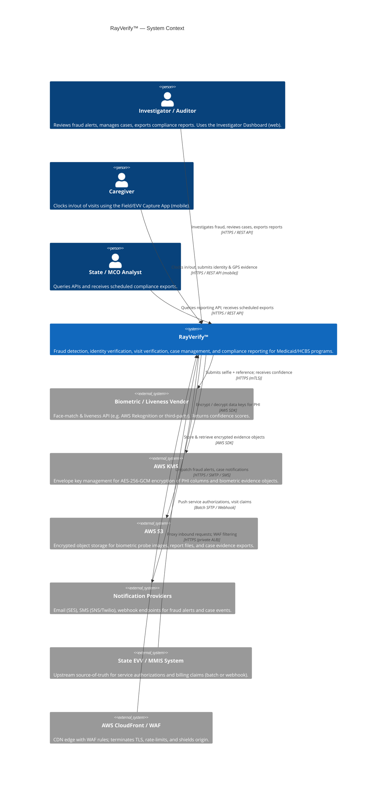

### 2.2 Container Diagram

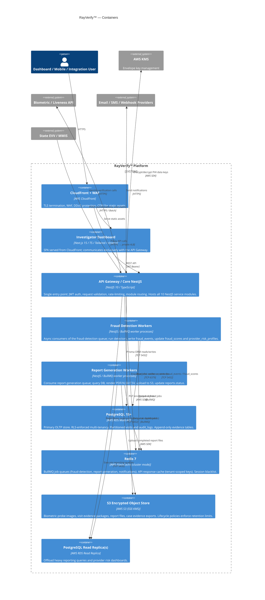

---

## 3. Logical Service Decomposition

### 3.1 NestJS Module Map

The backend is a single NestJS application (`packages/backend/src`) composed of the following modules. Each module is independently testable and has no compile-time circular dependencies on siblings.

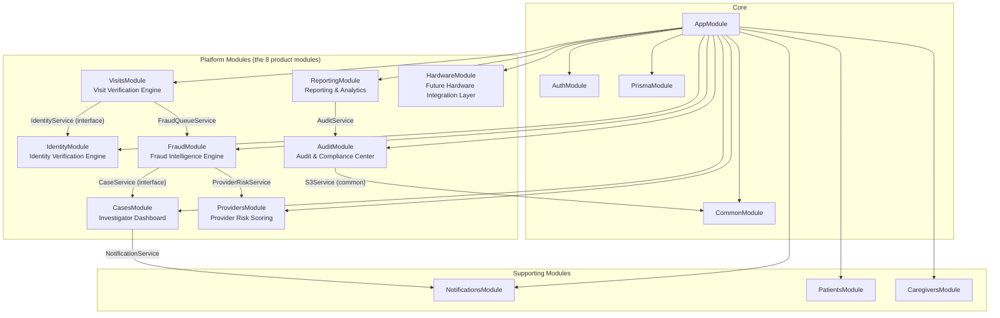

### 3.2 Module-to-Schema Responsibility

| NestJS Module | Tables Owned (write authority) | Tables Read |
|---|---|---|
| `AuthModule` | `users`, `sessions`, `user_roles` | `roles`, `permissions`, `role_permissions` |
| `IdentityModule` | `identity_verifications`, `biometric_enrollments` | `caregivers`, `devices` |
| `VisitsModule` | `visits`, `visit_verifications` | `caregivers`, `patients`, `service_authorizations`, `devices` |
| `FraudModule` | `fraud_events`, `fraud_scores` | `visits`, all verification tables |
| `CasesModule` | `fraud_cases`, `case_notes`, `case_evidence` | `fraud_events`, `providers`, `users` |
| `ProvidersModule` | `providers`, `provider_risk_profiles` | `fraud_events`, `fraud_scores`, `visits` |
| `AuditModule` | `audit_logs` | `audit_logs` (read-only exports) |
| `ReportingModule` | `reports` | all (read replica) |
| `NotificationsModule` | `notifications` | `users`, `fraud_cases` |
| `PatientsModule` | `patients` | `visits`, `service_authorizations` |
| `CaregiversModule` | `caregivers` | `visits`, `identity_verifications` |

### 3.3 Modular-Monolith Now / Microservice Later

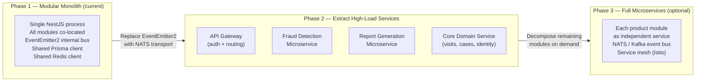

The transition from Phase 1 to Phase 2 requires only:
1. Replacing `EventEmitter2` emissions with `@nestjs/microservices` NATS client calls.
2. Extracting worker processes (already separate in Phase 1) into their own ECS task definitions.
3. No database schema changes — the RLS boundary already enforces isolation.

---

## 4. Key Runtime Flows

### 4.1 Full Visit Verification Chain

This is the primary integrity-critical flow. It runs synchronously within the API request for the clock-out event, writing append-only evidence at every step.

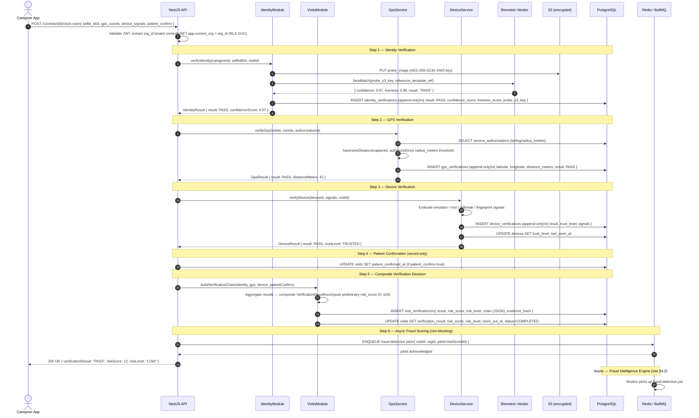

### 4.2 Async Fraud Detection Pipeline

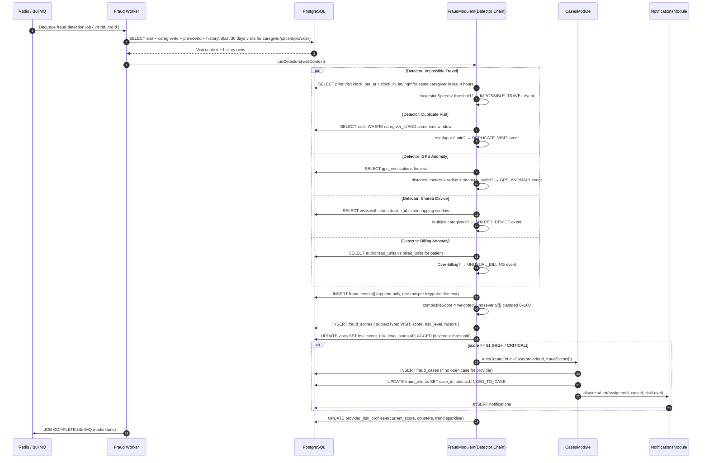

### 4.3 Report Generation Job

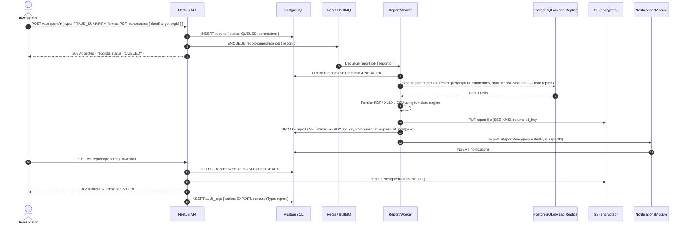

---

## 5. Data Flow & Storage Tiers

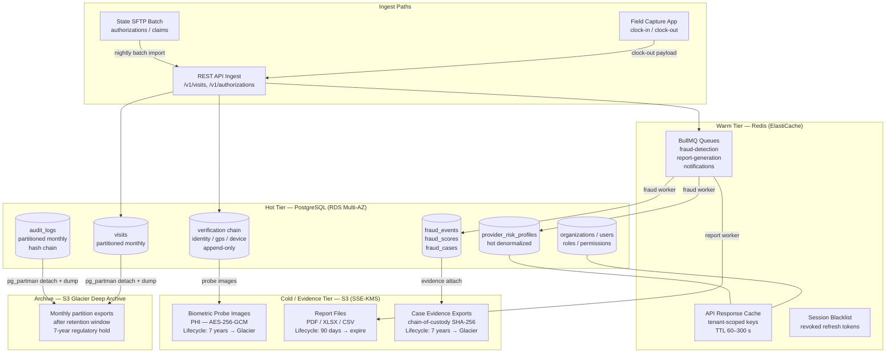

### Storage Tier Summary

| Tier | Technology | Data | Retention |
|---|---|---|---|
| Hot OLTP | RDS PostgreSQL Multi-AZ | visits, verifications, fraud events, cases, audit logs, users | Active + 24-month hot rolling window |
| Warm Queue/Cache | ElastiCache Redis Cluster | BullMQ jobs, API cache, session blacklist | Job TTL 24 h; cache TTL 60–300 s |
| Evidence Object | S3 SSE-KMS | Biometric probe images, case evidence exports | 7 years (HIPAA), then Glacier |
| Report Object | S3 SSE-KMS | Generated PDF/XLSX/CSV reports | 90 days, presigned download only |
| Cold Archive | S3 Glacier Deep Archive | Detached monthly partition dumps | 7 years minimum |

---

## 6. Multi-Tenancy Model

### 6.1 Tenant Isolation Architecture

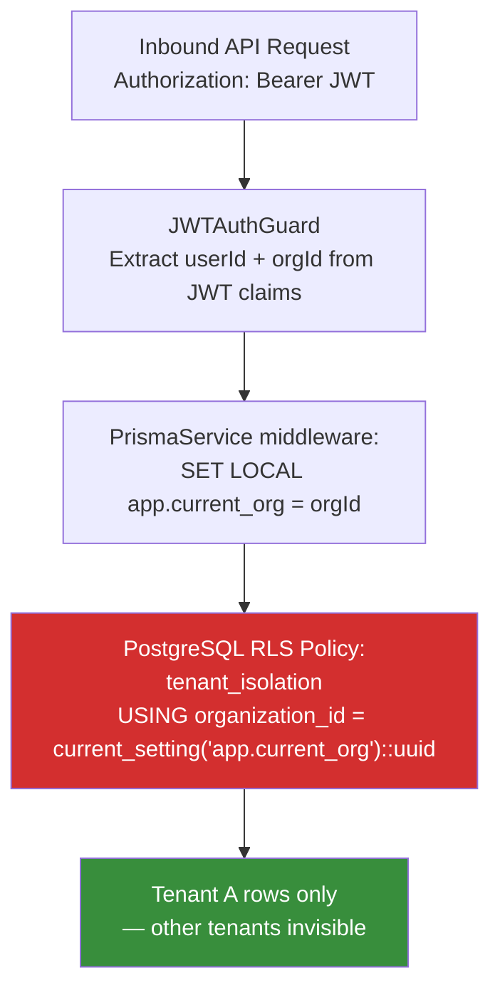

### 6.2 How Tenant Context Flows

1. **JWT Issuance:** On login, the JWT payload includes `{ sub: userId, org: organizationId, roles: [...] }`. Signed with RS256; public key available at `/.well-known/jwks.json`.

2. **Request Middleware:** A NestJS global middleware extracts `org` from the verified JWT claims and stores it on the request context.

3. **Prisma Middleware:** A Prisma client middleware runs `SET LOCAL app.current_org = '<uuid>'` at the start of every transaction/query session. This sets the PostgreSQL session-level GUC that all RLS policies read.

4. **RLS Enforcement:** Every tenant-scoped table has:

   ```sql
   ALTER TABLE <table> ENABLE ROW LEVEL SECURITY;
   ALTER TABLE <table> FORCE ROW LEVEL SECURITY;
   CREATE POLICY tenant_isolation ON <table>
     USING (organization_id = current_setting('app.current_org', true)::uuid)
     WITH CHECK (organization_id = current_setting('app.current_org', true)::uuid);
   ```

   `FORCE ROW LEVEL SECURITY` ensures the policy applies even to the table owner role.

5. **Bypass Role:** A dedicated `rls_bypass` role (BYPASSRLS privilege) is used only by migration jobs and ops tooling. It is never granted to the application service account.

### 6.3 Noisy-Neighbor Controls

| Control | Mechanism |
|---|---|
| API rate limiting | NestJS `ThrottlerModule` per `org_id` + IP, configurable per tenant tier |
| Queue job quotas | BullMQ rate limiter per `org_id` key prefix; max concurrency per queue |
| DB connection pooling | PgBouncer / RDS Proxy; per-tenant connection limits via pool configuration |
| Report query timeouts | `statement_timeout` set per read-replica session for reporting queries |
| Storage quotas | S3 lifecycle + bucket policy; per-prefix size alarms via CloudWatch |

### 6.4 Tenant Configuration

Each `organizations` row carries a `settings JSONB` column holding per-tenant feature flags, risk thresholds, notification preferences, and branding:

```jsonc
{
  "fraudScoreThreshold": 61,       // minimum score to auto-create case
  "gpsRadiusOverrideMeters": null, // null = use service_authorizations.radius_meters
  "mfaRequired": true,
  "notifyOnRiskLevel": "HIGH",
  "reportRetentionDays": 90,
  "featureFlags": {
    "hardwareIntegration": false,
    "aiRiskScoring": true
  }
}
```

---

## 7. Integration Architecture

### 7.1 Inbound Integration Patterns

```mermaid
flowchart LR
  subgraph StateMMIS["State MMIS / EVV System"]
    SFTP[SFTP Batch File\nCSV / EDI 834 / 837]
    WEBHOOK_IN[Webhook Push\napplication/json]
  end

  subgraph MCO["Managed Care Organization"]
    MCOAPI[MCO REST API\npull authorizations]
  end

  subgraph RayVerify["RayVerify™ Integration Layer"]
    IMPORT[BatchImportService\nIdempotent upsert\nvia authorization_id natural key]
    WHIN[WebhookIngressController\nHMAC-SHA256 signature verification]
    POLL[ScheduledPollService\n@Cron every 15 min]
  end

  SFTP -->|"nightly transfer"| IMPORT
  WEBHOOK_IN -->|"real-time push"| WHIN
  MCOAPI -->|"GET authorizations"| POLL

  IMPORT --> DB[(PostgreSQL\nservice_authorizations\nvisits)]
  WHIN --> DB
  POLL --> DB
```

**Idempotency for batch imports:** Each `ServiceAuthorization` upsert uses `ON CONFLICT (organization_id, patient_id, service_code, start_date) DO UPDATE` semantics. Visit imports key on the upstream EVV system's visit ID stored in an `external_id` field. Duplicate imports are safe.

### 7.2 Outbound Integration: Webhooks & State Exports

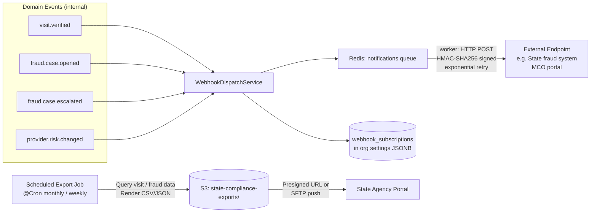

### 7.3 API Versioning Strategy

All API routes are prefixed `/v1/`. When a breaking change is required:

1. A new `/v2/` route group is added. The v1 routes are deprecated with a `Sunset` response header (90-day notice).
2. Versioning is path-based (not header-based) for transparency with government integration teams.
3. The OpenAPI 3.1 specification at `api/openapi.yaml` is the contract; any v1 → v2 migration path is documented in the spec's `x-deprecation-notice` extension.

---

## 8. Scalability, Resilience & Failure Modes

### 8.1 Horizontal Scaling Topology

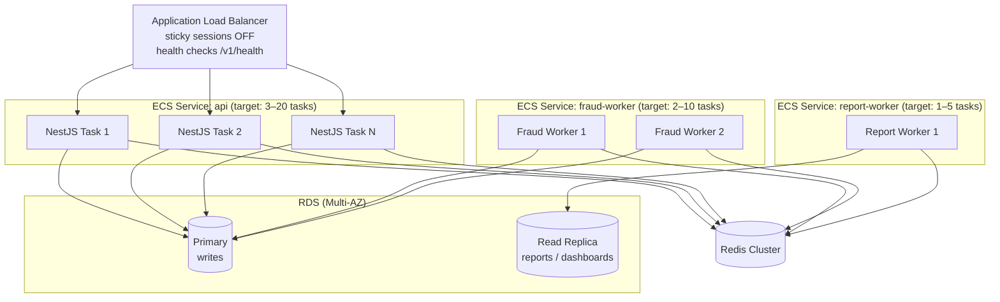

### 8.2 Resilience & Failure Modes

| Failure Mode | Detection | Recovery |
|---|---|---|
| API task crash | ALB health check fails → ECS replaces task in < 30 s | Stateless tasks; no in-memory state loss |
| RDS primary failure | RDS Multi-AZ automatic failover | < 60 s failover; Prisma connection retry with exponential backoff |
| Redis node failure | ElastiCache cluster mode; automatic slot rebalancing | BullMQ jobs re-queued from persistence log; idempotent job IDs |
| Biometric vendor timeout | 5 s HTTP timeout → circuit breaker (consecutive failures) | Identity step result = REVIEW (not FAIL); human review queue |
| S3 PUT failure (probe image) | SDK retry (3x exponential backoff) | If exhausted: identity step REVIEW; probe key logged as null |
| Fraud detector exception | Try/catch per detector; non-fatal | Failing detector skipped; other detectors run; job completes with partial score |
| Report worker crash mid-render | BullMQ job retried (max 3 attempts) | `reports.status` remains GENERATING until worker re-picks; idempotent report ID |
| Partition missing for future date | `visits_default` catch-all partition | Inserts succeed; pg_partman cron creates named partition and reattaches rows |

### 8.3 Idempotency

- **Visit clock events:** `POST /v1/visits/{id}/clock-out` is idempotent via `visit_verifications.visit_id UNIQUE` constraint. A second request for the same `visitId` will receive the existing `visit_verifications` row.
- **Fraud detection jobs:** BullMQ job IDs are `fraud:${visitId}`. A second enqueue for the same `visitId` deduplicates at the queue level.
- **Batch imports:** `ON CONFLICT ... DO UPDATE` semantics on natural keys.
- **Report generation:** `reports.id` is the idempotency key; re-enqueuing a `QUEUED` report checks `status` before rendering.

### 8.4 Eventual Consistency for Risk Scores

`visits.risk_score` and `visits.risk_level` are updated asynchronously by the fraud worker. The clock-out API response returns the **preliminary** score (computed synchronously from verification chain inputs only). The **final** fraud-enriched score is written within seconds and readable via `GET /v1/visits/{id}`. The `visit_verifications.chain` JSONB field tracks both `preliminary` and `final` score states for audit clarity.

`provider_risk_profiles.current_score` is similarly updated after every fraud detection job and is the denormalized hot read for the provider risk dashboard. Historical point-in-time scores are in `fraud_scores` (time series).

---

*Document version: 1.0 | Platform: RayVerify™ | Classification: Investor/Government Distribution*
