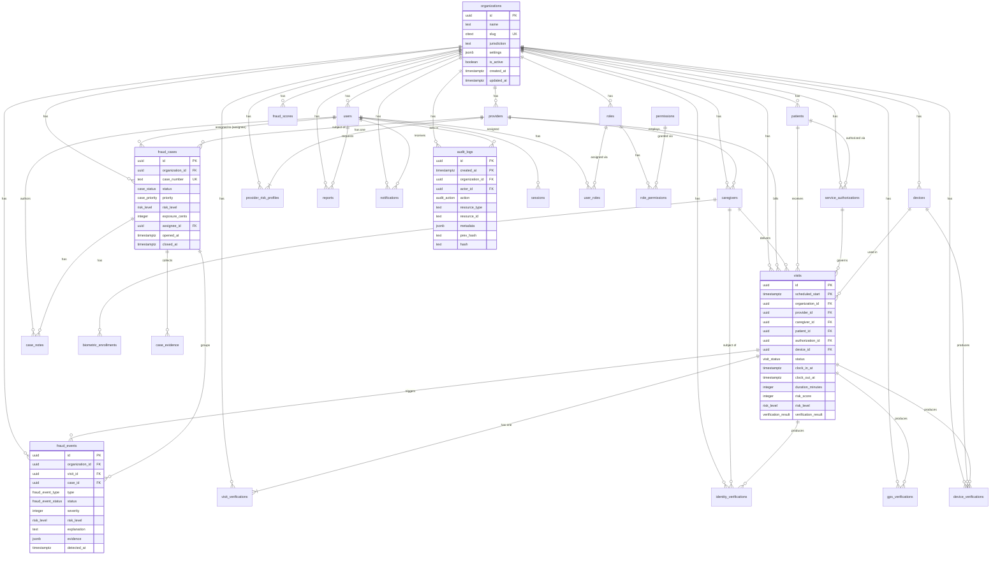
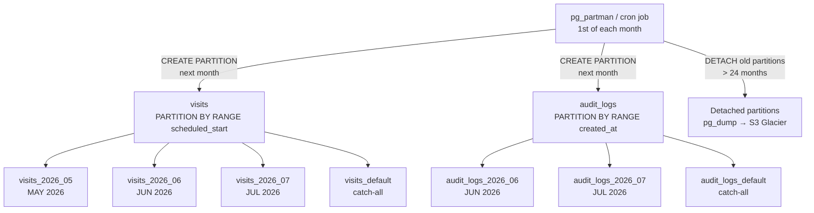
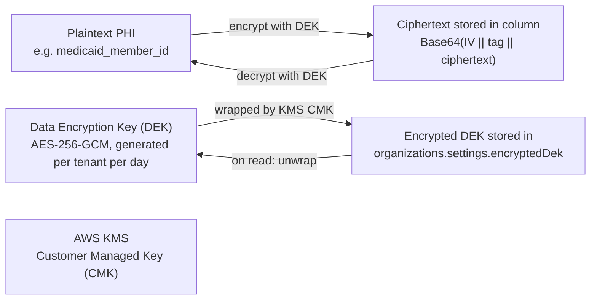
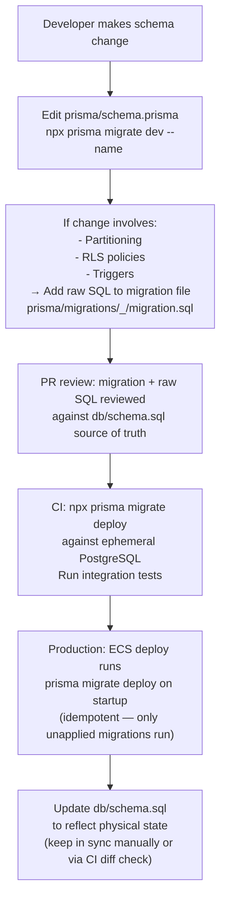

# RayVerify™ — Database Design

> **Document:** 03 — Database Design
> **Platform:** RayVerify™ (parent: RayHealthEVV™)
> **Audience:** Engineering leadership, government evaluators, technical investors, database administrators
> **Status:** Approved for distribution

---

## Table of Contents

1. [Physical Model Overview](#1-physical-model-overview)
2. [Entity-Relationship Diagram](#2-entity-relationship-diagram)
3. [Table-by-Table Reference](#3-table-by-table-reference)
4. [Indexing, Partitioning & Data Integrity](#4-indexing-partitioning--data-integrity)
5. [Multi-Tenant Isolation via Row-Level Security](#5-multi-tenant-isolation-via-row-level-security)
6. [PHI Handling & Data Retention](#6-phi-handling--data-retention)
7. [Migration Strategy, Seeding & Performance](#7-migration-strategy-seeding--performance)

---

## 1. Physical Model Overview

### 1.1 Prisma vs. SQL: Separation of Concerns

RayVerify uses a **two-layer data definition approach**:

| Layer | File | Authority | Concerns |
|---|---|---|---|
| **Logical model** | `packages/backend/prisma/schema.prisma` | Prisma Migrate | TypeScript types, relations, indexes, enum definitions used by application code |
| **Physical model** | `db/schema.sql` | Applied manually / via CI migration script | Native PostgreSQL ENUMs, declarative RANGE partitioning, Row-Level Security policies, immutability triggers, tamper-evidence hash chain trigger, `FORCE ROW LEVEL SECURITY` |

The SQL file is the **source of truth for production DDL**. Prisma manages the logical model and generates TypeScript types; it cannot express partitioning, RLS policies, or trigger definitions. These are applied via raw SQL migration files stored in `packages/backend/prisma/migrations/` as `migration.sql` steps.

### 1.2 Database Stack

- **Engine:** PostgreSQL 15+ (tested on 16). AWS RDS Multi-AZ deployment.
- **Extensions:** `pgcrypto` (UUID generation, SHA-256 via `digest()`), `citext` (case-insensitive text for emails and slugs), `pg_trgm` (trigram fuzzy search on names and case numbers).
- **Optional (recommended for production geofencing):** `PostGIS` — the schema uses `NUMERIC(9,6)` coordinates and Haversine application-layer distance calculation today; PostGIS `GEOGRAPHY` columns can be added in a non-breaking migration.

### 1.3 Naming Conventions

| Convention | Example |
|---|---|
| Tables: `snake_case` plural | `fraud_cases`, `identity_verifications` |
| Columns: `snake_case` | `organization_id`, `risk_score` |
| PKs: UUID v4 (`gen_random_uuid()`) | `id UUID PRIMARY KEY DEFAULT gen_random_uuid()` |
| Timestamps: `TIMESTAMPTZ` | `created_at`, `updated_at`, `detected_at` |
| Money: integer cents | `billed_amount_cents INTEGER`, `exposure_cents INTEGER` |
| Geo coords: `NUMERIC(9,6)` | `latitude NUMERIC(9,6)` (~11 cm precision) |
| Risk scores: `INTEGER` 0–100 | `risk_score`, `score`, `severity` |
| Enums: `UPPER_SNAKE_CASE` | `'IMPOSSIBLE_TRAVEL'`, `'PASS'`, `'CRITICAL'` |

---

## 2. Entity-Relationship Diagram



---

## 3. Table-by-Table Reference

### Group A — Tenancy & Access Control

#### `organizations`

Tenant root. Every other table foreign-keys to this via `organization_id`.

| Column | Type | Notes |
|---|---|---|
| `id` | `UUID` | PK, `gen_random_uuid()` |
| `name` | `TEXT` | Display name of the state agency / MCO |
| `slug` | `CITEXT` | URL-safe unique identifier; UNIQUE |
| `jurisdiction` | `TEXT` | FIPS code, CMS region, or state abbreviation |
| `settings` | `JSONB` | Feature flags, risk thresholds, branding, webhook config |
| `is_active` | `BOOLEAN` | Soft-disable a tenant without deleting data |
| `created_at` | `TIMESTAMPTZ` | Auto-set |
| `updated_at` | `TIMESTAMPTZ` | Auto-maintained by `trg_org_touch` trigger |

#### `users`

Platform users: investigators, auditors, compliance officers, admins.

| Column | Type | Notes |
|---|---|---|
| `id` | `UUID` | PK |
| `organization_id` | `UUID` | FK → organizations, CASCADE |
| `email` | `CITEXT` | Case-insensitive; UNIQUE per org |
| `password_hash` | `TEXT` | Argon2id hash; NULL for SSO-only accounts |
| `first_name` | `TEXT` | |
| `last_name` | `TEXT` | |
| `phone` | `TEXT` | |
| `status` | `user_status` | `ACTIVE` / `INACTIVE` / `SUSPENDED` / `LOCKED` / `PENDING_INVITE` |
| `mfa_method` | `mfa_method` | `NONE` / `TOTP` / `SMS` / `WEBAUTHN` |
| `mfa_secret` | `TEXT` | AES-256-GCM encrypted TOTP secret (KMS envelope) |
| `last_login_at` | `TIMESTAMPTZ` | |
| `failed_logins` | `INTEGER` | Reset on success; triggers lock at threshold |
| `locked_until` | `TIMESTAMPTZ` | Null if not locked |
| `created_at` | `TIMESTAMPTZ` | |
| `updated_at` | `TIMESTAMPTZ` | Auto-maintained by trigger |

#### `sessions`

Short-lived server-side session records for refresh token rotation.

| Column | Type | Notes |
|---|---|---|
| `id` | `UUID` | PK |
| `user_id` | `UUID` | FK → users, CASCADE |
| `refresh_token_hash` | `TEXT` | SHA-256 of the raw refresh token; UNIQUE |
| `user_agent` | `TEXT` | |
| `ip_address` | `INET` | PostgreSQL INET type |
| `expires_at` | `TIMESTAMPTZ` | 30-day refresh window |
| `revoked_at` | `TIMESTAMPTZ` | Null if active |
| `created_at` | `TIMESTAMPTZ` | |

#### `roles`, `permissions`, `role_permissions`, `user_roles`

RBAC tables. `roles` are org-scoped (e.g. `INVESTIGATOR`, `AUDITOR`, `OIG_AGENT`). `permissions` are a global catalog keyed by `resource:action` format (e.g. `fraud_case:assign`, `report:export`). `role_permissions` and `user_roles` are pure join tables with composite PKs.

---

### Group B — Domain: Providers, Caregivers, Patients, Authorizations

#### `providers`

A Medicaid-enrolled billing agency or home-care organization.

| Column | Type | Notes |
|---|---|---|
| `id` | `UUID` | PK |
| `organization_id` | `UUID` | FK → organizations |
| `npi` | `TEXT` | 10-digit NPI; CHECK constraint `~ '^[0-9]{10}$'`; UNIQUE per org |
| `medicaid_id` | `TEXT` | Jurisdiction-specific enrollment ID |
| `legal_name` | `TEXT` | |
| `tax_id` | `TEXT` | Encrypted at app layer before write |
| `is_active` | `BOOLEAN` | |
| `enrolled_at` | `TIMESTAMPTZ` | |
| `created_at` | `TIMESTAMPTZ` | |
| `updated_at` | `TIMESTAMPTZ` | |

#### `caregivers`

Individual care workers; primary subjects of identity verification.

| Column | Type | Notes |
|---|---|---|
| `id` | `UUID` | PK |
| `organization_id` | `UUID` | FK → organizations |
| `provider_id` | `UUID` | FK → providers |
| `external_id` | `TEXT` | Payroll / scheduling system reference |
| `first_name`, `last_name` | `TEXT` | |
| `email` | `CITEXT` | Optional |
| `phone` | `TEXT` | Optional |
| `status` | `user_status` | Active / Inactive / Suspended |
| `created_at`, `updated_at` | `TIMESTAMPTZ` | |

#### `biometric_enrollments`

Reference biometric template record for a caregiver. The raw face image never leaves S3; only the S3 key and vendor template reference pointer are stored here.

| Column | Type | Notes |
|---|---|---|
| `id` | `UUID` | PK |
| `caregiver_id` | `UUID` | FK → caregivers, CASCADE |
| `method` | `identity_method` | `SELFIE` / `LIVENESS` / `FINGERPRINT` / `NFC_CARD` / `GOV_CREDENTIAL` |
| `reference_s3_key` | `TEXT` | S3 key of the KMS-encrypted reference image (PHI) |
| `template_ref` | `TEXT` | Pointer to vendor face-embedding vector store record |
| `is_active` | `BOOLEAN` | One active enrollment per method per caregiver |
| `enrolled_at` | `TIMESTAMPTZ` | |
| `retired_at` | `TIMESTAMPTZ` | Set when superseded by a new enrollment |

#### `patients`

Medicaid beneficiaries receiving personal care / HCBS services.

| Column | Type | Notes |
|---|---|---|
| `id` | `UUID` | PK |
| `organization_id` | `UUID` | FK → organizations |
| `medicaid_member_id` | `TEXT` | PHI — AES-256-GCM encrypted at app layer; blind index maintained separately |
| `first_name`, `last_name` | `TEXT` | PHI |
| `date_of_birth` | `DATE` | PHI |
| `created_at`, `updated_at` | `TIMESTAMPTZ` | |

#### `service_authorizations`

Medicaid-approved service events including the geofence anchor (address + `radius_meters`) used by GPS fraud rules.

| Column | Type | Notes |
|---|---|---|
| `id` | `UUID` | PK |
| `organization_id` | `UUID` | FK → organizations |
| `patient_id` | `UUID` | FK → patients |
| `service_code` | `TEXT` | HCPCS / state code (e.g. `T1019`) |
| `description` | `TEXT` | |
| `address_line1/2`, `city`, `state`, `postal_code` | `TEXT` | Service delivery address |
| `latitude`, `longitude` | `NUMERIC(9,6)` | CHECKed: lat in [-90,90], lng in [-180,180] |
| `radius_meters` | `INTEGER` | GPS geofence radius; CHECK > 0; default 150 |
| `authorized_units` | `INTEGER` | Periodic cap used in overtime/overlap detectors |
| `start_date`, `end_date` | `DATE` | Authorization window |
| `is_active` | `BOOLEAN` | |
| `created_at` | `TIMESTAMPTZ` | |

---

### Group C — Device Trust

#### `devices`

Device registry and trust level store.

| Column | Type | Notes |
|---|---|---|
| `id` | `UUID` | PK |
| `organization_id` | `UUID` | FK → organizations |
| `device_id` | `TEXT` | Stable client-generated identifier; UNIQUE per org |
| `fingerprint_hash` | `TEXT` | Hash of composite device fingerprint (model+OS+screen…) |
| `platform` | `device_platform` | `IOS` / `ANDROID` / `WEB` / `HARDWARE_TERMINAL` |
| `os_version`, `browser`, `app_version` | `TEXT` | |
| `last_ip_address` | `INET` | |
| `trust_level` | `device_trust_level` | `TRUSTED` / `UNKNOWN` / `SUSPICIOUS` / `BLOCKED` |
| `is_emulator` | `BOOLEAN` | Set by DeviceVerification analysis |
| `is_rooted` | `BOOLEAN` | |
| `is_jailbroken` | `BOOLEAN` | |
| `first_seen_at`, `last_seen_at` | `TIMESTAMPTZ` | |

---

### Group D — Visits & Verification Chain

#### `visits`

Core service event record. Partitioned monthly by `scheduled_start`. Composite PK `(id, scheduled_start)` is required by PostgreSQL declarative partitioning.

| Column | Type | Notes |
|---|---|---|
| `id` | `UUID` | Part of composite PK |
| `scheduled_start` | `TIMESTAMPTZ` | Part of composite PK; partition key |
| `organization_id` | `UUID` | FK → organizations |
| `provider_id` | `UUID` | FK → providers |
| `caregiver_id` | `UUID` | FK → caregivers |
| `patient_id` | `UUID` | FK → patients |
| `authorization_id` | `UUID` | FK → service_authorizations (nullable) |
| `device_id` | `UUID` | FK → devices (nullable) |
| `service_code` | `TEXT` | HCPCS code delivered |
| `status` | `visit_status` | `SCHEDULED` → `IN_PROGRESS` → `COMPLETED` / `FLAGGED` / `REJECTED` / `APPROVED` / `CANCELLED` |
| `scheduled_end` | `TIMESTAMPTZ` | |
| `clock_in_at`, `clock_out_at` | `TIMESTAMPTZ` | |
| `duration_minutes` | `INTEGER` | Computed at clock-out |
| `clock_in_lat`, `clock_in_lng` | `NUMERIC(9,6)` | Denormalized from `gps_verifications` for fast fraud queries |
| `billed_units` | `INTEGER` | |
| `billed_amount_cents` | `INTEGER` | Billing amount in integer cents |
| `verification_result` | `verification_result` | `PASS` / `REVIEW` / `FAIL` — rolled up from chain |
| `risk_score` | `INTEGER` | 0–100; CHECK constraint enforced |
| `risk_level` | `risk_level` | `LOW` / `MODERATE` / `HIGH` / `CRITICAL` |
| `created_at`, `updated_at` | `TIMESTAMPTZ` | |

#### `visit_verifications`

Immutable rollup binding the full verification evidence package for a visit. One record per visit (`visit_id UNIQUE`).

| Column | Type | Notes |
|---|---|---|
| `id` | `UUID` | PK |
| `organization_id` | `UUID` | FK → organizations |
| `visit_id` | `UUID` | UNIQUE; references visits |
| `result` | `verification_result` | Composite outcome |
| `risk_score` | `INTEGER` | 0–100 at time of verification |
| `risk_level` | `risk_level` | |
| `chain` | `JSONB` | Per-step results & contributing factors (identity/gps/device/patient/fraud) |
| `evidence_hash` | `TEXT` | SHA-256 over the canonical evidence package |
| `approved_by_id` | `UUID` | FK → users (manual approval) |
| `approved_at` | `TIMESTAMPTZ` | |
| `created_at` | `TIMESTAMPTZ` | Write-once; no trigger needed (no `UPDATE` path) |

#### `identity_verifications`

Append-only record of each identity verification attempt. Multiple records per visit are possible (retry scenarios).

| Column | Type | Notes |
|---|---|---|
| `id` | `UUID` | PK |
| `organization_id` | `UUID` | FK → organizations |
| `visit_id` | `UUID` | FK → visits (nullable; enrollment-time verifications have no visit) |
| `caregiver_id` | `UUID` | FK → caregivers |
| `method` | `identity_method` | `SELFIE` / `LIVENESS` / `DEVICE_TRUST` / `FINGERPRINT` / `NFC_CARD` / `GOV_CREDENTIAL` |
| `result` | `verification_result` | `PASS` / `REVIEW` / `FAIL` |
| `confidence_score` | `NUMERIC(5,4)` | 0.0000–1.0000 face-match confidence |
| `liveness_score` | `NUMERIC(5,4)` | 0.0000–1.0000 anti-spoofing liveness probability |
| `probe_s3_key` | `TEXT` | S3 key of encrypted probe image (PHI) |
| `matcher` | `TEXT` | Internal model ID or vendor identifier |
| `reasons` | `JSONB` | Array of explainability factors |
| `created_at` | `TIMESTAMPTZ` | Immutable; `trg_idv_immutable` blocks UPDATE/DELETE |

#### `gps_verifications`

Append-only GPS evidence and geofence decision for each clock event.

| Column | Type | Notes |
|---|---|---|
| `id` | `UUID` | PK |
| `organization_id` | `UUID` | FK → organizations |
| `visit_id` | `UUID` | FK → visits |
| `latitude`, `longitude` | `NUMERIC(9,6)` | Captured device coordinates |
| `accuracy_meters` | `NUMERIC(7,2)` | Device-reported GPS accuracy |
| `distance_meters` | `NUMERIC(10,2)` | Haversine distance from authorized address |
| `result` | `verification_result` | `PASS` (within radius) / `REVIEW` / `FAIL` |
| `captured_at` | `TIMESTAMPTZ` | Device-side timestamp |
| `event_type` | `TEXT` | `CLOCK_IN` / `CLOCK_OUT` / `MID_VISIT` |
| `raw_payload` | `JSONB` | Full GPS provider payload for forensic use |
| `created_at` | `TIMESTAMPTZ` | Immutable; `trg_gps_immutable` blocks UPDATE/DELETE |

#### `device_verifications`

Append-only device posture snapshot.

| Column | Type | Notes |
|---|---|---|
| `id` | `UUID` | PK |
| `organization_id` | `UUID` | FK → organizations |
| `visit_id` | `UUID` | FK → visits (nullable) |
| `device_id` | `UUID` | FK → devices |
| `result` | `verification_result` | |
| `trust_level` | `device_trust_level` | Point-in-time posture at capture |
| `ip_address` | `INET` | |
| `signals` | `JSONB` | `{ emulator, rooted, jailbroken, vpn, cloneApp, ... }` |
| `created_at` | `TIMESTAMPTZ` | Immutable; `trg_dv_immutable` blocks UPDATE/DELETE |

---

### Group E — Fraud Intelligence

#### `fraud_events`

A single detected fraud signal. Append-only; never mutated after insert.

| Column | Type | Notes |
|---|---|---|
| `id` | `UUID` | PK |
| `organization_id` | `UUID` | FK → organizations |
| `visit_id` | `UUID` | FK → visits (nullable; SET NULL on visit delete) |
| `case_id` | `UUID` | FK → fraud_cases (nullable; SET NULL when unlinked) |
| `type` | `fraud_event_type` | One of 13 signal types (see §3.5) |
| `status` | `fraud_event_status` | `OPEN` → `TRIAGED` → `LINKED_TO_CASE` → `DISMISSED` / `CONFIRMED` |
| `severity` | `INTEGER` | 0–100; CHECK constraint; detector confidence contribution |
| `risk_level` | `risk_level` | Derived from severity |
| `explanation` | `TEXT` | Human-readable rationale |
| `evidence` | `JSONB` | Structured supporting data (coordinates, timestamps, amounts) |
| `detector` | `TEXT` | Detector identifier |
| `detector_version` | `TEXT` | Detector version for reproducibility |
| `detected_at` | `TIMESTAMPTZ` | Immutable; `trg_fe_immutable` blocks UPDATE/DELETE |

**Fraud event type catalog:**

| Type | Signal |
|---|---|
| `IMPOSSIBLE_TRAVEL` | Caregiver at two locations faster than physically possible |
| `DUPLICATE_VISIT` | Overlapping visit records for the same caregiver |
| `SHARED_DEVICE` | Same device used by multiple caregivers concurrently |
| `GPS_ANOMALY` | Clock-in outside geofence or mock GPS detected |
| `IDENTITY_MISMATCH` | Face confidence below threshold / liveness failure |
| `UNUSUAL_BILLING` | Billed units exceed authorized units |
| `ABNORMAL_DURATION` | Visit duration statistically anomalous vs. history |
| `EXCESSIVE_OVERTIME` | Caregiver hours exceed regulatory limits |
| `SERVICE_OVERLAP` | Patient receiving same service from two caregivers concurrently |
| `CROSS_PROVIDER_RISK` | Risk signal aggregated across multiple providers |
| `LIVENESS_FAILURE` | Anti-spoofing liveness score below threshold |
| `DEVICE_TAMPERING` | Rooted / jailbroken / emulator device detected |
| `GEOFENCE_BREACH` | GPS coordinates outside the authorized service address radius |

#### `fraud_cases`

An investigation grouping related fraud events for formal case management.

| Column | Type | Notes |
|---|---|---|
| `id` | `UUID` | PK |
| `organization_id` | `UUID` | FK → organizations |
| `case_number` | `TEXT` | Human-friendly: `RV-2026-000123`; UNIQUE per org |
| `title` | `TEXT` | Auto-generated or investigator-set |
| `status` | `case_status` | `OPEN` → `IN_REVIEW` → `ESCALATED` → `PENDING_PAYMENT_HOLD` → `SUBSTANTIATED` / `UNSUBSTANTIATED` → `CLOSED` |
| `priority` | `case_priority` | `LOW` / `MEDIUM` / `HIGH` / `URGENT` |
| `risk_level` | `risk_level` | |
| `provider_id` | `UUID` | FK → providers (primary subject of investigation) |
| `assignee_id` | `UUID` | FK → users (investigator) |
| `exposure_cents` | `INTEGER` | Estimated program dollars at risk |
| `summary` | `TEXT` | Investigator narrative |
| `opened_at`, `closed_at` | `TIMESTAMPTZ` | |
| `created_at`, `updated_at` | `TIMESTAMPTZ` | `trg_case_touch` maintains `updated_at` |

#### `case_notes` and `case_evidence`

`case_notes` — investigator narrative entries on a case. `is_internal` notes are never included in beneficiary disclosure exports. `case_evidence` — chain-of-custody evidence items (visit records, GPS traces, identity images, uploaded documents) with `content_hash` (SHA-256) for integrity verification.

#### `fraud_scores`

Time-series of computed risk scores for any subject type.

| Column | Type | Notes |
|---|---|---|
| `id` | `UUID` | PK |
| `organization_id` | `UUID` | FK → organizations |
| `subject_type` | `score_subject_type` | `VISIT` / `PROVIDER` / `CAREGIVER` / `PATIENT` / `CLAIM` |
| `subject_id` | `UUID` | References the relevant entity (polymorphic by subject_type) |
| `score` | `INTEGER` | 0–100; CHECK constraint |
| `risk_level` | `risk_level` | Derived: 0–30=LOW, 31–60=MODERATE, 61–80=HIGH, 81–100=CRITICAL |
| `factors` | `JSONB` | SHAP-style per-feature contributions for explainability |
| `model_version` | `TEXT` | Scoring model version for reproducibility |
| `computed_at` | `TIMESTAMPTZ` | |

#### `provider_risk_profiles`

Denormalized current risk standing per provider — one row per provider, kept hot for the risk ranking dashboard.

| Column | Type | Notes |
|---|---|---|
| `id` | `UUID` | PK |
| `organization_id` | `UUID` | FK → organizations |
| `provider_id` | `UUID` | UNIQUE; FK → providers |
| `current_score` | `INTEGER` | 0–100 latest composite score |
| `risk_level` | `risk_level` | |
| `verification_failures` | `INTEGER` | Rolling count |
| `gps_anomalies` | `INTEGER` | Rolling count |
| `billing_anomalies` | `INTEGER` | Rolling count |
| `identity_issues` | `INTEGER` | Rolling count |
| `open_cases` | `INTEGER` | Sync'd from fraud_cases count |
| `substantiated_cases` | `INTEGER` | Historical confirmed fraud count |
| `trend` | `JSONB` | Sparkline array `[{ t: epoch, score: int }]` |
| `last_computed_at` | `TIMESTAMPTZ` | |
| `updated_at` | `TIMESTAMPTZ` | |

---

### Group F — Reporting & Audit

#### `reports`

Report job records and their S3 output pointers.

| Column | Type | Notes |
|---|---|---|
| `id` | `UUID` | PK |
| `organization_id` | `UUID` | FK → organizations |
| `type` | `report_type` | `FRAUD_SUMMARY` / `PROVIDER_RISK` / `VISIT_VERIFICATION` / `INVESTIGATION` / `STATE_COMPLIANCE` / `EXECUTIVE_DASHBOARD` |
| `format` | `report_format` | `PDF` / `XLSX` / `CSV` / `JSON` |
| `status` | `report_status` | `QUEUED` → `GENERATING` → `READY` / `FAILED` / `EXPIRED` |
| `parameters` | `JSONB` | Filters, date range, scope passed at request time |
| `s3_key` | `TEXT` | Set when READY; presigned URL generated on download |
| `requested_by_id` | `UUID` | FK → users |
| `expires_at` | `TIMESTAMPTZ` | Default: 90 days; after which status=EXPIRED and S3 object lifecycle'd |
| `created_at`, `completed_at` | `TIMESTAMPTZ` | |

#### `notifications`

In-app, email, SMS, and webhook notification records.

| Column | Type | Notes |
|---|---|---|
| `id` | `UUID` | PK |
| `organization_id` | `UUID` | FK → organizations |
| `user_id` | `UUID` | FK → users (nullable for webhook channel) |
| `channel` | `notification_channel` | `IN_APP` / `EMAIL` / `SMS` / `WEBHOOK` |
| `status` | `notification_status` | `PENDING` → `SENT` → `DELIVERED` → `READ` / `FAILED` |
| `title` | `TEXT` | |
| `body` | `TEXT` | |
| `data` | `JSONB` | Deep-link context: `{ caseId, visitId, fraudEventId }` |
| `read_at` | `TIMESTAMPTZ` | |
| `created_at` | `TIMESTAMPTZ` | |

#### `audit_logs`

Immutable, append-only, tamper-evident audit trail. Partitioned monthly by `created_at`.

| Column | Type | Notes |
|---|---|---|
| `id` | `UUID` | Part of composite PK |
| `created_at` | `TIMESTAMPTZ` | Part of composite PK; partition key |
| `organization_id` | `UUID` | Tenant scoped; RLS enforced |
| `actor_id` | `UUID` | FK → users (nullable for system actions; SET NULL on user delete) |
| `action` | `audit_action` | `CREATE` / `READ` / `UPDATE` / `DELETE` / `LOGIN` / `LOGOUT` / `EXPORT` / `VERIFY` / `SCORE` / `CASE_ACTION` / `CONFIG_CHANGE` |
| `resource_type` | `TEXT` | Logical resource: `fraud_case`, `visit`, `report`, `user`, etc. |
| `resource_id` | `TEXT` | UUID string of the affected record |
| `ip_address` | `INET` | |
| `user_agent` | `TEXT` | |
| `metadata` | `JSONB` | Before/after diff or action context (PHI-scrubbed before write) |
| `prev_hash` | `TEXT` | SHA-256 of the previous row in the per-tenant chain |
| `hash` | `TEXT` | SHA-256 of `prev_hash \|\| org_id \|\| actor_id \|\| action \|\| resource_type \|\| resource_id \|\| metadata \|\| created_at` |

---

## 4. Indexing, Partitioning & Data Integrity

### 4.1 Index Inventory

| Index Name | Table | Columns | Purpose |
|---|---|---|---|
| `idx_users_org_status` | `users` | `(organization_id, status)` | Tenant-scoped user lookups by status |
| `idx_sessions_user_exp` | `sessions` | `(user_id, expires_at)` | Efficient session validation and cleanup |
| `idx_providers_org_active` | `providers` | `(organization_id, is_active)` | Active provider lookups within tenant |
| `idx_caregivers_org_provider` | `caregivers` | `(organization_id, provider_id)` | Caregiver lists per provider |
| `idx_enrollments_caregiver_active` | `biometric_enrollments` | `(caregiver_id, is_active)` | Active enrollment lookup at clock-in |
| `idx_patients_org` | `patients` | `(organization_id)` | Tenant patient roster |
| `idx_auth_org_patient_active` | `service_authorizations` | `(organization_id, patient_id, is_active)` | Authorization lookup for GPS geofence check |
| `idx_devices_org_trust` | `devices` | `(organization_id, trust_level)` | Device trust dashboard and BLOCKED device lookups |
| `idx_devices_fingerprint` | `devices` | `(fingerprint_hash)` | Cross-organization duplicate device detection |
| `idx_visits_org_status` | `visits` | `(organization_id, status)` | Visit list views by status |
| `idx_visits_org_sched` | `visits` | `(organization_id, scheduled_start)` | Date-range visit queries within tenant |
| `idx_visits_caregiver` | `visits` | `(caregiver_id, scheduled_start)` | Caregiver visit history (impossible travel lookups) |
| `idx_visits_patient` | `visits` | `(patient_id, scheduled_start)` | Patient visit history (overlap / duplicate checks) |
| `idx_visits_provider` | `visits` | `(provider_id, scheduled_start)` | Provider audit view |
| `idx_vv_org_result` | `visit_verifications` | `(organization_id, result)` | Compliance dashboard: FAIL/REVIEW visit counts |
| `idx_idv_org_result` | `identity_verifications` | `(organization_id, result)` | Identity failure trend analysis |
| `idx_idv_caregiver` | `identity_verifications` | `(caregiver_id, created_at)` | Caregiver identity history for liveness-failure detector |
| `idx_gps_org_result` | `gps_verifications` | `(organization_id, result)` | GPS anomaly trend analysis |
| `idx_gps_visit` | `gps_verifications` | `(visit_id, captured_at)` | All GPS events for a given visit |
| `idx_dv_org_result` | `device_verifications` | `(organization_id, result)` | Device tampering trend analysis |
| `idx_fe_org_type_status` | `fraud_events` | `(organization_id, type, status)` | Fraud alert dashboard by signal type |
| `idx_fe_org_detected` | `fraud_events` | `(organization_id, detected_at)` | Fraud event time-series charts |
| `idx_fe_case` | `fraud_events` | `(case_id)` | Events per case lookup |
| `idx_cases_org_status` | `fraud_cases` | `(organization_id, status, priority)` | Case queue sorted by priority |
| `idx_cases_assignee` | `fraud_cases` | `(assignee_id)` | My cases / investigator workload |
| `idx_notes_case` | `case_notes` | `(case_id, created_at)` | Case note timeline |
| `idx_evidence_case` | `case_evidence` | `(case_id)` | Evidence items per case |
| `idx_scores_subject` | `fraud_scores` | `(organization_id, subject_type, subject_id, computed_at DESC)` | Latest score + score history per subject |
| `idx_risk_org_level` | `provider_risk_profiles` | `(organization_id, risk_level)` | Provider risk ranking by level |
| `idx_reports_org_type` | `reports` | `(organization_id, type, status)` | Report list and status polling |
| `idx_notif_org_user` | `notifications` | `(organization_id, user_id, status)` | Unread notification inbox |
| `idx_audit_org_created` | `audit_logs` | `(organization_id, created_at)` | Audit log time-range exports |
| `idx_audit_org_resource` | `audit_logs` | `(organization_id, resource_type, resource_id)` | Resource-specific audit trail lookups |
| `idx_audit_actor` | `audit_logs` | `(actor_id)` | User activity audit |

### 4.2 Partitioning Strategy



**Why monthly range partitioning:**

- Visit and audit log data grows linearly with caregiver activity. A multi-state deployment may generate millions of visit rows per month. Partitioning allows:
  - **Fast date-range queries:** the planner prunes irrelevant partitions.
  - **Cheap archival:** `ALTER TABLE visits DETACH PARTITION visits_2024_01` removes the partition from the live table without a full table scan. The detached partition is then dumped and archived to S3 Glacier.
  - **Regulatory compliance:** monthly partitions map cleanly to billing cycle retention windows.

**Catch-all partitions (`visits_default`, `audit_logs_default`):** Prevent insert failures if a partition creation job runs late. The cron job moves rows from the default partition to the named partition after creation.

**Retention:** Active partitions are kept for 24 months in RDS. Detached partitions are archived to S3 Glacier Deep Archive for 7 years (HIPAA minimum) then automatically expired by S3 lifecycle policy.

### 4.3 Constraints & Data Integrity

| Constraint | Table | Definition | Purpose |
|---|---|---|---|
| `chk_npi_format` | `providers` | `npi ~ '^[0-9]{10}$'` | Enforce 10-digit NPI format |
| `chk_radius_positive` | `service_authorizations` | `radius_meters > 0` | Prevent zero-radius geofence |
| `chk_lat` | `service_authorizations` | `latitude BETWEEN -90 AND 90` | Valid latitude range |
| `chk_lng` | `service_authorizations` | `longitude BETWEEN -180 AND 180` | Valid longitude range |
| `chk_visit_risk` | `visits` | `risk_score BETWEEN 0 AND 100` | Bounded risk score |
| `chk_severity` | `fraud_events` | `severity BETWEEN 0 AND 100` | Bounded severity |
| `chk_score` | `fraud_scores` | `score BETWEEN 0 AND 100` | Bounded composite score |
| `UNIQUE (organization_id, email)` | `users` | | Email unique per tenant |
| `UNIQUE (organization_id, key)` | `roles` | | Role key unique per tenant |
| `UNIQUE (organization_id, npi)` | `providers` | | NPI unique per tenant |
| `UNIQUE (organization_id, device_id)` | `devices` | | Device unique per tenant |
| `UNIQUE (organization_id, case_number)` | `fraud_cases` | | Case number unique per tenant |
| `UNIQUE visit_id` | `visit_verifications` | | One verification package per visit |
| `UNIQUE provider_id` | `provider_risk_profiles` | | One risk profile per provider |

### 4.4 Immutability Triggers

The `rv_forbid_mutation()` trigger function raises `integrity_constraint_violation` on any `UPDATE` or `DELETE` against the four append-only evidence tables and `audit_logs`:

```sql
CREATE OR REPLACE FUNCTION rv_forbid_mutation() RETURNS trigger AS $$
BEGIN
  RAISE EXCEPTION 'Table % is append-only; % is not permitted',
    TG_TABLE_NAME, TG_OP USING ERRCODE = 'integrity_constraint_violation';
END; $$ LANGUAGE plpgsql;
```

Triggers: `trg_idv_immutable`, `trg_gps_immutable`, `trg_dv_immutable`, `trg_fe_immutable`, `trg_audit_immutable` — all `BEFORE UPDATE OR DELETE FOR EACH ROW`.

### 4.5 Audit Hash Chain Design

Each `audit_logs` insert automatically computes `prev_hash` and `hash` via the `rv_audit_hash_chain()` `BEFORE INSERT` trigger:

```
hash_n = SHA256(
    prev_hash_{n-1}         -- empty string for first row per tenant
  || organization_id        -- tenant scope
  || actor_id               -- who acted
  || action                 -- what action
  || resource_type          -- on what resource type
  || resource_id            -- on what record
  || metadata::text         -- PHI-scrubbed context
  || created_at::text       -- when
)
```

**Chain verification procedure:**

1. `SELECT id, organization_id, actor_id, action, resource_type, resource_id, metadata, created_at, prev_hash, hash FROM audit_logs WHERE organization_id = $1 ORDER BY created_at ASC, id ASC`.
2. For each row in sequence: recompute `expected_hash = SHA256(prev_hash || fields...)`.
3. Compare `expected_hash` to the stored `hash`. Any mismatch indicates tampering of that row or any predecessor.
4. A government auditor or OIG agent can run this verification offline using only the exported data — no secret key required.

**Note:** The chain is per-tenant (keyed by `organization_id`). The trigger fetches the most recent hash for the same tenant on insert. In high-concurrency environments a serialization advisory lock per `organization_id` is recommended to prevent hash-chain gaps.

---

## 5. Multi-Tenant Isolation via Row-Level Security

### 5.1 RLS Policy Application

The DDL block in `db/schema.sql` applies three statements to every tenant-scoped table in a `DO $$` loop:

```sql
ALTER TABLE <table> ENABLE ROW LEVEL SECURITY;
ALTER TABLE <table> FORCE ROW LEVEL SECURITY;
CREATE POLICY tenant_isolation ON <table>
  USING (organization_id = current_setting('app.current_org', true)::uuid)
  WITH CHECK (organization_id = current_setting('app.current_org', true)::uuid);
```

Tables covered: `users`, `roles`, `providers`, `caregivers`, `patients`, `service_authorizations`, `devices`, `visits`, `visit_verifications`, `identity_verifications`, `gps_verifications`, `device_verifications`, `fraud_events`, `fraud_cases`, `fraud_scores`, `provider_risk_profiles`, `reports`, `notifications`, `audit_logs`.

`FORCE ROW LEVEL SECURITY` ensures the policy applies even when the connected role is the table owner — preventing accidental bypass.

### 5.2 Setting the GUC from Application Code

NestJS Prisma middleware pattern:

```typescript
// Simplified; actual implementation wraps every query in a transaction
prisma.$use(async (params, next) => {
  await prisma.$executeRawUnsafe(
    `SET LOCAL app.current_org = '${orgId}'`
  );
  return next(params);
});
```

`SET LOCAL` scopes the GUC to the current transaction only — it is automatically reset when the transaction ends, preventing GUC leakage across connection pool hops.

### 5.3 Operations / Migration Role

A dedicated PostgreSQL role (`rv_ops`) is granted `BYPASSRLS`. It is used only by:

- Prisma migration runner (`npx prisma migrate deploy`).
- Nightly partition management cron jobs.
- DBA emergency access (MFA-gated bastion host).

The application service account (`rv_app`) does **not** have BYPASSRLS and cannot access another tenant's data even with a crafted query.

---

## 6. PHI Handling & Data Retention

### 6.1 PHI Column Inventory

| Table | Column | PHI Type | Protection |
|---|---|---|---|
| `patients` | `medicaid_member_id` | Medicaid ID | AES-256-GCM (KMS envelope) + blind index |
| `patients` | `first_name`, `last_name` | Name | AES-256-GCM (KMS envelope) |
| `patients` | `date_of_birth` | DOB | AES-256-GCM (KMS envelope) |
| `caregivers` | `first_name`, `last_name`, `email`, `phone` | PII (caregiver employee) | Stored plaintext in DB; TLS in transit; role-scoped access |
| `users` | `mfa_secret` | TOTP secret | AES-256-GCM (KMS envelope) |
| `providers` | `tax_id` | Federal Tax ID | AES-256-GCM (app layer) |
| `identity_verifications` | `probe_s3_key` | Biometric image pointer | S3 object: SSE-KMS; access gated by presigned URL + IAM |
| `biometric_enrollments` | `reference_s3_key` | Biometric reference image | S3 object: SSE-KMS; access gated by presigned URL + IAM |
| `audit_logs` | `metadata` | Contextual — PHI-scrubbed before write | PHI fields removed by `AuditService.sanitize()` before insert |

### 6.2 Envelope Encryption Pattern



- Each tenant's DEK is cached in-process (LRU, 15 min TTL) to avoid per-row KMS calls.
- Key rotation: a new DEK is generated on a schedule; old ciphertext is re-encrypted in a background job.

### 6.3 Blind Index for Searchable PHI

`patients.medicaid_member_id` must be searchable (e.g. "look up patient by Medicaid ID") without decrypting. A `medicaid_member_id_blind_idx` column (not in the Prisma model for clarity; added in raw SQL migration) stores `HMAC-SHA256(medicaid_member_id, blind_index_key)`. Search queries compare against the blind index. The blind index key is separate from the DEK and stored in AWS Secrets Manager.

### 6.4 Data Retention & Purge

| Data Category | Retention | Mechanism |
|---|---|---|
| Active visits + verifications | 24 months hot (RDS) | Partition detach + archive |
| Archived partitions | 7 years (HIPAA minimum) | S3 Glacier Deep Archive |
| Biometric probe images (S3) | 7 years | S3 lifecycle: transition to Glacier at 90 days, expire at 7 years |
| Report files (S3) | 90 days | S3 lifecycle: expire at 90 days |
| Case evidence (S3) | 7 years | S3 lifecycle: Glacier at 1 year, expire at 7 years |
| Audit logs | 7 years (regulatory) | Partitioned; archived to Glacier |
| Sessions | 30 days (or on revocation) | Cron: `DELETE FROM sessions WHERE expires_at < now()` |
| Notifications | 90 days | Cron: delete delivered/read notifications older than 90 days |
| Terminated tenant data | Purge on written request | `DELETE FROM organizations WHERE id = $1 CASCADE` (cascades to all tenant rows via FK); S3 objects purged via object tagging |

---

## 7. Migration Strategy, Seeding & Performance

### 7.1 Migration Strategy



**Key rules:**

- Prisma migration files are **never edited after merging**. If a migration needs to be corrected, a new migration is created.
- Destructive migrations (DROP COLUMN, DROP TABLE) must be preceded by a two-phase migration: first add the replacement, then remove the old in a separate PR after code is deployed.
- `db/schema.sql` is kept manually in sync with the production state and acts as the human-readable reference for DBA review.

### 7.2 Seeding

`npm run db:seed` (`packages/backend/prisma/seed.ts`) creates:

1. A default `organizations` row (slug: `demo-state-agency`).
2. System roles: `ORG_ADMIN`, `INVESTIGATOR`, `AUDITOR`, `COMPLIANCE_OFFICER`, `OIG_AGENT`.
3. Global permissions catalog (all `resource:action` pairs).
4. Role-permission assignments for the system roles.
5. A demo admin user for local development (never run in production).

### 7.3 Connection Pooling

| Environment | Pooler | Pool Size |
|---|---|---|
| Development | Direct Prisma connection | `connection_limit=5` |
| Staging / Production | AWS RDS Proxy (PgBouncer mode) | `max_pool_size=100` per service; `default_pool_size=20` |
| Report workers (read replica) | RDS Proxy read-only endpoint | `max_pool_size=20`; `statement_timeout=30s` |

PgBouncer transaction-mode pooling is compatible with `SET LOCAL` GUC calls because the GUC is scoped to the transaction, not the connection, and is reset automatically on `COMMIT` / `ROLLBACK`.

### 7.4 Read Replica Usage

| Query Pattern | Route | Rationale |
|---|---|---|
| Visit clock-in/out writes | Primary | Requires immediate read-your-writes consistency |
| Fraud detection worker reads | Primary | Must see latest clock-out data |
| Report generation queries | Read replica | Heavy aggregation; can tolerate < 1 s replication lag |
| Provider risk dashboard | Read replica | Denormalized; staleness acceptable |
| Audit log exports | Read replica | Historical data; no lag concern |
| Investigator dashboard list views | Read replica | Eventual consistency acceptable |

### 7.5 Performance Notes

- `pg_trgm` GIN indexes on `providers.legal_name`, `fraud_cases.case_number`, and `patients.last_name` enable sub-millisecond fuzzy search in the investigator dashboard.
- JSONB columns (`chain`, `evidence`, `signals`, `factors`, `trend`) are not individually indexed unless specific key paths are queried frequently; targeted `jsonb_path_ops` GIN indexes can be added per path as query patterns emerge.
- The `fraud_scores` table grows as a time series; a background job periodically downsizes by keeping only the latest N score records per subject and archiving older rows (configurable per tenant in `organizations.settings`).

---

*Document version: 1.0 | Platform: RayVerify™ | Classification: Investor/Government Distribution*
