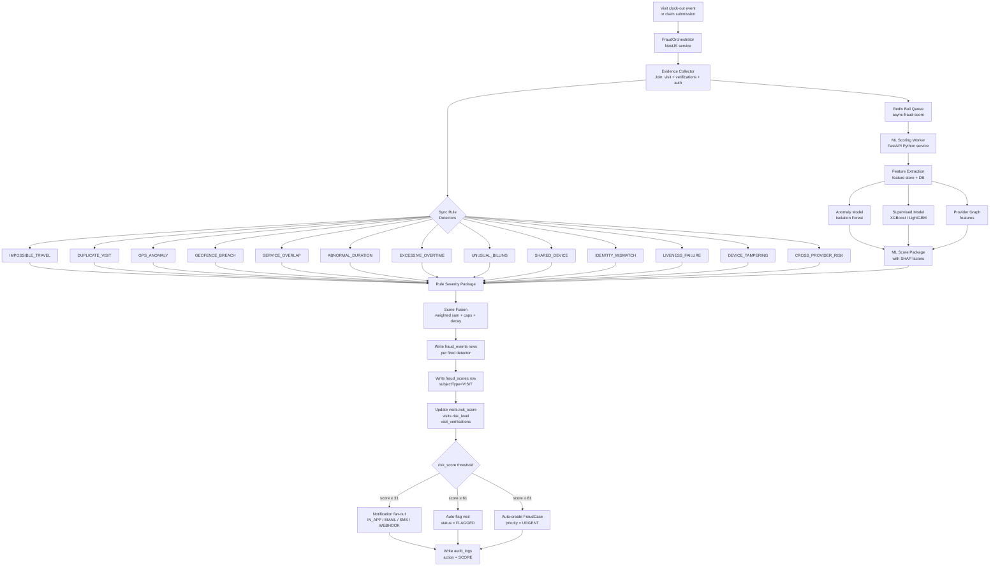
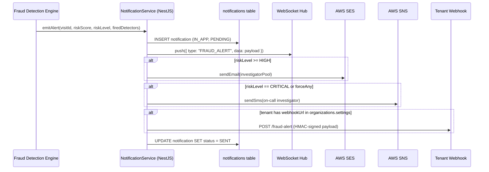

# RayVerify™ — Fraud Detection Engine

> **Document 05 of 11** | Parent platform: RayHealthEVV™  
> Audience: Engineering, Program Integrity, State Medicaid Agencies, Investors  
> Last updated: 2026-06-10

---

## Table of Contents

1. [Objectives & Design Principles](#1-objectives--design-principles)
2. [Pipeline Architecture](#2-pipeline-architecture)
3. [Detector Catalog](#3-detector-catalog)
4. [Score Fusion](#4-score-fusion)
5. [Alerting & Case Linkage](#5-alerting--case-linkage)
6. [Tuning & Governance](#6-tuning--governance)

---

## 1. Objectives & Design Principles

### 1.1 Mission

The RayVerify Fraud Detection Engine (FDE) surfaces fraudulent or erroneous Medicaid/HCBS visits **before payments are made**. Its outputs drive investigator workflows, provider risk rankings, and state agency reporting. It is not a black box: every score is accompanied by a structured explanation that satisfies the due-process requirements of Medicaid program integrity.

### 1.2 Core Objectives

| Objective | Description |
|-----------|-------------|
| **Pre-payment detection** | Flag suspicious visits at clock-out or claim submission, before the billing cycle runs. The `visits.status` transitions to `FLAGGED` and blocks the approval pathway until an investigator clears it. |
| **Explainability** | Every composite fraud score must carry per-factor contributions in `fraud_scores.factors` (SHAP-style). Every `fraud_events` row carries `explanation` (human-readable) and `evidence` (structured JSON). No score is actionable without a reason. |
| **Deterministic rules + ML hybrid** | Rule-based detectors provide instant, auditable, threshold-configurable decisions with zero cold-start latency. ML scorers augment rules with learned behavioral patterns and generalize to novel fraud variants. The two signal streams are fused into a single composite score. |
| **Low false-positive cost framing** | Wrongly flagging a legitimate caregiver visit has real harm: delayed payment to the worker and disrupted care. The FDE is tuned to minimize false positives at the cost of slightly lower sensitivity. Precision is the primary optimization target; recall is monitored but secondary until label volume is sufficient to calibrate a cost-weighted threshold. |
| **Human-in-the-loop** | The FDE never autonomously withholds payment. A score ≥ 61 (HIGH) triggers an alert; payment hold requires a `PENDING_PAYMENT_HOLD` case status set by an investigator. Fully automated adverse action is prohibited. |
| **Tenant configurability** | Every threshold, weight, and enabled detector is configurable per tenant via `organizations.settings` (JSONB). Defaults are research-backed starting points, not hard-coded constants. |

### 1.3 Design Principles

**P1 — Append-only evidence:** `fraud_events` rows are never updated or deleted (DB trigger `trg_fe_immutable`). Each detection run produces a new event. The audit trail is immutable.

**P2 — Detector versioning:** Every `fraud_events` row carries `detector` (e.g., `impossible_travel`) and `detector_version` (e.g., `v2.1.0`). Score reproductions are always attributed to a specific detector version. This enables backtesting and regulatory challenge response.

**P3 — Sync/async split:** Rule detectors that complete in < 100 ms run synchronously in the NestJS request pipeline. ML scorers that call the Python FastAPI scoring service are dispatched asynchronously via Redis Bull queues and write results back when complete. The visit is held in `FLAGGED` status until the async pipeline finalizes.

**P4 — Multi-tenant isolation:** Row-level security (`SET app.current_org`) ensures no cross-tenant data exposure during scoring. Tenant-specific thresholds override defaults from `organizations.settings`.

**P5 — Point-in-time correctness:** All lookback windows use data with `detected_at` / `scheduled_start` strictly before the current visit's `scheduledStart` to prevent temporal leakage.

---

## 2. Pipeline Architecture

### 2.1 High-Level Flow



### 2.2 Sync vs Async Split

| Path | Detectors | Latency budget | Trigger |
|------|-----------|---------------|---------|
| **Synchronous** (NestJS request) | IMPOSSIBLE_TRAVEL, DUPLICATE_VISIT, GPS_ANOMALY, GEOFENCE_BREACH, SERVICE_OVERLAP, ABNORMAL_DURATION, EXCESSIVE_OVERTIME, UNUSUAL_BILLING, SHARED_DEVICE, IDENTITY_MISMATCH, LIVENESS_FAILURE, DEVICE_TAMPERING, CROSS_PROVIDER_RISK (rule tier only) | ≤ 250 ms total | Clock-out API call |
| **Asynchronous** (Bull worker) | ML scoring service (all 13 event types as learned features + CROSS_PROVIDER_RISK graph features) | ≤ 30 s p99 | Job enqueued on clock-out; visit held in `FLAGGED` until worker writes result |

The sync pass produces a preliminary `fraud_scores` row (`modelVersion = "rules-only"`). The async pass overwrites the composite score with the fused result (`modelVersion = "fused-v{n}"`). If the async pass does not complete within 60 seconds (configurable), the visit retains the rules-only score as a safe fallback.

### 2.3 Evidence Collector

Before any detector fires, the `EvidenceCollector` assembles a hydrated context object from the database:

```typescript
interface VisitScoringContext {
  visit: Visit;                          // from visits
  auth: ServiceAuthorization | null;     // from service_authorizations
  gpsVerifications: GpsVerification[];   // from gps_verifications
  identityVerifications: IdentityVerification[];  // from identity_verifications
  deviceVerification: DeviceVerification | null;  // from device_verifications
  device: Device | null;                 // from devices
  recentCaregiverVisits: Visit[];        // last 30 days, same caregiverId
  recentPatientVisits: Visit[];          // last 30 days, same patientId
  providerRiskProfile: ProviderRiskProfile | null;  // from provider_risk_profiles
  tenantSettings: FraudDetectionSettings;          // from organizations.settings
}
```

---

## 3. Detector Catalog

Each detector maps to exactly one value in the `FraudEventType` enum. All 13 detectors are described below with their signals, logic, evidence schema, severity contribution, and false-positive mitigations.

---

### 3.1 IMPOSSIBLE_TRAVEL

**Definition:** The caregiver clocks in to a new visit from a location that is physically unreachable given the elapsed time since their last clock-out.

**Signals / inputs:**
- `visits.clockInLat`, `visits.clockInLng` (current visit)
- Previous visit's `clock_out_at`, `clock_in_lat`, `clock_in_lng` (from `recentCaregiverVisits`)
- `gps_verifications.capturedAt` (timestamp of GPS capture)

**Detection logic:**

Haversine distance between two GPS points:

```
R = 6371000  # Earth radius in meters

φ1, λ1 = lat/lng of previous clock-out (radians)
φ2, λ2 = lat/lng of current clock-in  (radians)

Δφ = φ2 - φ1
Δλ = λ2 - λ1

a = sin²(Δφ/2) + cos(φ1)·cos(φ2)·sin²(Δλ/2)
c = 2·atan2(√a, √(1−a))
distance_m = R · c
```

Effective travel speed:

```
time_delta_s = clockInAt_current − clockOutAt_previous  (seconds)
speed_mps    = distance_m / max(time_delta_s, 1)
speed_kph    = speed_mps * 3.6
```

Thresholds (tenant-configurable):

```python
PLAUSIBLE_SPEED_KPH    = 130    # upper bound for ground/car travel
SUSPICIOUS_SPEED_KPH   = 300    # below commercial aviation
IMPOSSIBLE_SPEED_KPH   = 900    # no commercial route achievable

if speed_kph > IMPOSSIBLE_SPEED_KPH:
    severity = 90;  risk = CRITICAL
elif speed_kph > SUSPICIOUS_SPEED_KPH:
    severity = 70;  risk = HIGH
elif speed_kph > PLAUSIBLE_SPEED_KPH:
    severity = 45;  risk = MODERATE
else:
    no event emitted
```

**Default severity contribution:** 45–90 depending on band.

**Evidence JSON:**
```json
{
  "previousVisitId":    "uuid",
  "previousClockOut":   "2026-06-10T08:00:00Z",
  "previousLat":        40.712800,
  "previousLng":       -74.006000,
  "currentClockIn":     "2026-06-10T08:15:00Z",
  "currentLat":         34.052200,
  "currentLng":       -118.243700,
  "distanceMeters":     3950000,
  "timeDeltaSeconds":   900,
  "speedKph":           15800,
  "threshold":          900,
  "band":               "IMPOSSIBLE"
}
```

**Typical false-positive causes:**
- GPS inaccuracy on initial lock (high `accuracy_meters` in `gps_verifications`) — mitigate by requiring `accuracy_meters < 50` before using a GPS point as a travel anchor.
- Caregiver clocked out from a desk/admin location, not the physical care site — mitigate by using `CLOCK_IN` GPS events only, not admin clock-outs.
- Two caregivers sharing the same device ID due to organizational device re-issue — detected separately by SHARED_DEVICE.
- Manual time corrections by a supervisor — mitigate by checking `visit.updatedAt` vs `clockInAt` lag.

---

### 3.2 DUPLICATE_VISIT

**Definition:** Two or more visits for the same caregiver and patient overlap in their scheduled or actual time window, or two visits share identical attributes that are statistically improbable unless duplicated.

**Signals / inputs:**
- `visits.caregiverId`, `visits.patientId`, `visits.scheduledStart`, `visits.scheduledEnd`
- `visits.clockInAt`, `visits.clockOutAt`
- `visits.serviceCode`, `visits.billedUnits`, `visits.billedAmountCents`

**Detection logic:**

```python
# Exact duplicate: same caregiver + patient + scheduled window within 1-min tolerance
exact_match = SELECT * FROM visits
  WHERE caregiver_id = :caregiverId
    AND patient_id   = :patientId
    AND id           != :visitId
    AND abs(extract(epoch FROM scheduled_start - :scheduledStart)) < 60
    AND status NOT IN ('CANCELLED')

if exact_match:
    severity = 85;  risk = CRITICAL

# Overlapping window: same caregiver, different patient or same patient
overlap = SELECT * FROM visits
  WHERE caregiver_id = :caregiverId
    AND id           != :visitId
    AND status NOT IN ('CANCELLED')
    AND tsrange(clock_in_at, clock_out_at) && tsrange(:clockInAt, :clockOutAt)

overlap_count = len(overlap)
if overlap_count >= 2:
    severity = 75;  risk = HIGH
elif overlap_count == 1:
    severity = 55;  risk = MODERATE
```

**Default severity contribution:** 55–85.

**Evidence JSON:**
```json
{
  "duplicateVisitIds":  ["uuid-a", "uuid-b"],
  "matchType":          "EXACT_SCHEDULE",
  "overlapMinutes":     120,
  "affectedPatients":   ["patient-uuid"],
  "billedAmountCents":  28000
}
```

**False-positive causes:** Rescheduled visits that were not cancelled before a replacement was created. Mitigate by checking `visits.status = CANCELLED` exclusion and implementing a grace window (configurable `duplicateGraceMinutes`).

---

### 3.3 SHARED_DEVICE

**Definition:** Multiple caregivers use the same physical device (`devices.deviceId` or `devices.fingerprintHash`) to clock in, suggesting credential sharing, identity substitution, or device relay fraud.

**Signals / inputs:**
- `visits.deviceId` → `devices.deviceId`, `devices.fingerprintHash`
- Recent `visits` joined by same `deviceId`, different `caregiverId`
- `devices.isEmulator`, `devices.isRooted`, `devices.isJailbroken`
- `device_verifications.signals`

**Detection logic:**

```python
recent_device_users = SELECT DISTINCT caregiver_id FROM visits
  WHERE device_id = :deviceId
    AND caregiver_id != :caregiverId
    AND scheduled_start > now() - interval '30 days'
    AND status NOT IN ('CANCELLED')

distinct_caregivers = len(recent_device_users)

if distinct_caregivers >= 3:
    severity = 80;  risk = HIGH
elif distinct_caregivers >= 2:
    severity = 55;  risk = MODERATE
elif distinct_caregivers == 1:
    severity = 35;  risk = MODERATE

# Amplify if device is flagged
if device.trustLevel in ('SUSPICIOUS', 'BLOCKED'):
    severity = min(severity + 15, 100)
if device.isEmulator or device.isRooted or device.isJailbroken:
    severity = min(severity + 20, 100)
```

**Default severity contribution:** 35–80 (amplified with device flags).

**Evidence JSON:**
```json
{
  "deviceId":           "device-uuid",
  "fingerprintHash":    "sha256hex",
  "sharedCaregiverIds": ["cg-uuid-1", "cg-uuid-2"],
  "lookbackDays":       30,
  "deviceTrustLevel":   "SUSPICIOUS",
  "isEmulator":         false,
  "isRooted":           true
}
```

**False-positive causes:** Agency-issued shared tablets intended for use by multiple caregivers in a facility. Mitigate by whitelisting `device.deviceId` values marked as "shared facility device" in `organizations.settings.sharedDeviceWhitelist`. Shared facility devices are excluded from SHARED_DEVICE scoring but still scored on DEVICE_TAMPERING.

---

### 3.4 GPS_ANOMALY

**Definition:** The GPS reading is internally inconsistent: reported accuracy is too poor to be meaningful, coordinates are physically impossible, or the GPS fix is suspiciously stale.

**Signals / inputs:**
- `gps_verifications.latitude`, `gps_verifications.longitude`
- `gps_verifications.accuracyMeters`
- `gps_verifications.capturedAt` vs `visits.clockInAt`
- `gps_verifications.rawPayload` (provider/mock signals)

**Detection logic:**

```python
# Coordinate bounds check
if not (-90 <= lat <= 90) or not (-180 <= lng <= 180):
    severity = 90;  emit CRITICAL

# Accuracy too poor to be meaningful
if accuracy_meters > 500:
    severity = 60;  risk = HIGH
elif accuracy_meters > 200:
    severity = 30;  risk = MODERATE

# GPS timestamp lag (stale fix)
fix_lag_s = abs((capturedAt - clockInAt).total_seconds())
if fix_lag_s > 300:          # 5-minute stale fix
    severity = max(severity, 45)

# Mock GPS indicator from device signals (rawPayload.mockLocation == true)
if raw_payload.get('mockLocation') == True:
    severity = 85;  risk = CRITICAL
```

**Default severity contribution:** 30–90.

**Evidence JSON:**
```json
{
  "latitude":        40.712800,
  "longitude":      -74.006000,
  "accuracyMeters":  350.0,
  "fixLagSeconds":   312,
  "mockLocation":    false,
  "rawPayload":      { "provider": "fused", "mockLocation": false }
}
```

**False-positive causes:** Rural or indoor environments with legitimately degraded GPS accuracy. Mitigate with tenant-level `gpsAccuracyThresholdMeters` override. Urban canyon effect produces >200 m accuracy legitimately — apply relaxed thresholds for visits where `service_authorizations.city` is in a known high-rise zone.

---

### 3.5 IDENTITY_MISMATCH

**Definition:** The biometric verification (selfie/liveness) produced a low face-match confidence score, suggesting the person presenting is not the enrolled caregiver.

**Signals / inputs:**
- `identity_verifications.confidenceScore` (0.0–1.0 face-match probability)
- `identity_verifications.livenessScore`
- `identity_verifications.result` (PASS / REVIEW / FAIL)
- `identity_verifications.method` (SELFIE, LIVENESS, DEVICE_TRUST, …)
- Historical `identity_verifications` for the same `caregiverId`

**Detection logic:**

```python
CONFIDENCE_FAIL_THRESHOLD   = 0.60   # below = strong mismatch
CONFIDENCE_REVIEW_THRESHOLD = 0.80   # below = weak match

if result == 'FAIL' or confidence_score < CONFIDENCE_FAIL_THRESHOLD:
    severity = 80;  risk = HIGH
elif result == 'REVIEW' or confidence_score < CONFIDENCE_REVIEW_THRESHOLD:
    severity = 50;  risk = MODERATE

# Historical pattern: repeated mismatches
recent_failures = SELECT count(*) FROM identity_verifications
  WHERE caregiver_id = :caregiverId
    AND result IN ('FAIL', 'REVIEW')
    AND created_at > now() - interval '7 days'

if recent_failures >= 3:
    severity = min(severity + 20, 100)
```

**Default severity contribution:** 50–80 (amplified by pattern).

**Evidence JSON:**
```json
{
  "identityVerificationId": "uuid",
  "method":                 "LIVENESS",
  "result":                 "FAIL",
  "confidenceScore":        0.43,
  "livenessScore":          0.91,
  "recentFailures7d":       2,
  "matcher":                "aws-rekognition-v3"
}
```

**False-positive causes:** Poor lighting, glasses/hat changes, enrollment quality issues. Mitigate by requiring re-enrollment if `confidence_score` averages below 0.75 over the past 10 verifications. Allow supervisor-confirmed identity as a REVIEW-pass fallback.

---

### 3.6 UNUSUAL_BILLING

**Definition:** The billed units or dollar amount for a visit is statistically anomalous relative to the caregiver's own billing history, the provider's cohort, or the service authorization cap.

**Signals / inputs:**
- `visits.billedUnits`, `visits.billedAmountCents`
- `service_authorizations.authorizedUnits` (periodic cap)
- `visits.serviceCode`
- Historical `visits` for same `caregiverId` + `serviceCode`
- `provider_risk_profiles.billingAnomalies`

**Detection logic:**

```python
# Compute historical billing distribution (last 90 days, same service code)
hist = SELECT billed_units FROM visits
  WHERE caregiver_id  = :caregiverId
    AND service_code  = :serviceCode
    AND scheduled_start BETWEEN now()-interval'90d' AND :scheduledStart
    AND status = 'APPROVED'

mean_units = mean(hist)
std_units  = std(hist)
z_score    = (billed_units - mean_units) / max(std_units, 0.01)

if z_score > 3.0:
    severity = 70;  risk = HIGH
elif z_score > 2.0:
    severity = 45;  risk = MODERATE

# Over-authorization cap
if auth.authorized_units is not None and billed_units > auth.authorized_units:
    over_pct = (billed_units - auth.authorized_units) / auth.authorized_units
    if over_pct > 0.50:
        severity = max(severity, 75);  risk = HIGH
    elif over_pct > 0.10:
        severity = max(severity, 40);  risk = MODERATE
```

**Default severity contribution:** 40–75.

**Evidence JSON:**
```json
{
  "billedUnits":        16,
  "meanUnitsLookback":  8.2,
  "stdUnitsLookback":   1.4,
  "zScore":             5.6,
  "authorizedUnits":    12,
  "overAuthPct":        0.33,
  "billedAmountCents":  34000,
  "serviceCode":        "T1019"
}
```

**False-positive causes:** Extended visits due to medical emergencies, holidays, or legitimate authorization amendments. Mitigate by checking `service_authorizations.endDate` and recent amendment history. A single z-score outlier in an otherwise clean history should produce MODERATE, not HIGH.

---

### 3.7 ABNORMAL_DURATION

**Definition:** The actual visit duration (`clockOutAt − clockInAt`) is statistically extreme compared to the caregiver's own duration distribution for the same service code.

**Signals / inputs:**
- `visits.durationMinutes`
- `visits.clockInAt`, `visits.clockOutAt`
- Historical `visits.durationMinutes` for same `caregiverId` + `serviceCode`
- `service_authorizations.authorizedUnits` (unit = 15-min increment for most HCBS codes)

**Detection logic:**

Duration z-score over rolling 90-day window:

```
μ  = mean(durationMinutes | caregiverId, serviceCode, last 90 days)
σ  = std(durationMinutes  | caregiverId, serviceCode, last 90 days)
z  = (durationMinutes_current − μ) / max(σ, 1.0)
```

```python
if abs(z) > 3.5:
    severity = 65;  risk = HIGH
elif abs(z) > 2.5:
    severity = 40;  risk = MODERATE
elif abs(z) > 2.0:
    severity = 20;  risk = LOW

# Extremely short visits (< 5 min) — billing with no real service
if duration_minutes < 5 and billed_units > 0:
    severity = max(severity, 70);  risk = HIGH

# Extremely long visits exceeding authorization ceiling
if auth is not None:
    auth_duration_minutes = auth.authorized_units * 15
    if duration_minutes > auth_duration_minutes * 1.5:
        severity = max(severity, 55)
```

**Default severity contribution:** 20–70.

**Evidence JSON:**
```json
{
  "durationMinutes":    3,
  "meanMinutes":        92.4,
  "stdMinutes":         18.7,
  "zScore":             -4.78,
  "direction":          "SHORT",
  "authDurationMinutes":120,
  "billedUnits":        8
}
```

**False-positive causes:** Visit aborted due to patient refusal or emergency (legitimately short). Mitigate by checking `visits.status = CANCELLED` and supervisor notes. Unusual-short visits should be reviewed, not auto-rejected.

---

### 3.8 EXCESSIVE_OVERTIME

**Definition:** The caregiver's total billed hours across all visits in a 24-hour or 7-day window exceeds the physiological or regulatory maximum, suggesting ghost hours or shared credentials.

**Signals / inputs:**
- `visits.clockInAt`, `visits.clockOutAt`, `visits.durationMinutes`
- `visits.caregiverId` — aggregate over rolling windows
- `service_authorizations.authorizedUnits` (weekly cap)
- Tenant-configurable limits

**Detection logic:**

```python
# Rolling 24-hour window
hours_24h = SELECT sum(duration_minutes) / 60.0 FROM visits
  WHERE caregiver_id = :caregiverId
    AND status NOT IN ('CANCELLED')
    AND clock_in_at >= :clockInAt - interval '24h'
    AND clock_in_at <= :clockInAt

# Rolling 7-day window
hours_7d = SELECT sum(duration_minutes) / 60.0 FROM visits
  WHERE caregiver_id = :caregiverId
    AND status NOT IN ('CANCELLED')
    AND clock_in_at >= :clockInAt - interval '7d'

# Thresholds (tenant-configurable)
MAX_HOURS_24H = 16    # physiological ceiling
MAX_HOURS_7D  = 70    # regulatory / labor law ceiling

if hours_24h > MAX_HOURS_24H:
    overage_pct = (hours_24h - MAX_HOURS_24H) / MAX_HOURS_24H
    severity = min(50 + int(overage_pct * 50), 90)
    risk = CRITICAL if hours_24h > 24 else HIGH

if hours_7d > MAX_HOURS_7D:
    severity = max(severity, 60);  risk = HIGH
```

**Default severity contribution:** 50–90.

**Evidence JSON:**
```json
{
  "window24hHours":     22.5,
  "window7dHours":      85.0,
  "maxAllowed24h":      16,
  "maxAllowed7d":       70,
  "overage24hHours":    6.5,
  "visitCountIn24h":    6
}
```

**False-positive causes:** Live-in caregivers with legitimate 24-hour overnight shifts (documented in auth). Mitigate by flagging `service_authorizations.serviceCode` = overnight codes (e.g., T1005) as exempt from 24h overtime checks. Apply 7d cap regardless.

---

### 3.9 SERVICE_OVERLAP

**Definition:** Two visits for the same patient overlap in time — the patient cannot simultaneously receive two services — or the caregiver has overlapping visits with different patients (already partly captured in DUPLICATE_VISIT; SERVICE_OVERLAP focuses on patient-centered billing fraud).

**Signals / inputs:**
- `visits.patientId`, `visits.caregiverId`
- `visits.clockInAt`, `visits.clockOutAt`
- `service_authorizations.serviceCode`
- All visits for same `patientId` in the billing period

**Detection logic:**

Clock-overlap arithmetic for a pair of visits A and B:

```
overlap_start = max(A.clockInAt,  B.clockInAt)
overlap_end   = min(A.clockOutAt, B.clockOutAt)
overlap_min   = max(0, (overlap_end - overlap_start).total_seconds() / 60)
```

```python
patient_concurrent = SELECT * FROM visits v2
  WHERE v2.patient_id = :patientId
    AND v2.id         != :visitId
    AND v2.status NOT IN ('CANCELLED')
    AND tsrange(v2.clock_in_at, v2.clock_out_at)
        && tsrange(:clockInAt, :clockOutAt)

for v2 in patient_concurrent:
    overlap_min = compute_overlap(current_visit, v2)
    if overlap_min > 60:
        severity = 80;  risk = HIGH
    elif overlap_min > 15:
        severity = 55;  risk = MODERATE
    elif overlap_min > 0:
        severity = 30;  risk = LOW
```

**Default severity contribution:** 30–80.

**Evidence JSON:**
```json
{
  "overlappingVisitId":   "uuid",
  "overlapMinutes":       90,
  "overlapStart":         "2026-06-10T10:00:00Z",
  "overlapEnd":           "2026-06-10T11:30:00Z",
  "patientId":            "patient-uuid",
  "conflictingCaregiver": "cg-uuid-2",
  "billedAmountCombinedCents": 56000
}
```

**False-positive causes:** Transition/escort visits where two caregivers legitimately provide concurrent care under different service codes (e.g., T1019 personal care + S5125 attendant care). Mitigate by defining a tenant-level `allowedConcurrentServiceCodes` whitelist pair in `organizations.settings`.

---

### 3.10 CROSS_PROVIDER_RISK

**Definition:** The caregiver is associated with a provider whose `provider_risk_profiles.currentScore` is HIGH or CRITICAL, or the visit exhibits patterns consistent with known provider-level fraud schemes (coordinated billing, patient swapping, etc.).

**Signals / inputs:**
- `provider_risk_profiles.currentScore`, `riskLevel`, `substantiatedCases`, `openCases`
- `provider_risk_profiles.billingAnomalies`, `gpsAnomalies`, `identityIssues`, `verificationFailures`
- Number of open `fraud_cases` linked to `providerId` in the current period
- Graph features: caregivers shared across multiple providers (computed by ML service)

**Detection logic:**

```python
profile = provider_risk_profiles WHERE provider_id = :providerId

if profile.risk_level == 'CRITICAL':
    base_severity = 70
elif profile.risk_level == 'HIGH':
    base_severity = 50
elif profile.risk_level == 'MODERATE':
    base_severity = 25
else:
    base_severity = 0

# Amplifiers
if profile.substantiated_cases >= 2:
    base_severity = min(base_severity + 15, 90)
if profile.open_cases >= 3:
    base_severity = min(base_severity + 10, 90)
if profile.billing_anomalies > 10:
    base_severity = min(base_severity + 10, 90)

severity = base_severity
```

**Default severity contribution:** 0–90 (0 for LOW-risk provider).

**Evidence JSON:**
```json
{
  "providerId":            "prov-uuid",
  "providerRiskLevel":     "HIGH",
  "providerCurrentScore":  72,
  "substantiatedCases":    3,
  "openCases":             2,
  "billingAnomalies":      14,
  "gpsAnomalies":          8
}
```

**False-positive causes:** A new provider inheriting a flagged NPI due to ownership change. Mitigate by checking `providers.enrolledAt` — new enrollment resets the contamination weight.

---

### 3.11 LIVENESS_FAILURE

**Definition:** The biometric liveness check explicitly failed, indicating a spoofing attempt (printed photo, video replay, mask, or 3D artefact).

**Signals / inputs:**
- `identity_verifications.livenessScore` (0.0–1.0; > 0.5 = live)
- `identity_verifications.result`
- `identity_verifications.method` (must be LIVENESS or SELFIE with liveness enabled)
- Historical liveness failures for `caregiverId`

**Detection logic:**

```python
LIVENESS_FAIL_THRESHOLD   = 0.40   # explicit spoof
LIVENESS_REVIEW_THRESHOLD = 0.65   # uncertain

if liveness_score < LIVENESS_FAIL_THRESHOLD or result == 'FAIL':
    severity = 85;  risk = CRITICAL

elif liveness_score < LIVENESS_REVIEW_THRESHOLD or result == 'REVIEW':
    severity = 55;  risk = HIGH

# Repeated liveness failures
recent_liveness_fails = SELECT count(*) FROM identity_verifications
  WHERE caregiver_id = :caregiverId
    AND liveness_score < :LIVENESS_REVIEW_THRESHOLD
    AND created_at > now() - interval '14 days'

if recent_liveness_fails >= 2:
    severity = min(severity + 10, 100)
```

**Default severity contribution:** 55–85.

**Evidence JSON:**
```json
{
  "identityVerificationId": "uuid",
  "livenessScore":          0.22,
  "confidenceScore":        0.88,
  "method":                 "LIVENESS",
  "result":                 "FAIL",
  "recentLivenessFailures": 1,
  "matcher":                "aws-rekognition-v3"
}
```

**False-positive causes:** Extremely poor lighting, unusual camera angles, glasses with reflective lenses. These conditions produce borderline (REVIEW) scores, not hard FAIL. System applies a second-chance confirmation window before treating REVIEW as a fraud event.

---

### 3.12 DEVICE_TAMPERING

**Definition:** The device used to clock in shows signs of modification that could circumvent GPS or identity controls: emulator, root/jailbreak, tampered app binary, clock manipulation, or mock-location injection.

**Signals / inputs:**
- `devices.isEmulator`, `devices.isRooted`, `devices.isJailbroken`
- `devices.trustLevel`
- `device_verifications.signals` (emulator flags, root detection, mock GPS flag, app integrity hash)
- App-layer attestation result (Google Play Integrity / Apple DeviceCheck)

**Detection logic:**

```python
signals = device_verification.signals  # JSONB
flags = 0

if device.is_emulator or signals.get('emulatorDetected'):
    severity = 80;  risk = HIGH;  flags += 1

if device.is_rooted or device.is_jailbroken:
    severity = max(severity, 70);  risk = HIGH;  flags += 1

if signals.get('mockLocation'):
    severity = max(severity, 85);  risk = CRITICAL;  flags += 1

if signals.get('appIntegrityFailed'):
    severity = max(severity, 75);  risk = HIGH;  flags += 1

if signals.get('clockManipulated'):
    severity = max(severity, 90);  risk = CRITICAL;  flags += 1

if device.trust_level == 'BLOCKED':
    severity = 95;  risk = CRITICAL

final_severity = min(severity + (flags - 1) * 5, 100) if flags > 1 else severity
```

**Default severity contribution:** 70–95 (multiple flags compound).

**Evidence JSON:**
```json
{
  "deviceId":            "device-uuid",
  "isEmulator":          false,
  "isRooted":            true,
  "isJailbroken":        false,
  "mockLocation":        true,
  "appIntegrityFailed":  false,
  "clockManipulated":    false,
  "trustLevel":          "SUSPICIOUS",
  "flagCount":           2
}
```

**False-positive causes:** Corporate MDM solutions that intentionally enable certain root-like capabilities (Android Enterprise). Mitigate by adding MDM-attested devices to `organizations.settings.trustedMdmProfiles`. Root alone without mock-GPS is treated as MODERATE, not CRITICAL.

---

### 3.13 GEOFENCE_BREACH

**Definition:** The caregiver's clock-in GPS coordinates are outside the approved geofence radius defined in `service_authorizations.radiusMeters`, centered on the authorized service address.

**Signals / inputs:**
- `gps_verifications.latitude`, `gps_verifications.longitude`, `gps_verifications.distanceMeters`
- `service_authorizations.latitude`, `service_authorizations.longitude`, `service_authorizations.radiusMeters`
- `gps_verifications.result` (already contains the geofence decision: PASS/REVIEW/FAIL)

**Detection logic:**

The geofence verdict is pre-computed and stored in `gps_verifications.result` by the GPS Verification Engine:

```
approved radius = service_authorizations.radius_meters     (default 150 m)
distance        = gps_verifications.distance_meters

PASS   : distance ≤ radius_meters
REVIEW : radius_meters < distance ≤ radius_meters * 3
FAIL   : distance > radius_meters * 3
```

The GEOFENCE_BREACH detector translates this to fraud severity:

```python
if gps_result == 'FAIL':
    severity = 75
    if distance_meters > radius_meters * 10:   # > 1.5 km for default 150 m radius
        severity = 90
    risk = HIGH

elif gps_result == 'REVIEW':
    severity = 35
    risk = MODERATE

elif gps_result == 'PASS':
    no event emitted
```

**Default severity contribution:** 35–90.

**Evidence JSON:**
```json
{
  "gpsVerificationId":    "uuid",
  "capturedLat":          40.720000,
  "capturedLng":         -74.020000,
  "authorizedLat":        40.712800,
  "authorizedLng":       -74.006000,
  "distanceMeters":       1420.5,
  "radiusMeters":         150,
  "gpsResult":            "FAIL",
  "accuracyMeters":       18.0
}
```

**False-positive causes:** Patient temporary relocation (hospital, rehab), home address change not yet updated in the authorization. Mitigate via `service_authorizations.radiusMeters` override process and a grace-review pathway (REVIEW vs auto-FAIL) when the distance is less than 500 m.

---

## 4. Score Fusion

### 4.1 Weighted Sum

Each fired detector contributes a severity (0–100) weighted by a global weight `w_i` (configurable per tenant):

```
Default detector weights (sum must ≤ 1.0; excess is normalized):

IMPOSSIBLE_TRAVEL   0.18   DUPLICATE_VISIT      0.16
SHARED_DEVICE       0.12   GPS_ANOMALY          0.07
IDENTITY_MISMATCH   0.10   UNUSUAL_BILLING      0.09
ABNORMAL_DURATION   0.06   EXCESSIVE_OVERTIME   0.07
SERVICE_OVERLAP     0.09   CROSS_PROVIDER_RISK  0.05
LIVENESS_FAILURE    0.11   DEVICE_TAMPERING     0.08
GEOFENCE_BREACH     0.07
```

Raw weighted score:

```
S_raw = Σ (w_i × severity_i)   for all fired detectors i
```

### 4.2 Caps & Diminishing Returns

A single detector cannot drive the composite score above 70 regardless of severity (single-signal cap). Two independent HIGH+ detectors are required to reach 81 (CRITICAL band). This prevents a single GPS glitch from triggering a CRITICAL case.

```python
def apply_caps(S_raw: float, fired_severities: list[int]) -> float:
    """
    Single-signal cap: if only one detector fired, cap at 70.
    Independence bonus: each additional independent HIGH detector adds
    up to 5 points (max 3 bonuses = +15).
    """
    n_high = sum(1 for s in fired_severities if s >= 61)
    independence_bonus = min(n_high - 1, 3) * 5 if n_high > 1 else 0
    if len(fired_severities) == 1:
        return min(S_raw, 70.0)
    return min(S_raw + independence_bonus, 100.0)
```

### 4.3 Time Decay for Prior Events

When fusing with the ML model's behavioral score, prior fraud events for the same caregiver or provider are down-weighted by an exponential decay:

```
decay(t) = e^( −λ · days_since_event )
λ = 0.05   (half-life ≈ 14 days; configurable)

weighted_prior_score = Σ ( prior_score_i × decay(t_i) ) / n_priors
```

The fused score is the convex combination of the rule score and the ML behavioral score:

```
S_fused = α · S_rules + (1 − α) · S_ml_behavioral
α = 0.60   (rules weight; configurable; decreases as label corpus grows)
```

### 4.4 Risk Band Mapping

| Score Range | `RiskLevel` | Default Action |
|-------------|-------------|----------------|
| 0–30        | `LOW`       | Auto-approve (unless identity FAIL) |
| 31–60       | `MODERATE`  | In-app notification to investigator; visit approved with note |
| 61–80       | `HIGH`      | In-app + email alert; visit flagged; investigator review required |
| 81–100      | `CRITICAL`  | All channels; visit flagged; auto-open `FraudCase` (URGENT) |

### 4.5 Writing Results to the Database

After fusion, the engine writes atomically within a single Postgres transaction:

```sql
-- 1. Insert fraud_events for each fired detector
INSERT INTO fraud_events (organization_id, visit_id, type, severity, risk_level,
    explanation, evidence, detector, detector_version)
VALUES (...) [one row per fired detector];

-- 2. Insert fraud_scores time-series record
INSERT INTO fraud_scores (organization_id, subject_type, subject_id,
    score, risk_level, factors, model_version)
VALUES (:orgId, 'VISIT', :visitId, :fusedScore, :riskLevel, :factorsJson, :version);

-- 3. Update visits snapshot
UPDATE visits
SET risk_score = :fusedScore, risk_level = :riskLevel,
    verification_result = :verificationResult, status = :newStatus
WHERE id = :visitId;

-- 4. Upsert visit_verifications
INSERT INTO visit_verifications (organization_id, visit_id, result,
    risk_score, risk_level, chain, evidence_hash)
VALUES (...)
ON CONFLICT (visit_id) DO UPDATE
SET result = EXCLUDED.result, risk_score = EXCLUDED.risk_score,
    risk_level = EXCLUDED.risk_level, chain = EXCLUDED.chain;

-- 5. Append to audit_logs (hash chain trigger fires automatically)
INSERT INTO audit_logs (organization_id, actor_id, action, resource_type,
    resource_id, metadata)
VALUES (:orgId, NULL, 'SCORE', 'visit', :visitId, :metadataJson);
```

### 4.6 `fraud_scores.factors` JSON Schema

Every `fraud_scores` row carries a `factors` array that enables the investigator UI to render a bar chart of contributions:

```json
[
  {
    "detector":     "IMPOSSIBLE_TRAVEL",
    "severity":     90,
    "weight":       0.18,
    "contribution": 16.2,
    "shapValue":    0.162,
    "explanation":  "Caregiver clocked in 3,950 km from previous clock-out in 15 minutes (speed: 15,800 km/h).",
    "evidence":     { "speedKph": 15800, "distanceMeters": 3950000 }
  },
  {
    "detector":     "IDENTITY_MISMATCH",
    "severity":     50,
    "weight":       0.10,
    "contribution": 5.0,
    "shapValue":    0.050,
    "explanation":  "Face match confidence 0.43 is below FAIL threshold 0.60.",
    "evidence":     { "confidenceScore": 0.43, "result": "FAIL" }
  }
]
```

---

## 5. Alerting & Case Linkage

### 5.1 Threshold Decision Table

| Condition | `visits.status` | `visit_verifications.result` | Auto-action |
|-----------|----------------|------------------------------|-------------|
| `riskScore` = 0–30 AND all verifications PASS | `APPROVED` | `PASS` | None; visit approved |
| `riskScore` = 0–30 AND any verification REVIEW | `COMPLETED` | `REVIEW` | In-app notification (low priority) |
| `riskScore` = 31–60 (MODERATE) | `COMPLETED` | `REVIEW` | In-app + email notification to assigned investigator pool |
| `riskScore` = 61–80 (HIGH) | `FLAGGED` | `REVIEW` | In-app + email + (optional) SMS; visit blocked from billing |
| `riskScore` = 81–100 (CRITICAL) | `FLAGGED` | `FAIL` | All notification channels; auto-open `FraudCase` with priority `URGENT` |
| Any `LIVENESS_FAILURE` or `DEVICE_TAMPERING` at severity ≥ 80 | `FLAGGED` | `FAIL` | Immediate alert regardless of composite score |

### 5.2 Notification Fan-out



The `notifications.data` JSONB includes deep-link context:
```json
{
  "visitId":      "uuid",
  "caseId":       "uuid-or-null",
  "riskScore":    87,
  "riskLevel":    "CRITICAL",
  "topDetector":  "IMPOSSIBLE_TRAVEL",
  "actionUrl":    "/investigations/cases/RV-2026-000123"
}
```

### 5.3 Auto-Case Creation

When `riskScore ≥ 81` (CRITICAL), the `CaseService` is called synchronously:

```typescript
// NestJS CaseService.autoCreateFromScore()
const caseNumber = await this.generateCaseNumber(orgId);  // RV-YYYY-NNNNNN
const fraudCase = await this.prisma.fraudCase.create({
  data: {
    organizationId: orgId,
    caseNumber,
    title:        `Auto-flagged: ${topDetector} — Visit ${visitId.slice(0,8)}`,
    status:       CaseStatus.OPEN,
    priority:     CasePriority.URGENT,
    riskLevel:    RiskLevel.CRITICAL,
    providerId:   visit.providerId,
    exposureCents: visit.billedAmountCents ?? 0,
    summary:      buildAutoSummary(firingDetectors, fraudScore),
  }
});
// Link all fraud_events for this visit to the new case
await this.prisma.fraudEvent.updateMany({
  where:  { visitId, organizationId: orgId },
  data:   { caseId: fraudCase.id, status: FraudEventStatus.LINKED_TO_CASE },
});
```

For MODERATE and HIGH scores, fraud events remain in `OPEN` status and the investigator manually decides whether to open a case or dismiss.

---

## 6. Tuning & Governance

### 6.1 Tenant-Configurable Thresholds

All detection thresholds and fusion weights are stored in `organizations.settings` (JSONB) and merged over compiled-in defaults at runtime. Changing a threshold takes effect immediately without a deploy.

```jsonc
// organizations.settings — fraud detection sub-key
{
  "fraudDetection": {
    "enabled":                        true,
    "detectorWeights": {
      "IMPOSSIBLE_TRAVEL":   0.18,
      "DUPLICATE_VISIT":     0.16,
      // ... all 13 detectors
    },
    "thresholds": {
      "impossibleTravelKph":           900,
      "suspiciousSpeedKph":            300,
      "gpsAccuracyMaxMeters":          200,
      "identityConfidenceFail":        0.60,
      "identityConfidenceReview":      0.80,
      "livenessFail":                  0.40,
      "livenessReview":                0.65,
      "maxHours24h":                   16,
      "maxHours7d":                    70,
      "billingZScoreHigh":             3.0,
      "billingZScoreModerate":         2.0,
      "durationZScoreHigh":            3.5,
      "durationZScoreModerate":        2.5,
      "geofenceReviewMultiplier":      3.0,
      "geofenceFailMultiplier":        3.0
    },
    "autoFlagThreshold":               61,
    "autoCaseThreshold":               81,
    "rulesWeight":                     0.60,
    "decayLambda":                     0.05,
    "duplicateGraceMinutes":           5,
    "sharedDeviceWhitelist":           [],
    "allowedConcurrentServiceCodes":   [["T1019", "S5125"]],
    "trustedMdmProfiles":              []
  }
}
```

### 6.2 Backtesting

The backtesting harness replays historical visits against updated rule configurations or model versions without touching the live `fraud_events` table. It writes results to a shadow schema (`fraud_events_backtest_<run_id>`) and computes:

- **Alert rate:** fraction of visits that would have been flagged.
- **Rule agreement rate:** fraction of backtest events matching current production events.
- **Precision proxy:** when adjudicated case outcomes are known, `substantiated / (substantiated + unsubstantiated)` for auto-flagged visits.

### 6.3 Precision / Recall Tracking

The system tracks a monthly operational scorecard per detector and per composite score band:

| Metric | Definition | Target |
|--------|-----------|--------|
| **Precision** | Substantiated cases / total flagged visits | ≥ 0.70 per detector |
| **False-positive rate** | Dismissed / total flagged | ≤ 0.20 overall |
| **Alert volume** | FLAGS per 1,000 visits | Monitored for drift; budget linked to investigator capacity |
| **Coverage (Recall proxy)** | Confirmed fraud cases that had a pre-case FLAG | ≥ 0.85 |
| **Mean time to case open** | time from first FLAG to `FraudCase.openedAt` | ≤ 4 hours for CRITICAL |

### 6.4 Detector & Model Versioning

Every `fraud_events` row carries `detector` (e.g., `impossible_travel`) and `detector_version` (e.g., `v2.1.0`). Version strings follow `vMAJOR.MINOR.PATCH`:

- **MAJOR:** logic change that alters severity output for the same inputs.
- **MINOR:** new signal input added; backward-compatible evidence schema extension.
- **PATCH:** threshold-only change (logged in `organizations.settings` change history).

The ML model version is tracked in `fraud_scores.modelVersion` (e.g., `fused-xgb-2026-05-01`). Shadow scoring runs the challenger model in parallel without affecting alerts, until A/B evaluation confirms parity or improvement.

### 6.5 Audit of Every Score

Every score computation writes a row to `audit_logs`:

```
action = SCORE
resource_type = "visit"  (or "provider", "caregiver")
resource_id   = <visitId>
metadata = {
  "score":          87,
  "riskLevel":      "CRITICAL",
  "modelVersion":   "fused-xgb-2026-05-01",
  "detectorsFired": ["IMPOSSIBLE_TRAVEL", "IDENTITY_MISMATCH"],
  "rulesScore":     82,
  "mlScore":        89
}
```

The audit log's tamper-evident hash chain (`audit_logs.hash` → `prev_hash`, computed by the `rv_audit_hash_chain()` trigger) ensures that score records cannot be retroactively altered, providing an irrefutable audit trail for litigation and state program integrity audits.

### 6.6 Drift Monitoring

The ML scoring service emits feature distribution statistics to CloudWatch after every batch scoring run. Significant drift (KL-divergence > 0.15 on any top-5 feature) triggers a Slack/PagerDuty alert to the ML team. Data drift reports are reviewed monthly; concept drift (precision/recall degradation) triggers a retraining sprint.

---

*End of Document 05 — Fraud Detection Engine*
