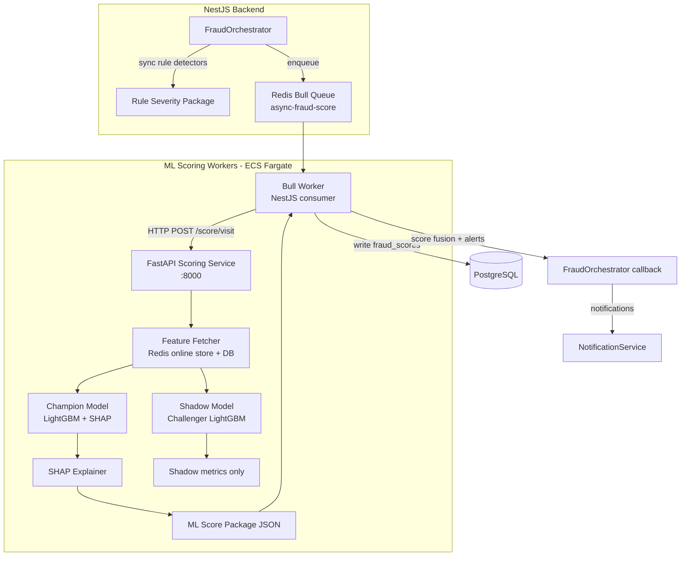

# RayVerify™ — AI Risk Scoring

> **Document 06 of 11** | Parent platform: RayHealthEVV™  
> Audience: Engineering, Data Science, Program Integrity, Investors, Regulators  
> Last updated: 2026-06-10

---

## Table of Contents

1. [AI Risk-Scoring Framework Overview](#1-ai-risk-scoring-framework-overview)
2. [Data & Feature Engineering](#2-data--feature-engineering)
3. [Models](#3-models)
4. [Explainability](#4-explainability)
5. [MLOps Lifecycle](#5-mlops-lifecycle)
6. [Responsible AI & Fairness](#6-responsible-ai--fairness)
7. [Serving Architecture](#7-serving-architecture)

---

## 1. AI Risk-Scoring Framework Overview

### 1.1 Purpose

The Fraud Detection Engine (doc 05) applies deterministic rules that catch known, enumerable fraud patterns with high precision and zero cold-start latency. The AI Risk-Scoring layer augments those rules with two complementary capabilities:

1. **Behavioral anomaly detection** — learns the statistical "normal" for each caregiver, provider, and patient and scores deviations, catching novel fraud patterns that no rule explicitly addresses.
2. **Label-supervised prediction** — as investigative case outcomes accumulate (`CaseStatus.SUBSTANTIATED` / `UNSUBSTANTIATED`), supervised gradient-boosted models learn which combinations of signals most reliably predict confirmed fraud, continuously improving precision.

The outputs of the AI layer are fused with rule severities in the score fusion step (doc 05 §4) to produce the final composite `fraud_scores.score`.

### 1.2 Where ML Augments Rules

| Scenario | Rule layer | ML layer |
|----------|-----------|---------|
| Impossible travel (explicit threshold) | Fires at speed > 900 km/h | Learns caregiver-specific travel patterns; flags anomalous-but-below-threshold routes |
| Billing outlier (z-score) | Fires at z > 3.0 | Learns cross-feature interactions (billing × duration × patient complexity) |
| Caregiver behavior drift | Not modeled | Detects gradual drift in clock-in times, durations, location cluster shifts |
| Provider ring / collusion | CROSS_PROVIDER_RISK (rule) | Graph neural features on shared-device and co-patient networks |
| Cold-start provider (no history) | Rules fire on raw signals | Unsupervised anomaly score from cohort comparison |
| Novel fraud variant | No rule exists | Anomaly model flags statistical outliers for human review |

### 1.3 Scoring Entities

`fraud_scores.subjectType` maps to five entity types. The ML service produces scores for all five; visit-level scores are the primary gating mechanism:

| `subjectType` | Key tables | Primary consumers |
|---------------|-----------|------------------|
| `VISIT` | `visits`, all `*_verifications` | Pre-payment gate; most frequent |
| `PROVIDER` | `provider_risk_profiles`, aggregated visits | Risk ranking dashboard; `CROSS_PROVIDER_RISK` detector |
| `CAREGIVER` | `caregivers`, `identity_verifications`, visit history | Identity risk; `IDENTITY_MISMATCH` amplifier |
| `PATIENT` | `patients`, visit history | Billing fraud targeting patient; rare |
| `CLAIM` | `visits.billedUnits`, `billedAmountCents` | Post-submission claim-level sweep |

---

## 2. Data & Feature Engineering

### 2.1 Feature Store Design

RayVerify uses a two-tier feature store:

```
┌──────────────────────────────────────────────────────────────────┐
│                        OFFLINE STORE                              │
│  PostgreSQL (primary DB) + S3 Parquet snapshots                   │
│  - Historical aggregates: rolling 7d/30d/90d windows              │
│  - Provider cohort statistics (recomputed nightly batch)          │
│  - Training dataset snapshots with point-in-time labels           │
│  - Backfilled features for retraining                             │
└──────────────────────────┬───────────────────────────────────────┘
                           │ nightly ETL → feature materialization
┌──────────────────────────▼───────────────────────────────────────┐
│                        ONLINE STORE                               │
│  Redis (ElastiCache) — sub-millisecond feature lookup             │
│  - Pre-materialized rolling aggregates per caregiverId            │
│  - Provider risk profile snapshot                                 │
│  - Device trust snapshot                                          │
│  - Last N visit features per entity                               │
│  TTL: 24 hours; refreshed on every visit completion               │
└──────────────────────────────────────────────────────────────────┘
```

Features are keyed by `{entity_type}:{entity_id}:{feature_name}:{window}`. Example:

```
caregiver:uuid-1234:avg_duration_min:7d   → 87.3
caregiver:uuid-1234:std_duration_min:7d   → 12.4
provider:uuid-5678:billing_anomaly_rate:30d → 0.12
```

### 2.2 Feature Families

#### 2.2.1 Geospatial Features

| Feature name | Source columns | Description |
|-------------|---------------|-------------|
| `clockin_distance_meters` | `gps_verifications.distance_meters` | Distance from authorized site at clock-in |
| `clockin_accuracy_meters` | `gps_verifications.accuracy_meters` | GPS fix quality |
| `geofence_breach_rate_30d` | Aggregated `gps_verifications.result` | Fraction of FAIL/REVIEW GPS events over 30 days |
| `unique_clockin_locations_30d` | Clustered `gps_verifications` lat/lng | Count of distinct location clusters visited by caregiver |
| `travel_speed_prior_visit_kph` | Derived from consecutive `visits` | Speed from last clock-out to current clock-in (haversine) |
| `median_patient_distance_km` | Patient home vs provider headquarters | Structural distance features |

#### 2.2.2 Temporal / Clock-in Habit Features

| Feature name | Source columns | Description |
|-------------|---------------|-------------|
| `clockin_hour_of_day` | `visits.clockInAt` | Hour extracted (0–23) |
| `clockin_day_of_week` | `visits.clockInAt` | 0–6 |
| `clockin_deviation_minutes` | `clockInAt - scheduledStart` | Early/late deviation from schedule |
| `clockin_deviation_std_30d` | Rolling std of above | Consistency metric |
| `duration_vs_scheduled_ratio` | `durationMinutes / (scheduledEnd - scheduledStart)` | Ratio; 1.0 = exactly as scheduled |
| `overnight_visit_flag` | `clockInAt.date != clockOutAt.date` | Binary: spans midnight |
| `weekend_visit_rate_30d` | Fraction of weekend visits | Pattern feature |
| `visits_per_day_7d` | Count of visits in last 7 days | Volume feature |

#### 2.2.3 Behavioral Features

| Feature name | Source columns | Description |
|-------------|---------------|-------------|
| `identity_fail_rate_14d` | `identity_verifications.result` | Fraction FAIL/REVIEW over 14 days |
| `liveness_score_mean_30d` | `identity_verifications.liveness_score` | Rolling mean liveness |
| `device_trust_level` | `devices.trust_level` | Encoded: TRUSTED=0, UNKNOWN=1, SUSPICIOUS=2, BLOCKED=3 |
| `device_switch_count_30d` | Distinct `device_id` values per caregiver | Frequent device switching |
| `new_device_flag` | `devices.first_seen_at` relative to visit | Binary: first use within 7 days |
| `patient_count_active_30d` | Distinct `patient_id` per caregiver | Load feature; unusually high = risk |
| `duplicate_visit_count_90d` | Count of prior `DUPLICATE_VISIT` events | Historical pattern |

#### 2.2.4 Billing / Utilization Features

| Feature name | Source columns | Description |
|-------------|---------------|-------------|
| `billed_units_z_score` | `visits.billedUnits` vs caregiver 90d hist | From UNUSUAL_BILLING detector (reused) |
| `duration_z_score` | `visits.durationMinutes` vs caregiver 90d hist | From ABNORMAL_DURATION detector |
| `weekly_hours_total` | Sum of `durationMinutes` in rolling 7 days | Overtime risk |
| `revenue_per_visit_cents` | `billedAmountCents / durationMinutes` | Billing rate; outliers suspicious |
| `over_authorization_pct` | `(billedUnits - authorizedUnits) / authorizedUnits` | Overrun relative to auth cap |
| `authorization_utilization_rate` | Running units used vs total authorized | Approaching cap = review |
| `service_overlap_minutes_30d` | Total overlap from `SERVICE_OVERLAP` events | Accumulated overlap indicator |

#### 2.2.5 Network / Graph Features

Graph features are computed offline (nightly batch) using the PostgreSQL adjacency and pushed to the online store:

| Feature name | Derivation | Description |
|-------------|-----------|-------------|
| `shared_device_caregiver_count` | Visits with same `device_id`, distinct `caregiver_id` | Device sharing ring width |
| `shared_patient_caregiver_count` | Visits with same `patient_id`, distinct `caregiver_id` | Cross-caregiver patient access |
| `provider_network_risk_score` | Mean `provider_risk_profiles.current_score` of all providers a caregiver has worked for | Guilt-by-association proxy |
| `caregiver_device_graph_centrality` | PageRank-style centrality on caregiver↔device bipartite graph | Hub caregivers in sharing rings |
| `cross_provider_visit_count_90d` | Visits under different `provider_id` in 90 days | Multi-provider caregivers (legitimate or fraudulent) |

### 2.3 Offline vs Online Features

| Category | Computation | Freshness | Where stored |
|----------|------------|-----------|-------------|
| Rolling aggregates (7d, 30d, 90d) | Nightly batch ETL (AWS Glue / Spark) | ~24 h lag | S3 Parquet → Redis online store |
| Graph centrality / network features | Nightly batch (PostgreSQL + Python NetworkX) | ~24 h lag | Redis online store |
| Point-of-visit features (GPS, identity result) | Real-time from DB in scoring request | Synchronous | Queried during scoring |
| Provider risk profile snapshot | Updated after each visit scoring | Near-real-time | `provider_risk_profiles` + Redis |

### 2.4 Point-in-Time Correctness / Leakage Avoidance

The training dataset is constructed with strict point-in-time semantics:

```
For each training sample (visitId, label):
    feature_snapshot_time = visit.scheduled_start
    All rolling aggregates use only visits WHERE scheduled_start < feature_snapshot_time
    Labels are drawn from fraud_cases.status WHERE updated_at > feature_snapshot_time + 30d
    (30-day investigation buffer; no label is considered final until 30 days after visit)
```

This prevents the model from seeing features computed with knowledge of the future, ensuring that production inference (where the future is unknown) matches training-time conditions.

---

## 3. Models

### 3.1 Architecture Overview

```mermaid
flowchart LR
    FS[Feature Store\nOnline + Offline] --> A
    FS --> B
    FS --> C

    subgraph ML_SCORING_SERVICE [Python FastAPI scoring service]
        A[Unsupervised Anomaly\nIsolation Forest / Autoencoder]
        B[Supervised GBT\nXGBoost / LightGBM]
        C[Graph Feature\nExtractor]

        A --> E[Score Ensemble]
        B --> E
        C --> B
    end

    E --> F[SHAP Explainer]
    F --> G[ML Score Package\n{score, factors, modelVersion}]
    G --> H[NestJS Fusion\nα·rules + 1−α·ml]
```

### 3.2 Model A — Unsupervised Anomaly Detection (Cold Start)

**Purpose:** In early deployment or for new caregivers/providers with no investigation history, there are no confirmed fraud labels. Unsupervised models identify statistical outliers without requiring labeled examples.

#### 3.2.1 Isolation Forest

Isolation Forest isolates anomalies by recursively partitioning feature space. Anomalies require fewer splits to isolate (shorter path length).

```python
from sklearn.ensemble import IsolationForest
import numpy as np

# Training: fit on the full caregiver population's feature matrix
# Features: 25-dimensional vector from §2.2 (geospatial + temporal + behavioral)
iso_forest = IsolationForest(
    n_estimators     = 300,
    max_samples      = 'auto',    # min(256, n_samples)
    contamination    = 0.05,      # expected 5% anomaly rate (tunable)
    random_state     = 42,
    n_jobs           = -1
)
iso_forest.fit(X_train)  # X_train shape: (n_caregivers_x_visits, 25)

# Inference: anomaly score (raw) → normalized 0-100
raw_score   = iso_forest.score_samples([feature_vector])[0]  # negative; more negative = more anomalous
# Convert: IsolationForest score_samples returns values in [-0.5, 0]
# Normalize to 0-100 (0 = normal, 100 = extreme anomaly)
anomaly_score = int(np.clip((0.5 + raw_score) / (-0.5 - 0.5 + 0.001) * -100 + 100, 0, 100))
# Simpler linear rescale:
anomaly_score = int(np.clip((-raw_score - 0.0) / 0.5 * 100, 0, 100))
```

The contamination hyperparameter is tuned to match the tenant's historical fraud rate when known, or defaults to 5% (conservative for Medicaid HCBS fraud base rates).

#### 3.2.2 Autoencoder (Temporal Sequence Anomaly)

For caregivers with ≥ 30 visits, a lightweight autoencoder captures sequential visit patterns (time-series of clock-in behavior). Anomaly score = reconstruction loss.

```python
# Architecture: encoder–decoder on sliding window of last 14 visits
# Input: (14, 10) tensor — 14 visits × 10 normalized temporal/billing features
# Encoder: Dense(10) → Dense(4) [bottleneck]
# Decoder: Dense(4) → Dense(10) → Dense(14, 10)
# Loss: MSE
# Training: only on visits with no prior fraud events (proxy "normal" examples)

reconstruction_loss = mse(original_features, reconstructed_features)
# Percentile-rank against historical distribution → 0-100 anomaly score
autoencoder_score = percentile_rank(reconstruction_loss, historical_loss_distribution) * 100
```

The Isolation Forest and autoencoder scores are averaged: `unsupervised_score = 0.5 * iso_score + 0.5 * ae_score`.

### 3.3 Model B — Supervised Gradient-Boosted Trees

**Purpose:** Once ≥ 500 labeled cases (substantiated + unsubstantiated) have accumulated, the supervised model replaces the unsupervised model as the primary ML scorer (the unsupervised score becomes a feature).

**Label definition:**
- Positive (fraud): `fraud_cases.status = SUBSTANTIATED` with `exposureCents > 0`
- Negative (clean): `fraud_cases.status = UNSUBSTANTIATED` OR visit had no case and was manually cleared after 90 days

```python
import lightgbm as lgb

# Feature matrix: ~40 features per visit (all families from §2.2 + unsupervised_score)
# Label: binary (1 = substantiated fraud, 0 = clean)
# Class imbalance: typical fraud rate 2–8% → use scale_pos_weight or SMOTE

model = lgb.LGBMClassifier(
    n_estimators       = 500,
    learning_rate      = 0.05,
    max_depth          = 6,
    num_leaves         = 31,
    min_child_samples  = 20,
    subsample          = 0.8,
    colsample_bytree   = 0.8,
    reg_alpha          = 0.1,
    reg_lambda         = 1.0,
    scale_pos_weight   = neg_samples / pos_samples,  # handle class imbalance
    class_weight       = 'balanced',
    random_state       = 42,
    n_jobs             = -1
)
model.fit(
    X_train, y_train,
    eval_set         = [(X_val, y_val)],
    eval_metric      = ['aucpr'],          # PR-AUC optimized (not ROC-AUC; imbalanced)
    callbacks        = [lgb.early_stopping(50), lgb.log_evaluation(50)]
)

# Inference → probability → 0-100 score
prob = model.predict_proba([feature_vector])[0][1]
supervised_score = int(prob * 100)
```

**Calibration:** Platt scaling (logistic regression on out-of-fold predictions) ensures that `supervised_score = 70` means approximately 70% probability of confirmed fraud, supporting risk-band thresholding.

### 3.4 Model C — Graph Features for Collusion & Shared-Device Rings

**Purpose:** Individual visit features miss multi-entity collusion patterns. Graph analysis identifies rings of caregivers sharing devices, providers with abnormal patient-sharing patterns, and coordinated billing clusters.

**Graph construction (nightly batch):**

```python
import networkx as nx

# Bipartite graph: caregivers ↔ devices (edge = at least 2 shared visits in 30d)
G_cd = nx.Graph()
for (caregiver_id, device_id), count in shared_device_pairs:
    if count >= 2:
        G_cd.add_edge(f"cg:{caregiver_id}", f"dv:{device_id}", weight=count)

# Caregiver–caregiver projection (two caregivers connected if they share a device)
G_cc = nx.bipartite.projected_graph(G_cd, caregiver_nodes)

# Graph features per caregiver node
features['device_ring_size']        = nx.degree(G_cc, caregiver_node) + 1
features['device_ring_max_degree']  = max(dict(G_cc.degree()).values(), default=0)
features['caregiver_betweenness']   = nx.betweenness_centrality(G_cc).get(caregiver_node, 0)

# Provider–patient bipartite graph (same patient billed by multiple providers in same week)
G_pp = build_provider_patient_graph(visits_last_30d)
features['patient_sharing_providers'] = count_providers_sharing_patient(patientId, G_pp)
```

These graph features are appended to the feature vector before the supervised model runs, improving detection of coordinated schemes.

### 3.5 Provider Risk Scoring Model

`provider_risk_profiles` is maintained by a dedicated provider scoring job that runs after each visit scoring pass and as a nightly batch sweep.

**Inputs (columns in `provider_risk_profiles` + aggregated visits):**

| Input | Source | Description |
|-------|--------|-------------|
| `verification_failures` | `provider_risk_profiles.verification_failures` | Cumulative count of FAIL verifications |
| `gps_anomalies` | `provider_risk_profiles.gps_anomalies` | Cumulative GPS anomaly events |
| `billing_anomalies` | `provider_risk_profiles.billing_anomalies` | Cumulative billing outlier events |
| `identity_issues` | `provider_risk_profiles.identity_issues` | Cumulative identity failure events |
| `open_cases` | `provider_risk_profiles.open_cases` | Currently open `FraudCase` count |
| `substantiated_cases` | `provider_risk_profiles.substantiated_cases` | Historical confirmed fraud cases |
| `caregiver_count_active` | Count of active `caregivers` | Staffing volume |
| `high_risk_caregiver_fraction` | Fraction of caregivers with visit risk_level ≥ HIGH | Workforce risk |
| `billing_z_score_mean_30d` | Mean of `UNUSUAL_BILLING` z-scores | Provider-wide billing anomaly |
| `visit_approval_rate_30d` | Approved visits / completed visits | Clean visit rate |

**Scoring formula:**

The provider score is a weighted combination of a rule-based component and an ML-predicted component:

```python
# Rule component (normalized 0–100):
rule_component = (
    min(verification_failures / 10, 1.0) * 20 +
    min(gps_anomalies         / 20, 1.0) * 15 +
    min(billing_anomalies     / 15, 1.0) * 20 +
    min(identity_issues       / 10, 1.0) * 15 +
    min(open_cases            /  5, 1.0) * 15 +
    min(substantiated_cases   /  3, 1.0) * 15
)  # max = 100

# ML component: supervised model trained on provider-level features
# (same LightGBM architecture, provider-grain dataset)
ml_component = provider_lgbm.predict_proba([provider_feature_vector])[0][1] * 100

# Fused provider score
provider_score = int(0.55 * rule_component + 0.45 * ml_component)
provider_score = max(0, min(100, provider_score))
```

**Historical trend:** After each computation, the new score is appended to `provider_risk_profiles.trend`:

```json
[
  { "t": "2026-06-01T00:00:00Z", "score": 45 },
  { "t": "2026-06-08T00:00:00Z", "score": 52 },
  { "t": "2026-06-10T00:00:00Z", "score": 71 }
]
```

The frontend investigator dashboard renders this as a sparkline for trend visualization.

---

## 4. Explainability

### 4.1 Requirement

Explainability is mandatory. No score may be used to flag a visit, hold a payment, or open a case without a human-readable explanation and structured factor contributions. This satisfies:

- **Due process:** Medicaid providers have appeal rights; investigators must explain why a visit was flagged.
- **Investigator efficiency:** An unexplained score forces investigators to reverse-engineer the model, wasting time.
- **Regulatory reporting:** State program integrity submissions require documented rationale.

### 4.2 Global Explanations (Feature Importance)

At the model level, SHAP global importance identifies which features most drive predictions across the entire training population:

```python
import shap

explainer = shap.TreeExplainer(model)
shap_values = explainer.shap_values(X_test)

# Global importance: mean |SHAP value| per feature
global_importance = pd.DataFrame({
    'feature':    feature_names,
    'importance': np.abs(shap_values).mean(axis=0)
}).sort_values('importance', ascending=False)
```

Global importance reports are generated monthly and stored as model card artifacts in S3, reviewed by the ML governance team, and surfaced in the admin dashboard's "Model Performance" panel.

### 4.3 Local Explanations (Per-Score SHAP)

For each individual visit score, SHAP values decompose the prediction into per-feature contributions:

```python
# Single-instance SHAP
shap_values_instance = explainer.shap_values(feature_vector_instance)

factors = []
for i, fname in enumerate(feature_names):
    factors.append({
        "feature":     fname,
        "value":       float(feature_vector_instance[i]),
        "shapValue":   float(shap_values_instance[i]),
        "direction":   "INCREASES_RISK" if shap_values_instance[i] > 0 else "DECREASES_RISK",
        "contribution": abs(float(shap_values_instance[i]))
    })

# Sort by |shapValue| descending; top 5 become the displayed reason codes
top_factors = sorted(factors, key=lambda x: x['contribution'], reverse=True)[:5]
```

These are stored in `fraud_scores.factors` (JSONB array).

### 4.4 Reason Codes

Reason codes map SHAP-identified features to human-readable investigator guidance:

| Feature | High-risk reason code | Investigator guidance |
|---------|-----------------------|----------------------|
| `travel_speed_prior_visit_kph` | `RC-001: Physically impossible travel speed` | Review previous clock-out location and current clock-in GPS. Verify caregiver was not using a shared credential. |
| `identity_fail_rate_14d` | `RC-002: Repeated identity verification failures` | Pull identity verification images. Compare against enrollment photo. Schedule re-enrollment. |
| `billed_units_z_score` | `RC-003: Billing volume anomaly (z > 3.0)` | Cross-check billed units against caregiver's visit notes and patient's authorization cap. |
| `device_ring_size` | `RC-004: Shared device ring detected` | Map all caregivers using the same device. Determine if agency-issued or personal device. |
| `geofence_breach_rate_30d` | `RC-005: Persistent GPS geofence breaches` | Review patient's current service address. Verify authorization is current. |
| `liveness_score_mean_30d` | `RC-006: Liveness score trend declining` | Review biometric evidence package. Consider field audit. |

### 4.5 Example Explained Score

A complete `fraud_scores` row for a CRITICAL-scored visit:

```json
{
  "id":            "fs-uuid-example",
  "organizationId": "org-uuid",
  "subjectType":   "VISIT",
  "subjectId":     "visit-uuid",
  "score":         87,
  "riskLevel":     "CRITICAL",
  "modelVersion":  "fused-xgb-2026-05-01",
  "computedAt":    "2026-06-10T14:32:11Z",
  "factors": [
    {
      "detector":     "IMPOSSIBLE_TRAVEL",
      "severity":     90,
      "weight":       0.18,
      "contribution": 16.2,
      "shapValue":    0.162,
      "feature":      "travel_speed_prior_visit_kph",
      "featureValue": 15800.0,
      "direction":    "INCREASES_RISK",
      "reasonCode":   "RC-001",
      "explanation":  "Caregiver clocked in 3,950 km from previous clock-out in 15 minutes (speed: 15,800 km/h). Physical travel is impossible.",
      "investigatorAction": "Review GPS evidence and prior visit record. Likely credential sharing or GPS spoofing."
    },
    {
      "detector":     "IDENTITY_MISMATCH",
      "severity":     50,
      "weight":       0.10,
      "contribution": 5.0,
      "shapValue":    0.081,
      "feature":      "identity_fail_rate_14d",
      "featureValue": 0.67,
      "direction":    "INCREASES_RISK",
      "reasonCode":   "RC-002",
      "explanation":  "2 of 3 identity verifications in the past 14 days returned FAIL or REVIEW (confidence < 0.60).",
      "investigatorAction": "Pull identity verification images from S3. Schedule re-enrollment if enrollment quality is poor."
    },
    {
      "detector":     "LIVENESS_FAILURE",
      "severity":     85,
      "weight":       0.11,
      "contribution": 9.35,
      "shapValue":    0.093,
      "feature":      "liveness_score_mean_30d",
      "featureValue": 0.31,
      "direction":    "INCREASES_RISK",
      "reasonCode":   "RC-006",
      "explanation":  "Mean liveness score 0.31 over 30 days is below the spoofing threshold (0.40). Current visit liveness: 0.22.",
      "investigatorAction": "Escalate to field supervisor. Consider unannounced visit audit."
    },
    {
      "detector":     "ML_BEHAVIORAL",
      "severity":     null,
      "weight":       0.40,
      "contribution": 31.2,
      "shapValue":    0.312,
      "feature":      "caregiver_betweenness",
      "featureValue": 0.74,
      "direction":    "INCREASES_RISK",
      "reasonCode":   "RC-004",
      "explanation":  "Caregiver has high graph centrality in a shared-device network connecting 5 caregivers. Behavioral pattern consistent with credential relay.",
      "investigatorAction": "Map full device-sharing network. Identify all visits in the ring over the past 90 days."
    },
    {
      "detector":     "ML_BEHAVIORAL",
      "severity":     null,
      "weight":       0.40,
      "contribution": 8.1,
      "shapValue":    0.081,
      "feature":      "visits_per_day_7d",
      "featureValue": 9.3,
      "direction":    "INCREASES_RISK",
      "reasonCode":   null,
      "explanation":  "Caregiver logged 9.3 visits/day on average over 7 days (cohort 90th percentile: 4.1).",
      "investigatorAction": "Review daily schedule. Compare against payroll and service authorization caps."
    }
  ]
}
```

**Human-readable summary** (generated by the `ExplanationService` and stored in `fraud_events.explanation` for the composite event):

> **CRITICAL — Score 87/100.** Primary signal: Impossible travel (caregiver clocked in 3,950 km from previous location in 15 minutes). Compounded by repeated liveness failures (mean 0.31 over 30 days) and position as a hub in a 5-caregiver device-sharing ring. Recommend immediate hold pending investigator review and field audit.

---

## 5. MLOps Lifecycle

### 5.1 Labeling from Case Outcomes

The ground-truth label pipeline polls `fraud_cases` for closed cases and joins them to their constituent `fraud_events` and visits:

```python
# Label assignment
SELECT v.id AS visit_id,
       CASE WHEN fc.status = 'SUBSTANTIATED' THEN 1 ELSE 0 END AS label,
       fc.closed_at AS label_date
FROM fraud_cases fc
JOIN fraud_events fe ON fe.case_id = fc.id
JOIN visits v        ON v.id = fe.visit_id
WHERE fc.status IN ('SUBSTANTIATED', 'UNSUBSTANTIATED')
  AND fc.closed_at > now() - interval '180 days'
  AND fc.closed_at IS NOT NULL
```

Labels are **only assigned after a human investigator closes the case**. No automated adverse-action label is ever created without a substantiated human determination. Partial labels (open cases) are excluded from training and used only in active-learning uncertainty sampling.

### 5.2 Training Pipeline

```mermaid
flowchart LR
    A[fraud_cases SUBSTANTIATED\n/ UNSUBSTANTIATED] -->|label join| B[Point-in-time\nfeature snapshot\nfrom offline store]
    B --> C[Data validation\nGreat Expectations:\nnull rates, range checks\ndistribution drift]
    C --> D[Train / Val / Test split\n70 / 15 / 15\ntime-ordered: no future leakage]
    D --> E[LightGBM training\nearly stopping on PR-AUC]
    D --> F[IsolationForest refresh\nnew normal examples]
    E & F --> G[SHAP explainer fit\nTreeExplainer]
    G --> H[Evaluation harness\n§5.3 metrics]
    H -->|pass gates| I[Model registry\nS3 + MLflow]
    H -->|fail gates| J[Reject + alert\nML team Slack]
    I --> K[Shadow deployment\nchallenger scoring]
    K -->|A/B evaluation ≥ 2 weeks| L[Promote to champion\nBlue-Green deploy]
```



### 5.3 Evaluation Metrics

The evaluation harness runs on a held-out test set (time-ordered; test set is strictly after training cutoff):

| Metric | Definition | Minimum gate |
|--------|-----------|-------------|
| **PR-AUC** | Area under Precision-Recall curve | ≥ 0.70 |
| **Precision at alert threshold** | Precision at operating threshold (score ≥ 61) | ≥ 0.65 |
| **Recall at alert threshold** | Recall at score ≥ 61 | ≥ 0.55 |
| **Alert volume rate** | Fraction of visits scored ≥ 61 | ≤ 0.08 (investigator capacity constraint) |
| **CRITICAL alert rate** | Fraction scored ≥ 81 | ≤ 0.02 |
| **Calibration error** | Expected Calibration Error (ECE) | ≤ 0.05 |
| **PR-AUC degradation vs champion** | New model PR-AUC vs current champion | ≥ −0.02 (must not regress) |

**Investigator capacity constraint:** The alert volume is gated independently of statistical metrics. If a model produces valid precision/recall numbers but would generate more alerts than the investigator team can review (configurable `maxAlertRatePer1000Visits` in `organizations.settings`), the threshold is raised rather than the model rejected, preserving precision at the cost of recall.

**Cost-weighted threshold selection:**

```python
# Cost matrix: false positive (wasted investigator time) vs false negative (missed fraud)
C_fp = 1.0   # cost of flagging a clean visit
C_fn = 8.0   # cost of missing confirmed fraud (estimated from average exposure_cents)

optimal_threshold = argmin over t: (
    C_fp * FP(t) + C_fn * FN(t)
) / n_visits
```

The optimal threshold is computed per tenant (C_fn varies with average `fraud_cases.exposureCents`).

### 5.4 Model Registry & Versioning

Models are registered in MLflow (self-hosted on ECS) with:

- Artifact: serialized LightGBM model + SHAP explainer (joblib)
- Metadata: training dataset hash, feature schema version, hyperparameters, evaluation metrics
- Stage: `Staging` → `Shadow` → `Champion` → `Archived`
- Version string: `{model_type}-{training_date}` e.g., `xgb-2026-05-01`

`fraud_scores.modelVersion` references the registry version string for full reproducibility.

### 5.5 Shadow + Champion-Challenger Deployment

```
Champion model:  scores all visits; results written to fraud_scores; alerts fired.
Challenger model: scores all visits; results written to fraud_scores_shadow (separate table);
                  alerts NOT fired; metrics compared weekly.

After ≥ 2 weeks and ≥ 500 visits, if challenger PR-AUC ≥ champion PR-AUC − 0.01:
    promote challenger → champion (blue-green swap, zero downtime)
    demote champion → archived
```

The shadow scoring adds ~5% overhead to the scoring service. It runs on a low-priority worker pool separated from the hot path.

### 5.6 Monitoring: Data & Concept Drift

**Data drift** (input distribution shift):

```python
# After every batch scoring run (nightly):
for feature in top_20_features:
    current_dist = feature_values_last_7d[feature]
    baseline_dist = feature_baseline_30d[feature]      # rolling 30d window
    kl_div = scipy.stats.entropy(current_dist, baseline_dist)
    if kl_div > 0.15:
        alert("DATA_DRIFT", feature, kl_div)
```

Metrics published to CloudWatch namespace `RayVerify/ML/Drift`.

**Concept drift** (output distribution shift / model degradation):

```python
# Monthly precision/recall computation against newly closed cases
precision_30d = closed_substantiated_count / total_flagged_visits_30d
if precision_30d < 0.60:    # below minimum gate
    alert("CONCEPT_DRIFT", precision_30d)
    trigger_retraining_sprint()
```

**Retraining cadence:**
- **Scheduled:** Monthly, regardless of drift metrics (keeps model current with evolving fraud patterns).
- **Triggered:** Immediately on concept-drift alert or KL-divergence > 0.20 on ≥ 3 top features.
- **Label minimum:** Retraining is skipped if fewer than 50 new labeled cases have accumulated since the last training run (insufficient signal).

---

## 6. Responsible AI & Fairness

### 6.1 Principles

RayVerify's AI scoring system operates on caregivers who are predominantly members of protected groups (women, racial/ethnic minorities, immigrant workers). Biased scores translate directly to unjust payment delays, reputational harm, and workforce disruption. The following governance controls are mandatory, not aspirational.

### 6.2 Bias Monitoring

Protected-attribute proxies available in the data (we do not collect protected attributes directly):

| Proxy feature | Source | Protected attribute proxied |
|--------------|--------|-----------------------------|
| `caregiver.zipCode` (derived) | Service address geography | Race / ethnicity / SES |
| `providers.jurisdiction` | State/region | Geographic equity |
| `identity_verifications.matcher` | Model used for face match | Differential accuracy by skin tone |

Bias monitoring runs monthly against a held-out representative sample:

```python
# Disparate impact ratio (80% rule)
alert_rate_group_A = (score_A >= 61).mean()
alert_rate_group_B = (score_B >= 61).mean()
disparate_impact_ratio = min(alert_rate_group_A, alert_rate_group_B) /
                         max(alert_rate_group_A, alert_rate_group_B)

if disparate_impact_ratio < 0.80:
    flag_for_fairness_review("DISPARATE_IMPACT", disparate_impact_ratio)

# Equal opportunity: true positive rate parity across groups
tpr_group_A = TP_A / (TP_A + FN_A)
tpr_group_B = TP_B / (TP_B + FN_B)
if abs(tpr_group_A - tpr_group_B) > 0.10:
    flag_for_fairness_review("TPR_DISPARITY", abs(tpr_group_A - tpr_group_B))
```

Results are included in the quarterly model card update and reviewed by the Responsible AI committee.

### 6.3 Face Recognition Accuracy Parity

The biometric matching model (`identity_verifications.matcher`) is evaluated monthly for differential false-match rates by demographic proxy (geography-based cohorts). If false-reject rate for any cohort exceeds the population average by > 5 percentage points, the matcher vendor is notified and a threshold recalibration is triggered.

### 6.4 Human-in-the-Loop Mandate

**No fully automated adverse action.** The AI system may:
- Emit alerts and notifications
- Set `visits.status = FLAGGED`
- Auto-create a `FraudCase` with `status = OPEN`

The AI system may **not**:
- Set `FraudCase.status = PENDING_PAYMENT_HOLD` without a user action
- Reject a billing claim directly
- Permanently block a caregiver or provider

Payment holds require an investigator to explicitly set `status = PENDING_PAYMENT_HOLD` in the case management interface (RBAC-controlled: `fraud_case:payment_hold` permission). This action is recorded in `case_notes` and `audit_logs`.

### 6.5 Model Cards & Governance Documentation

Each model version published to the registry includes a model card covering:

1. **Model details:** version, architecture, training dataset dates, label definition.
2. **Intended use:** fraud detection for Medicaid/HCBS visits; not suitable for criminal prosecution without additional evidence.
3. **Out-of-scope uses:** Direct employment decisions; re-identification of patients; real-time hard blocks without human review.
4. **Performance metrics:** PR-AUC, precision, recall, alert rate (overall and per-cohort).
5. **Bias evaluation:** Disparate impact ratios, TPR parity across geographic cohorts.
6. **Explainability method:** SHAP TreeExplainer; feature schema version.
7. **Limitations:** Performance degrades on providers with < 30 visits (cold-start); assumes consistent GPS availability.
8. **Monitoring & retraining cadence:** As documented in §5.6.

Model cards are stored in S3 (`s3://rayverify-mlops/model-cards/`) and linked from the MLflow model registry entry. They are reviewed and signed off by the Engineering Lead and a Responsible AI reviewer before `Shadow` → `Champion` promotion.

---

## 7. Serving Architecture

### 7.1 Overview



### 7.2 FastAPI Scoring Service

The Python scoring service is a thin HTTP wrapper that receives a feature vector (or raw entity IDs for online feature fetching), runs the champion model, computes SHAP values, and returns a structured response.

**Endpoint:** `POST /score/visit`

**Request:**
```json
{
  "visitId":       "uuid",
  "orgId":         "uuid",
  "features":      { "...": "..." },   // optional pre-computed features
  "modelVersion":  "latest"            // or specific version tag
}
```

**Response:**
```json
{
  "visitId":      "uuid",
  "score":        87,
  "riskLevel":    "CRITICAL",
  "modelVersion": "fused-xgb-2026-05-01",
  "factors":      [ /* SHAP factor array as in §4.5 */ ],
  "latencyMs":    42
}
```

**Additional endpoints:**

| Endpoint | Purpose |
|----------|---------|
| `POST /score/provider` | Provider risk profile recomputation |
| `POST /score/batch` | Batch scoring for nightly sweep (accepts array of visitIds) |
| `GET /health` | Liveness probe; returns model version and last retraining date |
| `GET /features/{entityType}/{entityId}` | Debug: dump online feature vector for an entity |

### 7.3 Latency Budget

| Operation | Target p50 | Target p99 | Notes |
|-----------|-----------|-----------|-------|
| Feature fetch (Redis online) | < 5 ms | < 15 ms | All hot features pre-materialized |
| Feature fetch (DB fallback) | < 30 ms | < 80 ms | For cold features not in cache |
| LightGBM inference | < 5 ms | < 10 ms | ~40 features, 500 trees |
| SHAP computation | < 20 ms | < 50 ms | TreeExplainer; fast for GBT |
| Total scoring service | < 60 ms | < 150 ms | End-to-end HTTP |
| Bull queue wait (async path) | < 5 s p50 | < 30 s p99 | Under normal queue depth |
| Full async pipeline (enqueue → result) | < 10 s p50 | < 60 s p99 | Includes DB writes |

**Batch scoring (nightly sweep):** 10,000 visits/hour throughput on 4 vCPU workers with concurrency = 8 per worker. Designed to sweep the previous day's completed visits before the state billing cycle runs at 06:00 local time.

### 7.4 Infrastructure

| Component | AWS service | Configuration |
|-----------|------------|---------------|
| FastAPI scoring service | ECS Fargate | 2 vCPU / 4 GB RAM per task; 2–8 tasks (auto-scale on queue depth) |
| Bull workers | ECS Fargate (same cluster) | 1 vCPU / 2 GB RAM; 4–16 tasks |
| Online feature store | ElastiCache Redis (cluster mode) | 3 shards × 2 nodes; r7g.large |
| ML model artifacts | S3 (`rayverify-mlops/`) | Versioned; encrypted at rest (KMS) |
| Model registry | MLflow on ECS | Backed by RDS PostgreSQL |
| Drift metrics | CloudWatch custom namespace | `RayVerify/ML/Drift`, `RayVerify/ML/Performance` |

### 7.5 Security & Isolation

- The FastAPI scoring service runs in the same VPC private subnet as the NestJS backend. It is **not** internet-accessible.
- Communication between NestJS and FastAPI uses mTLS (AWS Certificate Manager Private CA).
- Model artifacts in S3 are encrypted with a dedicated KMS key (`alias/rayverify-ml-artifacts`). Access is restricted to the ECS task IAM role.
- No PHI is passed to the scoring service. Only UUID identifiers and pre-aggregated numeric features flow into the ML service. Feature labels are non-identifying (e.g., `avg_duration_min`, not `patient_name`).
- Scoring requests and responses are logged to `audit_logs` (`action = SCORE`) with PHI scrubbed from metadata.

---

*End of Document 06 — AI Risk Scoring*
