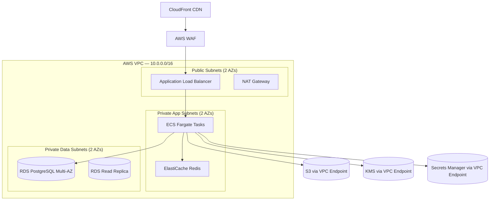

# RayVerify™ — Security Architecture

**Document:** 07-Security-Architecture  
**Classification:** SENSITIVE — Government/Investor Distribution  
**Platform:** RayVerify™ (parent: RayHealthEVV™)  
**Version:** 1.0 | June 2026  
**Audience:** State security reviewers, OIG, CMS auditors, CISO, investors

---

## Table of Contents

1. [Security Principles](#1-security-principles)
2. [Threat Model (STRIDE)](#2-threat-model-stride)
3. [Identity & Access Management](#3-identity--access-management)
4. [Data Protection](#4-data-protection)
5. [Multi-Tenant Isolation](#5-multi-tenant-isolation)
6. [Auditability & Integrity](#6-auditability--integrity)
7. [Application Security](#7-application-security)
8. [Network & Infrastructure Security](#8-network--infrastructure-security)
9. [Compliance Control Mapping](#9-compliance-control-mapping)
10. [Privacy](#10-privacy)

---

## 1. Security Principles

RayVerify is built on five foundational security principles that cascade through every architectural decision, from database schema to network topology.

### 1.1 Zero Trust

RayVerify assumes no implicit trust for any actor, device, or network path. Every request — internal or external — is authenticated, authorized, and logged. Service-to-service calls within the AWS VPC use mutual TLS (mTLS) and short-lived credentials provisioned by AWS IAM Roles. No service is granted ambient authority based solely on network position.

Trust is established at the boundary of each transaction:
- API callers present JWT access tokens (short-lived, 15-minute expiry) on every request.
- Internal microservices authenticate via mTLS certificates with identity bound to the service's ECS task role.
- Database connections are established under a narrow application role; the `app.current_org` GUC is set per transaction, not per connection.

### 1.2 Defense-in-Depth

No single control is treated as sufficient. Protections are layered so that the compromise of any one layer does not expose PHI or allow unauthorized system action:

```
Internet → WAF (Layer 7) → ALB (TLS termination) → ECS container (mTLS)
         → NestJS input validation → RBAC check → RLS policy → encrypted column
         → KMS envelope-decryption (only at point of use) → audit log
```

A threat actor who bypasses application-layer RBAC still encounters PostgreSQL Row-Level Security. A threat actor who obtains a database dump still encounters AES-256-GCM envelope encryption keyed per tenant via AWS KMS. A threat actor who obtains KMS data keys still cannot connect the decrypted data to identity without the blind-index preimage.

### 1.3 Least Privilege

Every identity — human or machine — is granted the minimum permissions required for its function:

- PostgreSQL application role cannot execute DDL, cannot bypass RLS, and cannot access tables outside its grant list.
- ECS task roles are scoped to specific S3 prefixes, specific KMS key ARNs, and specific Secrets Manager paths.
- Human users are granted permissions through the RBAC system (`roles` → `role_permissions` → `permissions`); the `permissions` table stores fine-grained `resource:action` keys, not broad grants.
- The migration/ops role that holds `BYPASSRLS` is a separate PostgreSQL role never used by the application process.

### 1.4 Secure-by-Default

New tenants, new users, and new services start in a locked-down state:
- New `User` records default to `status = PENDING_INVITE`; they cannot authenticate until the invitation flow is completed.
- New `Device` records default to `trust_level = UNKNOWN`; they cannot be used for biometric verification until the trust evaluation passes.
- New `Session` records require a valid Argon2id password check and a passing MFA factor before the refresh token is issued.
- All S3 buckets are created with public access blocked and SSE-KMS encryption as the default.
- RLS is `FORCE ROW LEVEL SECURITY` on all 19 business tables, meaning even the table owner role cannot bypass it without the `BYPASSRLS` privilege.

### 1.5 Assume Breach

Controls are designed on the premise that an attacker will eventually achieve partial penetration. The architecture limits blast radius through tenant isolation, short-lived credentials, append-only evidence, and cryptographic audit integrity so that a breach is detected quickly, its scope is bounded, and forensic reconstruction is possible.

---

## 2. Threat Model (STRIDE)

### 2.1 Key Assets

| Asset | Sensitivity | Impact if Compromised |
|-------|-------------|----------------------|
| PHI — beneficiary PII, medicaid_member_id, date of birth | HIPAA-protected | HIPAA breach notification, civil/criminal liability |
| Biometric templates (face embeddings, reference selfies) | PHI + biometric law | Identity theft, fraud bypass |
| Fraud scores and case notes | Law-enforcement sensitive | Litigation exposure, tipping off subjects |
| Audit log integrity | Chain-of-custody | Evidence inadmissible; investigation undermined |
| GPS + clock evidence | Billing-determinative | Payment fraud enabled |
| Refresh tokens / session state | Authentication | Account takeover |
| KMS data keys / secrets | Root of encryption | Mass decryption of all tenant PHI |

### 2.2 STRIDE Analysis

#### Spoofing

| Threat | Attack Scenario | Mitigations |
|--------|----------------|-------------|
| Caregiver identity spoofing | Fraudster uses another person's credentials to clock in | Selfie + liveness check (`IdentityVerification`); face embedding comparison against enrolled `BiometricEnrollment`; device trust evaluation; MFA on platform users |
| Session token theft | Attacker steals JWT from browser local storage | Short 15-min access token expiry; `refreshTokenHash` stored (SHA-256 of token, never raw); refresh token rotation on use; `revokedAt` column for explicit invalidation; `HttpOnly` + `Secure` cookie flags for web clients |
| Inter-tenant impersonation | Attacker obtains a valid JWT for Tenant A and queries Tenant B data | `app.current_org` GUC bound to the JWT `organizationId` claim at NestJS middleware; PostgreSQL RLS policy `USING (organization_id = current_setting('app.current_org', true)::uuid)` enforced at every row read/write |
| API key / credential leak | CI/CD pipeline leaks AWS credentials | Secrets stored in AWS Secrets Manager, never in environment variables in code; secret scanning in CI; OIDC-based short-lived credentials for GitHub Actions |

#### Tampering

| Threat | Attack Scenario | Mitigations |
|--------|----------------|-------------|
| Audit log tampering | Insider deletes or modifies audit records to hide activity | `rv_forbid_mutation()` trigger blocks all UPDATE/DELETE on `audit_logs`; SHA-256 hash chain (`prev_hash → hash`) computed by `rv_audit_hash_chain()` trigger on INSERT; hash chain can be replayed offline to detect any gap or substitution |
| Verification evidence tampering | Attacker modifies GPS coordinates or liveness score after the fact | `rv_forbid_mutation()` triggers on `identity_verifications`, `gps_verifications`, `device_verifications`, `fraud_events`; `visit_verifications.evidence_hash` is a SHA-256 over the canonical evidence package, stored at sealing time |
| Selfie/GPS payload replay | Fraudster replays a previously accepted selfie or GPS coordinate | `IdentityVerification` records are append-only with `createdAt` timestamp; replay detection compares probe against enrolled reference with liveness score threshold; GPS `capturedAt` is server-validated against clock-in window |
| Score manipulation by insider | Investigator artificially lowers a provider's risk score to protect a fraudulent provider | `fraud_scores` and `provider_risk_profiles` updates are audit-logged with actor, before/after diff; score computation is automated by the ML pipeline — manual overrides require `fraud_score:override` permission and are separately logged |

#### Repudiation

| Threat | Attack Scenario | Mitigations |
|--------|----------------|-------------|
| Investigator denies accessing PHI | Investigator exports beneficiary data then claims they did not | `AuditLog` records every `READ` and `EXPORT` with `actorId`, `resourceType`, `resourceId`, `ipAddress`, `userAgent`; log forwarding to immutable WORM store (S3 Object Lock) within 60 seconds |
| Caregiver denies performing visit | Caregiver claims they were elsewhere | GPS + selfie + device evidence chain is append-only with timestamps; `CaseEvidence.contentHash` provides chain-of-custody for any exported artifact |

#### Information Disclosure

| Threat | Attack Scenario | Mitigations |
|--------|----------------|-------------|
| Cross-tenant data leakage | Bug in query allows Tenant A to see Tenant B records | PostgreSQL RLS as an independent enforcement layer below the application; all 19 business tables have `FORCE ROW LEVEL SECURITY`; integration tests assert cross-tenant queries return empty |
| PHI in logs | Structured logs inadvertently capture medicaid_member_id or biometric data | PHI scrubber middleware strips known PHI field names from structured log payloads before emission; field-level encryption means even raw DB dumps expose only ciphertext |
| Biometric template exfiltration | Attacker obtains face embeddings from the vector store | Reference images stored in S3 under SSE-KMS; only a pointer (`templateRef`) is stored in `biometric_enrollments`, not the raw vector; access to the vector store is gated by IAM policy; biometric data is never returned by any API endpoint |
| Indirect object reference | Attacker enumerates UUIDs to access records they do not own | All PKs are UUID v4 (non-sequential, non-guessable); RLS policy enforces tenant boundary even if a valid UUID is guessed |

#### Denial of Service

| Threat | Attack Scenario | Mitigations |
|--------|----------------|-------------|
| API flooding | Attacker floods authentication endpoint to lock out users or exhaust compute | AWS WAF rate limiting per IP/path; NestJS rate-limit guard on `/auth` endpoints (e.g., 10 req/min per IP); `failed_logins` counter with `locked_until` backoff for account-level lockout |
| Database partition exhaustion | Attacker submits millions of visits to overflow the `visits_default` partition | Input validation limits batch size; autoscaling on ECS; pg_partman creates future partitions proactively; `visits_default` catch-all partition prevents hard failures; monitoring alert on partition fill percentage |
| Noisy-neighbor resource contention | One high-volume tenant saturates DB connections | PgBouncer connection pooling with per-tenant pool limits; RDS instance sizing with separate read replicas for reporting queries; circuit breakers in NestJS services |

#### Elevation of Privilege

| Threat | Attack Scenario | Mitigations |
|--------|----------------|-------------|
| RBAC bypass | Attacker tampers with JWT claims to add permissions | JWT signed with RS256 using AWS KMS-managed private key; NestJS guard validates signature and checks permissions against DB at request time — claims in the token are not trusted for authorization decisions without DB re-validation |
| SQL injection to bypass RLS | Attacker injects SQL to set `app.current_org` to a different tenant | Prisma ORM parameterized queries; raw SQL execution requires explicit `$queryRaw` with Prisma's tagged template (auto-parameterized); WAF SQL injection ruleset; defense-in-depth: even a successful injection into a query predicate cannot override `FORCE ROW LEVEL SECURITY` |
| Privilege escalation via role assignment | User assigns themselves a higher role | `user_role:assign` permission required; only `ORG_ADMIN` and `OIG_AGENT` hold this permission; all role assignment events are audit-logged as `CONFIG_CHANGE` |

### 2.3 Fraud-Platform-Specific Abuse Cases

| Abuse Case | Description | Control |
|-----------|-------------|---------|
| Insider gaming fraud scores | An investigator with `fraud_score:write` suppresses a provider's score | Score override requires `fraud_score:override` permission (held only by `COMPLIANCE_OFFICER` and above); override is a separate audit event; ML pipeline re-computes scores nightly regardless |
| GPS spoofing / mock location | Caregiver uses a GPS spoofing app to fake presence at the patient's address | Device verification detects emulator flag (`is_emulator`), rooted/jailbroken status (`is_rooted`, `is_jailbroken`); device trust level set to `SUSPICIOUS` or `BLOCKED`; GPS accuracy check (`accuracy_meters` threshold) flags low-confidence locations |
| Selfie photo injection | Fraudster replaces the probe image with a known-good image from a previous session | Liveness detection score (`liveness_score`) required above threshold; server-side image integrity check; probe S3 key is write-once with object lock; `createdAt` timestamp server-assigned |
| Multi-tenant data leakage via shared infrastructure | Two tenants on the same RDS instance; query bug exposes cross-tenant rows | PostgreSQL RLS with `FORCE RLS`; `app.current_org` GUC set per transaction, cleared after transaction commit; automated integration tests assert empty result sets on cross-tenant queries |
| Replay attack on verification package | Attacker replays a previously passed verification to approve a fraudulent visit | `visit_verifications` is 1:1 with `visits` (`UNIQUE visitId`); a second verification attempt for the same visit is rejected at the DB unique constraint; `evidenceHash` is computed over timestamps |
| Duplicate billing via shared caregiver | One caregiver logs overlapping visits across two patients simultaneously | `SERVICE_OVERLAP` and `DUPLICATE_VISIT` fraud detectors check for concurrent visit windows; `IMPOSSIBLE_TRAVEL` detector flags physically impossible transitions |
| Case evidence tampering for litigation | Investigator modifies a case note before handing to OIG | `case_notes` created_at is server-assigned; notes cannot be updated (append-only by convention, enforced by application layer); `CaseEvidence.contentHash` covers exported artifacts; all `CASE_ACTION` events are audit-logged |

---

## 3. Identity & Access Management

### 3.1 Authentication

#### JWT Token Architecture

RayVerify uses a dual-token model:

- **Access token:** RS256-signed JWT, 15-minute TTL. Contains `sub` (user UUID), `org` (organization UUID), `roles` (array of role keys), `iat`, `exp`. Signed using an AWS KMS asymmetric key pair. The private key never leaves KMS.
- **Refresh token:** Cryptographically random 256-bit opaque string (generated server-side). Only the SHA-256 hash (`refresh_token_hash`) is stored in the `sessions` table — the raw token is never persisted. This means a database breach does not yield usable refresh tokens.

Token lifecycle:

```
POST /auth/login (password + MFA) → { accessToken, refreshToken }
                                         ↓
                              sessions.refresh_token_hash = SHA256(refreshToken)
                                         ↓
POST /auth/refresh (refreshToken) → validate hash → rotate → { newAccessToken, newRefreshToken }
                                         ↓
POST /auth/logout → sessions.revoked_at = now()
```

Refresh token rotation: on every `/auth/refresh` call, the old token is invalidated and a new token pair is issued. Reuse of an old refresh token (after rotation) triggers session revocation and an audit log `LOGOUT` event flagged as suspicious.

#### Password Security

Passwords are hashed using **Argon2id** (memory-hard, side-channel-resistant). The schema field is `password_hash` — plaintext is never stored. SSO-only accounts have `password_hash = NULL`. The NestJS auth module enforces a minimum password strength policy (length, character classes) at the DTO validation layer.

#### Multi-Factor Authentication

| Method | Schema field | Description |
|--------|-------------|-------------|
| TOTP | `mfa_method = TOTP`, `mfa_secret` (encrypted) | RFC 6238 time-based OTP; the TOTP secret is AES-256-GCM encrypted via AWS KMS before storage in `users.mfa_secret` |
| SMS | `mfa_method = SMS` | One-time code delivered via SMS; code stored transiently in Redis with 5-minute TTL |
| WebAuthn | `mfa_method = WEBAUTHN` | FIDO2 passkey/hardware security key; credential public keys stored in a separate `webauthn_credentials` table (not shown in base schema) |

MFA is enforced for all platform users (investigators, auditors, admins). Caregiver mobile app authentication uses selfie + liveness as the second factor in conjunction with a PIN/biometric.

#### Account Lockout

The `users` table carries two lockout fields:

- `failed_logins INT DEFAULT 0`: incremented on each failed authentication attempt.
- `locked_until TIMESTAMPTZ`: set to `now() + lockout_duration` after the threshold is exceeded (default: 5 consecutive failures triggers a 30-minute lockout with exponential backoff).

A locked account (`status = LOCKED` or `locked_until > now()`) rejects all authentication attempts regardless of credential correctness, preventing timing-based enumeration. The lockout is reset on successful authentication or by an `ORG_ADMIN` via an explicit unlock operation (audit-logged as `CONFIG_CHANGE`).

### 3.2 Authorization — RBAC Model

The permission model is a three-layer graph: `User` → `UserRole` → `Role` → `RolePermission` → `Permission`.

**Permission key format:** `resource:action`

Examples: `fraud_case:read`, `fraud_case:assign`, `fraud_case:close`, `report:export`, `visit:approve`, `fraud_score:override`, `provider:read`, `user_role:assign`, `audit_log:read`, `config:write`.

#### System Role → Permission Matrix

| Permission | INVESTIGATOR | AUDITOR | COMPLIANCE_OFFICER | ORG_ADMIN | OIG_AGENT |
|-----------|:---:|:---:|:---:|:---:|:---:|
| `visit:read` | Yes | Yes | Yes | Yes | Yes |
| `visit:approve` | Yes | No | Yes | Yes | Yes |
| `fraud_event:read` | Yes | Yes | Yes | Yes | Yes |
| `fraud_event:triage` | Yes | No | Yes | No | Yes |
| `fraud_case:read` | Yes | Yes | Yes | Yes | Yes |
| `fraud_case:create` | Yes | No | Yes | No | Yes |
| `fraud_case:assign` | Yes | No | Yes | Yes | Yes |
| `fraud_case:close` | No | No | Yes | Yes | Yes |
| `fraud_case:escalate` | Yes | No | Yes | No | Yes |
| `fraud_score:read` | Yes | Yes | Yes | Yes | Yes |
| `fraud_score:override` | No | No | Yes | No | Yes |
| `report:read` | Yes | Yes | Yes | Yes | Yes |
| `report:export` | Yes | Yes | Yes | Yes | Yes |
| `provider:read` | Yes | Yes | Yes | Yes | Yes |
| `audit_log:read` | No | Yes | Yes | Yes | Yes |
| `audit_log:export` | No | No | Yes | Yes | Yes |
| `user_role:assign` | No | No | No | Yes | Yes |
| `config:write` | No | No | No | Yes | No |
| `patient:read` | Yes | Yes | Yes | Yes | Yes |
| `case_note:create` | Yes | No | Yes | No | Yes |
| `case_evidence:add` | Yes | No | Yes | No | Yes |

System roles (`is_system = TRUE`) are seeded and cannot be deleted or modified by tenant administrators. Custom roles can be created by `ORG_ADMIN` with an explicit subset of system-role permissions.

All authorization checks occur in NestJS guards at the handler level. The RBAC guard resolves the requesting user's effective permission set from the database (cached in Redis with a short TTL), then asserts the required permission key. JWT role claims are used only for routing/UX — they are not the source of truth for authorization decisions.

### 3.3 NIST 800-63 IAL/AAL Mapping

| Actor | Identity Assurance Level | Authenticator Assurance Level | Rationale |
|-------|--------------------------|-------------------------------|-----------|
| Platform users (investigators, auditors, compliance) | IAL2 — identity proofed via government-issued ID during onboarding | AAL2 — password + TOTP/SMS/WebAuthn MFA | Handles PHI; HIPAA minimum; CMS program integrity access |
| ORG_ADMIN / OIG_AGENT | IAL2 | AAL2 (WebAuthn preferred) | Elevated privilege; phishing-resistant authenticator recommended |
| Caregivers (field workers) | IAL1 at enrollment; IAL2 roadmap (GOV_CREDENTIAL identity method) | AAL1 — PIN + selfie liveness | Identity initially proofed by the provider agency; liveness + biometric match as continuous assurance |
| State agency integrations | IAL2 (entity-level, mTLS client certificate) | AAL3-equivalent — hardware key bound to entity | Machine-to-machine; certificate pinning |
| Medicaid beneficiaries | IAL1 (indirect — identity held by Medicaid enrollment) | N/A — patients do not authenticate to RayVerify | Patient confirmation is a separate workflow |

---

## 4. Data Protection

### 4.1 Encryption at Rest

RayVerify uses **AWS KMS envelope encryption** with per-tenant data keys:

```
Plaintext PHI
      ↓ encrypt
AES-256-GCM (data key, per-tenant, 256-bit)
      ↓ wraps
AWS KMS Customer Managed Key (CMK, per-environment)
      ↓ stored as
Encrypted data key ciphertext (in Secrets Manager or alongside record)
```

The application layer fetches the data key from KMS (GenerateDataKey API call), encrypts the plaintext field, stores the ciphertext in the database column, and discards the plaintext data key from memory after use. Decryption requires a live KMS API call, meaning a database dump without KMS access yields only ciphertext.

**Key hierarchy:**

| Layer | Key Type | Rotation |
|-------|----------|----------|
| AWS KMS CMK (per environment) | Asymmetric RSA-4096 (JWT signing) + Symmetric AES-256 (data encryption) | Annual rotation via KMS automatic key rotation |
| Per-tenant data key | AES-256, generated by KMS GenerateDataKey | On-demand re-keying per tenant; rotated at least annually |
| TOTP secret (`mfa_secret`) | AES-256-GCM under per-user data key | Re-encrypted on MFA re-enrollment |

### 4.2 Field-Level Encryption and Blind Indexing for PHI

The following columns are encrypted at the application layer before storage:

| Table | Column | PHI Category | Blind Index |
|-------|--------|-------------|-------------|
| `patients` | `medicaid_member_id` | Medicaid ID | Yes — HMAC-SHA256 truncated to 128 bits for lookup |
| `providers` | `tax_id` | Federal tax ID (EIN) | No — searched by NPI |
| `users` | `mfa_secret` | TOTP seed | No — write-only |
| `biometric_enrollments` | `reference_s3_key` (pointer) | Biometric reference | No — accessed by caregiver UUID |
| `identity_verifications` | `probe_s3_key` (pointer) | Probe biometric image | No — accessed by visit UUID |

Blind indexing: the application computes `HMAC-SHA256(key=blind_index_secret, message=normalized_medicaid_member_id)` and stores the first 128 bits as a separate column (`medicaid_member_id_bidx`). Equality searches use the blind index column; the ciphertext column is decrypted only at point of use. The HMAC key is distinct from the encryption data key and is stored in AWS Secrets Manager.

### 4.3 Encryption in Transit

All external traffic uses **TLS 1.3** (minimum TLS 1.2 with deprecated cipher suites disabled). The AWS ALB terminates TLS at the edge; CloudFront enforces TLSv1.3_2021 security policy.

Internal service-to-service communication (ECS container-to-container, NestJS microservice calls) uses **mTLS** with certificates issued by AWS Private CA. Service identities are bound to ECS task roles; certificates are rotated every 30 days.

Database connections from the application to RDS PostgreSQL use TLS with certificate verification. The PostgreSQL `ssl_mode=verify-full` parameter is set in the connection string.

### 4.4 S3 Evidence Encryption and Lifecycle

Biometric evidence (reference selfies, probe images) is stored in a dedicated S3 bucket:

- **Encryption:** SSE-KMS with the tenant CMK. All objects are encrypted at upload; unencrypted uploads are blocked by S3 bucket policy.
- **Access:** Pre-signed URLs with 5-minute expiry are issued for read access; no public access is permitted. IAM policies restrict S3:GetObject to the specific ECS task role.
- **Object Lock:** Evidence objects are protected with S3 Object Lock in COMPLIANCE mode, retention period aligned to the state's records retention requirement (default: 7 years).
- **Lifecycle:** Probe images (per-visit identity verification) transition to S3 Glacier Instant Retrieval after 90 days and are deleted at the retention boundary. Reference enrollment images are retained while the enrollment is active plus 7 years.
- **Versioning:** Enabled on the evidence bucket; deletion of any object version creates a delete marker that is itself immutable during the lock period.

### 4.5 Secrets Management

All secrets (database passwords, API keys, third-party credentials, HMAC keys, data keys) are stored in **AWS Secrets Manager**. The application retrieves secrets at startup via the Secrets Manager SDK; secrets are never embedded in container images, environment variables in task definitions, or source code. Secret scanning (Gitleaks, Semgrep) runs in CI to prevent accidental commits.

Secret rotation:
- Database credentials: Secrets Manager automatic rotation every 30 days via Lambda rotation function.
- Application API keys: Rotated manually with zero-downtime dual-key pattern (old key remains valid for 24 hours after rotation).
- JWT signing key pair: KMS key rotation; old signing keys are retained for JWT verification until all tokens issued with the old key have expired.

---

## 5. Multi-Tenant Isolation

### 5.1 Tenant Data Model

Every business table carries `organization_id UUID NOT NULL REFERENCES organizations(id)`. The `organizations` table is the tenant root. A tenant corresponds to a single state Medicaid agency, MCO, or oversight unit. Cross-tenant queries are architecturally impossible at the database layer.

### 5.2 PostgreSQL Row-Level Security — Deep Dive

RLS is applied to all 19 business tables in a single migration block that iterates over the table list:

```sql
ALTER TABLE <table> ENABLE ROW LEVEL SECURITY;
ALTER TABLE <table> FORCE ROW LEVEL SECURITY;
CREATE POLICY tenant_isolation ON <table>
  USING (organization_id = current_setting('app.current_org', true)::uuid)
  WITH CHECK (organization_id = current_setting('app.current_org', true)::uuid);
```

`FORCE ROW LEVEL SECURITY` is critical: it applies the policy even to the table owner role. Without it, the table owner can bypass policies. The `BYPASSRLS` privilege is granted only to a dedicated migration role (`rayverify_migrations`) that is never used by the live application process.

**GUC lifecycle per request:**

```
Request arrives at NestJS
  → JWT guard validates token, extracts organizationId
  → Database middleware: SET LOCAL app.current_org = '<organizationId>'
  → Prisma query executes (RLS policy evaluated per row)
  → Transaction commits → GUC resets to default (empty string)
  → Next request starts fresh
```

`SET LOCAL` scopes the GUC to the current transaction; if the transaction is rolled back or the connection is returned to the pool, the GUC resets. This prevents GUC bleed across pooled connections.

### 5.3 Connection and Role Separation

| Role | Privileges | Used by |
|------|-----------|---------|
| `rayverify_app` | SELECT, INSERT, UPDATE on specific tables; cannot DDL, cannot BYPASSRLS | NestJS application process |
| `rayverify_readonly` | SELECT only; cannot BYPASSRLS | Read replicas; reporting queries; BI tools |
| `rayverify_migrations` | DDL; BYPASSRLS; CREATE/DROP | Schema migration process (Prisma migrate) |
| `rds_superuser` | Full | RDS maintenance only; no application access |

### 5.4 Preventing Cross-Tenant Leakage

Additional safeguards beyond RLS:

- **Integration tests:** The test suite includes a dedicated cross-tenant isolation test suite that creates two organizations, authenticates as Tenant A, and asserts that all read operations for Tenant B resources return empty or 403.
- **Query review:** All Prisma `findMany` and `findFirst` calls use `where: { organizationId }` as an additional application-layer filter. RLS is the enforcement layer; the application filter is a belt-and-suspenders defense.
- **JSONB data:** The `chain` JSONB field in `visit_verifications` and `evidence` in `fraud_events` may contain nested references. A JSONB scrubber in the serialization layer strips any cross-tenant UUID references.

### 5.5 Noisy Neighbor

- **Connection pool limits:** PgBouncer enforces per-tenant connection pool limits to prevent a single high-volume tenant from exhausting the RDS max_connections.
- **Redis keyspace isolation:** All Redis keys are prefixed with `org:<organizationId>:` to provide logical namespace separation.
- **ECS resource limits:** CPU and memory limits are set per task definition; a single tenant's background jobs (report generation, score computation) cannot starve other tenants.

---

## 6. Auditability & Integrity

### 6.1 Append-Only Verification Tables

The following tables are immutable by database trigger (`rv_forbid_mutation()`):

- `identity_verifications` — every selfie/liveness check attempt
- `gps_verifications` — every GPS coordinate capture event
- `device_verifications` — every device posture snapshot
- `fraud_events` — every fraud signal detection
- `audit_logs` — every auditable action

The trigger raises `integrity_constraint_violation` on any `UPDATE` or `DELETE` attempt, regardless of which database role issues it:

```sql
CREATE OR REPLACE FUNCTION rv_forbid_mutation() RETURNS trigger AS $$
BEGIN
  RAISE EXCEPTION 'Table % is append-only; % is not permitted',
    TG_TABLE_NAME, TG_OP USING ERRCODE = 'integrity_constraint_violation';
END; $$ LANGUAGE plpgsql;
```

This means that even the `rds_superuser` account cannot silently modify evidence records — any modification attempt raises an exception and is visible in RDS logs.

### 6.2 Audit Log Hash Chain

Every insert into `audit_logs` is processed by the `rv_audit_hash_chain()` `BEFORE INSERT` trigger. The trigger constructs a cryptographic hash chain per organization:

```sql
-- Pseudocode of rv_audit_hash_chain()
v_prev := SELECT hash FROM audit_logs
          WHERE organization_id = NEW.organization_id
          ORDER BY created_at DESC, id DESC LIMIT 1;

NEW.prev_hash := v_prev;
NEW.hash := encode(digest(
  coalesce(v_prev,'') ||
  NEW.organization_id::text ||
  coalesce(NEW.actor_id::text,'') ||
  NEW.action::text ||
  NEW.resource_type ||
  coalesce(NEW.resource_id,'') ||
  NEW.metadata::text ||
  NEW.created_at::text,
  'sha256'), 'hex');
```

**Chain inputs:** previous hash (chain linkage) + organization_id + actor_id + action + resource_type + resource_id + metadata + created_at.

**Chain verification procedure:**

1. Select all `audit_logs` for an organization, ordered by `created_at ASC, id ASC`.
2. Re-compute `hash` for each row using the same inputs.
3. Assert that `row[n].prev_hash == row[n-1].hash` for all n > 0.
4. Assert that the computed hash equals the stored `row[n].hash`.

Any deletion, insertion-with-reordering, or field modification produces a hash mismatch detectable at step 3 or 4. The verification tool is part of the `Audit & Compliance Center` module and can be run by `COMPLIANCE_OFFICER` and `OIG_AGENT` roles on demand or on a scheduled basis.

### 6.3 Log Forwarding to Immutable Store

Audit log records are forwarded to an S3 bucket with **Object Lock (COMPLIANCE mode)** enabled within 60 seconds of creation:

```
audit_logs INSERT → PostgreSQL NOTIFY → NestJS audit-forwarder service
                 → S3 PutObject (SSE-KMS) → Object Lock applied (7-year retention)
```

The S3 export is in NDJSON format; each line is a complete audit record. The forwarder itself is audited: any failure to forward (e.g., S3 unreachable) generates an alert and is retried with exponential backoff. The audit export bucket is separate from the evidence bucket and has no delete permissions for any application role.

### 6.4 Evidence Chain-of-Custody

`CaseEvidence` records include `content_hash TEXT` — a SHA-256 hash of the referenced artifact (S3 object, exported report, GPS package). When evidence is collected:

1. The artifact is written to S3.
2. The server computes `SHA-256(artifact bytes)`.
3. The hash is stored in `case_evidence.content_hash`.

Before presenting evidence in a proceeding, the recipient can recompute the hash from the S3 object and compare it to the stored `content_hash`. A mismatch proves tampering. The S3 Object Lock prevents the artifact from being replaced.

### 6.5 Tamper Detection

An automated tamper-detection job runs nightly (ECS Scheduled Task):

1. Fetches the last 10,000 audit log records per organization.
2. Re-computes the hash chain.
3. Compares against stored hashes.
4. Emits a `CRITICAL` alert to the on-call channel if any mismatch is detected.
5. Results are written to a separate `hash_verification_runs` table (append-only) for historical record.

---

## 7. Application Security

### 7.1 Input Validation

All API inputs are validated using NestJS `class-validator` decorators at the DTO layer before reaching any business logic. Validation includes:
- Type checking (string, number, UUID, enum membership)
- Format validation (NPI: `^[0-9]{10}$` enforced at DB level via `chk_npi_format` CHECK constraint; coordinates: latitude `[-90,90]`, longitude `[-180,180]` enforced by `chk_lat`, `chk_lng` constraints; risk_score `[0,100]` via `chk_visit_risk`; severity `[0,100]` via `chk_severity`)
- Length limits to prevent oversized payloads
- Whitelist validation (unknown properties are stripped by `ValidationPipe({ whitelist: true })`)

### 7.2 Output Encoding

API responses are serialized via NestJS interceptors that:
- Apply `class-transformer` `@Exclude()` to sensitive fields (`passwordHash`, `mfaSecret`, `refreshTokenHash`) — these fields are never present in any API response.
- Scrub PHI fields from non-privileged role responses (e.g., `INVESTIGATOR` sees masked `medicaid_member_id`; `AUDITOR` sees only the blind index).
- Set `Content-Type: application/json; charset=utf-8` on all responses.

### 7.3 OWASP ASVS Alignment

RayVerify targets OWASP ASVS Level 2 (standard) with Level 3 controls on authentication and session management:

| ASVS Category | Level | Key Controls |
|--------------|-------|-------------|
| V2 — Authentication | L3 | Argon2id, TOTP/WebAuthn MFA, account lockout, refresh token rotation, PKCE for OAuth flows |
| V3 — Session Management | L3 | HttpOnly+Secure cookies, refresh token hash storage, absolute session expiry, session revocation on password change |
| V4 — Access Control | L2 | RBAC guard on every handler, RLS at DB layer, no IDOR (UUID PKs + RLS) |
| V5 — Validation & Encoding | L2 | class-validator whitelist, Prisma parameterized queries, output serialization |
| V6 — Stored Cryptography | L2 | AES-256-GCM, Argon2id, SHA-256 chain, KMS key management |
| V9 — Communication | L2 | TLS 1.3, mTLS internal, HSTS |
| V10 — Malicious Code | L2 | Dependency scanning (npm audit, Dependabot), SAST (Semgrep, CodeQL) |
| V12 — Files & Resources | L2 | Selfie upload size limit (5 MB), MIME type validation, virus scan before storage, pre-signed URL download |
| V13 — API & Web Service | L2 | OpenAPI 3.1 contract enforcement, rate limiting, CORS allowlist |

### 7.4 Rate Limiting and Abuse Prevention

| Endpoint Group | Limit | Window |
|---------------|-------|--------|
| `POST /auth/login` | 10 requests | 1 minute per IP |
| `POST /auth/refresh` | 20 requests | 1 minute per user |
| `POST /auth/mfa/verify` | 5 requests | 1 minute per user |
| `POST /visits/*/verify` (identity submit) | 30 requests | 5 minutes per caregiver |
| `GET /reports` (export) | 5 requests | 1 hour per user |
| All authenticated endpoints | 1,000 requests | 1 minute per organization |

Limits are enforced by NestJS `@nestjs/throttler` with Redis as the backing store for distributed rate state.

### 7.5 CSRF and CORS

- **CSRF:** The API is stateless (JWT Bearer tokens); CSRF tokens are not required for the NestJS API. The frontend Next.js application uses `SameSite=Strict` cookies for any session cookies and includes the `X-CSRF-Token` header for non-read operations.
- **CORS:** Strict allowlist of permitted origins (`ALLOWED_ORIGINS` environment variable). Pre-flight requests are handled; credentials are allowed only for origins on the allowlist. Wildcard origins are never permitted.

### 7.6 Secure Headers

All API responses include:

```
Strict-Transport-Security: max-age=31536000; includeSubDomains; preload
X-Content-Type-Options: nosniff
X-Frame-Options: DENY
Referrer-Policy: strict-origin-when-cross-origin
Content-Security-Policy: default-src 'self'; frame-ancestors 'none'
Permissions-Policy: geolocation=(), microphone=(), camera=()
```

CloudFront is configured to forward and add security headers before the response reaches the client.

### 7.7 Selfie Upload Hardening (SSRF and File Upload)

Biometric selfie images represent a special attack surface:

- **Size limit:** 5 MB maximum; enforced at the API gateway and NestJS validation layer.
- **MIME type validation:** Accepted types: `image/jpeg`, `image/png`, `image/webp` only; validated by inspecting the file magic bytes (not just the Content-Type header).
- **Virus scan:** Files are scanned by ClamAV (running as a sidecar container) before being stored to S3. Infected files are quarantined.
- **No client-supplied S3 keys:** The server generates the S3 object key (`org/{orgId}/selfies/{caregiverId}/{timestamp}-{uuid}.jpg`). Client cannot control the storage path.
- **No SSRF via URL:** Selfie submission requires a direct binary upload; URL-based image fetch endpoints are not offered, preventing SSRF.
- **Write-once:** After the identity verification record is created, the `probe_s3_key` column is immutable (covered by the append-only trigger).

### 7.8 Biometric Data Minimization

In compliance with state biometric privacy laws and HIPAA minimum-necessary principle:
- Raw face embeddings (vectors) are not stored in the PostgreSQL database; only a `templateRef` pointer to the vector store record is stored.
- Probe images (per-verification selfies) are lifecycle-deleted after 90 days unless linked to an open fraud case.
- Reference enrollment images are never accessible via API — only the matching result (PASS/REVIEW/FAIL) and confidence score are returned.
- Biometric data is excluded from all reporting exports; `EXPORT` audit events for reports containing biometric references are specifically flagged.

### 7.9 Dependency and Secret Scanning

- **npm audit:** Runs on every CI build; HIGH/CRITICAL vulnerabilities block merge.
- **Dependabot:** Automated dependency update PRs for security patches; auto-merged for patch-level updates in non-PHI-handling packages.
- **Semgrep:** SAST rules for OWASP Top 10 patterns, secrets detection, and Prisma/NestJS-specific rule sets.
- **CodeQL:** GitHub Advanced Security CodeQL scanning for JavaScript/TypeScript.
- **Gitleaks:** Pre-commit hook and CI scan for accidental secret commits.
- **Trivy:** Container image scanning for OS and application CVEs; scan runs before ECS deployment.

---

## 8. Network & Infrastructure Security

### 8.1 VPC Architecture



### 8.2 Subnet Segmentation

| Subnet Tier | Inbound | Outbound |
|------------|---------|----------|
| Public | 443/tcp from internet (ALB), ICMP health checks | Via NAT Gateway to internet |
| Private App | 4000/tcp from ALB security group only | RDS port 5432, Redis port 6379, S3/KMS/SM via VPC endpoints; HTTPS via NAT for third-party APIs |
| Private Data | 5432/tcp from App security group only | No outbound internet |

### 8.3 Security Groups

Security groups follow strict allowlisting:
- **ALB SG:** Ingress 443/tcp from `0.0.0.0/0`. Egress 4000/tcp to ECS SG.
- **ECS SG:** Ingress 4000/tcp from ALB SG only. Egress to RDS SG (5432), Redis SG (6379), S3 prefix list, KMS/SM VPC endpoints.
- **RDS SG:** Ingress 5432/tcp from ECS SG only. No public ingress.
- **Redis SG:** Ingress 6379/tcp from ECS SG only.

All security group rules are IaC-managed (Terraform); ad-hoc console modifications trigger a compliance drift alert via AWS Config.

### 8.4 WAF and DDoS Protection

- **AWS WAF v2:** Deployed in front of CloudFront with managed rule groups: `AWSManagedRulesCommonRuleSet`, `AWSManagedRulesKnownBadInputsRuleSet`, `AWSManagedRulesSQLiRuleSet`. Custom rate-based rules per endpoint.
- **AWS Shield Standard:** Automatically applied to ALB and CloudFront; provides Layer 3/4 DDoS protection.
- **AWS Shield Advanced:** Recommended for state deployment; provides Layer 7 DDoS protection, cost protection, and 24/7 DRT (DDoS Response Team) access.

### 8.5 Bastion-less Access (AWS Systems Manager)

There are no bastion hosts. Operator access to ECS containers and RDS is via **AWS Systems Manager Session Manager**:
- ECS exec: `aws ecs execute-command` routed through SSM; all session activity is logged to CloudWatch Logs and S3.
- RDS access: via SSM port-forwarding to a local psql client; no direct public RDS endpoint.
- All SSM session starts generate an audit event in CloudTrail.

### 8.6 No Public Database

The RDS cluster has no public endpoint. `publicly_accessible = false` is enforced in the Terraform RDS module. Access from outside the VPC requires SSM port-forwarding through an authorized bastion-less session.

---

## 9. Compliance Control Mapping

### 9.1 HIPAA Security Rule — Administrative, Physical, Technical Safeguards

| HIPAA Safeguard | Standard / Implementation Spec | RayVerify Control |
|----------------|--------------------------------|------------------|
| Administrative | Security Officer designation | Named CISO/Security Officer role; documented security policy set |
| Administrative | Risk Analysis (§164.308(a)(1)) | Annual NIST 800-30 risk assessment; threat model maintained in this document |
| Administrative | Workforce training | Security awareness training required pre-access; annual recertification |
| Administrative | Access management (§164.308(a)(4)) | RBAC with least-privilege roles; user provisioning workflow; access reviews quarterly |
| Administrative | Contingency plan (§164.308(a)(7)) | DR runbook in doc 11; RTO 4h / RPO 1h targets; annual DR test |
| Administrative | Audit controls (§164.312(b)) | Immutable `audit_logs` table with hash chain; all 11 `AuditAction` types captured |
| Physical | Facility access (§164.310(a)) | AWS data centers hold ISO 27001, SOC 2 Type II; no customer physical access required |
| Physical | Workstation use (§164.310(b)) | MDM policy for admin workstations; screen lock timeout; disk encryption required |
| Physical | Device and media controls (§164.310(d)) | No PHI stored on endpoint devices; all PHI in RDS (encrypted) or S3 (encrypted) |
| Technical | Access control (§164.312(a)(1)) | JWT + RBAC + PostgreSQL RLS; unique user IDs; emergency access procedure |
| Technical | Automatic logoff (§164.312(a)(2)(iii)) | 15-minute JWT access token expiry; idle session timeout in frontend |
| Technical | Encryption and decryption (§164.312(a)(2)(iv)) | AES-256-GCM at rest via KMS; TLS 1.3 in transit; field-level encryption for PHI columns |
| Technical | Audit controls (§164.312(b)) | Append-only audit_logs; hash chain; forwarded to WORM S3 |
| Technical | Integrity (§164.312(c)(1)) | Immutability triggers; evidence_hash on visit_verifications; content_hash on case_evidence |
| Technical | Transmission security (§164.312(e)(1)) | TLS 1.3 external; mTLS internal; no PHI in URLs or logs |

### 9.2 NIST 800-53 Control Families

| Control Family | NIST Control | RayVerify Implementation |
|---------------|--------------|------------------------|
| AC — Access Control | AC-2 Account Management | User lifecycle (PENDING_INVITE → ACTIVE → SUSPENDED/LOCKED); quarterly access reviews |
| AC — Access Control | AC-3 Access Enforcement | PostgreSQL RLS + NestJS RBAC guard; every permission check is explicit |
| AC — Access Control | AC-6 Least Privilege | Role-permission matrix; system roles cannot be elevated by tenants |
| AC — Access Control | AC-17 Remote Access | All access via HTTPS/TLS; no VPN required; SSM for operator access |
| AU — Audit and Accountability | AU-2 Event Logging | 11 AuditAction types covering all NIST AU-2 events |
| AU — Audit and Accountability | AU-3 Audit Record Content | actor, action, resource_type, resource_id, ip_address, user_agent, metadata, timestamp |
| AU — Audit and Accountability | AU-9 Audit Protection | Immutability trigger; hash chain; WORM S3 export; no delete permission on audit bucket |
| AU — Audit and Accountability | AU-11 Audit Retention | S3 Object Lock 7-year retention; partition-based DB retention |
| IA — Identification and Authentication | IA-2 User Identification | Unique user UUID + email per organization |
| IA — Identification and Authentication | IA-2(1) MFA | TOTP/SMS/WebAuthn required for all platform users |
| IA — Identification and Authentication | IA-5 Authenticator Management | Argon2id for passwords; encrypted TOTP secrets; refresh token hash |
| IA — Identification and Authentication | IA-8 Non-Org Users | IAL2 identity proofing for state agency integrations |
| SC — System and Communications Protection | SC-8 Transmission Integrity | TLS 1.3; mTLS internal |
| SC — System and Communications Protection | SC-28 Protection at Rest | AES-256-GCM; KMS CMK; field-level encryption |
| SI — System and Information Integrity | SI-2 Flaw Remediation | CVE scanning (Trivy, npm audit); patching SLA (Critical: 24h, High: 7d) |
| SI — System and Information Integrity | SI-7 Software Integrity | Container image digest pinning; Sigstore image signing in CI |
| CP — Contingency Planning | CP-9 Information Backup | RDS automated backups (35-day PITR); S3 versioning; cross-region backup replication |
| IR — Incident Response | IR-6 Incident Reporting | HIPAA breach rule 60-day notification; documented IR playbook |
| CM — Configuration Management | CM-7 Least Functionality | Minimal container base images (distroless); no SSH in containers; SSM-only operator access |
| SA — System and Services Acquisition | SA-11 Developer Testing | SAST/DAST in CI; OWASP ASVS L2 target; annual penetration test |

### 9.3 SOC 2 Trust Services Criteria

| TSC | Criterion | RayVerify Control |
|-----|-----------|------------------|
| CC6.1 | Logical and physical access controls | RBAC + RLS + MFA + account lockout; AWS IAM least-privilege |
| CC6.2 | Prior to issuance of credentials | User invitation flow; identity proofing per NIST 800-63 IAL2; BAA in place before access |
| CC6.3 | Removal of access | User status lifecycle; session revocation; quarterly access reviews |
| CC7.1 | Detection of security events | WAF alerts; CloudTrail; anomaly detection on audit log volume; tamper detection job |
| CC7.2 | Monitoring of system components | CloudWatch metrics, logs, alarms; ECS health checks; RDS Performance Insights |
| CC7.3 | Evaluation of security events | SIEM forwarding; on-call runbook; incident severity classification |
| CC8.1 | Change management | IaC-only infrastructure changes; PR review + CI gate for code changes; change advisory board for production |
| CC9.1 | Vendor risk management | AWS BAA; third-party vendor security questionnaires; SOC 2 reports required for sub-processors |
| A1.1 | System availability | Multi-AZ RDS; ECS Fargate multi-AZ; SLO 99.9% uptime |
| A1.2 | Environmental protections | AWS facility controls; DR runbook with tested RTO/RPO |
| C1.1 | Confidentiality of information | PHI encryption at rest and in transit; access limited to authorized roles; data classification policy |
| PI1.1 | Processing completeness | Visit verification chain integrity; evidence_hash; append-only verification tables |

### 9.4 CMS EVV Requirements (21st Century Cures Act)

| CMS EVV Requirement | Data Element | RayVerify Implementation |
|--------------------|-------------|------------------------|
| Type of service performed | `visits.service_code` (HCPCS/state-specific) | Captured at visit creation; validated against `service_authorizations.service_code` |
| Individual who receives service | `visits.patient_id` → `patients` | Medicaid beneficiary linked to visit; `medicaid_member_id` encrypted and blind-indexed |
| Date of service | `visits.scheduled_start`, `clock_in_at`, `clock_out_at` | Server-timestamped; GPS `captured_at` corroborates |
| Location of service | `gps_verifications.latitude/longitude`; compared to `service_authorizations.latitude/longitude` | Geofence check (`distance_meters` vs `radius_meters`); result stored in `gps_verifications.result` |
| Individual providing service | `visits.caregiver_id` → `caregivers` | Identity verified via `identity_verifications` (selfie + liveness) |
| Begin and end time of service | `visits.clock_in_at`, `clock_out_at`, `duration_minutes` | Clock events captured by mobile app; GPS verification at both clock events |

Additional program integrity features beyond minimum CMS EVV:
- Biometric identity verification (not required by CMS, but exceeds minimum standard)
- Device trust evaluation (TRUSTED/UNKNOWN/SUSPICIOUS/BLOCKED)
- Fraud Intelligence Engine (13 detector types, ML-scored 0-100)
- Tamper-evident audit chain (exceeds CMS logging requirements)
- Case management and OIG referral workflow

---

## 10. Privacy

### 10.1 Minimum Necessary Standard

Under HIPAA §164.502(b), covered entities must limit PHI use and disclosure to the minimum necessary. RayVerify implements this at the API layer:

- API responses are filtered by role: an `INVESTIGATOR` sees masked `medicaid_member_id` (e.g., `***-***-1234`); only `COMPLIANCE_OFFICER` and `OIG_AGENT` can retrieve the full value.
- Beneficiary PHI is not included in fraud score outputs; only anonymized risk signals are returned.
- Internal `case_notes` with `is_internal = TRUE` are excluded from any beneficiary disclosure responses.
- Report generation scopes data to the requesting organization; cross-tenant data is never included even in aggregate reports.

### 10.2 Data Retention and Disposal

| Data Category | Retention Period | Disposal Method |
|--------------|----------------|----------------|
| Visit records + verification evidence | 7 years (CMS default; state-specific may vary) | DB partition drop (hard delete); S3 lifecycle expiration |
| Audit logs | 7 years | S3 Object Lock expiration; DB partition drop |
| Probe selfie images (non-case) | 90 days | S3 lifecycle expiration |
| Reference enrollment images | Active enrollment + 7 years | S3 lifecycle expiration after `retired_at + 7y` |
| Session records (expired/revoked) | 90 days | DB scheduled job; soft-deleted first, hard-deleted after 90 days |
| Fraud scores (time-series) | 3 years for operational; 7 years for substantiated cases | Partition archival to S3 Glacier; DB drop |
| Reports (generated files) | `expires_at` (default: 30 days after generation) | S3 lifecycle; `reports.status = EXPIRED` |

PHI disposal uses AWS S3 object expiration (hard delete) and RDS partition drop. KMS-encrypted objects that are deleted without key access are cryptographically unrecoverable.

### 10.3 Business Associate Agreements

RayVerify operates as a Business Associate under HIPAA §164.308(b). Before any tenant may upload PHI:

1. A signed **BAA** must be on file between RayVerify (the operating business entity) and the covered entity (state Medicaid agency, MCO).
2. AWS provides a BAA covering all AWS services used by RayVerify (RDS, S3, KMS, ECS, CloudFront, SecretsManager, CloudWatch).
3. Any third-party sub-processors that touch PHI (biometric matching vendors, SMS providers) must have a BAA in place and be listed in the sub-processor disclosure.

### 10.4 Breach Response

In the event of a suspected PHI breach, RayVerify follows the HIPAA Breach Notification Rule (§164.400):

1. **Detection:** Automated anomaly detection on audit log access patterns; WAF alerts; on-call escalation.
2. **Containment (0–4 hours):** Session revocation for affected accounts; tenant isolation review; snapshot of affected DB state.
3. **Risk Assessment (4–24 hours):** Determine if the acquisition/access was unauthorized; assess the probability that PHI has been compromised (four-factor test per §164.402).
4. **Notification (≤60 days):** If breach is confirmed, notify: (a) affected individuals, (b) covered entity/tenant, (c) HHS, (d) media (if >500 individuals in a state).
5. **Post-Incident (≤30 days after containment):** Root cause analysis; control remediation; updated risk assessment.

All breach response actions are documented in audit logs and in a dedicated incident record (separate from the operational `fraud_cases` system).

### 10.5 De-Identification for Analytics and ML

When PHI is used for model training or analytics (fraud pattern analysis, risk model improvement):

- PHI is de-identified per HIPAA Safe Harbor method (§164.514(b)): 18 identifiers removed or generalized.
- Alternatively, Expert Determination de-identification is used when Safe Harbor would destroy analytic utility (e.g., geographic precision needed for geofencing model training).
- De-identified datasets are stored in a separate analytics S3 bucket (not subject to HIPAA requirements but still encrypted and access-controlled).
- Re-identification is prohibited by policy; any analytics pipeline that attempts to join a de-identified dataset back to identified records triggers an alert and is blocked by IAM policy.
- Synthetic data (generated via differential-privacy-based mechanisms) is used for model testing in non-production environments.

### 10.6 Beneficiary Rights

Although beneficiaries (Medicaid patients) do not directly interact with RayVerify, covered entities (state agencies, MCOs) must be able to respond to beneficiary rights requests:

| Right | HIPAA Reference | RayVerify Support |
|-------|----------------|------------------|
| Right of access | §164.524 | `patient:read` permission; `COMPLIANCE_OFFICER` can export a beneficiary's complete visit and verification history |
| Right to amend | §164.526 | Amendments recorded as new audit-logged events; original records are immutable (append-only) |
| Right to accounting of disclosures | §164.528 | `audit_logs` `EXPORT` and `READ` events for PHI resources, exportable by `COMPLIANCE_OFFICER` |
| Right to restrict | §164.522 | Restriction flags storable in `patients.settings` JSONB; enforcement via application-layer policy |

---

*Document controlled. For questions contact the RayVerify Security & Compliance team.*  
*Next review: annual or upon material architecture change.*
