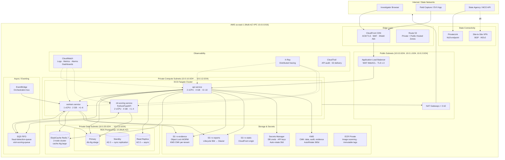
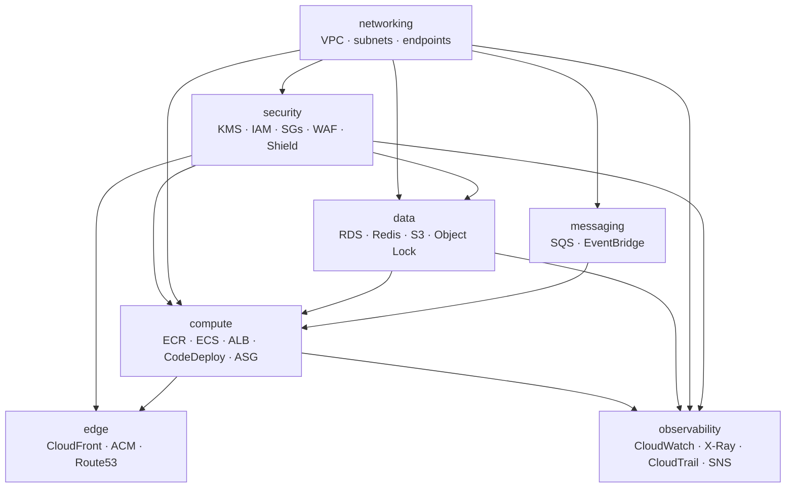

# RayVerify™ — AWS Deployment Architecture

> **Platform:** RayVerify™ | **Parent:** RayHealthEVV™
> **Classification:** Government-grade · HIPAA · SOC 2 · CMS-EVV
> **IaC:** Terraform under `infra/terraform/` · AWS region primary: `us-east-1` (GovCloud path described in §7)

---

## Table of Contents

1. [Cloud Topology Overview](#1-cloud-topology-overview)
2. [Network Architecture & Security](#2-network-architecture--security)
3. [Compute Layer — ECS Fargate](#3-compute-layer--ecs-fargate)
4. [Data Layer](#4-data-layer)
5. [Edge & DNS](#5-edge--dns)
6. [Observability & Operations](#6-observability--operations)
7. [GovCloud / FedRAMP Considerations](#7-govcloud--fedramp-considerations)
8. [Terraform Module Layout](#8-terraform-module-layout)
9. [Cost & Environment Sizing](#9-cost--environment-sizing)

---

## 1. Cloud Topology Overview

RayVerify runs inside a dedicated **multi-AZ VPC** (`10.0.0.0/16`) spanning three Availability Zones. All stateful resources (RDS, ElastiCache) and compute services (ECS Fargate) run in **private subnets**. Only the Application Load Balancer and NAT Gateways have public-facing presence. State agency integrations reach the platform via AWS PrivateLink or a managed VPN — never over the public internet.



---

## 2. Network Architecture & Security

### 2.1 Subnet Tiers

| Tier | CIDR Range | Resources | Internet Route |
|------|-----------|-----------|----------------|
| **Public** | `10.0.0.0/24` – `10.0.2.0/24` | ALB, NAT Gateways | IGW direct |
| **Private Compute** | `10.0.10.0/24` – `10.0.12.0/24` | ECS Fargate tasks (api, workers, ml-scoring) | Via NAT GW |
| **Private Data** | `10.0.20.0/24` – `10.0.22.0/24` | RDS, ElastiCache | None (VPC endpoints only) |

All subnets are replicated across three AZs (`us-east-1a/b/c`). Data subnets have **no route to the internet** — all AWS service calls (S3, KMS, Secrets Manager, SQS, ECR, CloudWatch) traverse **VPC Interface Endpoints** or **Gateway Endpoints** to keep traffic private.

### 2.2 Security Groups

| Security Group | Inbound | Outbound |
|----------------|---------|----------|
| `sg-alb` | 443 from `0.0.0.0/0` (WAF-filtered) | 4000 to `sg-api` |
| `sg-api` | 4000 from `sg-alb`; 8001 from `sg-api` (internal) | 5432 to `sg-rds`; 6379 to `sg-redis`; 443 to VPC endpoints |
| `sg-workers` | 443 from `sg-api` (internal events) | 5432 to `sg-rds`; 6379 to `sg-redis`; 443 to VPC endpoints |
| `sg-ml` | 8000 from `sg-api`; 8000 from `sg-workers` | 443 to VPC endpoints |
| `sg-rds` | 5432 from `sg-api`, `sg-workers`, `sg-ml` | None |
| `sg-redis` | 6379 from `sg-api`, `sg-workers` | None |

No security group permits `0.0.0.0/0` inbound except `sg-alb` (which is covered by WAF). Database security groups have **no outbound rules** (default deny).

### 2.3 WAF & DDoS

- **AWS WAF WebACL** attached to both ALB and CloudFront:
  - OWASP Core Rule Set (CRS) managed rule group
  - AWS IP Reputation List
  - Rate-based rules: 2 000 req/5 min per IP; 500 req/5 min for `/auth/*` paths
  - Geo-restriction: optional per-tenant; default allow all (configurable for state-specific deployments)
  - PHI endpoint protection: custom rule blocking non-TLS or missing `Authorization` header
- **AWS Shield Advanced** on CloudFront, ALB, and Elastic IPs (NAT GWs) — provides DDoS protection with 24/7 DRT access and SLA credits.

### 2.4 Egress Control

ECS tasks in private compute subnets egress exclusively via the three NAT Gateways. Egress is further restricted by:
- Security group outbound rules (allowlist of specific ports/destinations)
- VPC endpoint policies on S3 and KMS (deny any principal not in the ECS task execution role)
- No direct internet egress from data subnets

### 2.5 State / Federal Private Connectivity

| Method | Use Case | Details |
|--------|----------|---------|
| **AWS PrivateLink** | Real-time API integration with state EVV aggregators | NLB-backed endpoint service; state consumes via Interface Endpoint in their VPC |
| **Site-to-Site VPN** | Legacy state MMIS or MES integrations | IKEv2 / BGP; terminated on AWS Virtual Private Gateway; monitored via CloudWatch |
| **Direct Connect** (future) | High-volume state data feeds; GovCloud | Dedicated 1 Gbps circuit; recommended for GA-scale state pilots |

---

## 3. Compute Layer — ECS Fargate

### 3.1 Service Definitions

| Service | Image | Task Size | Min Tasks | Max Tasks | Port | Notes |
|---------|-------|-----------|-----------|-----------|------|-------|
| `rv-api` | `ecr/rv-api:latest` | 2 vCPU · 4 GB | 2 | 10 | 4000 | NestJS; ALB target group |
| `rv-workers` | `ecr/rv-workers:latest` | 1 vCPU · 2 GB | 1 | 6 | — | SQS consumer; fraud scoring pipeline |
| `rv-ml-scoring` | `ecr/rv-ml-scoring:latest` | 2 vCPU · 4 GB | 1 | 4 | 8000 | Python/FastAPI; called by api + workers |

All tasks run with:
- **No public IP** (awsvpc networking mode, private subnets)
- **Task execution role** (ECR pull, Secrets Manager read, CloudWatch Logs write)
- **Task role** (KMS decrypt, S3 put/get on `rv-evidence` and `rv-reports`, SQS send/receive, X-Ray PutTraceSegments)
- **Read-only root filesystem** where possible; non-root user inside container
- **ECS Exec disabled** in production (enabled in staging for debugging)
- Health checks: HTTP `GET /health` (api, ml-scoring); SQS heartbeat (workers)

### 3.2 Autoscaling

Application Auto Scaling policies per service:

```
rv-api:
  metric: ALBRequestCountPerTarget (target: 800 req/min/task)
  scale-out: +2 tasks, cooldown 60s
  scale-in: -1 task, cooldown 300s

rv-workers:
  metric: SQS ApproximateNumberOfMessagesVisible (target: 50 msgs/task)
  scale-out: +2 tasks, cooldown 30s
  scale-in: -1 task, cooldown 180s

rv-ml-scoring:
  metric: ECSServiceAverageCPUUtilization (target: 65%)
  scale-out: +1 task, cooldown 60s
  scale-in: -1 task, cooldown 180s
```

### 3.3 Blue/Green Deployments

Deployments use **AWS CodeDeploy with ECS blue/green**:

1. New task set created alongside current (blue) set
2. Test traffic listener (port 8080 on ALB) receives 10% traffic to green set
3. Automated smoke tests + CloudWatch alarm gate (5-minute observation window)
4. If alarms clear: 100% traffic shift to green; blue set retained 15 minutes for instant rollback
5. If any alarm fires or smoke tests fail: automatic rollback to blue within 60 seconds

### 3.4 EKS Migration Path

The architecture is **EKS-ready**. Migration path when horizontal scale demands exceed ECS ergonomics (estimated at ~50+ concurrent tasks per service):

1. Helm charts maintained alongside `infra/terraform/` (future)
2. Same container images (ECR) — no code changes required
3. Swap ECS service Terraform module for `aws_eks_node_group` + Helm release
4. Migrate CodeDeploy blue/green to ArgoCD + Argo Rollouts canary
5. RDS, ElastiCache, S3, KMS remain unchanged — only compute plane migrates

---

## 4. Data Layer

### 4.1 RDS PostgreSQL — High Availability

| Parameter | Value |
|-----------|-------|
| Engine | PostgreSQL 15 (16-compatible) |
| Instance class | `db.r6g.xlarge` (prod); `db.t3.medium` (staging/dev) |
| Storage | 500 GB gp3, 3 000 IOPS, autoscale to 2 TB |
| Multi-AZ | Synchronous standby in AZ-2; automatic failover < 60 s |
| Read Replica | 1× async replica in AZ-3 for reporting queries and read-heavy dashboard endpoints |
| Encryption | KMS CMK `rv-rds-key` (AES-256); storage, snapshots, replicas all encrypted |
| Backups | Automated daily snapshots, 35-day retention; **PITR** enabled (1-second granularity) |
| Maintenance window | Sunday 03:00–04:00 UTC (configurable per tenant region) |
| CA cert | `rds-ca-2019` → migrate to `rds-ca-rsa2048-g1` on next cert rotation |

**Parameter Group Hardening** (`rv-pg15-params`):

```ini
log_connections            = on
log_disconnections         = on
log_duration               = on   # query-level audit
log_min_duration_statement = 1000 # log slow queries > 1s
ssl                        = on
ssl_min_protocol_version   = TLSv1.2
rds.force_ssl              = 1
shared_preload_libraries   = pg_stat_statements,auto_explain
```

The physical schema (`db/schema.sql`) enables **Row-Level Security** on all 19 business tables. The application sets `SET app.current_org = '<uuid>'` per request — this is enforced at the database layer, not just the application layer. The `BYPASSRLS` privilege is reserved for the DBA/migration role and is never granted to the application user.

### 4.2 ElastiCache Redis

| Parameter | Value |
|-----------|-------|
| Engine | Redis 7 OSS |
| Node type | `cache.r6g.large` |
| Cluster mode | 2-node primary + replica (single shard, prod); 1-node (dev) |
| Encryption | In-transit (TLS); at-rest (KMS) |
| Auth | `AUTH` token via Secrets Manager |
| Use cases | BullMQ fraud-scoring queues, API response cache, session store, rate-limit counters |
| Eviction policy | `volatile-lru` (queues protected by TTL-free keys) |

### 4.3 S3 Buckets

| Bucket | Purpose | Object Lock | Lifecycle | KMS Key |
|--------|---------|-------------|-----------|---------|
| `rv-evidence-{env}` | Biometric probe images, GPS payloads, identity verification records (PHI) | **WORM Compliance** 7-year retention | None (Object Lock governs) | Per-tenant CMK (`rv-evidence-{org-slug}`) |
| `rv-reports-{env}` | Generated PDF/XLSX/CSV reports | None | 90 days → Glacier IR; 7 years → delete | `rv-reports-key` |
| `rv-audit-{env}` | CloudTrail + compliance export archives | **WORM Governance** 7-year retention | None | `rv-audit-key` |
| `rv-static-{env}` | Frontend Next.js static assets | None | 365 days → delete | `rv-static-key` (SSE-S3 acceptable) |

**Bucket policies** enforce:
- `aws:SecureTransport: true` on all buckets (deny HTTP)
- `s3:PutObject` restricted to specific task roles
- Public access blocked at account and bucket level
- `rv-evidence-*` additionally restricts `GetObject` to the api task role and a designated investigator-download Lambda — no direct browser access

**KMS CMK Strategy:**

```
rv-rds-key          → RDS encryption (shared across tenants at storage level)
rv-evidence-{slug}  → Per-tenant evidence bucket key (envelope encryption; data key cached in-process)
rv-reports-key      → Reports bucket (shared; report objects scoped by tenant prefix)
rv-audit-key        → Audit/CloudTrail archival
rv-secrets-key      → Secrets Manager encryption
```

Per-tenant data keys are generated by `GenerateDataKey` against the tenant's CMK. The encrypted data key is stored alongside the ciphertext (envelope encryption pattern). Tenant key rotation does not require re-encryption of existing data — only new data keys are generated under the new CMK.

---

## 5. Edge & DNS

### 5.1 CloudFront Distribution

| Setting | Value |
|---------|-------|
| Origins | ALB (`api.rv-internal.com`), S3 `rv-static-{env}` |
| TLS policy | `TLSv1.2_2021` (minimum); ACM certificate auto-renewed |
| HTTP/3 | Enabled (QUIC) |
| Cache behaviors | `/api/*` — no cache, forward all headers; `/_next/static/*` — 365-day TTL; `/docs/*` — 24-hour TTL |
| WAF WebACL | `rv-waf-global` (CloudFront-scoped) |
| Geo restriction | Configurable per deployment (none by default) |
| Access logs | S3 `rv-audit-{env}/cloudfront/` with 90-day lifecycle |
| Price class | `PriceClass_100` (US/EU/AUS) — expand for international pilots |

### 5.2 ACM & Route 53

- Wildcard certificate `*.rayverify.io` + apex `rayverify.io` in ACM (us-east-1 for CloudFront; regional cert per region for ALB)
- Route 53 hosted zones: public (`rayverify.io`) and private (`rv-internal.com` for VPC-internal service discovery)
- Health-check-based failover records for multi-region DR (future)
- State-specific subdomain isolation: `{state}.rayverify.io` → tenant-scoped CloudFront behavior or separate distribution

---

## 6. Observability & Operations

### 6.1 CloudWatch Metrics & Alarms

Key alarms (all routed to SNS → PagerDuty for P1/P2):

| Alarm | Threshold | Severity |
|-------|-----------|----------|
| `rv-api-5xx-rate` | > 1% over 5 min | P1 |
| `rv-api-p99-latency` | > 3 000 ms | P2 |
| `rv-rds-cpu` | > 80% for 10 min | P2 |
| `rv-rds-freeable-memory` | < 512 MB | P1 |
| `rv-rds-replica-lag` | > 30 s | P2 |
| `rv-redis-cache-hit-ratio` | < 70% | P3 |
| `rv-fraud-queue-depth` | > 500 messages for 5 min | P2 |
| `rv-waf-block-rate` | > 500 blocks/min | P1 |
| `rv-kms-throttle` | Any throttle event | P2 |
| `rv-rds-failed-logins` | > 10 in 1 min | P1 (security) |

### 6.2 CloudWatch Logs

All ECS task logs shipped to CloudWatch Logs via the `awslogs` log driver:

| Log Group | Retention | Notes |
|-----------|-----------|-------|
| `/rv/api` | 365 days | Structured JSON; PHI fields redacted at application layer before logging |
| `/rv/workers` | 365 days | Queue consumer events, scoring decisions |
| `/rv/ml-scoring` | 365 days | Model inference logs, feature values (non-PHI) |
| `/rv/rds/postgresql` | 90 days | Slow queries, connections, errors |
| `/rv/waf` | 365 days | Full WAF request log with blocked reasons |
| `/rv/cloudtrail` | 7 years | All AWS API calls; delivered to `rv-audit-{env}` S3 + CloudWatch Logs |

Log Insights queries are pre-built for:
- Failed identity verifications per caregiver (last 24 hours)
- Fraud events by type and organization
- API error rate by endpoint
- Slow RDS queries > 5 seconds

### 6.3 AWS X-Ray

Distributed tracing enabled across all three ECS services with the X-Ray SDK. Sampling rules:
- All requests to `/api/visits/*/verify` (verification chain): 100% sampled
- All fraud scoring requests: 100% sampled
- All other API requests: 5% sampled (configurable per environment)

Service map in X-Ray Insights shows: `CloudFront → ALB → rv-api → (rv-ml-scoring | RDS | ElastiCache | S3 | SQS)`

### 6.4 CloudTrail

- Multi-region trail with S3 delivery to `rv-audit-{env}` (WORM Object Lock)
- Log file validation enabled (SHA-256 + RSA digest chain)
- CloudWatch Logs delivery for real-time alerting on sensitive API calls (e.g., `kms:Disable*`, `s3:DeleteBucketPolicy`, `iam:AttachRolePolicy`)
- Insights enabled for unusual API call volume

---

## 7. GovCloud / FedRAMP Considerations

For state Medicaid agencies or federal programs requiring **FedRAMP Moderate** or **High** authorization:

| Consideration | Current (Commercial) | GovCloud Path |
|---------------|---------------------|---------------|
| AWS region | `us-east-1` | `us-gov-east-1` or `us-gov-west-1` |
| IAM | Standard AWS IAM | GovCloud IAM (separate account; no cross-region federation) |
| Service availability | Full service catalog | Verify Shield Advanced, CloudFront, ACM availability in GovCloud |
| Compliance boundary | HIPAA BAA + SOC 2 | FedRAMP ATO package; NIST SP 800-53 Rev 5 control mapping |
| Data residency | US regions only | GovCloud guarantees US-only data sovereignty |
| Personnel | No restriction | GovCloud requires US citizens / US persons for admin access |
| Encryption keys | KMS (standard) | KMS with CloudHSM backing (FIPS 140-2 Level 3) |
| Terraform | Standard AWS provider | `hashicorp/aws` GovCloud endpoints; separate state bucket in GovCloud |

**Migration approach:** The Terraform module design (§8) anticipates this by parameterizing region and AWS partition. Adding a `gov` workspace to each module with `partition = "aws-us-gov"` and `region = "us-gov-east-1"` is the primary change required. No application code changes needed.

State-specific **Authority to Operate (ATO)** requirements should be evaluated per-state as part of the Phase 5 hardening milestone (see `docs/10-development-roadmap.md`).

---

## 8. Terraform Module Layout

The IaC lives under `infra/terraform/` using a flat module structure with per-environment workspaces (`dev`, `staging`, `prod`). The module design mirrors AWS service ownership boundaries for clear separation of concerns.

### 8.1 Module Map

```
infra/terraform/
├── main.tf                     # Root module: workspace-aware variable resolution
├── variables.tf                # Global inputs (environment, region, CIDR blocks)
├── outputs.tf                  # Cross-module references (VPC IDs, ARNs, etc.)
├── versions.tf                 # Required providers + version constraints
│
├── modules/
│   ├── networking/             # VPC, subnets, IGW, NAT GWs, route tables,
│   │   │                       # VPC endpoints (S3/KMS/SQS/ECR/CW/Secrets Mgr),
│   │   │                       # PrivateLink NLB endpoint service
│   │   ├── main.tf
│   │   ├── variables.tf
│   │   └── outputs.tf          # vpc_id, private_subnet_ids, public_subnet_ids
│   │
│   ├── security/               # KMS CMKs, IAM roles (ECS task/execution),
│   │   │                       # WAF WebACLs, security groups, Secrets Manager secrets,
│   │   │                       # Shield Advanced subscription
│   │   ├── main.tf
│   │   ├── variables.tf
│   │   └── outputs.tf          # kms_key_arns, sg_ids, iam_role_arns
│   │
│   ├── data/                   # RDS (Multi-AZ + read replica), ElastiCache,
│   │   │                       # S3 buckets (evidence/reports/audit/static),
│   │   │                       # S3 Object Lock configuration, bucket policies
│   │   ├── main.tf
│   │   ├── variables.tf
│   │   └── outputs.tf          # rds_endpoint, redis_endpoint, s3_bucket_arns
│   │
│   ├── compute/                # ECR repositories, ECS cluster, task definitions,
│   │   │                       # ECS services (api/workers/ml-scoring),
│   │   │                       # Application Auto Scaling, CodeDeploy blue/green,
│   │   │                       # ALB + target groups + listener rules
│   │   ├── main.tf
│   │   ├── variables.tf
│   │   └── outputs.tf          # alb_dns_name, ecs_cluster_arn, ecr_repo_urls
│   │
│   ├── edge/                   # CloudFront distribution, ACM certificates,
│   │   │                       # Route 53 hosted zones + records,
│   │   │                       # CloudFront WAF association
│   │   ├── main.tf
│   │   ├── variables.tf
│   │   └── outputs.tf          # cloudfront_domain, zone_ids
│   │
│   ├── messaging/              # SQS FIFO queues (fraud-detection, visit-scoring),
│   │   │                       # dead-letter queues, EventBridge bus + rules
│   │   ├── main.tf
│   │   ├── variables.tf
│   │   └── outputs.tf          # queue_urls, eventbridge_bus_arn
│   │
│   └── observability/          # CloudWatch log groups, metric filters, alarms,
│       │                       # X-Ray sampling rules, CloudTrail trail,
│       │                       # SNS topics (alerting), dashboards
│       ├── main.tf
│       ├── variables.tf
│       └── outputs.tf          # cloudwatch_dashboard_urls, sns_topic_arns
│
└── environments/
    ├── dev.tfvars
    ├── staging.tfvars
    └── prod.tfvars
```

### 8.2 Module Dependency Diagram



**Dependency rationale:**
- `networking` is the foundation — all other modules consume VPC/subnet IDs
- `security` depends on `networking` for SG VPC placement; all other modules consume roles and key ARNs from `security`
- `data` depends on `networking` (subnet placement) and `security` (KMS keys, SGs)
- `compute` depends on all of `networking`, `security`, `data`, and `messaging`
- `edge` depends on `compute` (ALB DNS) and `security` (WAF ACL, ACM cert ARNs)
- `observability` is last — subscribes to resources created by all other modules

---

## 9. Cost & Environment Sizing

All estimates in USD/month. Actual costs depend on traffic volume, data volume, and AWS pricing at time of deployment. These figures are indicative for planning and investor/procurement modeling.

| Component | Dev / Local | Staging | Production (MVP Scale) |
|-----------|-------------|---------|----------------------|
| **ECS Fargate (api)** | Local Docker | 0.25 vCPU × 1 task ≈ $12 | 2 vCPU × 3 tasks (avg) ≈ $220 |
| **ECS Fargate (workers)** | Local Docker | 0.25 vCPU × 1 ≈ $6 | 1 vCPU × 2 tasks (avg) ≈ $75 |
| **ECS Fargate (ml-scoring)** | Local Docker | 0.5 vCPU × 1 ≈ $10 | 2 vCPU × 2 tasks (avg) ≈ $145 |
| **RDS PostgreSQL** | LocalStack / local PG | `db.t3.medium` ≈ $50 | `db.r6g.xlarge` Multi-AZ ≈ $530 |
| **RDS Read Replica** | — | — | `db.r6g.large` ≈ $180 |
| **ElastiCache Redis** | Local Redis | `cache.t3.micro` ≈ $14 | `cache.r6g.large` × 2 ≈ $200 |
| **S3 (all buckets)** | LocalStack | < $5 | ≈ $30–80 (depends on evidence volume) |
| **CloudFront** | — | Minimal ≈ $5 | ≈ $30–100 (traffic-dependent) |
| **ALB** | — | ≈ $18 | ≈ $25 + LCU charges |
| **NAT Gateways (×3)** | — | 1× ≈ $35 | 3× ≈ $105 |
| **KMS** | — | < $5 | ≈ $10–40 (key count + API calls) |
| **Secrets Manager** | — | < $5 | ≈ $10 |
| **CloudWatch / X-Ray** | — | ≈ $10 | ≈ $50–150 (log volume) |
| **WAF + Shield Adv** | — | WAF only ≈ $10 | WAF + Shield ≈ $3 100 (Shield is $3 000/mo flat) |
| **Data Transfer** | — | < $5 | ≈ $30–100 |
| **ECR** | — | < $5 | ≈ $10 |
| **SQS / EventBridge** | — | < $5 | < $20 |
| **TOTAL ESTIMATE** | ~$0 (local) | ~$185/mo | ~$4 800–5 500/mo |

> **Notes:**
> - Shield Advanced ($3 000/mo) becomes cost-effective once monthly data or revenue protected justifies it; it can be deferred to the state pilot phase.
> - Production scale above assumes a single-state pilot (~10 000 visits/month). Multi-state scale (×5–10 states) adds roughly linear compute cost but RDS and Redis are shared; marginal cost per additional state is primarily storage and data transfer.
> - Reserved Instances (1-year, no-upfront) on RDS and ElastiCache can reduce those line items by 30–40%.
> - Savings Plans on Fargate (Compute Savings Plan) reduce compute by 20–35% at production scale.
