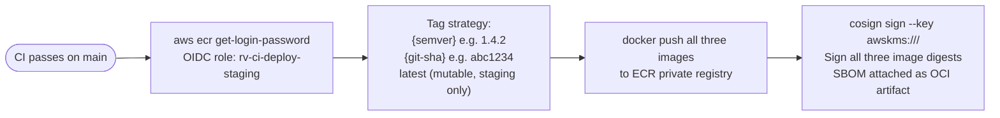
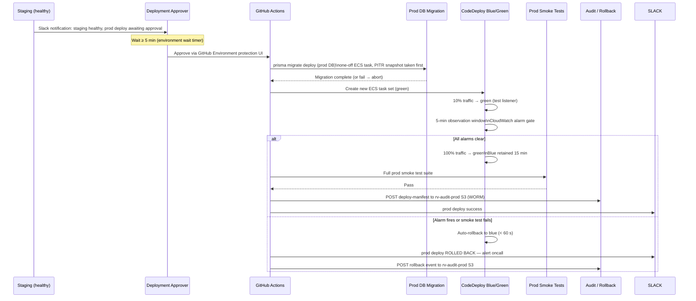

# RayVerify™ — CI/CD Pipeline

> **Platform:** RayVerify™ | **Parent:** RayHealthEVV™
> **IaC:** `infra/terraform/` · **Workflows:** `.github/workflows/`
> **Strategy:** Trunk-based development · GitHub Actions · AWS OIDC · Zero long-lived credentials

---

## Table of Contents

1. [Pipeline Philosophy](#1-pipeline-philosophy)
2. [CI Pipeline — Stages & Flow](#2-ci-pipeline--stages--flow)
3. [CD Pipeline — Build, Push & Deploy](#3-cd-pipeline--build-push--deploy)
4. [Quality Gates & Required Checks](#4-quality-gates--required-checks)
5. [Secrets Management in CI](#5-secrets-management-in-ci)
6. [Release Management](#6-release-management)

---

## 1. Pipeline Philosophy

### 1.1 Trunk-Based Development

RayVerify uses a **trunk-based development** model with short-lived feature branches:

- `main` is the single source of truth and is always deployable
- Feature branches live < 48 hours; longer work is gated behind feature flags
- No long-lived `develop`, `release/*`, or `hotfix/*` branches — all paths go through `main`
- Direct commits to `main` are blocked; all changes require a pull request with at least one approved review and all required checks passing

### 1.2 Everything as Code

- Infrastructure is managed exclusively in Terraform (`infra/terraform/`); no manual console changes in staging or prod
- Pipeline definitions are in `.github/workflows/`; no out-of-band pipeline configuration
- Database migrations are Prisma-managed and version-controlled; schema changes are never applied manually
- Environment secrets are managed in AWS Secrets Manager and surfaced to CI via OIDC — never stored as plaintext in GitHub Secrets unless unavoidable (and then rotated on a 30-day schedule)

### 1.3 Supply-Chain Security

- All container images are built in CI, scanned, and signed before deployment
- Software Bill of Materials (SBOM) is generated at build time and attached to every ECR image
- Dependencies are pinned to exact versions in `package.json` and `requirements.txt`; Dependabot raises PRs for updates
- GitHub Actions third-party actions are pinned to specific commit SHAs (not mutable tags)
- OIDC federation to AWS eliminates all long-lived AWS access keys in CI

### 1.4 Separation of Duties for Production

- Staging deployments are **automatic** on merge to `main` (no human gate)
- Production deployments require **manual approval** from a designated Deployment Approver (separate from the developer who authored the change)
- The GitHub Environment `production` has protection rules: required reviewers, deployment branch policy (`main` only), wait timer (5 minutes minimum after staging smoke tests pass)
- Post-deployment audit evidence is automatically posted to the immutable `rv-audit-{env}` S3 bucket to satisfy SOC 2 change-management control CC8.1

---

## 2. CI Pipeline — Stages & Flow

CI runs on every pull request and every push to `main`. The pipeline is defined in `.github/workflows/ci.yml`.

```mermaid
flowchart TD
  TRIGGER([PR opened / push to main])

  subgraph INSTALL["Stage 1 — Install"]
    S1[npm ci --workspaces\ncache: ~/.npm key=package-lock.json]
    S1B[pip install -r requirements.txt\ncache: pip key=requirements.txt]
  end

  subgraph LINT["Stage 2 — Lint & Format"]
    S2A[ESLint --max-warnings 0\nnpm run lint --workspaces]
    S2B[Prettier --check\nnpm run format:check]
    S2C[Ruff lint + isort\npython ml-scoring]
    S2D[Prisma format --check\nno schema drift]
  end

  subgraph TYPECHECK["Stage 3 — Type Safety"]
    S3A[tsc --noEmit\npackages/backend]
    S3B[tsc --noEmit\npackages/frontend]
    S3C[tsc --noEmit\npackages/shared]
    S3D[mypy ml-scoring\n--strict]
  end

  subgraph UNIT["Stage 4 — Unit Tests"]
    S4A[Jest — backend unit\nnpm run test:unit --workspace=backend]
    S4B[Jest + RTL — frontend\nnpm run test:unit --workspace=frontend]
    S4C[pytest ml-scoring\ncover: 80% threshold]
  end

  subgraph BUILD["Stage 5 — Build"]
    S5A[nest build\n--workspace=backend]
    S5B[next build\n--workspace=frontend]
    S5C[Verify ml-scoring imports\npython -m py_compile]
  end

  subgraph MIGRATE["Stage 6 — Migration Check"]
    S6[prisma migrate diff\n--from-migrations --to-schema-datamodel\nfail on destructive unapplied drift]
  end

  subgraph INTEG["Stage 7 — Integration Tests"]
    SVC1[(PostgreSQL 15\nephemeral service container)]
    SVC2[(Redis 7\nephemeral service container)]
    S7[npm run test:integration\n--workspace=backend\nWith real DB + Redis]
    S7ML[pytest -m integration\nml-scoring]
  end

  subgraph SAST["Stage 8 — SAST & Supply Chain"]
    S8A[CodeQL analysis\nJS/TS + Python\n.github/workflows/codeql.yml]
    S8B[npm audit --audit-level=high\nfail on high/critical]
    S8C[pip-audit\nfail on high/critical]
    S8D[gitleaks detect\n.github/workflows/security-scan.yml]
  end

  subgraph CONTAINER["Stage 9 — Container Build & Scan"]
    S9A[docker build rv-api\nmulti-stage · non-root · distroless]
    S9B[docker build rv-workers\nmulti-stage · non-root]
    S9C[docker build rv-ml-scoring\nmulti-stage · non-root · slim python]
    S9D[Trivy image scan\nfail on HIGH/CRITICAL CVEs\n.github/workflows/security-scan.yml]
    S9E[syft SBOM generation\ncyclonedx-json attached to workflow run]
  end

  PASS([All gates pass\nPR merge unblocked / CD triggered])
  FAIL([Any gate fails\nPR blocked / Slack + GitHub notification])

  TRIGGER --> INSTALL
  INSTALL --> LINT
  LINT --> TYPECHECK
  TYPECHECK --> UNIT
  UNIT --> BUILD
  BUILD --> MIGRATE
  MIGRATE --> INTEG
  INTEG --> SAST
  SAST --> CONTAINER
  CONTAINER --> PASS
  CONTAINER --> FAIL
```



### 2.1 Key Implementation Details

**Stage 1 — Install**

```yaml
# .github/workflows/ci.yml (excerpt)
- uses: actions/setup-node@v4
  with: { node-version: '20', cache: 'npm' }
- run: npm ci --workspaces --include-workspace-root
```

npm workspaces installs all three packages (`backend`, `frontend`, `shared`) in a single `npm ci`. The lockfile is the source of truth — any `package-lock.json` drift fails the install stage.

**Stage 6 — Migration Check**

Before running integration tests, Prisma validates that:
1. Every migration in `prisma/migrations/` is applied in sequence
2. The current schema matches the last migration (no unapplied drift)
3. No destructive migration (column drop, type change) is present without an explicit `-- RayVerify: destructive-acknowledged` comment

```bash
npx prisma migrate diff \
  --from-migrations packages/backend/prisma/migrations \
  --to-schema-datamodel packages/backend/prisma/schema.prisma \
  --exit-code  # non-zero if diff exists
```

**Stage 7 — Integration Tests**

GitHub Actions service containers spin up a real PostgreSQL 15 and Redis 7 for the duration of the integration test job:

```yaml
services:
  postgres:
    image: postgres:15-alpine
    env: { POSTGRES_DB: rv_test, POSTGRES_USER: rv, POSTGRES_PASSWORD: test }
    options: --health-cmd "pg_isready" --health-interval 5s
  redis:
    image: redis:7-alpine
    options: --health-cmd "redis-cli ping" --health-interval 5s
```

The NestJS integration tests run the full API layer against a real DB with RLS enabled, exercising the verification chain, fraud event creation, and case management flows.

**Stage 8 — SAST & Supply Chain** (`.github/workflows/codeql.yml`, `.github/workflows/security-scan.yml`)

- **CodeQL**: static analysis for SQL injection, path traversal, prototype pollution, insecure deserialization across the TypeScript and Python codebases
- **npm audit / pip-audit**: transitive dependency CVE scan; any HIGH or CRITICAL finding blocks merge
- **gitleaks**: secret scan against full git history on every PR; custom rules for AWS key patterns, HIPAA-adjacent tokens (SSNs, Medicaid IDs in test fixtures)

**Stage 9 — Container Build & Scan**

All three Dockerfiles use **multi-stage builds** to produce minimal production images:
- `rv-api`: Node 20 Alpine builder → `gcr.io/distroless/nodejs20-debian12` runtime (~130 MB)
- `rv-workers`: same pattern as api
- `rv-ml-scoring`: Python 3.11 builder → `python:3.11-slim` runtime (~280 MB)

Trivy scans the final image layer with `--exit-code 1 --severity HIGH,CRITICAL`. Any unpatched HIGH/CRITICAL CVE in the production image fails the pipeline. The Trivy DB is updated at the start of every run.

---

## 3. CD Pipeline — Build, Push & Deploy

Defined in `.github/workflows/deploy.yml`. Triggered automatically after a successful CI run on `main`.

### 3.1 Image Build, Tag & Push



**Tagging strategy:**

| Tag | Purpose | Mutability |
|-----|---------|-----------|
| `{semver}` e.g. `1.4.2` | Human-readable release version | Immutable (ECR `imageTagMutability: IMMUTABLE`) |
| `{short-sha}` e.g. `abc1234` | Exact commit traceability | Immutable |
| `staging-latest` | Convenience for staging service | Mutable (staging only) |

Production ECS task definitions reference the immutable `{semver}` tag. `latest` tags are **never used in production task definitions**.

### 3.2 Staging Deployment (Automatic)

```mermaid
sequenceDiagram
  participant CI as GitHub Actions
  participant TF as Terraform
  participant MIGR as DB Migration
  participant ECS as ECS CodeDeploy
  participant SMOKE as Smoke Tests
  participant SLACK as Slack / Audit

  CI->>TF: terraform plan (staging workspace)
  TF-->>CI: plan output (no infra drift expected on feature deploys)
  CI->>MIGR: prisma migrate deploy (staging DB)
  Note over MIGR: Runs in ECS one-off task;\nwait for STOPPED status
  CI->>ECS: aws ecs update-service --force-new-deployment (blue/green)
  ECS-->>CI: deployment ID returned
  CI->>ECS: Poll: wait for DeploymentComplete (max 15 min)
  CI->>SMOKE: POST /health, POST /api/auth/ping, GET /api/visits (empty 200)
  SMOKE-->>CI: All pass
  CI->>SLACK: staging deploy success\n{version} {sha} {timestamp}
  CI->>SLACK: audit S3 put: deploy-manifest.json to rv-audit-staging
```

**Migration safety ordering:**
1. Migration runs in a one-off ECS task against the staging RDS instance **before** traffic shifts
2. Only additive migrations (add column/table, add index) are permitted in an automated deploy
3. Destructive migrations (drop column, rename, type change) require a two-phase deployment: Phase A deploys backward-compatible schema + new code; Phase B removes the deprecated column in a subsequent PR after the old code path is confirmed gone
4. Migration task uses a separate IAM role with `BYPASSRLS` and `rds:Connect` — this role is **not** the application task role

### 3.3 Production Deployment (Manual Approval)



**Pre-deployment PITR snapshot:** Before any production migration, the workflow triggers an RDS snapshot (`rv-prod-pre-deploy-{timestamp}`). This provides a guaranteed restore point independent of the automated 35-day backup window. Snapshots older than 7 days are automatically expired by an S3 lifecycle rule on the RDS snapshot S3 delivery bucket.

### 3.4 Rollback Procedures

| Scenario | Rollback Method | RTO |
|----------|----------------|-----|
| Code bug detected in canary window | CodeDeploy auto-rollback (alarm fires) | < 60 s |
| Bug detected after full traffic shift | Re-run deploy workflow with previous `{semver}` tag (manual) | < 10 min |
| Migration caused data corruption | Restore from pre-deploy RDS snapshot + redeploy previous image | < 30 min |
| Full environment failure | Restore from RDS PITR to clean timestamp + redeploy | < 60 min |

---

## 4. Quality Gates & Required Checks

The following checks are **required** (cannot be bypassed) via GitHub branch protection on `main`:

| Check | Tool | Threshold | Blocks Merge? |
|-------|------|-----------|---------------|
| Lint (TS + Python) | ESLint · Prettier · Ruff | Zero warnings | Yes |
| Type safety | `tsc --noEmit` · mypy `--strict` | Zero errors | Yes |
| Unit test coverage — backend | Jest `--coverage` | ≥ 80% lines | Yes |
| Unit test coverage — ML scoring | pytest-cov | ≥ 80% lines | Yes |
| Integration tests | Jest integration + pytest | All pass | Yes |
| Migration drift check | `prisma migrate diff` | No unapplied drift | Yes |
| SAST (CodeQL) | CodeQL | No new HIGH/CRITICAL findings | Yes |
| Dependency CVEs | npm audit + pip-audit | No HIGH/CRITICAL | Yes |
| Secret scan | gitleaks | No secrets detected | Yes |
| Container image CVEs | Trivy | No HIGH/CRITICAL in production layer | Yes |
| PR review | GitHub | ≥ 1 approved review from CODEOWNERS | Yes |
| Signed image | cosign + KMS | Valid signature present on ECR digest | Yes (CD gate) |

**CODEOWNERS** (`/.github/CODEOWNERS`) maps:
- `packages/backend/prisma/` → `@rv-db-team` (DBA review on schema changes)
- `infra/terraform/` → `@rv-infra-team` (infra review on IaC changes)
- `packages/backend/src/modules/fraud/` → `@rv-fraud-team` (ML/fraud review)
- `.github/workflows/` → `@rv-security-team` (security review on pipeline changes)

---

## 5. Secrets Management in CI

### 5.1 OIDC Federation — No Long-Lived Keys

GitHub Actions authenticates to AWS using **OpenID Connect (OIDC) federation**. There are no AWS access keys stored in GitHub Secrets.

```yaml
# .github/workflows/deploy.yml (excerpt)
permissions:
  id-token: write   # required for OIDC
  contents: read

- uses: aws-actions/configure-aws-credentials@v4
  with:
    role-to-assume: arn:aws:iam::123456789012:role/rv-ci-deploy-staging
    aws-region: us-east-1
    role-session-name: GitHubActions-${{ github.run_id }}
```

The OIDC trust policy on the IAM role restricts assumption to:
- The specific GitHub repository (`org/RayVerify`)
- Specific branches (`refs/heads/main` for staging/prod deploy roles; `refs/pull/*` for CI scan roles)
- Specific workflow files (using `job_workflow_ref` condition)

### 5.2 IAM Roles by Pipeline Stage

| Role | Permissions | Used By |
|------|-------------|---------|
| `rv-ci-read-only` | ECR DescribeImages, no write | PR CI (scan, build verification) |
| `rv-ci-build` | ECR PutImage, ECR GetAuthorizationToken | CI image build + push |
| `rv-ci-deploy-staging` | ECS UpdateService, ECS RegisterTaskDefinition, S3 PutObject (rv-audit-staging) | Staging CD |
| `rv-ci-deploy-prod` | ECS UpdateService, ECS RegisterTaskDefinition, S3 PutObject (rv-audit-prod), RDS CreateDBSnapshot | Prod CD (requires manual approval) |
| `rv-ci-migration` | RDS Connect (via IAM auth), Secrets Manager GetSecretValue (DB URL only) | Migration one-off task |

All roles use **condition keys** to restrict the session to the specific GitHub repo, workflow file, and branch. No role grants `*` on any resource. Roles are defined in `infra/terraform/modules/security/` and reviewed in the infra CODEOWNERS path.

### 5.3 Application Secrets in CI

Application environment variables needed for integration tests are sourced from GitHub Actions environment secrets (encrypted at rest in GitHub) and rotated on a 90-day schedule:

| Secret | Value | Used In |
|--------|-------|---------|
| `TEST_DATABASE_URL` | Points to ephemeral service container | CI integration stage only |
| `TEST_REDIS_URL` | Points to ephemeral service container | CI integration stage only |
| `JWT_SECRET_TEST` | Randomly generated per-run value | CI unit + integration |

Production secrets (DB connection strings, KMS key IDs, Slack webhook) are stored **only in AWS Secrets Manager** and are never injected into GitHub Actions. ECS tasks pull secrets from Secrets Manager at container startup via the `secrets` field in the ECS task definition.

### 5.4 Environment Protection Rules

| Environment | Protection Rules |
|-------------|----------------|
| `staging` | Deployment branch: `main` only; no required reviewers; 0-minute wait |
| `production` | Deployment branch: `main` only; required reviewers: 1 (Deployment Approver role); 5-minute wait timer; prevent self-approval |

---

## 6. Release Management

### 6.1 Semantic Versioning

RayVerify follows **SemVer 2.0** (`MAJOR.MINOR.PATCH`):

| Increment | When |
|-----------|------|
| `MAJOR` | Breaking API changes, incompatible schema changes, module removal |
| `MINOR` | New features, new API endpoints, backward-compatible schema additions |
| `PATCH` | Bug fixes, security patches, dependency updates, documentation |

Version is maintained in the monorepo root `package.json` and mirrored in `packages/backend/package.json`, `packages/frontend/package.json`. The `packages/shared` package version is kept in sync — shared types are the contract between services.

### 6.2 Release Process

```
1. Feature PRs merged to main → staging deployed automatically
2. When ready for release: create annotated git tag  v{semver}
   git tag -a v1.2.0 -m "Release 1.2.0 — Phase 2 fraud detection MVP"
   git push origin v1.2.0
3. GitHub Actions release workflow triggers on tag push:
   - Generates changelog from conventional commits since last tag
   - Creates GitHub Release with changelog body
   - Produces release SBOM artifact
   - Triggers production deployment pipeline (still requires manual approval)
```

**Conventional commits** are enforced via a PR title lint step (`commitlint`). Merge commits to `main` must follow `{type}({scope}): {description}` — this powers automated changelog generation via `conventional-changelog-cli`.

### 6.3 Changelog & Artifact Retention

| Artifact | Retention |
|----------|-----------|
| GitHub Actions workflow runs | 90 days (configurable) |
| Test result artifacts (JUnit XML, coverage HTML) | 30 days |
| SBOM (CycloneDX JSON) | Attached to ECR image (indefinite) |
| Container images in ECR | Last 30 tagged versions retained; untagged images purged after 7 days via lifecycle policy |
| Deploy manifests in `rv-audit-prod` S3 | 7 years (WORM Object Lock) |
| Pre-deploy RDS snapshots | 7 days (automated expiry) |

### 6.4 Deployment Audit Trail

Every production deployment writes a structured `deploy-manifest.json` to `s3://rv-audit-prod/deployments/{timestamp}-{semver}.json` under WORM Object Lock. This file contains:

```json
{
  "version": "1.2.0",
  "git_sha": "abc1234def5678",
  "deployed_by": "github-actions",
  "approved_by": "jane.doe@agency.gov",
  "approval_timestamp": "2026-06-10T14:32:00Z",
  "deploy_timestamp": "2026-06-10T14:40:00Z",
  "images": {
    "rv-api": "123456789012.dkr.ecr.us-east-1.amazonaws.com/rv-api:1.2.0@sha256:...",
    "rv-workers": "123456789012.dkr.ecr.us-east-1.amazonaws.com/rv-workers:1.2.0@sha256:...",
    "rv-ml-scoring": "123456789012.dkr.ecr.us-east-1.amazonaws.com/rv-ml-scoring:1.2.0@sha256:..."
  },
  "migration_applied": true,
  "smoke_tests_passed": true,
  "rollback_occurred": false
}
```

This record satisfies the **SOC 2 CC8.1** (change management) and **HIPAA § 164.312(b)** (audit controls) requirements for traceable, tamper-evident deployment history.
