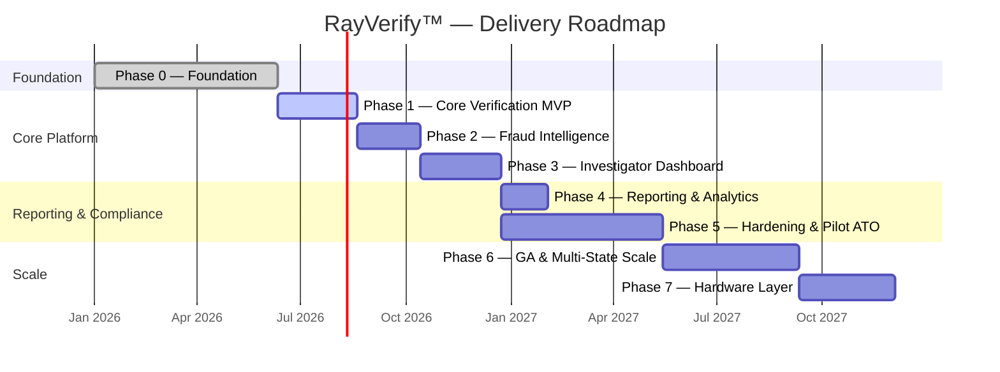
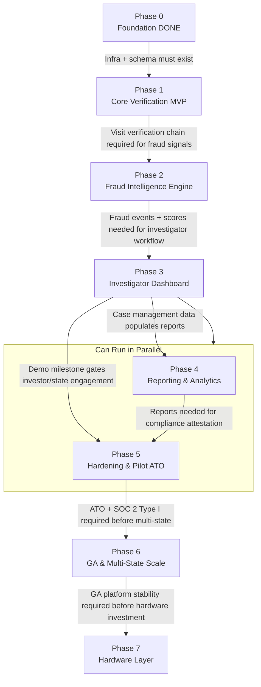

# RayVerify™ — Development Roadmap

> **Platform:** RayVerify™ | **Parent:** RayHealthEVV™
> **Current Status:** Phase 0 complete — schema, API contract, service scaffolding, and full documentation set in place.
> **Horizon:** Foundation (done) → MVP → State Pilot → General Availability → Scale

---

## Table of Contents

1. [Guiding Principles](#1-guiding-principles)
2. [Phase Definitions](#2-phase-definitions)
   - [Phase 0 — Foundation (Complete)](#phase-0--foundation-complete)
   - [Phase 1 — Core Verification MVP](#phase-1--core-verification-mvp)
   - [Phase 2 — Fraud Intelligence Engine](#phase-2--fraud-intelligence-engine)
   - [Phase 3 — Investigator Dashboard & Case Management](#phase-3--investigator-dashboard--case-management)
   - [Phase 4 — Reporting & Analytics](#phase-4--reporting--analytics)
   - [Phase 5 — Hardening, Compliance & State Pilot ATO](#phase-5--hardening-compliance--state-pilot-ato)
   - [Phase 6 — General Availability & Multi-State Scale](#phase-6--general-availability--multi-state-scale)
   - [Phase 7 — Hardware Integration Layer](#phase-7--hardware-integration-layer)
3. [Gantt Chart](#3-gantt-chart)
4. [Milestones Table](#4-milestones-table)
5. [Team & Roles](#5-team--roles)
6. [Key Risks & Mitigations](#6-key-risks--mitigations)
7. [KPIs & Success Metrics](#7-kpis--success-metrics)
8. [Dependencies & Sequencing](#8-dependencies--sequencing)

---

## 1. Guiding Principles

### 1.1 Compliance Milestones Gate Phase Transitions

No phase transitions to the next until its **compliance exit criteria** are met. Security is not a phase-5 activity — it is built into every phase. Each phase produces:
- Updated threat model (STRIDE) for the new attack surface
- SAST/DAST/dependency scan results with all HIGH/CRITICAL findings resolved
- Evidence artifacts for SOC 2 and HIPAA control mapping

### 1.2 Pre-Payment Prevention First

Feature prioritization consistently favors capabilities that block fraud **before** a Medicaid claim is paid. Retroactive analytics and reporting are necessary but secondary to real-time verification and pre-payment scoring.

### 1.3 Explainability as a Core Requirement

Every fraud score and identity verification decision must produce a human-readable explanation alongside a machine-readable factor list. Investigators, state auditors, and provider advocates need to understand *why* a visit was flagged — not just *that* it was flagged. This is a non-negotiable constraint on the ML scoring architecture.

### 1.4 Tenant Isolation at Every Phase

Multi-tenancy (row-level security, per-tenant KMS keys, organization-scoped API access) is enforced from Phase 1. No single-tenant shortcuts are taken. The first state pilot must onboard as a proper tenant, not as a hardcoded deployment.

### 1.5 State Procurement Reality

State Medicaid IT procurement cycles run 12–24 months. The roadmap is structured so that RayVerify can demonstrate a credible, working MVP to state program integrity units and MCO technology officers **before** a formal RFP/RFI response is needed. Phase 3 (Investigator Dashboard) is the target demo milestone for investor and state engagement.

---

## 2. Phase Definitions

---

### Phase 0 — Foundation (Complete)

**Duration:** Complete as of current drop.

**Objectives:**
- Establish the full production-grade data model, schema, and logical/physical database
- Define the complete API contract (OpenAPI 3.1)
- Scaffold the NestJS backend service structure with all eight module directories
- Scaffold the Next.js 15 frontend with auth shell
- Produce the complete documentation suite (docs/00 through docs/11)
- Configure local development environment (Docker Compose, LocalStack, Prisma seed)

**Key Deliverables:**

| Deliverable | Module(s) | Status |
|-------------|-----------|--------|
| `db/schema.sql` — partitioning, RLS, immutability triggers, audit hash chain | All | Done |
| `packages/backend/prisma/schema.prisma` — canonical logical model, all entities | All | Done |
| `api/openapi.yaml` — full endpoint contract | All | Done |
| `docker-compose.yml` — local dev stack | Dev experience | Done |
| `docs/00` through `docs/11` — complete architecture & compliance docs | All | Done |
| Monorepo structure (`package.json` workspaces, npm scripts) | Dev experience | Done |

**Exit Criteria:**
- `npm install && npm run dev:infra && npm run db:migrate && npm run dev` succeeds on a clean checkout
- OpenAPI spec parses without errors
- Schema applies cleanly to a fresh PostgreSQL 15 instance
- Documentation reviewed by at least one engineer and one compliance stakeholder

---

### Phase 1 — Core Verification MVP

**Duration:** ~10 weeks

**Objectives:**
- Implement a working, end-to-end visit verification chain: identity → GPS → device → visit package
- Stand up the AWS infrastructure (ECS Fargate, RDS Multi-AZ, ElastiCache, S3, KMS) using the Terraform modules
- Implement authentication (JWT + refresh + MFA TOTP) and RBAC
- Implement the NestJS modules for Auth, Identity Verification, Visit Verification, and Device Trust
- Implement the Python/FastAPI ml-scoring service with a rule-based scoring baseline (no ML model yet — weighted rules producing a 0–100 score)
- Connect the verification chain to the fraud score pipeline (rules-based)
- Deliver a minimal field capture API (clock-in, clock-out, GPS submission, identity selfie upload)
- Ship a working CI/CD pipeline (all `.github/workflows/` operational)

**Key Deliverables by Module:**

| Module | Deliverables |
|--------|-------------|
| **Identity Verification Engine** | Selfie upload endpoint, face-match stub (configurable similarity threshold), liveness check integration (AWS Rekognition or internal model), confidence/liveness score persistence in `identity_verifications` |
| **Visit Verification Engine** | Clock-in / clock-out API, GPS verification against `service_authorizations.radius_meters`, device trust assessment, `visit_verifications` record creation with SHA-256 `evidenceHash`, visit status lifecycle |
| **Fraud Intelligence Engine** | Rule-based detector stubs: impossible travel, duplicate visit, GPS anomaly, shared device; `fraud_events` creation; composite rule-based score written to `fraud_scores` |
| **Provider Risk Scoring** | `provider_risk_profiles` computed after each visit; initial score = weighted sum of rule violations |
| **Audit & Compliance Center** | All API actions write to `audit_logs` with hash chain; append-only triggers enforced end-to-end |
| **Infrastructure** | Terraform modules: networking, security, data, compute, messaging, observability deployed to staging |
| **CI/CD** | All workflow files operational: `ci.yml`, `codeql.yml`, `deploy.yml`, `security-scan.yml` |

**Compliance Exit Criteria:**
- HIPAA BAA signed with AWS
- PHI encryption at rest (KMS) and in transit (TLS 1.3) verified by integration tests
- RLS enforcement verified: tenant A cannot query tenant B's data under any API path
- Audit log immutability verified: UPDATE/DELETE on `audit_logs`, `identity_verifications`, `fraud_events` raise DB-level exceptions
- Penetration test (scope: authentication, RLS bypass, injection) — no CRITICAL findings unresolved

**Phase 1 KPIs:**
- Identity verification API response time (p99) < 3 000 ms including face match
- Visit clock-in end-to-end (GPS + identity + device + fraud score) < 5 000 ms (p99)
- Zero tenant data leakage in RLS test suite

---

### Phase 2 — Fraud Intelligence Engine

**Duration:** ~8 weeks

**Objectives:**
- Replace rule-based scoring baseline with a trained gradient-boosted ML model (Python/FastAPI service)
- Implement all 13 fraud detector types cataloged in `FraudEventType` enum
- Build the feature store: real-time feature computation from `visits`, `identity_verifications`, `gps_verifications`, and `provider_risk_profiles`
- Implement SHAP-style explainability: per-feature factor weights written to `fraud_scores.factors`
- Implement the provider risk scoring refresh pipeline (async worker, triggered post-visit)
- Implement the `fraud_events` → `fraud_cases` auto-grouping heuristic (provider + time window clustering)

**Key Deliverables by Module:**

| Module | Deliverables |
|--------|-------------|
| **Fraud Intelligence Engine** | All 13 detectors implemented and tested; composite scorer v1; model training pipeline; A/B test framework for model versions; `modelVersion` tracking in `fraud_scores` |
| **Provider Risk Scoring** | Full `provider_risk_profiles` recompute: `verificationFailures`, `gpsAnomalies`, `billingAnomalies`, `identityIssues`, `openCases`, `substantiatedCases`, `trend` sparkline |
| **Visit Verification Engine** | Mid-visit GPS check support (`eventType: MID_VISIT`); visit status auto-transition to `FLAGGED` on high fraud score |
| **ML Infrastructure** | Feature pipeline in `rv-workers`; model artifact stored in S3 and loaded by `rv-ml-scoring`; model version pinned per deployment |

**Compliance Exit Criteria:**
- False-positive rate < 10% on labeled test dataset (ghost visits marked confirmed fraud)
- All ML training data is synthetic or de-identified (no real PHI used in model training at this phase)
- Model versioning and reproducibility: any historical score can be regenerated from `modelVersion` + input features
- SAST + container scan: no HIGH/CRITICAL findings

**Phase 2 KPIs:**
- Fraud score computation latency (p99) < 800 ms from visit close to score available
- Detection recall on test set (confirmed fraud cases): ≥ 85%
- False positive rate on test set: ≤ 10%

---

### Phase 3 — Investigator Dashboard & Case Management

**Duration:** ~10 weeks

**Objectives:**
- Build the full Next.js 15 investigator dashboard (shadcn/ui components, Tailwind)
- Implement case management: create, assign, escalate, add notes/evidence, update status
- Implement fraud alert feed with filtering, sorting, and investigation actions
- Implement provider risk ranking views with trend visualization
- Implement evidence review: visit timeline, GPS map overlay, identity verification result, device signals
- Implement the `FraudCase` → `CaseEvidence` → chain-of-custody export workflow
- Implement real-time notifications (in-app via WebSocket, email via SES)

**Key Deliverables by Module:**

| Module | Deliverables |
|--------|-------------|
| **Investigator Dashboard** | Fraud alert feed; provider risk heat map; geographic anomaly map; fraud case list + detail view; evidence timeline; role-based views (INVESTIGATOR, AUDITOR, COMPLIANCE_OFFICER, ORG_ADMIN) |
| **Fraud Intelligence Engine** | `FraudCase` CRUD API; `CaseNote` API; `CaseEvidence` S3 attachment API; case status lifecycle (OPEN → IN_REVIEW → ESCALATED → PENDING_PAYMENT_HOLD → SUBSTANTIATED/UNSUBSTANTIATED → CLOSED) |
| **Audit & Compliance Center** | Chain-of-custody export: PDF/Excel package of all evidence for a case, signed with KMS, written to `rv-reports-{env}` with `contentHash`; `EXPORT` audit log entry |
| **Notifications** | In-app notification on new CRITICAL fraud event; email (SES) on case assignment; webhook stub for state system integration |

**Compliance Exit Criteria:**
- RBAC verified: INVESTIGATOR cannot delete cases; COMPLIANCE_OFFICER cannot assign cases; ORG_ADMIN cannot access other tenant's data
- Chain-of-custody export package passes legal admissibility review (internal counsel sign-off)
- Accessibility: WCAG 2.1 AA compliance on all investigator-facing views
- SAST + DAST (OWASP ZAP against staging): no HIGH/CRITICAL findings

**Phase 3 KPIs:**
- This phase is the primary **investor and state demo milestone**
- Investigator time-to-triage (from alert creation to case action): target < 10 minutes (baseline TBD from state partner feedback)
- Case creation → evidence attachment → export: < 30 minutes end-to-end
- Dashboard load time (p95): < 2 000 ms (authenticated, populated tenant)

---

### Phase 4 — Reporting & Analytics

**Duration:** ~6 weeks

**Objectives:**
- Implement all six `ReportType` variants: FRAUD_SUMMARY, PROVIDER_RISK, VISIT_VERIFICATION, INVESTIGATION, STATE_COMPLIANCE, EXECUTIVE_DASHBOARD
- Implement async report generation pipeline (SQS → worker → S3 delivery)
- Implement scheduled reports (daily/weekly/monthly, configurable per tenant)
- Implement the Report API (request, status poll, signed download URL)
- Implement the executive dashboard analytics view (real-time stats: visit volume, fraud rate, dollars-at-risk, open cases)
- Implement state compliance export in CMS-EVV required format

**Key Deliverables by Module:**

| Module | Deliverables |
|--------|-------------|
| **Reporting & Analytics** | All six report types; PDF generation (Puppeteer/WKHTML); Excel generation (ExcelJS); CSV; JSON; scheduled report cron; S3 delivery with `expiresAt` lifecycle; signed presigned URL generation |
| **Audit & Compliance Center** | EXPORT audit log entries for every report download; report access controls (RBAC) |
| **Visit Verification Engine** | Read replica query routing for report-generating queries (offload from primary) |

**Compliance Exit Criteria:**
- STATE_COMPLIANCE report format reviewed against CMS EVV data element requirements (42 CFR 441.301)
- Report downloads write to audit log: who, what, when, from which IP
- PHI in reports is redacted to minimum necessary (member ID masked to last 4 digits in non-investigator reports)

**Phase 4 KPIs:**
- Report generation time (p95, 30-day FRAUD_SUMMARY, 1 000 visits): < 60 seconds
- Scheduled report delivery reliability: ≥ 99.5%
- Dollars of fraud identified in demo environment (synthetic data): demonstrate ≥ $500K identified in a 90-day simulated dataset

---

### Phase 5 — Hardening, Compliance & State Pilot ATO

**Duration:** ~12 weeks

**Objectives:**
- Achieve formal **HIPAA compliance attestation** and execute BAAs with all processing sub-contractors
- Complete **SOC 2 Type I** readiness assessment; begin evidence collection for Type II
- Conduct third-party **penetration test** (scope: full application, API, infrastructure)
- Implement **Zero Trust** network controls: mTLS between ECS services, service mesh consideration
- Implement **WAF** tuning based on real traffic patterns from staging
- Onboard **first state pilot partner** as a live tenant (synthetic/test data initially, then real Medicaid data under BAA)
- Implement state-specific data residency and jurisdiction controls
- Implement **GovCloud migration path** (Terraform workspace, FIPS 140-2 KMS) if required by pilot state

**Key Deliverables by Module:**

| Module | Deliverables |
|--------|-------------|
| **All** | Penetration test remediation; SOC 2 control evidence package; HIPAA Risk Analysis (NIST 800-30); Security policy documentation |
| **Audit & Compliance Center** | SOC 2 CC6/CC7/CC8/CC9 evidence collection automation; automated control testing for RLS, immutability, encryption |
| **Identity Verification Engine** | NIST SP 800-63-3 IAL2 alignment documentation; liveness assurance level review |
| **Infrastructure** | CloudHSM evaluation for FIPS 140-2 Level 3 key storage; Shield Advanced activation; VPN/PrivateLink to pilot state |
| **State Pilot** | Onboarding playbook; tenant provisioning automation; pilot state BAA executed; first 500 live visits processed |

**Compliance Exit Criteria:**
- Penetration test: no CRITICAL findings; all HIGH findings have accepted mitigations or are resolved
- HIPAA Risk Analysis complete and approved by designated Security Officer
- SOC 2 Type I report issued by qualified auditor
- First state pilot processing live visits with zero PHI breach incidents
- State pilot SLA met: 99.9% API uptime over 30-day pilot window

**Phase 5 KPIs:**
- Live visits processed in pilot: ≥ 500 with real identity verification
- Fraud events detected in pilot: ≥ 10 confirmed or probable fraud signals
- Estimated dollars-at-risk surfaced to pilot state: ≥ $50K (dependent on pilot dataset size)
- Investigator throughput in pilot: cases triaged per investigator per day

---

### Phase 6 — General Availability & Multi-State Scale

**Duration:** ~16 weeks

**Objectives:**
- Expand to three or more state Medicaid agencies and/or MCOs
- Achieve **SOC 2 Type II** report covering the 6-month audit window beginning Phase 5
- Scale infrastructure to support 10× pilot traffic (autoscaling validation, load testing)
- Implement cross-tenant analytics (aggregate state-level fraud trends, no individual PHI)
- Implement provider network graph analysis (cross-provider risk detection)
- Implement payment hold integration API (connect to state claims adjudication system)
- Launch partner SDK for EVV vendors to integrate the RayVerify identity verification API

**Key Deliverables by Module:**

| Module | Deliverables |
|--------|-------------|
| **Fraud Intelligence Engine** | Cross-tenant/cross-provider graph analysis; network fraud ring detection; ML model v2 (trained on real, de-identified pilot data) |
| **Provider Risk Scoring** | Multi-state provider NPI matching (a provider enrolled in multiple states visible as a single risk entity) |
| **Reporting & Analytics** | State program integrity dashboard with aggregate metrics; CMS EVV compliance export in mandated electronic format |
| **Infrastructure** | Multi-region active-passive DR; EKS migration if Fargate limits are reached; Direct Connect for high-volume states |
| **Partner SDK** | REST + webhook SDK for EVV vendor integration; API key management; rate limiting per partner |

**Compliance Exit Criteria:**
- SOC 2 Type II report issued (covers Phase 5 + Phase 6 audit window)
- Load test results: 10 000 concurrent visit clock-ins without SLA degradation
- CMS EVV compliance certification (where applicable by state)
- Third annual penetration test completed with no new CRITICAL findings

**Phase 6 KPIs:**
- Annual Recurring Revenue (ARR): contract trajectory of $2M+ (investor milestone)
- States under active contract: ≥ 3
- Visits verified per month: ≥ 100 000
- Fraud prevented (pre-payment blocks + investigator-substantiated cases): ≥ $5M annualized
- Platform uptime (multi-state): ≥ 99.9% (SLA-contractual)

---

### Phase 7 — Future Hardware Integration Layer

**Duration:** ~12 weeks (parallel to Phase 6 for design; implementation begins post-GA)

**Objectives:**
- Implement the Hardware Integration Layer SDK (Module 8)
- Define the abstraction interface for: NFC card readers, fingerprint scanners, facial recognition cameras, secure elements, dedicated GPS modules, LTE backup
- Partner with one hardware vendor per modality
- Pilot hardware-based identity verification (NIST IAL3) at one high-fraud-risk provider site

**Key Deliverables by Module:**

| Module | Deliverables |
|--------|-------------|
| **Future Hardware Integration Layer** | Platform-agnostic SDK with pluggable adapters for `IdentityMethod.FINGERPRINT`, `NFC_CARD`, `GOV_CREDENTIAL` (already modeled in the `identity_method` enum); hardware device management API; secure enclave key storage integration |
| **Identity Verification Engine** | IAL3 verification path in the identity verification chain; hardware attestation record in `identity_verifications.matcher` |
| **Audit & Compliance Center** | Hardware audit trail: device serial, firmware version, calibration status logged per verification |

**Exit Criteria:**
- SDK supports at least two hardware modalities in production
- IAL3 path accepted by at least one state partner as an enhanced verification tier
- Hardware device tamper detection integrated with `DEVICE_TAMPERING` fraud event type

---

## 3. Gantt Chart

---

## 4. Milestones Table

| # | Milestone | Target Date | Phase | Gate Condition |
|---|-----------|-------------|-------|---------------|
| M0 | Foundation complete — schema, API, docs, scaffolding | 2026-06-10 | 0 | Repo green, schema applies cleanly |
| M1 | End-to-end visit verification working in staging | 2026-07-31 | 1 | Clock-in → identity → GPS → score → visit_verification record |
| M2 | AWS infrastructure live in staging via Terraform | 2026-08-10 | 1 | ECS Fargate, RDS Multi-AZ, Redis, S3, KMS deployed |
| M3 | CI/CD pipeline fully operational | 2026-08-19 | 1 | All `.github/workflows/*.yml` passing on `main` |
| M4 | ML fraud scoring v1 (gradient-boosted model) | 2026-09-18 | 2 | Recall ≥ 85%, FPR ≤ 10% on labeled test set |
| M5 | All 13 fraud detectors implemented | 2026-10-14 | 2 | All `FraudEventType` variants produce events in integration tests |
| M6 | Investigator Dashboard MVP — investor demo ready | 2026-11-28 | 3 | Case management, evidence review, alert feed all functional |
| M7 | Chain-of-custody export (legal-grade evidence package) | 2026-12-23 | 3 | Export PDF passes internal legal review |
| M8 | All six report types delivered | 2027-01-14 | 4 | Report generation < 60 s for 1 000-visit dataset |
| M9 | HIPAA attestation + BAA chain complete | 2027-02-14 | 5 | Security Officer sign-off; BAA with AWS and sub-processors |
| M10 | Third-party penetration test passed | 2027-03-07 | 5 | No CRITICAL; all HIGH mitigated or accepted |
| M11 | SOC 2 Type I report issued | 2027-04-11 | 5 | Auditor report in hand |
| M12 | First state pilot live (real visits under BAA) | 2027-05-14 | 5 | ≥ 500 live visits; zero PHI breach |
| M13 | SOC 2 Type II audit window opens | 2027-05-14 | 5→6 | 6-month observation period begins |
| M14 | Three state contracts signed | 2027-07-30 | 6 | Executed contracts with 3 state agencies or MCOs |
| M15 | 100K visits/month throughput validated | 2027-08-20 | 6 | Load test + production metrics |
| M16 | SOC 2 Type II report issued | 2027-11-14 | 6 | Audit window closes; report issued |
| M17 | Hardware integration pilot | 2027-12-04 | 7 | Fingerprint or NFC working at one pilot site |

---

## 5. Team & Roles

| Role | Responsibility | Phase Involvement |
|------|---------------|-------------------|
| **Lead Backend Engineer (NestJS/Prisma)** | API modules, verification chain, fraud event pipeline, RLS enforcement | P1–P6 |
| **Backend Engineer (NestJS)** | Auth, notifications, report generation, integrations | P1–P6 |
| **ML / Data Engineer (Python/FastAPI)** | Fraud scoring models, feature pipeline, explainability, detector algorithms | P2–P6 |
| **Frontend Engineer (Next.js/TS/Tailwind)** | Investigator dashboard, shadcn/ui components, case management UI | P3–P6 |
| **DevOps / Platform Engineer** | Terraform IaC, CI/CD pipelines, ECS operations, observability | P1–P6 |
| **Security Engineer** | Penetration test coordination, SAST triage, WAF tuning, SOC 2 evidence | P1–P5 |
| **Compliance / Privacy Officer** | HIPAA Risk Analysis, BAA chain, SOC 2 control mapping, state regulatory liaison | P5–P6 |
| **Product Manager / Delivery Lead** | Roadmap prioritization, state partner communication, investor demos | P1–P6 |
| **QA Engineer** | Integration test coverage, load testing, accessibility testing | P1–P6 |
| **State Integration Specialist** | State MMIS/MES integration, EVV aggregator connectivity, state onboarding | P5–P6 |

Minimum viable team for Phases 1–3: 4–5 engineers (1 lead backend, 1 ML/backend, 1 frontend, 1 DevOps/platform, part-time compliance advisor).

---

## 6. Key Risks & Mitigations

| Risk | Probability | Impact | Mitigation |
|------|-------------|--------|-----------|
| **State procurement cycle length** — state RFP/contract timelines extend 12–24 months | High | High | Begin state conversations at Phase 3 demo (M6); target MCOs and program integrity contractors as faster-moving buyers; build credible SOC 2 Type I earlier in Phase 5 to reduce procurement friction |
| **Identity verification accuracy** — face-match false negative rejects legitimate caregivers | Medium | High | Configurable confidence threshold per tenant; fallback to supervisor approval for borderline cases; document FMR/FNMR tradeoff in compliance materials; human-in-the-loop override path in Phase 1 |
| **HIPAA enforcement risk during pilot** — pilot state requires ATO before any real PHI | High | Critical | Execute BAA before any live data; begin only with synthetic data in staging; HIPAA Risk Analysis complete before M12; phase pilot as: synthetic → de-identified → live PHI under BAA |
| **ML model false positive rate** — high FPR erodes investigator trust and adoption | Medium | High | Baseline rule-based scoring in Phase 1 keeps FPR low; Phase 2 ML model validated against labeled data before rollout; A/B test framework allows gradual rollout; investigator feedback loop feeds model retraining |
| **RDS failover during migration** — automated failover during a migration causes split-brain | Low | High | Migrations run against primary only; PITR snapshot before migration; migration task detects failover and aborts; always test migrations on staging with same instance class as prod |
| **Key personnel dependency** — small team, loss of lead engineer is high-impact | Medium | High | Documentation-first culture; all architectural decisions in `docs/`; pair programming on critical paths; no single engineer holds exclusive knowledge of the ML pipeline |
| **State data residency requirements** — state requires data in-state or in GovCloud | Medium | Medium | Terraform parameterized for region from Phase 1; GovCloud workspace documented in `docs/08-aws-deployment.md`; budget line for GovCloud migration if required |
| **AWS Rekognition / face-match vendor dependency** — third-party ML vendor changes API or pricing | Low | Medium | Abstraction layer in `IdentityMethod` enum and `matcher` field; vendor-agnostic interface in identity engine; self-hosted model path available in Phase 2 |
| **Competitor EVV vendor integration** — incumbent EVV vendors block or delay integration | Medium | Medium | PrivateLink / REST API approach does not require EVV vendor cooperation for core product; position as complement, not replacement; target state agencies directly |

---

## 7. KPIs & Success Metrics

### Phase 1 — Core Verification

| KPI | Target | Measurement |
|-----|--------|-------------|
| Identity verification API latency (p99) | < 3 000 ms | CloudWatch X-Ray trace |
| End-to-end visit verification (clock-in to fraud score) | < 5 000 ms (p99) | CloudWatch custom metric |
| RLS tenant isolation test coverage | 100% of business tables | Automated integration test |
| CI pipeline duration (full run) | < 15 minutes | GitHub Actions duration |

### Phase 2 — Fraud Intelligence

| KPI | Target | Measurement |
|-----|--------|-------------|
| Fraud score computation latency (p99) | < 800 ms | X-Ray trace on scoring service |
| Detector recall (confirmed fraud test set) | ≥ 85% | Offline evaluation vs. labeled dataset |
| False positive rate (non-fraud test set) | ≤ 10% | Offline evaluation |
| Fraud event creation throughput | ≥ 500 events/minute | Load test |

### Phase 3 — Investigator Dashboard

| KPI | Target | Measurement |
|-----|--------|-------------|
| Dashboard initial load (authenticated, p95) | < 2 000 ms | Lighthouse / CloudWatch RUM |
| Time-to-triage (alert creation to case action) | < 10 minutes | Case timestamp delta |
| Chain-of-custody export generation | < 30 seconds | CloudWatch report-generation metric |
| Investigator user satisfaction (pilot survey) | ≥ 4.0/5.0 | Post-session survey |

### Phase 4 — Reporting

| KPI | Target | Measurement |
|-----|--------|-------------|
| Report generation time (1 000-visit dataset, p95) | < 60 seconds | SQS message → S3 delivery timestamp |
| Scheduled report delivery reliability | ≥ 99.5% | CloudWatch alarm on missed schedules |
| Dollars of fraud identified in demo dataset | ≥ $500K (90-day synthetic data) | `fraud_cases.exposure_cents` aggregate |

### Phase 5 — Pilot

| KPI | Target | Measurement |
|-----|--------|-------------|
| API uptime (pilot window, 30 days) | ≥ 99.9% | CloudWatch composite alarm |
| Live visits processed (pilot) | ≥ 500 | `visits` table count |
| Confirmed or probable fraud events (pilot) | ≥ 10 | `fraud_events.status = CONFIRMED` |
| Estimated dollars-at-risk surfaced | ≥ $50K | `fraud_cases.exposure_cents` aggregate |
| PHI breach incidents | 0 | Security incident log |

### Phase 6 — GA

| KPI | Target | Measurement |
|-----|--------|-------------|
| Visits verified per month | ≥ 100 000 | Monthly `visits` count |
| States under active contract | ≥ 3 | Signed contracts |
| Fraud prevented annually (pre-payment + substantiated) | ≥ $5M | `fraud_cases.exposure_cents` annualized |
| Platform SLA (contractual) | 99.9% | CloudWatch SLA composite metric |
| ARR trajectory | $2M+ | Finance |
| Investigator throughput | ≥ 15 cases triaged/investigator/day | Case timestamp analysis |

---

## 8. Dependencies & Sequencing

**Hard sequencing constraints:**

1. **P0 → P1**: The schema, API contract, and Terraform module stubs defined in Phase 0 are the foundation for all implementation work. Nothing in Phase 1 can begin without them.

2. **P1 → P2**: The fraud intelligence engine scores visits and caregivers. It needs real visit records, identity verification records, GPS verifications, and device verifications — all of which are only produced by the working verification chain from Phase 1.

3. **P2 → P3**: The investigator dashboard's core value — the fraud alert feed, provider risk ranking, and evidence timeline — requires the fraud event and fraud scoring data produced by Phase 2. A Phase 3 dashboard built before Phase 2 would have nothing meaningful to display.

4. **P3 → P5 (investor/state gate)**: Phase 3 is explicitly the demo milestone for investor fundraising and state engagement. The Phase 5 state pilot partnership cannot realistically be initiated without a working, demonstrable product. The state procurement clock starts when the demo happens.

5. **P4 + P5 can run in parallel** after P3, but P4 reporting deliverables (particularly STATE_COMPLIANCE export) are needed as evidence during the Phase 5 compliance attestation.

6. **P5 → P6**: Multi-state GA without SOC 2 Type I and a clean penetration test is not viable for state government procurement. State Medicaid agencies will require evidence of independent security assessment before signing contracts.

7. **P6 → P7**: Hardware integration is a premium tier enhancement. Building it before the software platform is at GA scale would misallocate engineering resources. Phase 7 begins design in parallel with late Phase 6 but implementation starts post-GA.
