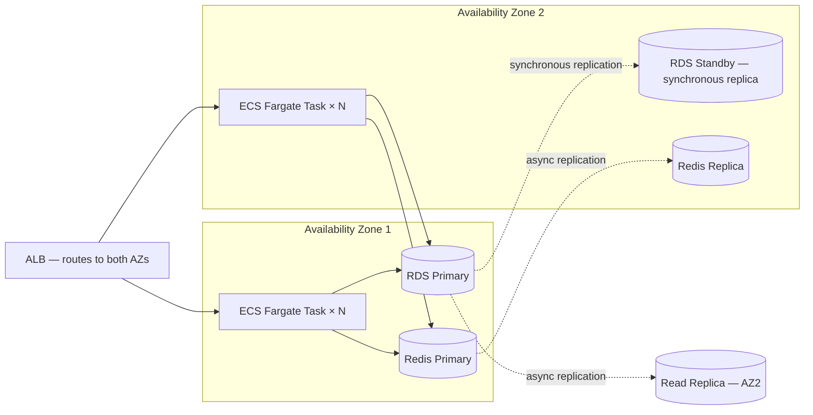

# RayVerify™ — Production Deployment & Go-Live Runbook

**Document:** 11-Production-Deployment  
**Classification:** SENSITIVE — Operations / Government Distribution  
**Platform:** RayVerify™ (parent: RayHealthEVV™)  
**Version:** 1.0 | June 2026  
**Audience:** DevOps/SRE, CISO, state pilot technical leads, government reviewers

---

## Table of Contents

1. [Environments & Promotion Flow](#1-environments--promotion-flow)
2. [Pre-Production Readiness Checklist](#2-pre-production-readiness-checklist)
3. [Release & Deployment Strategy](#3-release--deployment-strategy)
4. [Observability](#4-observability)
5. [Reliability & Disaster Recovery](#5-reliability--disaster-recovery)
6. [Capacity & Scaling](#6-capacity--scaling)
7. [Security Operations](#7-security-operations)
8. [Go-Live Runbook](#8-go-live-runbook)
9. [State Pilot Onboarding Checklist](#9-state-pilot-onboarding-checklist)

---

## 1. Environments & Promotion Flow

### 1.1 Environment Tiers

| Environment | Purpose | AWS Account | Data Classification | RLS Enforced |
|------------|---------|-------------|--------------------|-|
| `dev` | Developer local/feature branch testing | Shared dev account | Synthetic only | Yes |
| `staging` | Integration testing, pre-release QA, pen test target | Isolated staging account | Synthetic only | Yes |
| `prod` | Live state pilot and production tenants | Isolated prod account | Real PHI | Yes |
| `govcloud` *(roadmap)* | FedRAMP-authorized deployments for federal programs | AWS GovCloud (US-East) | Real PHI (federal) | Yes |

**Account separation is mandatory before go-live.** Dev and staging share no IAM roles, no KMS keys, no network connectivity, and no S3 buckets with production.

### 1.2 GovCloud Consideration

For state programs that require FedRAMP authorization or handle data classified at Moderate impact level, deployment to **AWS GovCloud (US-East or US-West)** is the correct posture:

- AWS GovCloud regions are FedRAMP High authorized.
- All AWS services used by RayVerify (ECS Fargate, RDS PostgreSQL, S3, KMS, CloudFront, Secrets Manager, ElastiCache) are available in GovCloud.
- ITAR controls apply; data must not egress to commercial AWS regions.
- The IaC Terraform modules accept a `region` variable; switching to `us-gov-east-1` or `us-gov-west-1` is the primary required change.
- A separate AWS GovCloud account with a dedicated management plane is required.
- StateRAMP authorization follows a similar process; RayVerify's architecture maps directly to StateRAMP Moderate controls.

### 1.3 Promotion Flow

```
Feature branch → PR → CI gate (build + test + scan) → merge to main
                                                           ↓
                                          Auto-deploy to dev environment
                                                           ↓
                                   Manual promotion trigger → staging deploy
                                                           ↓
                                          Staging QA sign-off + pen test
                                                           ↓
                                   Change Advisory Board approval ticket
                                                           ↓
                                          Blue/green deploy to prod
```

### 1.4 Configuration and Secrets Per Environment

Configuration is managed via a layered approach:
- **Non-secret config:** Environment-specific values (log level, feature flags, rate limit thresholds) are stored as ECS task definition environment variables, managed by Terraform per environment.
- **Secrets:** All secrets (database credentials, KMS key ARNs, JWT signing key IDs, HMAC keys, third-party API keys) are stored in **AWS Secrets Manager** under environment-namespaced paths (`/rayverify/dev/`, `/rayverify/staging/`, `/rayverify/prod/`). The application retrieves secrets at container startup. ECS task roles have IAM policies that permit `secretsmanager:GetSecretValue` only on paths within their environment namespace.
- **Feature flags:** Managed in `organizations.settings` JSONB per tenant for tenant-level flags. Global feature flags use an environment variable (`FEATURE_FLAGS` JSON blob) for infrastructure-level toggles.
- **Database URL:** Never stored as a plain connection string; constructed at runtime from Secrets Manager credentials + SSM Parameter Store host/port/database values.

---

## 2. Pre-Production Readiness Checklist

The following checklist must be completed and signed off before processing real PHI in production. Each item maps to a compliance or operational requirement.

### 2.1 Security Assessment

- [ ] Internal security review completed (architecture review, code review, threat model review)
- [ ] OWASP ASVS Level 2 self-assessment completed and findings remediated
- [ ] Static Application Security Testing (SAST) clean run: Semgrep + CodeQL zero HIGH/CRITICAL findings
- [ ] Dependency vulnerability scan clean: npm audit + Trivy zero HIGH/CRITICAL CVEs in production images
- [ ] Secret scanning (Gitleaks) confirms no secrets in repository history
- [ ] Container image signing enabled (Sigstore/Cosign); image digest pinning in task definitions
- [ ] AWS Security Hub enabled; `CIS AWS Foundations Benchmark` compliance scan passing

### 2.2 Penetration Test

- [ ] Third-party penetration test commissioned (CREST or equivalent certified firm)
- [ ] Scope: external API endpoints, authentication flows, RBAC bypass, injection attacks, multi-tenant isolation, S3 enumeration, JWT attacks
- [ ] All CRITICAL findings remediated before go-live; HIGH findings remediated or have accepted risk with CISO sign-off
- [ ] Penetration test report retained for state security reviewer and OIG review
- [ ] Next scheduled pentest: annually, or after major architecture changes

### 2.3 ATO / Authorization to Operate

- [ ] For state-level deployments: coordinate with state CISO for an ATO or Interim Authorization to Test (IATT)
- [ ] System Security Plan (SSP) submitted to state IT security office (references this document and `07-security-architecture.md`)
- [ ] Privacy Impact Assessment (PIA) completed
- [ ] Data Use Agreement (DUA) executed between RayVerify and the state Medicaid agency
- [ ] FedRAMP package initiated if federal program participation is required

### 2.4 BAA Chain

- [ ] AWS BAA accepted (covers RDS, S3, KMS, ECS, CloudFront, Secrets Manager, CloudWatch, CloudTrail)
- [ ] BAA executed with state Medicaid agency (covered entity) or MCO
- [ ] BAAs executed with all PHI sub-processors:
  - [ ] Biometric matching vendor (if third-party)
  - [ ] SMS provider (if third-party, for MFA SMS)
  - [ ] Any analytics/BI tooling that touches identified data
- [ ] Sub-processor inventory documented and disclosed to covered entities

### 2.5 Load Test

- [ ] Load test plan reviewed and approved (see Section 6.2)
- [ ] Sustained load test at 2× expected peak concurrent users for 30 minutes: no errors, p99 latency within SLO
- [ ] Spike test at 10× baseline for 60 seconds: graceful degradation (rate limiting, not errors)
- [ ] Database connection pool exhaustion test: PgBouncer correctly queues connections; no application crash
- [ ] Redis eviction test: cache misses fall back correctly to database without errors

### 2.6 Disaster Recovery Test

- [ ] RDS PITR restore test: successfully restored to a point 6 hours prior; data integrity verified
- [ ] S3 evidence bucket restore test: versioned objects retrieved from specific version ID
- [ ] ECS multi-AZ failover test: terminated tasks in AZ-1; traffic shifts to AZ-2 within ALB health check timeout
- [ ] DNS failover test (if Route 53 health checks configured for regional failover)
- [ ] RTO and RPO measurements documented and within targets (RTO ≤ 4h, RPO ≤ 1h)
- [ ] Runbook executed end-to-end by on-call team (not just tabletop)

### 2.7 Operational Runbooks

- [ ] On-call runbook completed and accessible in runbook store (e.g., Confluence/Notion/internal wiki)
- [ ] Incident response playbook reviewed and contact tree updated
- [ ] Database failover runbook tested
- [ ] Secret rotation runbook tested
- [ ] Partition creation runbook (pg_partman) tested
- [ ] Tenant onboarding runbook validated with dry-run

---

## 3. Release & Deployment Strategy

### 3.1 Blue/Green Deployment on ECS

RayVerify uses **blue/green deployments** via AWS CodeDeploy integrated with ECS Fargate. This achieves zero-downtime deployments with instant rollback capability.

```
[Current: Blue (100% traffic)]
     ↓  CodeDeploy starts deployment
[Green tasks started; health checks begin]
     ↓  Green passes ALB health check
[Traffic shifted: Blue 90% → Green 10%]  (canary validation window: 5 minutes)
     ↓  No errors in canary window
[Traffic shifted: Blue 0% → Green 100%]
     ↓  Blue tasks drained (connection drain: 60 seconds)
[Blue tasks terminated; deployment complete]
```

**Rollback:** If any alarm triggers during the canary window or the full cutover window (30 minutes post-cutover), CodeDeploy automatically reverts traffic to the blue task set within 30 seconds.

Alarms that trigger automatic rollback:
- HTTP 5xx error rate > 1% over 5 minutes
- p99 API latency > 2,000 ms over 5 minutes
- ECS task health check failures > 0

### 3.2 Database Migration Safety

Database migrations run independently from application deployments. The **expand/contract pattern** is mandatory for all schema changes:

**Phase 1 — Expand (backward-compatible):**
- Add new columns with DEFAULT or as nullable.
- Add new tables, new indexes, new enum values.
- Deploy new application code that writes to both old and new structures.
- All changes must be online-safe (no full table rewrites, no exclusive locks on large tables).

**Phase 2 — Migrate (data backfill):**
- Backfill data in batches (e.g., `UPDATE ... WHERE id > $cursor LIMIT 1000`) to avoid exclusive locks.
- Monitor replication lag and pause backfill if lag exceeds 5 seconds.

**Phase 3 — Contract (cleanup):**
- Remove old columns/tables/indexes only after confirming no application code references them.
- Deploy as a separate migration, separate deployment.

**Partitioned table migrations:** New partition creation for `visits` and `audit_logs` is handled by pg_partman. Partitions must be pre-created at least 1 month in advance. The partition creation job runs weekly and creates the next 3 months of partitions if they do not exist. The `visits_default` and `audit_logs_default` catch-all partitions prevent insert failures if a partition is missing.

**Online migration tools:** For large table changes, use `pgrollout` or `pg_repack` to avoid `ACCESS EXCLUSIVE` locks. All migrations are rehearsed in staging against a production-sized data snapshot before applying to production.

### 3.3 Zero-Downtime Principles

- All ECS services have a minimum healthy task count of 2 (spread across 2 AZs).
- ALB deregistration delay: 60 seconds (allows in-flight requests to complete before a task is terminated).
- Rolling partition creation does not lock the parent table.
- Redis cache operations are designed to be idempotent; cache invalidation on deployment does not cause errors (cold start degrades to database, not to failure).
- Prisma Client is initialized with connection pool warming; the first request after a cold start is not a connection spike.

### 3.4 Feature Flags

Feature flags allow progressive rollout of new capabilities without a new deployment:

- **Infrastructure-level flags:** `FEATURE_FLAGS` environment variable (JSON) in the ECS task definition; controls can be toggled via Terraform + deployment without application restart by using ECS environment variable update (triggers a rolling restart with ECS blue/green).
- **Tenant-level flags:** `organizations.settings` JSONB; toggled via the `ORG_ADMIN` API (`PATCH /organizations/:id/settings`); changes are audit-logged as `CONFIG_CHANGE`.
- **Fraud detector flags:** Individual fraud detectors (e.g., `IMPOSSIBLE_TRAVEL`, `LIVENESS_FAILURE`) can be enabled/disabled per organization via `organizations.settings.detectors` to allow phased rollout during state pilot.

### 3.5 Rollback Procedure

**Application rollback (< 5 minutes):**
1. Trigger CodeDeploy rollback via AWS console or `aws deploy stop-deployment --auto-rollback-enabled`.
2. Traffic immediately shifts back to the previous (blue) task set.
3. Confirm health check green on blue task set.
4. Post incident ticket with rollback reason.

**Database rollback:**
- Forward-only migrations are the default (expand/contract means rollback is just re-deploying the old app, not reversing the DB change).
- If a migration must be reverted (rare), a separate reverse migration is prepared and reviewed before any forward migration is applied.
- RDS PITR is available for data-level recovery (not for schema-level rollback).

---

## 4. Observability

### 4.1 Metrics — RED/USE

**RED metrics (per service):**

| Metric | Collection | Alert Threshold |
|--------|-----------|----------------|
| Request Rate | ALB `RequestCount` per target group | Baseline tracking only |
| Error Rate | ALB `HTTPCode_Target_5XX_Count` / `RequestCount` | > 1% over 5 min → P2 |
| Duration (p50/p95/p99) | ALB `TargetResponseTime` | p99 > 2s → P2; p99 > 5s → P1 |

**USE metrics (per resource):**

| Resource | Utilization | Saturation | Errors |
|---------|-------------|-----------|--------|
| ECS CPU | `CpuUtilized` / `CpuReserved` | > 80% sustained 10 min → scale-out | Task OOM kills |
| ECS Memory | `MemoryUtilized` / `MemoryReserved` | > 85% → scale-out | OOM kill events |
| RDS | `CPUUtilization` | > 70% sustained 10 min → investigate | `DatabaseConnections` near max |
| RDS Storage | `FreeStorageSpace` | < 20% → alert | — |
| Redis | `EngineCPUUtilization` | > 70% → investigate | `CacheHits` / `CacheMisses` ratio |
| PgBouncer | Pool wait queue depth | > 10 waiting → alert | — |

### 4.2 Logging

All application logs are **structured JSON** (Winston logger in NestJS). Every log line includes:

```json
{
  "timestamp": "2026-06-10T14:32:01.123Z",
  "level": "info",
  "service": "rayverify-api",
  "traceId": "abc123",
  "spanId": "def456",
  "organizationId": "org-uuid",   // never cross-tenant
  "userId": "user-uuid",
  "action": "visit.verify",
  "durationMs": 142,
  "statusCode": 200
}
```

**PHI scrubbing:** A NestJS logging interceptor strips the following field names from all log payloads before emission: `medicaidMemberId`, `medicaid_member_id`, `mfaSecret`, `mfa_secret`, `passwordHash`, `password_hash`, `probeS3Key`, `probe_s3_key`, `referenceS3Key`, `taxId`, `tax_id`, `dateOfBirth`, `date_of_birth`, `firstName`, `lastName`, `phone`, `email` (in PHI contexts). If a field name matches and its value is a string, it is replaced with `[REDACTED]`.

Log levels:
- `ERROR`: Unhandled exceptions, payment-blocking failures, security events.
- `WARN`: Recoverable errors, rate limit hits, failed auth attempts.
- `INFO`: Request lifecycle, audit-worthy business events.
- `DEBUG`: Development/staging only; disabled in production.

Logs are shipped to **Amazon CloudWatch Logs** via the ECS awslogs log driver. CloudWatch Log Insights is used for ad-hoc querying. Logs are also streamed to a SIEM (e.g., Splunk or Elastic SIEM) via CloudWatch Log subscription filter for security event correlation.

### 4.3 Distributed Tracing

OpenTelemetry SDK is instrumented in the NestJS application. Traces are exported to **AWS X-Ray** (via OTEL X-Ray exporter). Every trace includes:
- `organizationId` as a trace attribute (for tenant-scoped query in X-Ray).
- Service map showing call chains: ALB → NestJS → RDS → Redis → S3.
- Slow query spans from Prisma query instrumentation (queries > 500ms are logged at WARN level with the query text, with parameterized values masked).

### 4.4 Dashboards

Three CloudWatch dashboards are maintained:

1. **Operations Dashboard:** Request rate, error rate, p99 latency, ECS CPU/memory, RDS connections/CPU, Redis hit rate, ALB 5xx rate.
2. **Fraud Platform Dashboard:** Visits processed per hour, verification pass/fail/review rates, fraud events by type, open cases by priority, score computation queue depth.
3. **Security Dashboard:** Failed login rate, lockout events per hour, audit log write rate, hash chain verification status, unusual access pattern alerts.

### 4.5 SLOs/SLIs and Error Budgets

| SLI | SLO | Measurement Window | Error Budget |
|-----|-----|--------------------|-------------|
| API availability (non-5xx / total requests) | 99.9% | 30-day rolling | 43.2 minutes downtime/month |
| Visit verification p99 latency ≤ 3s | 99.5% of requests | 30-day rolling | 0.5% of requests may exceed 3s |
| Audit log write success rate | 99.99% | 30-day rolling | 0.01% failure (< 4 min/month) |
| Identity verification result delivery ≤ 5s | 95% of attempts | 7-day rolling | 5% may exceed 5s |

Error budget burn rate alerting:
- If the 1-hour burn rate × 720 hours > 2× the 30-day budget → P1 alert (fast burn).
- If the 6-hour burn rate × 120 hours > 5× the 30-day budget → P2 alert (slow burn).

### 4.6 Alerting and On-Call

Alert routing via Amazon SNS → PagerDuty (or equivalent). On-call rotation covers the engineering team with a 1-week rotation.

| Severity | Response Time | Examples |
|----------|--------------|---------|
| P1 — Critical | 15 minutes (24/7) | API down, RDS failover, security breach suspected, audit log immutability violation |
| P2 — High | 30 minutes (business hours + extended) | Error rate > 1%, p99 > 5s, ECS task crash loop, secret rotation failure |
| P3 — Medium | 4 hours | Disk space > 80%, slow queries, single task failure (autoscaling recovers) |
| P4 — Low | Next business day | Dependency updates, minor CVEs, non-critical metric drift |

---

## 5. Reliability & Disaster Recovery

### 5.1 High-Availability Topology



- **RDS Multi-AZ:** Synchronous standby replica in a second AZ. Automatic failover in 60–120 seconds on primary failure. Application uses the RDS cluster endpoint, which automatically routes to the new primary after failover.
- **ECS Fargate:** Tasks distributed across both AZs. ALB health checks (interval: 15s, threshold: 2 unhealthy) route traffic away from unhealthy tasks. ECS service maintains a minimum count of 2 tasks at all times.
- **ElastiCache Redis:** Multi-AZ cluster mode with automatic failover. Redis is used for rate limiting state and caching; the application is designed to degrade gracefully on Redis unavailability (cache miss falls back to database; rate limiter fails open with reduced limits).

### 5.2 Backups

| Data Store | Backup Method | Retention | RTO | RPO |
|-----------|--------------|-----------|-----|-----|
| RDS PostgreSQL | Automated daily snapshots + continuous PITR transaction logs | 35 days | < 1 hour (PITR restore) | ≤ 5 minutes |
| S3 Evidence Bucket | S3 Versioning + S3 Cross-Region Replication to DR bucket | Object Lock retention (7 years) | < 30 minutes (read from DR) | Near-zero (sync replication) |
| S3 Audit Export Bucket | S3 Versioning + CRR | Object Lock 7 years | < 30 minutes | Near-zero |
| Redis | ElastiCache automatic backup (daily RDB snapshot) | 7 days | < 30 minutes (restore from snapshot) | ≤ 24 hours (cache; acceptable loss) |
| Secrets Manager | Automatic replication across regions (Secrets Manager multi-region) | N/A | Immediate | Near-zero |

**Cross-region backup:** RDS automated backups are exported to S3 and replicated to a secondary AWS region (e.g., `us-east-1` primary → `us-west-2` DR). S3 Cross-Region Replication is configured for both the evidence bucket and the audit export bucket. In a total region failure, the recovery procedure targets the DR region.

### 5.3 RPO/RTO Targets

| Failure Scenario | RTO Target | RPO Target |
|-----------------|-----------|-----------|
| Single ECS task failure | < 2 minutes (autoscaling replaces) | Zero (stateless) |
| Single AZ failure (ECS + Redis) | < 5 minutes | Zero (RDS sync replica) |
| RDS primary failure (multi-AZ failover) | < 2 minutes (automatic) | ≤ 30 seconds (sync replica) |
| Full AZ loss (RDS + ECS) | < 30 minutes | ≤ 5 minutes (PITR) |
| Full region failure (DR scenario) | < 4 hours | ≤ 1 hour |

### 5.4 Disaster Recovery Runbook

**Trigger:** PagerDuty P1 alert for region-level failure; on-call engineer initiates DR declaration.

1. **Declare DR (T+0):** On-call engineer declares DR event; notifies CISO and state tenant POCs per the incident notification matrix.
2. **Assess scope (T+0 to T+30 min):** Confirm primary region is unavailable; confirm DR region S3/RDS backup data is intact.
3. **Restore RDS in DR region (T+30 to T+90 min):**
   - Restore from the most recent RDS snapshot exported to the DR region S3 bucket.
   - Apply PITR transaction logs to minimize data loss.
   - Update Secrets Manager (DR region) with new RDS endpoint.
4. **Deploy ECS tasks in DR region (T+90 to T+150 min):**
   - Terraform apply targeting the DR region workspace.
   - ECS tasks pull container images from ECR (cross-region replication enabled).
   - Validate health checks pass.
5. **DNS cutover (T+150 to T+180 min):**
   - Update Route 53 records to DR region ALB endpoint.
   - Confirm CloudFront origin failover or update CloudFront origin.
6. **Verify integrity (T+180 to T+240 min):**
   - Run hash chain verification on restored audit logs.
   - Confirm RLS is active on all tables in the restored database.
   - Confirm a synthetic verification request passes end-to-end.
7. **Notify tenants (T+180 min):** Send status update to all state tenant POCs with RTO achieved and RPO data point.
8. **Post-DR review (T+7 days):** Root cause analysis; runbook update; DR test scheduled.

### 5.5 Chaos and Failover Testing

- **Quarterly chaos exercises:** Terminate 50% of ECS tasks in one AZ; confirm no user-visible impact.
- **Annual RDS failover drill:** Force RDS primary failover; measure actual failover time against RTO target.
- **Annual full DR test:** Execute the full DR runbook to the DR region; measure actual RTO/RPO; restore to primary and validate data.
- Results are documented and shared with state security reviewers on request.

---

## 6. Capacity & Scaling

### 6.1 Autoscaling Policies

**ECS Service Auto Scaling (Application Auto Scaling):**

| Metric | Scale-Out Trigger | Scale-In Trigger | Cooldown |
|--------|------------------|-----------------|---------|
| ECS CPU Utilization | > 70% for 3 minutes | < 30% for 10 minutes | Scale-out: 60s; Scale-in: 300s |
| ALB RequestCountPerTarget | > 500 req/min per task | < 100 req/min per task | Scale-out: 60s; Scale-in: 300s |
| Custom metric: queue depth (Redis) | > 1,000 jobs in fraud scoring queue | < 100 jobs | Scale-out: 30s; Scale-in: 300s |

**Min/Max task counts:**

| Environment | Min Tasks | Max Tasks |
|------------|----------|---------|
| Production | 2 (1 per AZ) | 20 |
| Staging | 1 | 4 |

**RDS Read Replica:** A single read replica in AZ-2 handles reporting queries and analytics. If CPU > 80% sustained, provision a second read replica (manual trigger or via Auto Scaling for Aurora).

### 6.2 Load and Performance Test Plan

**Tools:** k6 (primary), Artillery (secondary for spike scenarios).

**Test scenarios:**

| Scenario | Virtual Users | Duration | Target |
|---------|--------------|---------|--------|
| Baseline steady state | 50 VUs | 30 minutes | p99 < 1s, error rate < 0.1% |
| Peak load (state pilot expected maximum) | 500 VUs | 30 minutes | p99 < 2s, error rate < 0.5% |
| Spike test | Ramp from 50 to 2,000 VUs in 60 seconds | 5 minutes at peak | Graceful degradation; rate limiting active; no crashes |
| Soak test | 200 VUs | 8 hours | No memory leaks; no connection pool exhaustion |
| Verification chain throughput | 100 concurrent verification submissions | 15 minutes | All verifications complete; no duplicate visit_verifications |

**Acceptance criteria:** All scenarios must pass before production go-live clearance.

### 6.3 Partition and Retention Operations

**Monthly partition creation (automated via pg_partman):**

The `visits` and `audit_logs` tables are partitioned by range on `scheduled_start` and `created_at` respectively. Partitions are named `visits_YYYY_MM` and `audit_logs_YYYY_MM`.

A scheduled ECS task runs every Monday to create any missing partitions for the next 3 months:

```sql
-- Example: create visits partition for next month
CREATE TABLE IF NOT EXISTS visits_2026_08 PARTITION OF visits
  FOR VALUES FROM ('2026-08-01') TO ('2026-09-01');
```

The task sends an alert if partition creation fails or if the `visits_default` or `audit_logs_default` catch-all partition receives any rows (indicating a missing partition).

**Archival and retention:**

- Partitions older than the retention boundary (7 years default) are archived by exporting to S3 Glacier Instant Retrieval in Parquet format, then dropped from PostgreSQL.
- Archival is a two-step process: (1) export and verify S3 object hash; (2) drop partition. Step 2 only proceeds after step 1 verification passes.
- Archived partitions remain queryable via Athena for compliance and legal hold purposes.
- Legal hold: if a tenant has an active `FraudCase` with status `SUBSTANTIATED` or `ESCALATED`, the associated data partitions are excluded from archival until the case is closed.

---

## 7. Security Operations

### 7.1 Vulnerability Management

| Vulnerability Source | Cadence | SLA |
|--------------------|---------|-----|
| Trivy container image scan | Every CI build + nightly scheduled scan | CRITICAL: fix within 24h; HIGH: fix within 7 days |
| npm audit (application dependencies) | Every CI build | CRITICAL: block merge; HIGH: fix within 7 days |
| AWS Inspector (EC2/ECS/ECR) | Continuous | CRITICAL: 24h; HIGH: 7 days |
| AWS Security Hub findings | Continuous | CRITICAL: 24h; HIGH: 7 days |
| Penetration test findings | Annual | CRITICAL: 30 days; HIGH: 60 days |
| Dependabot PRs | Automated PR generation | Patch: auto-merge via CI; Minor/Major: reviewed within 7 days |

### 7.2 Patching Cadence

- **OS-level patching:** ECS Fargate is serverless compute — AWS manages the underlying host OS. Container base images (distroless or AWS-managed) are updated when Trivy detects new CVEs.
- **PostgreSQL engine version:** RDS minor version auto-upgrade enabled for patch releases. Major version upgrades (e.g., PostgreSQL 15 → 16) are tested in staging with a 30-day soak before production.
- **Application dependencies:** Dependabot auto-approves patch-level updates. Minor/major updates require a PR review + staging validation.
- **Emergency patching:** Zero-day CVEs in critical paths (Node.js, NestJS, Prisma, PostgreSQL) trigger an emergency change process: patch available within 24 hours, deployed within 48 hours.

### 7.3 Secret Rotation

| Secret | Rotation Method | Frequency |
|--------|----------------|-----------|
| RDS database password | Secrets Manager automatic rotation (Lambda function) | Every 30 days |
| JWT signing key pair | KMS automatic key rotation | Annually (keys retained for token verification until expiry) |
| Per-tenant KMS data keys | Re-encrypt API call to KMS; old data keys revoked | Annually or on-demand |
| Blind index HMAC key | Manual rotation with dual-key transition period | Annually |
| Third-party API keys | Manual with dual-key pattern | Annually or on vendor recommendation |
| ECS task role credentials | Managed by AWS IAM (automatic rotation via STS) | Every 6 hours (STS temporary credentials) |

Secret rotation is tested in staging before production. Failed rotation attempts generate a P2 alert.

### 7.4 Incident Response and Breach Playbook

**Incident Severity Definitions:**

| Level | Description | Examples |
|-------|-------------|---------|
| SEV-1 | Active breach; PHI exfiltration confirmed or highly suspected | Unauthorized API access to patient records; S3 bucket public; ransomware |
| SEV-2 | Security event with high breach probability | Stolen credentials used; anomalous mass export; RLS bypass suspected |
| SEV-3 | Security event with low breach probability | Failed brute-force attempt; WAF block spike; misconfigured security group |
| SEV-4 | Security finding (no active exploitation) | Vulnerability detected; audit log anomaly; expired certificate |

**HIPAA Breach Playbook (SEV-1 / SEV-2):**

```
T+0:   Detection via alert, report, or discovery
T+0:   On-call engineer escalates to CISO + Security Officer
T+1h:  Containment: revoke affected sessions, isolate tenant if needed,
        snapshot DB state for forensics, preserve audit logs
T+4h:  Preliminary assessment: identify affected records, determine
        unauthorized access scope using audit_log query
T+24h: Risk assessment per HIPAA §164.402 four-factor test:
        (1) nature/extent of PHI involved
        (2) who accessed/could have accessed
        (3) whether PHI was actually acquired/viewed
        (4) extent to which risk has been mitigated
T+72h: Legal counsel briefed; covered entity tenant notified (required
        immediately upon breach discovery under HIPAA §164.410)
T+60d: If breach is confirmed:
        - HHS OCR notification (hhs.gov/breach portal)
        - Individual notifications to affected beneficiaries
        - Media notification if > 500 individuals in a state
T+90d: Root cause analysis and corrective action plan filed
```

### 7.5 Audit Log Monitoring

Automated SIEM rules alert on the following audit log patterns:

| Pattern | Alert Level | Rationale |
|---------|------------|-----------|
| > 1,000 `READ` events by a single `actorId` in 1 hour | P2 | Potential bulk data scraping |
| Any `EXPORT` event outside business hours (09:00–18:00 org timezone) | P3 | Unusual export timing |
| `CONFIG_CHANGE` event on user_role by a non-`ORG_ADMIN` | P1 | Privilege escalation |
| Hash chain mismatch detected by nightly tamper-check job | P1 | Audit log tampering |
| > 5 `LOGIN` failures for a single `actorId` in 5 minutes | P3 | Brute force in progress |
| Any action by a `userId` with `status = LOCKED` or `SUSPENDED` | P1 | Authentication bypass |
| `CASE_ACTION` on a case assigned to a different `organizationId` | P1 | Cross-tenant access |
| Sudden drop in audit log write rate (> 50% below baseline) | P2 | Log pipeline failure |

---

## 8. Go-Live Runbook

This runbook covers the step-by-step procedure for the first production deployment. It is executed by two engineers (lead + reviewer) during a scheduled maintenance window with state tenant POC on standby.

### 8.1 Pre-Go-Live (T-7 days)

- [ ] All Pre-Production Readiness Checklist items completed and signed off
- [ ] Production AWS account confirmed isolated from dev/staging
- [ ] Production Terraform workspace initialized and plan reviewed
- [ ] DNS records prepared (not yet active): `api.rayverify.io`, `app.rayverify.io`
- [ ] AWS WAF rules reviewed and enabled for production
- [ ] CloudWatch alarms and PagerDuty routing validated in a test fire
- [ ] On-call team briefed; rotation coverage confirmed for go-live week
- [ ] State tenant POC and BAA confirmed in place
- [ ] Rollback decision point defined: any P1 alert within 2 hours of go-live triggers rollback

### 8.2 Go-Live Day (T=0)

**Maintenance window: recommend 06:00–09:00 local state time (low traffic)**

**Step 1 — Infrastructure provisioning (T+0 to T+30 min)**

```bash
# Confirm you are in the production Terraform workspace
terraform workspace select prod

# Review the plan one final time
terraform plan -out=prod-golive.tfplan

# Apply infrastructure
terraform apply prod-golive.tfplan
```

Validate outputs:
- [ ] RDS cluster endpoint returned and reachable from within VPC (via SSM port-forward)
- [ ] S3 buckets created with Object Lock enabled
- [ ] KMS CMKs created and key policy reviewed
- [ ] ECS cluster created with correct VPC/subnet/security group assignments
- [ ] ALB created and health check target group configured
- [ ] Secrets Manager paths populated with production secrets

**Step 2 — Schema initialization (T+30 to T+45 min)**

```bash
# Via SSM session to a migration ECS task or ephemeral EC2 instance in the VPC
# Set DATABASE_URL to the production RDS endpoint (from Secrets Manager)
npx prisma migrate deploy

# Verify all migrations applied
npx prisma migrate status

# Seed system roles, permissions, and a bootstrap ORG_ADMIN user
npm run db:seed:prod
```

Validate:
- [ ] All 19 business tables exist
- [ ] RLS is enabled and FORCE RLS is set: `SELECT tablename, rowsecurity, forcerowsecurity FROM pg_tables WHERE schemaname = 'public' AND rowsecurity = TRUE;`
- [ ] Immutability triggers exist: `SELECT trigger_name, event_object_table FROM information_schema.triggers WHERE trigger_name LIKE 'trg_%immutable';`
- [ ] Hash chain trigger exists: `SELECT trigger_name FROM information_schema.triggers WHERE trigger_name = 'trg_audit_hash';`
- [ ] System roles seeded: `SELECT key, is_system FROM roles WHERE is_system = TRUE;`

**Step 3 — Application deployment (T+45 to T+60 min)**

```bash
# Tag and push the production container image
docker tag rayverify-api:$RELEASE_TAG $ECR_REPO:$RELEASE_TAG
docker tag rayverify-api:$RELEASE_TAG $ECR_REPO:prod-latest
docker push $ECR_REPO:$RELEASE_TAG
docker push $ECR_REPO:prod-latest

# Update ECS service with new image (CodeDeploy handles blue/green)
aws ecs update-service \
  --cluster rayverify-prod \
  --service rayverify-api \
  --force-new-deployment \
  --region us-east-1
```

Monitor deployment:
- [ ] ECS service event log shows new task starting: `aws ecs describe-services --cluster rayverify-prod --services rayverify-api`
- [ ] ALB target group health check passes (HTTP 200 on `/health`)
- [ ] No 5xx errors in ALB access logs for 5 minutes post-deployment

**Step 4 — DNS cutover (T+60 to T+70 min)**

```bash
# Update Route 53 records (low TTL set 24h prior for fast propagation)
aws route53 change-resource-record-sets \
  --hosted-zone-id $HOSTED_ZONE_ID \
  --change-batch file://dns-cutover-prod.json
```

Validate:
- [ ] `dig api.rayverify.io` returns production ALB DNS name
- [ ] `curl -I https://api.rayverify.io/health` returns HTTP 200 with `Strict-Transport-Security` header
- [ ] SSL certificate valid and issued by ACM for correct domain

**Step 5 — Smoke tests (T+70 to T+90 min)**

Run the production smoke test suite (read-only synthetic operations against the bootstrap tenant):

```bash
npm run test:smoke -- --env=prod
```

Smoke test checklist:
- [ ] `POST /auth/login` returns JWT pair
- [ ] `GET /organizations/me` returns correct organization
- [ ] `GET /visits` returns empty array (no data yet)
- [ ] `GET /audit-logs` returns bootstrap seeding entries with valid hash chain
- [ ] `GET /health/db` confirms database connectivity
- [ ] `GET /health/redis` confirms Redis connectivity

**Step 6 — Monitoring validation (T+90 to T+100 min)**

- [ ] CloudWatch dashboard shows green metrics for all services
- [ ] No P1 or P2 PagerDuty alerts fired
- [ ] Audit log hash chain verification tool confirms chain integrity on bootstrap entries
- [ ] First production audit log entry hash chain is consistent

**Step 7 — Declare go-live (T+100 min)**

- [ ] Lead engineer sends go-live confirmation to: on-call team, CISO, state tenant POC
- [ ] Status page updated to operational
- [ ] Hypercare period begins (72 hours of enhanced monitoring)

### 8.3 Post-Launch Hypercare (T+0 to T+72 hours)

During the 72-hour hypercare period:

- On-call team is on enhanced watch; P2 response time reduced to 15 minutes (same as P1).
- Metrics reviewed every 30 minutes for the first 4 hours, then every 2 hours.
- Any error rate spike > 0.1% triggers immediate investigation.
- Daily written status updates sent to CISO and state tenant POC.
- No schema migrations or risky code changes permitted during hypercare.
- Rollback decision authority: on-call lead engineer (no CAB approval required during hypercare).

After 72 hours with no P1/P2 incidents, declare hypercare complete and return to standard on-call procedures.

---

## 9. State Pilot Onboarding Checklist

For each new state or tenant onboarding to RayVerify:

### 9.1 Legal and Compliance

- [ ] BAA executed between RayVerify and the covered entity (state Medicaid agency or MCO)
- [ ] Data Use Agreement (DUA) or Data Sharing Agreement (DSA) executed
- [ ] Security questionnaire completed by state CISO (RayVerify security controls reviewed)
- [ ] State IT security office briefed; ATO/IATT issued if required
- [ ] Privacy Impact Assessment (PIA) or Privacy Threshold Analysis (PTA) completed
- [ ] Contact information registered: technical POC, privacy officer, security officer, legal contact

### 9.2 Tenant Provisioning

```bash
# 1. Create organization record via admin API (POST /admin/organizations)
#    Fields: name, slug (unique), jurisdiction (FIPS code / CMS region), settings

# 2. Seed system roles for the organization
npm run db:seed:tenant -- --org-id=$ORG_ID

# 3. Create the initial ORG_ADMIN user
#    POST /admin/users { organizationId, email, firstName, lastName, role: "ORG_ADMIN" }
#    User receives PENDING_INVITE status; invitation email sent

# 4. Configure organization settings (via ORG_ADMIN API after login)
#    - Enabled fraud detectors
#    - Geofence default radius (default: 150 meters)
#    - Score thresholds (LOW/MODERATE/HIGH/CRITICAL boundaries)
#    - Report schedule / delivery preferences
#    - Notification webhook endpoints (if applicable)
```

- [ ] Organization record created with correct `jurisdiction` field
- [ ] System roles seeded for the tenant
- [ ] Initial `ORG_ADMIN` user created and invitation accepted
- [ ] `OIG_AGENT` user created for state oversight account (if applicable)
- [ ] KMS data key provisioned for the tenant (tenant-specific data key generation)
- [ ] S3 prefix created for the tenant (`org/{org-id}/`)

### 9.3 Integration and Data Loading

- [ ] Provider enrollment data loaded (bulk import via `POST /providers/import` or CSV upload)
- [ ] Caregiver roster loaded per provider
- [ ] Patient (beneficiary) roster loaded (PHI; BAA must be in place first)
- [ ] Service authorization records loaded (including geofence coordinates)
- [ ] Caregiver biometric enrollment completed (selfie reference images uploaded)
- [ ] Device trust whitelist configured (approved devices for field workers)
- [ ] Integration with state EVV aggregator or MMIS tested (if applicable)

### 9.4 User Training

- [ ] Investigator role training completed (fraud case management, evidence review, scoring)
- [ ] Auditor role training completed (visit verification, audit log review)
- [ ] Compliance Officer training completed (report generation, breach response procedures)
- [ ] ORG_ADMIN training completed (user management, role assignment, settings configuration)
- [ ] MFA enrollment completed for all platform users before first login to production

### 9.5 Operational Handoff

- [ ] Tenant-specific SLO/SLA agreed upon (availability, response times, support tier)
- [ ] Escalation path documented: Level 1 support → RayVerify on-call → state POC
- [ ] Monthly reporting schedule confirmed (state compliance reports, executive dashboards)
- [ ] Notification webhook endpoints tested (if used for real-time alert delivery to state systems)
- [ ] Tenant-specific fraud detector thresholds calibrated against historical data (if available)
- [ ] First audit log hash chain verification run confirmed successful
- [ ] 30-day check-in scheduled with state POC

### 9.6 Pilot Validation Milestones

| Milestone | Target Timeline | Success Criteria |
|-----------|----------------|-----------------|
| First visit verified | Day 1 of pilot | Visit creates valid verification chain; no errors |
| First fraud event detected | Day 7 | At least one detector fires on synthetic test case |
| First investigation case opened | Day 14 | Case created, evidence linked, assigned to investigator |
| First compliance report generated | Day 30 | State compliance report PDF generated and reviewed |
| Hash chain integrity audit | Day 30 | All audit log records pass chain verification |
| Pilot performance review | Day 60 | SLO metrics reviewed; fraud detection rate reviewed with state PI unit |

---

*Document controlled. Operations team maintains this runbook; review quarterly and after any significant infrastructure change.*  
*For go-live approvals or DR declarations, contact the RayVerify SRE lead and CISO.*
