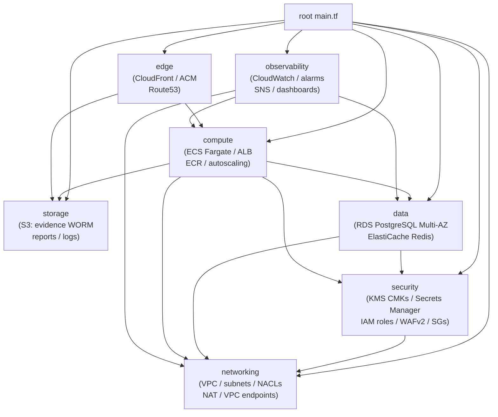

# RayVerify™ — Terraform IaC

Government-grade HIPAA/SOC 2/CMS-EVV-compliant Medicaid fraud-detection platform
infrastructure on AWS, managed by Terraform.

---

## Table of Contents

- [Prerequisites](#prerequisites)
- [Repository Layout](#repository-layout)
- [Remote State](#remote-state)
- [Provider Authentication](#provider-authentication)
- [Planning & Applying Per Environment](#planning--applying-per-environment)
- [Module Dependency Diagram](#module-dependency-diagram)
- [Compliance Notes](#compliance-notes)

---

## Prerequisites

| Tool | Minimum Version |
|------|----------------|
| Terraform | 1.7.x |
| AWS CLI | 2.x |
| aws provider | ~> 5.0 |

You must have AWS credentials with sufficient IAM permissions.  For CI/CD use an
OIDC-federated IAM role; never store long-lived access keys in code.

Bootstrap the remote-state bucket and DynamoDB lock table exactly once per AWS
account/region before any `terraform init`:

```bash
# One-time bootstrap (run manually or via a separate bootstrap Terraform root)
aws s3api create-bucket \
  --bucket rayverify-tfstate-<account-id> \
  --region us-east-1 \
  --create-bucket-configuration LocationConstraint=us-east-1

aws s3api put-bucket-versioning \
  --bucket rayverify-tfstate-<account-id> \
  --versioning-configuration Status=Enabled

aws s3api put-bucket-encryption \
  --bucket rayverify-tfstate-<account-id> \
  --server-side-encryption-configuration \
    '{"Rules":[{"ApplyServerSideEncryptionByDefault":{"SSEAlgorithm":"aws:kms"}}]}'

aws dynamodb create-table \
  --table-name rayverify-tfstate-lock \
  --attribute-definitions AttributeName=LockID,AttributeType=S \
  --key-schema AttributeName=LockID,KeyType=HASH \
  --billing-mode PAY_PER_REQUEST \
  --region us-east-1
```

---

## Repository Layout

```
infra/terraform/
├── README.md               # This file
├── versions.tf             # Terraform + provider version constraints
├── backend.tf              # S3 + DynamoDB remote state
├── providers.tf            # AWS provider config + default_tags
├── main.tf                 # Root composition — wires all modules
├── variables.tf            # Root input variables
├── outputs.tf              # Root outputs exposed to CI/CD
├── locals.tf               # Name-prefix helpers (rv-<env>-*)
├── environments/
│   ├── dev.tfvars.example
│   ├── staging.tfvars.example
│   └── prod.tfvars.example
└── modules/
    ├── networking/         # VPC, subnets, IGW, NAT, route tables, VPC endpoints, NACLs
    ├── security/           # KMS CMKs, Secrets Manager, IAM roles, WAFv2, security groups
    ├── data/               # RDS PostgreSQL Multi-AZ + replica, ElastiCache Redis
    ├── compute/            # ECS Fargate cluster, services, ALB, autoscaling, ECR
    ├── edge/               # CloudFront, ACM cert, Route53
    ├── storage/            # S3 buckets (evidence WORM, reports, logs)
    └── observability/      # CloudWatch dashboards, alarms, metric filters, SNS
```

---

## Remote State

State is stored in S3 with server-side KMS encryption and versioning.  DynamoDB
provides atomic locking to prevent concurrent applies.

`backend.tf` contains the configuration.  Override the bucket/key per environment
via `-backend-config` flags (recommended) or by editing the file before `init`.

Workspaces are **not** used.  Each environment has its own state key:

| Environment | State key                              |
|-------------|----------------------------------------|
| dev         | `env/dev/rayverify.tfstate`            |
| staging     | `env/staging/rayverify.tfstate`        |
| prod        | `env/prod/rayverify.tfstate`           |

---

## Provider Authentication

```bash
# Option A — AWS SSO (recommended for humans)
aws sso login --profile rayverify-<env>
export AWS_PROFILE=rayverify-<env>

# Option B — IAM role via GitHub Actions OIDC (recommended for CI)
# Configure aws-actions/configure-aws-credentials@v4 with role-to-assume
```

---

## Planning & Applying Per Environment

```bash
# From infra/terraform/
cd infra/terraform

# 1. Initialise (first time or after provider upgrades)
terraform init \
  -backend-config="bucket=rayverify-tfstate-<account-id>" \
  -backend-config="key=env/<env>/rayverify.tfstate" \
  -backend-config="region=us-east-1" \
  -backend-config="dynamodb_table=rayverify-tfstate-lock"

# 2. Select / create the named workspace (optional; state keys differ per env)
#    If you use separate state keys via -backend-config, skip workspaces.

# 3. Plan
terraform plan \
  -var-file="environments/<env>.tfvars" \
  -out=tfplan-<env>

# 4. Review the plan output carefully, especially for prod.

# 5. Apply (prod requires a second human approval in CI)
terraform apply tfplan-<env>
```

Destroy (non-prod only — prod has deletion_protection enabled on RDS):

```bash
terraform destroy -var-file="environments/dev.tfvars"
```

---

## Module Dependency Diagram



---

## Compliance Notes

| Control | Terraform implementation |
|---------|--------------------------|
| HIPAA §164.312(a)(2)(iv) — Encryption/Decryption | KMS CMKs on every storage resource; `storage_encrypted = true` on RDS |
| HIPAA §164.312(e)(2)(ii) — Encryption in Transit | ALB HTTPS-only listener; CloudFront TLS 1.3 minimum; `transit_encryption_enabled` on Redis |
| HIPAA §164.312(b) — Audit Controls | CloudWatch Logs + metric filters; immutable S3 Object Lock on evidence bucket |
| SOC 2 CC6.1 — Logical Access | WAFv2 managed rules; least-privilege IAM task roles; security groups default-deny |
| SOC 2 CC7.2 — System Monitoring | CloudWatch alarms; SNS alert topic; dashboard per service |
| CMS EVV — Data Integrity | S3 Object Lock (WORM) on evidence; PITR on RDS |
| Zero Trust | No public DB endpoints; VPC endpoints replace public AWS API routes; NACLs default-deny |
